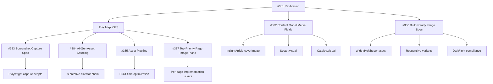

# Wayfinder Map — Images Across the Public Web App (Issue #378)

**Status**: Draft for ratification pending #381 policy approval
**Dependencies**: Blocked on #381 ratification; informs #383, #384, #385, #387
**Source of truth**: `docs/IMAGE_STRATEGY.md` (draft, not yet ratified)

---

## 1. Executive Summary

| Metric | Current State | Planned State (post-#381) |
|--------|---------------|---------------------------|
| `` tags in `src/` | 1 (Logo.tsx only) | ~40-60 across pages/components |
| Content images (screenshots, diagrams, metrics, brand) | **0** | Per taxonomy below |
| Decorative `aria-hidden` images/icons | 108 instances, 33 files | Consolidated; brand only |
| `dark:` theme variants | 41 usages | All images theme-aware |
| Brand assets in canonical tree | 68 (`brand/`) + 72 (`public/brand/`) | Source of truth for `brand` kind |
| Playwright reference captures | 33 (`output/playwright/`) | Reference only, never sources |

**Key finding**: The site currently ships **zero content images**. Every page renders correctly with no images. The only raster/SVG assets are the LightSpeed logo (brand kind) and decorative Lucide icons (aria-hidden). This aligns with IMAGE_STRATEGY Principle 1: *Default to no image*.

---

## 2. Current State Audit

### 2.1 Image Elements in `src/`

| File | Type | Kind | Status |
|------|------|------|--------|
| `src/components/site/Logo.tsx` | `` / `` | **brand** | ✅ Compliant (alt="LightSpeed Holdings", width/height set) |
| All other `.tsx` | None | — | ✅ No content images |

### 2.2 Decorative `aria-hidden` Instances (108 across 33 files)

**Pattern**: Lucide icons (ArrowRight, Sparkles, ShieldCheck, CheckCircle2, etc.) and visual separators (dots, arrows, numbers)

**Files with highest concentration**:
- `src/components/athena/SkillTags.tsx` — 18 instances
- `src/components/athena/AthenaLayout.tsx` — 12 instances
- `src/components/athena/MetricCard.tsx` — 10 instances
- `src/components/athena/JobCard.tsx` — 10 instances
- `src/components/athena/PipelineColumn.tsx` — 4 instances
- `src/pages/athena/JobList.tsx` — 8 instances
- `src/components/HeroSection.tsx` — 7 instances
- `src/components/home/AICompanyBuilderSection.tsx` — 2 instances
- `src/components/home/AboutSection.tsx` — 1 instance
- Various others — 1-3 each

**Compliance**: These are correctly `aria-hidden="true"` as decorative iconography. **No change needed** — they are not content images.

### 2.3 Dark Theme Variants (41 usages)

**Locations**:
- `src/brand/brand-tokens.css` — CSS custom properties (14 lines)
- `src/index.css` — Note about `dark:` utilities
- `src/pages/HomePage.tsx` — Background fallback (1)
- `src/data/publicAgentRegistry.ts` — DEPARTMENT_COLORS, HONESTY_LABELS (28)
- `src/components/PublicAgentRegistry.tsx` — 2 usages
- `src/components/home/VisitorPathsSection.tsx` — 2 usages
- `src/components/ContactSection.tsx` — 1 usage

**Implication**: Every content image must work in both themes. Raster assets must be theme-agnostic or have light/dark variants.

---

## 3. Page-by-Page Image Placement Map

### 3.1 Public Routes & Visual Anchor Decisions

| Route | Page Component | Current Images | Planned Visual Anchors (per #381) | Rationale |
|-------|----------------|----------------|-----------------------------------|-----------|
| `/` | `HomePage` | Logo only (Header) | **0** — Hero is typographic; chapters use numbered pills | Principle 1: no visual balance filler |
| `/solutions` | `SolutionsPage` | Logo only | **0** — Cards are spec-driven; evidence is textual | Principle 4: one claim per card, no collage |
| `/sectors` | `SectorsPage` | Logo only | **5** (one per sector card) — `screenshot` or `diagram` kind | Sector evidence tier needs visual proof; `status` gates tier |
| `/insights` | `InsightsPage` | Logo only | **0** — List view; article pages carry cover | List is navigation; article = content |
| `/insights/:slug` | `InsightArticlePage` | Logo only | **1** per article — `coverImage` (optional `screenshot`/`diagram`) | MASTER_SPEC §16: cover image optional on InsightArticle |
| `/proof` | `ProofPage` | Logo only | **4** platform metrics as `metric` kind (inline, not raster) + case study `screenshot` (optional) | Metrics are inline components; case studies may earn screenshot |
| `/what-we-do` | `WhatWeDoPage` | Logo only | **0** — Catalog is spec/pricing table; no visual claim | Principle 1: packages don't need images |
| `/ai-company-builder` | `AiCompanyBuilderPage` | Logo only | **1** architecture `diagram` (inline SVG) | Platform architecture is a diagram claim |
| `/ask` | `AskLightSpeed` | Logo only | **0** — Long-tail default (IMAGE_STRATEGY §117) | Interactive chat; no visual claim |
| `/contact` | `ContactPage` | Logo only | **0** — Long-tail default | Form page; no visual claim |
| `/about` | `AboutPage` | Logo only | **0** — Mission/values; leadership has no headshots (Principle 3) | No human images without consent |
| `/privacy`, `/terms` | Legal pages | Logo only | **0** — Long-tail default | Policy pages |

### 3.2 Athena (Dashboard) Routes — Out of Scope for Public Web App

| Route | Status |
|-------|--------|
| `/athena/dashboard` | Dashboard — separate image strategy |
| `/athena/jobs` | Dashboard — separate image strategy |
| `/athena/jobs/:id` | Dashboard — separate image strategy |
| `/athena/editor` | Dashboard — separate image strategy |

> **Note**: Athena routes are authenticated dashboard surfaces. This Wayfinder map covers **public web app only**.

---

## 4. Component Media Field Requirements (per #382)

### 4.1 Content Types Needing `ContentMedia` Field

| Content Type | Source File | Media Field | Allowed Kinds | Notes |
|--------------|-------------|-------------|---------------|-------|
| `InsightArticle` | `src/data/insights.ts` | `coverImage?: ContentMedia` | `screenshot` \| `diagram` | Optional; never a 5th block kind (IMAGE_STRATEGY §151) |
| `Sector` | `src/data/sector-registry.ts` | `visual?: ContentMedia` | `screenshot` \| `diagram` | Gated by `status.tone` (IMAGE_STRATEGY §156) |
| `CatalogOfferFamily` / `deliverables` | `src/data/useCaseCatalogData.ts` | `visual?: ContentMedia` | `screenshot` \| `brand` \| `metric` | Per IMAGE_STRATEGY §158 |
| `Solution` | `src/data/siteContent.ts` | `visual?: ContentMedia` | `screenshot` \| `diagram` | Optional; evidence-driven |
| `CaseStudy` | `src/data/siteContent.ts` (`proofCaseStudies`) | `visual?: ContentMedia` | `screenshot` | Only if shipped engagement has capture |
| `Leader` | `src/data/leadership.ts` | **None** | — | Principle 3: no headshots |

### 4.2 Shared Media Shape (from IMAGE_STRATEGY §161-198)

```ts
// Discriminated union — enforced at type level
type ContentMedia =
  | ScreenshotMedia  // kind: 'screenshot', src, alt, width, height, tone
  | BrandMedia       // kind: 'brand', src, alt: '', width, height (NO tone)
  | DiagramMedia     // kind: 'diagram', alt, tone (NO src — inline React/SVG)
  | MetricMedia;     // kind: 'metric', alt, tone (NO src — inline component)
```

**Critical constraints**:
- `BrandMedia.alt` typed as literal `''` — compiler enforces decorative rule
- `BrandMedia` carries no `tone` — brand mark cannot imply tier
- `DiagramMedia`/`MetricMedia` have no `src` — they are inline, not files
- One visual per record — never `diagram` + `screenshot` together (Principle 4)

---

## 5. Asset Pipeline Needs (Informs #385)

### 5.1 Required Asset Categories

| Category | Source | Pipeline Step | Output |
|----------|--------|---------------|--------|
| **Screenshots** | Fresh Playwright captures of live product surfaces | #383 spec → capture → optimize → commit | Raster (WebP/AVIF) with intrinsic W/H |
| **Brand marks** | `brand/logos/` canonical tree | Copy to `public/brand/` at build | SVG (preferred) / PNG fallback |
| **Diagrams** | Authored as inline React/SVG in components | No file pipeline — code is source | Inline SVG (theme-aware via CSS vars) |
| **Metrics** | `src/data/metrics.ts` canonical registry | Rendered by `MetricCard` / inline component | No image file |
| **Illustrations** | Grav character IP (article-illustrations skill) | Generate → QA → commit | WebP with alt text |

### 5.2 Screenshot Capture Spec Dependencies (#383)

| Target Surface | Honesty Tier | Capture Trigger | Notes |
|----------------|--------------|-----------------|-------|
| AI Company Builder dashboard | `proven` | On-demand per #383 | 90-agent registry view |
| Compliance automation flow | `proven` | On-demand | 14-dept reporting |
| WhatsApp coordination platform | `pilot` | On-demand | Agricultural cooperative pilot |
| Student management system | `pilot` | On-demand | University of Malawi |
| Digital presence / e-commerce | `fieldable` | On-demand | J&S StopOver Bar live proof |

> **Rule**: Screenshots must be freshly captured at implementation time (IMAGE_STRATEGY §24-25). Existing `output/playwright/` files are references only.

### 5.3 AI-Generated Asset Sourcing (#384)

| Asset Type | Tool | Governance |
|------------|------|------------|
| Article illustrations (Grav) | `article-illustrations` skill → `k-dense-infographics` | `ls-artifact-qa` gate |
| Infographics / explainer graphics | `ls-visual-storytelling` → `k-dense-infographics` | `ls-artifact-qa` gate |
| Social campaign assets | `ls-social-media-design` → `k-dense-infographics` | `ls-artifact-qa` gate |
| Brand advertising | `ls-brand-advertising` → ComfyUI / k-dense | `ls-artifact-qa` gate |

> **Rule**: No stock photos, no fake people, no illustrative stand-ins (IMAGE_STRATEGY §21-22, Principle 3).

---

## 6. Per-Page Image Taxonomy (Planned)

### 6.1 `/sectors` — 5 Sector Cards

| Sector ID | Status | Visual Kind | Visual Claim | Source |
|-----------|--------|-------------|--------------|--------|
| `financial-services` | `proven` | `screenshot` | Compliance dashboard across 14 depts | Fresh capture of ProofPage metric #1 |
| `healthcare` | `future` | **none** | Roadmap — no image per Principle 1 | — |
| `agriculture` | `current` | `screenshot` | WhatsApp coop platform (1,200 members) | Fresh capture of pilot |
| `education` | `current` | `screenshot` | Student management (3 depts, 5K records) | Fresh capture of pilot |
| `government` | `current` | `diagram` | SADC governance framework flow | Inline SVG authored against policy doc |

### 6.2 `/insights/:slug` — 3 Articles (Current)

| Slug | Cover Image Kind | Visual Claim | Source |
|------|------------------|--------------|--------|
| `sadc-ai-opportunity` | `diagram` | 4-principle governance framework | Inline SVG from Pharos policy draft |
| `agentic-ai-african-governments` | `diagram` | 4 reservations → engineering answers map | Inline SVG from pillars/03 |
| `digital-to-ai-native-transformation` | `screenshot` | 3-level adoption test | Fresh capture of internal tooling |

### 6.3 `/proof` — Platform Metrics + Case Studies

| Element | Kind | Implementation |
|---------|------|----------------|
| 90 Agents | `metric` | Inline `MetricCard` reading `metrics.agentCount` |
| 2,566 Tests | `metric` | Inline `MetricCard` reading `liveTestCount` |
| 20 Departments | `metric` | Inline `MetricCard` reading `metrics.departments` |
| 5-Tier Approval | `metric` | Inline badge component |
| Case Study WS-01 | `screenshot` (optional) | Compliance dashboard capture |
| Case Study WS-02 | `screenshot` (optional) | WhatsApp platform capture |
| Case Study WS-03 | `screenshot` (optional) | Student management capture |

### 6.4 `/ai-company-builder` — Architecture Diagram

| Element | Kind | Implementation |
|---------|------|----------------|
| Platform architecture | `diagram` | Inline React/SVG in `AiCompanyBuilderSection` or `PublicAgentRegistry` |
| Agent registry table | — | Tabular, no image |
| Department org chart | `diagram` | Inline SVG (D3 or Mermaid via `ls-diagramming`) |

### 6.5 `/what-we-do` — Catalog (Tab: Packages)

| Offer Family | Visual Kind | Notes |
|--------------|-------------|-------|
| A: Digital Presence | `brand` (client logo) or `screenshot` (site) | Only if client consented |
| B: Business Automation | `screenshot` (WhatsApp flow) | Blocked — G1-G4 pending |
| C: Data/Analytics | `screenshot` (dashboard) | Blocked — Tier-1 data |
| D: Digital Marketing | `brand` (social assets) | `ls-social-media-design` output |
| E: Platform Licensing | `diagram` (architecture) | Inline SVG |

---

## 7. Dependency Graph



**Critical path**: #381 must be ratified before any `ContentMedia` fields are added to data models (#382) or any capture pipeline is built (#383-385).

---

## 8. Open Questions Requiring #381 Ratification

1. **Metric canonical value source** (IMAGE_STRATEGY §210): Typed reference vs. render-time sourcing? Affects `MetricMedia` implementation.
2. **First content image precedent** (IMAGE_STRATEGY §218-220): No `width`/`height` precedent exists — must be established per asset.
3. **CatalogIndustryVertical.iconName** (IMAGE_STRATEGY §221-222): Convert from Lucide icon name to `ContentMedia`? Separate change.
4. **Metric image form restoration** (IMAGE_STRATEGY §223-227): If a surface genuinely cannot render the component inline, restore `src`/`width`/`height` on `MetricMedia`.

---

## 9. Implementation Sequence (Post-#381)

| Phase | Work | Dependencies |
|-------|------|--------------|
| 1 | Add `ContentMedia` union to `src/data/` types | #381 ratified, #382 merged |
| 2 | Add optional `visual`/`coverImage` fields to Sector, InsightArticle, Catalog, Solution | Phase 1 |
| 3 | Implement `MediaRenderer` component (handles 4 kinds) | Phase 1 |
| 4 | Build screenshot capture harness (#383) | #381, #386 |
| 5 | Capture priority screenshots (5 sectors + 3 insights + proof) | Phase 4 |
| 6 | Author inline diagrams for architecture/framework claims | #381 (Principle 5) |
| 7 | Integrate brand marks from canonical tree | `brand/` → `public/brand/` build step |
| 8 | `ls-artifact-qa` pass on all new images | Phase 5-7 complete |
| 9 | Per-page rollout behind feature flags | Phase 8 |

---

## 10. Quick Reference: Image Kind by Page

```
HomePage              → 0 (typographic hero, numbered chapters)
SolutionsPage         → 0 (spec-driven cards)
SectorsPage           → 5 (1 per sector: screenshot/diagram gated by tier)
InsightsPage (index)  → 0 (navigation only)
InsightArticlePage    → 1 per article (optional coverImage)
ProofPage             → 4 metric (inline) + 3 screenshot (optional case studies)
WhatWeDoPage          → 0 (catalog table) / 5 diagram (solution tabs)
AiCompanyBuilderPage  → 2 diagram (architecture + org chart)
AskLightSpeed         → 0 (long-tail default)
ContactPage           → 0 (long-tail default)
AboutPage             → 0 (long-tail default + Principle 3)
Legal pages           → 0 (long-tail default)
Header/Footer         → 1 brand (Logo.tsx) — shared chrome exempt
```

---

## 11. Validation Checklist (for #387 implementation tickets)

- [ ] Every `ContentMedia` has correct discriminated kind
- [ ] `screenshot`: `src`, `alt` (non-empty), `width`, `height`, `tone`
- [ ] `brand`: `src`, `alt: ''`, `width`, `height` (no tone)
- [ ] `diagram`: `alt` (non-empty), `tone` (no src — inline SVG)
- [ ] `metric`: `alt` (non-empty), `tone` (no src — inline component)
- [ ] All raster assets work in light/dark themes
- [ ] All assets have intrinsic `width`/`height` (no layout shift)
- [ ] No hover-dependent information
- [ ] `ls-artifact-qa` passes: visual, brand, UX, a11y, content
- [ ] Alt text describes purpose, not pixels (Principle 7)
- [ ] One claim per image (Principle 4)
- [ ] Honesty badge travels with image (Principle 2)

---

*This map is a living document. Update as #381 ratifies and implementation proceeds.*