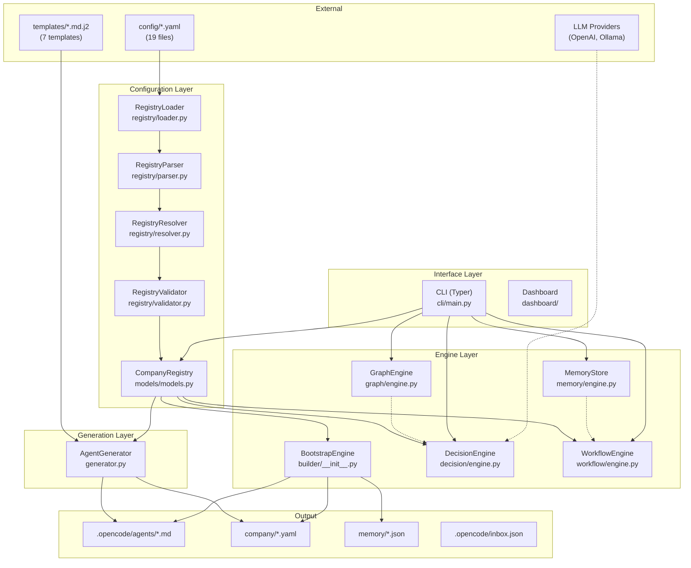
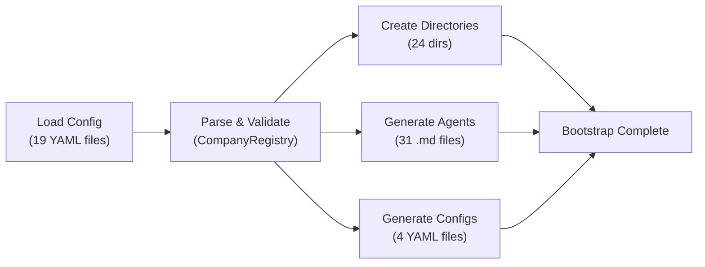
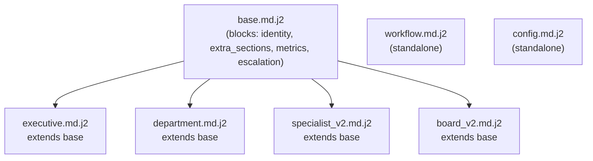
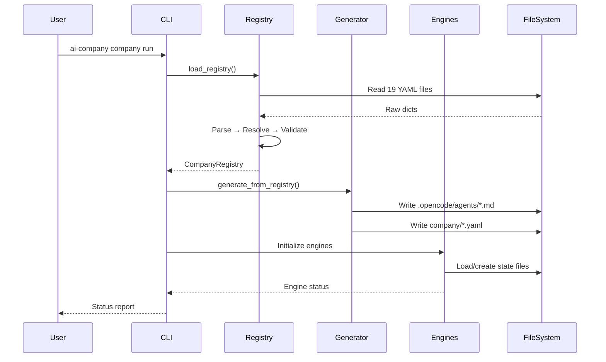
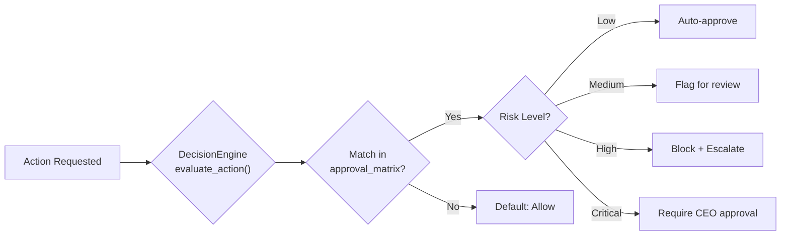
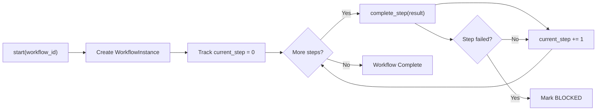
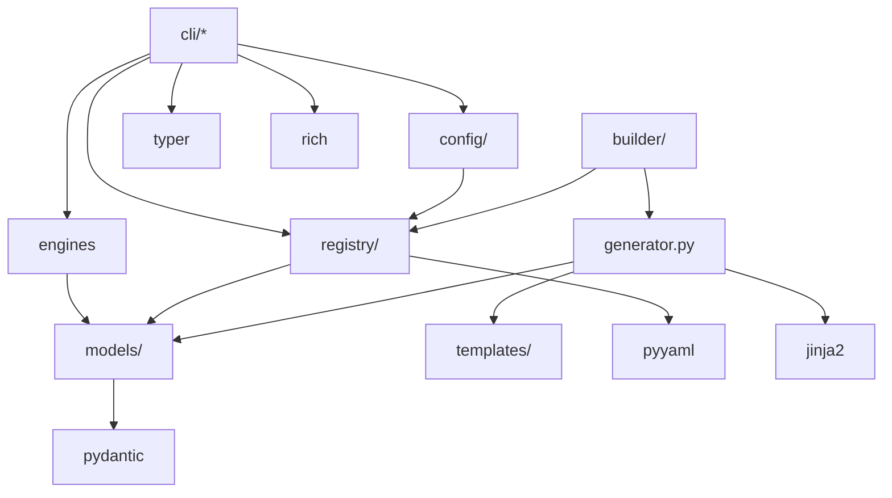

# AI Company Builder — Architecture Guide

> **Authority Level**: Layer 3 — derived from [14-DESIGN-PRINCIPLES.md](14-DESIGN-PRINCIPLES.md)
> **Supersedes**: `docs/ARCHITECTURE.md` (which remains as a quick-reference)
> **Last Updated**: 2026-07-16

---

## 1 Purpose

This document provides the complete architecture guide for AI Company Builder. It describes every component, every data flow, every integration point, and every architectural decision. This is the authoritative architecture document for the project.

---

## 2 Scope

This document covers:

- High-level system architecture
- Component architecture and responsibilities
- Repository structure and organization
- Bootstrap and generation pipeline
- Configuration architecture
- Data flow diagrams (Mermaid + ASCII)
- Layer responsibilities
- Module responsibilities
- External dependencies
- Architecture roadmap

---

## 3 High-Level Architecture

### 3.1 System Overview

AI Company Builder is a Python CLI platform that:

1. Reads company configuration from 19 YAML files
2. Parses configuration into typed Pydantic models
3. Generates AI agent definitions, workflows, and organizational structures
4. Provides engines for decision-making, workflow execution, memory, and graph analysis
5. Exposes 22 CLI commands for managing the AI company

### 3.2 Architecture Diagram (Mermaid)



### 3.3 ASCII Overview

```
┌──────────────────────────────────────────────────────────────┐
│                        INPUTS                                │
│  config/*.yaml (19)    templates/*.md.j2 (7)    LLM APIs   │
└───────────┬──────────────────┬───────────────────┬──────────┘
            │                  │                   │
            ▼                  ▼                   │
┌───────────────────────┐  ┌──────────────┐       │
│  CONFIGURATION LAYER  │  │  GENERATION   │       │
│                       │  │    LAYER      │       │
│  Loader → Parser →    │  │              │       │
│  Resolver → Validator │  │  AgentGenerator│      │
│       ↓               │  │  (Jinja2)     │       │
│  CompanyRegistry      │  └──────┬───────┘       │
└───────────┬───────────┘         │               │
            │                     │               │
            ▼                     ▼               ▼
┌──────────────────────────────────────────────────────────┐
│                      ENGINES                              │
│                                                           │
│  BootstrapEngine  DecisionEngine  WorkflowEngine          │
│  MemoryStore      GraphEngine                           │
└───────────┬─────────────────────────────────────────────┘
            │
            ▼
┌──────────────────────────────────────────────────────────┐
│                   INTERFACE LAYER                         │
│                                                           │
│  CLI (Typer) — 22 subcommands                            │
│  Dashboard — CEO view                                     │
└───────────┬─────────────────────────────────────────────┘
            │
            ▼
┌──────────────────────────────────────────────────────────┐
│                      OUTPUTS                              │
│                                                           │
│  .opencode/agents/*.md    company/*.yaml                  │
│  memory/*.json            .opencode/inbox.json            │
└──────────────────────────────────────────────────────────┘
```

---

## 4 Component Architecture

### 4.1 Configuration Layer

| Module | Responsibility | Input | Output |
|--------|---------------|-------|--------|
| `registry/loader.py` | Load 19 YAML files from disk | File paths | Raw dicts |
| `registry/parser.py` | Convert raw dicts to typed models | Raw dicts | Model instances |
| `registry/resolver.py` | Cross-reference validation | Model instances | Resolved models |
| `registry/validator.py` | Structural validation | Resolved models | Validation result |
| `config/__init__.py` | Convenience entry point | None | `CompanyRegistry` |

**Data flow**: `load_config()` → `load_raw()` → `parse_all()` → `resolve()` → `validate()` → `CompanyRegistry`

### 4.2 Engine Layer

| Engine | File | Responsibility | Dependencies |
|--------|------|---------------|-------------|
| BootstrapEngine | `builder/__init__.py` | Create directories, generate agents, generate configs | CompanyRegistry, AgentGenerator |
| DecisionEngine | `decision/engine.py` | Evaluate actions, assess risk, navigate decision trees | CompanyRegistry |
| WorkflowEngine | `workflow/engine.py` | Execute workflows, track steps, manage SLAs | CompanyRegistry |
| MemoryStore | `memory/engine.py` | Store/retrieve memories (6 types), consolidate | None (file I/O) |
| GraphEngine | `graph/engine.py` | Build/analyze graphs (4 types), find paths | None |

### 4.3 Generation Layer

| Module | File | Responsibility | Dependencies |
|--------|------|---------------|-------------|
| AgentGenerator | `generator.py` | Render agent markdown from config + templates | CompanyRegistry, Jinja2 |

**Template selection logic**:

```python
_TEMPLATE_MAP = {
    "executive": "executive.md.j2",
    "department": "department.md.j2",
    "specialist": "specialist_v2.md.j2",
    "board": "board_v2.md.j2",
    "workflow": "workflow.md.j2",
    "config": "config.md.j2",
}
# Default: "base.md.j2"
```

### 4.4 Interface Layer

| Module | File | Responsibility | Dependencies |
|--------|------|---------------|-------------|
| CLI | `cli/main.py` | 22 Typer subcommands | All engines, registry |
| Dashboard | `dashboard/` | CEO view (FastAPI) | Models, engines |

---

## 5 Repository Architecture

### 5.1 Directory Tree

```
ai-company/
├── .ai-company/              # Constitution & governance (THIS DOCUMENT)
│   ├── constitution/         # 16 governance documents + bootstrap.md
│   ├── state/                # 10 live project state documents
│   ├── templates/            # (empty — populated by generators)
│   ├── examples/             # (empty — populated with examples)
│   ├── diagrams/             # (empty — Mermaid sources)
│   └── reviews/              # (empty — code review records)
├── .opencode/                # Generated agent files (OUTPUT)
│   ├── agents/               # 31 generated .md agent files
│   ├── inbox.json            # Task queue
│   └── daily_briefing.md     # Generated briefing
├── config/                   # YAML configuration (SOURCE OF TRUTH)
│   ├── company/              # 7 files: company, vision, strategy, culture, etc.
│   ├── board/                # 4 files: board, committees, meetings, voting
│   ├── executives/           # 1 file: executives (12 roles)
│   ├── departments/          # 1 file: departments (12 depts)
│   ├── agents/               # 1 file: specialists (17 agents)
│   ├── decision/             # 3 files: approval_matrix, risk_matrix, decision_tree
│   ├── workflows/            # 1 file: workflows (9 workflows)
│   └── routing.yaml          # Model routing config
├── templates/                # Jinja2 templates (7 active)
│   ├── base.md.j2            # Base template with block inheritance
│   ├── executive.md.j2       # Executive agent template
│   ├── department.md.j2      # Department agent template
│   ├── specialist_v2.md.j2   # Specialist agent template
│   ├── board_v2.md.j2        # Board member template
│   ├── workflow.md.j2        # Workflow definition template
│   └── config.md.j2          # Config generator template
├── src/ai_company/           # Python source (APPLICATION CODE)
│   ├── cli/                  # 22 CLI modules
│   ├── models/               # 17+ Pydantic models
│   ├── config/               # Config loader
│   ├── registry/             # Registry system (4 modules)
│   ├── builder/              # Bootstrap engine
│   ├── decision/             # Decision engine
│   ├── workflow/             # Workflow engine
│   ├── memory/               # Memory engine
│   ├── graph/                # Graph engine
│   ├── orchestrator/         # Task orchestration
│   ├── llm/                  # LLM providers
│   ├── executor/             # Task execution loop
│   ├── doctor/               # System diagnostics
│   ├── dashboard/            # CEO dashboard
│   └── generator.py          # Agent file generation
├── tests/                    # Test suite (175 tests)
│   └── unit/                 # 14 test modules
├── harness/                  # ECL change lifecycle
│   ├── changes/              # Active/parked/archived changes
│   ├── evolution/            # Auto-evolution tracking
│   └── templates/            # Change templates
├── scripts/                  # PowerShell scripts
│   ├── harness-change.ps1    # Change lifecycle management
│   ├── harness-evolve.ps1    # Auto-evolution checker
│   └── lint-ecl.ps1          # ECL structure validator
├── docs/                     # Documentation
│   ├── ARCHITECTURE.md       # Quick-reference architecture
│   ├── STATUS.md             # Current project status
│   ├── ECL.md                # Change lifecycle guide
│   └── standards/            # Standards documents
├── agents/                   # Legacy agent definitions
├── board/                    # Legacy board definitions
├── company/                  # Legacy company definitions
├── departments/              # Legacy department definitions
├── executives/               # Legacy executive definitions
├── specialists/              # Legacy specialist definitions
├── generated/                # Legacy generated output
├── knowledge/                # Knowledge base
├── logs/                     # Application logs
├── memory/                   # Memory storage
├── orchestrator/             # Legacy orchestrator
├── projects/                 # Project tracking
├── prompts/                  # Prompt templates
├── reports/                  # Generated reports
├── tools/                    # Tool definitions
├── workflows/                # Workflow definitions
├── static/                   # Static assets
├── AGENTS.md                 # Agent operating guide
├── pyproject.toml            # Project metadata & dependencies
├── company-registry.yaml     # Legacy registry
├── *.py                      # Legacy setup scripts
```

### 5.2 Active vs Legacy

| Area | Status | Action |
|------|--------|--------|
| `src/ai_company/` | Active | Work here |
| `config/` | Active | Source of truth |
| `templates/` | Active | Template source |
| `tests/` | Active | Test suite |
| `harness/` | Active | ECL lifecycle |
| `.opencode/` | Generated | Regenerate, don't edit |
| `agents/`, `board/`, etc. | Legacy | Ignore |
| `*.py` (root) | Legacy | One-time scripts |

---

## 6 Bootstrap Architecture

### 6.1 Bootstrap Pipeline



### 6.2 Directory Creation

The `BootstrapEngine` creates 24 directories:

```
memory/          # 6 types (episodic, semantic, procedural, relational, temporal, aggregate)
knowledge/       # 3 types (domain, process, reference)
projects/        # 3 types (active, completed, archived)
reports/         # 3 types (daily, weekly, monthly)
prompts/         # 3 types (executive, department, specialist)
workflows/       # 2 types (active, templates)
logs/            # 2 types (system, audit)
```

### 6.3 Agent Generation

The `BootstrapEngine` delegates to `AgentGenerator.generate_from_registry()`:

```
CompanyRegistry
    ├── Executives (12) → executive.md.j2 → .opencode/agents/*.md
    ├── Departments (12) → department.md.j2 → .opencode/agents/*.md
    ├── Specialists (17) → specialist_v2.md.j2 → .opencode/agents/*.md
    └── Board Members (6) → board_v2.md.j2 → .opencode/agents/*.md
```

### 6.4 Config Generation

The `BootstrapEngine` generates 4 derived config files:

```
.opencode/config/
├── company.yaml      # Company structure summary
├── org_chart.yaml    # Organizational hierarchy
├── workflows.yaml    # Workflow definitions
└── governance.yaml   # Governance rules
```

---

## 7 Configuration Architecture

### 7.1 Configuration Files

| Category | Files | Count | Source of Truth For |
|----------|-------|-------|-------------------|
| Company | company, vision, strategy, culture, governance, policies, kpis, budget | 8 | Organization identity and rules |
| Board | board, committees, meetings, voting | 4 | Board governance |
| Executives | executives | 1 | Executive hierarchy (12 roles) |
| Departments | departments | 1 | Department structure (12 depts) |
| Agents | specialists | 1 | Specialist agents (17 roles) |
| Decision | approval_matrix, risk_matrix, decision_tree | 3 | Decision rules |
| Workflows | workflows | 1 | Process definitions (9 workflows) |
| **Total** | | **19** | |

### 7.2 Configuration Schema

Each YAML file follows a specific schema:

```yaml
# Top-level wrapper (optional)
company:                    # Wrapper key (parser unwraps automatically)
  name: "Company Name"
  id: "company-id"
  # ... nested structure
```

### 7.3 Loading Pipeline

```python
# config/__init__.py
def load_config() -> CompanyRegistry:
    """Load all 19 YAML files into a CompanyRegistry."""
    raw = load_raw_files()           # registry/loader.py
    parsed = parse_all(raw)          # registry/parser.py
    resolved = resolve(parsed)       # registry/resolver.py
    validated = validate(resolved)   # registry/validator.py
    return CompanyRegistry(**validated)
```

---

## 8 Generation Pipeline

### 8.1 Template Rendering

```
YAML Config ──→ CompanyRegistry ──→ Jinja2 Context ──→ Template ──→ Markdown File
```

### 8.2 Template Inheritance



### 8.3 Generation Output

| Output | Location | Regenerable | Count |
|--------|----------|------------|-------|
| Executive agents | `.opencode/agents/*.md` | Yes | 12 |
| Department agents | `.opencode/agents/*.md` | Yes | 12 |
| Specialist agents | `.opencode/agents/*.md` | Yes | 17 |
| Board member agents | `.opencode/agents/*.md` | Yes | 6 |
| Company config | `.opencode/config/company.yaml` | Yes | 1 |
| Org chart | `.opencode/config/org_chart.yaml` | Yes | 1 |
| Workflows | `.opencode/config/workflows.yaml` | Yes | 1 |
| Governance | `.opencode/config/governance.yaml` | Yes | 1 |

---

## 9 Data Flow

### 9.1 Primary Data Flow



### 9.2 Decision Flow



### 9.3 Workflow Flow



---

## 10 Dependency Graph

### 10.1 Module Dependencies



### 10.2 External Dependencies

| Package | Version | Used By | Purpose |
|---------|---------|---------|---------|
| pydantic | >=2.8 | models/ | Data validation and typing |
| pyyaml | * | registry/ | YAML parsing |
| jinja2 | * | generator.py | Template rendering |
| typer | * | cli/ | CLI framework |
| rich | * | cli/ | Terminal formatting |
| networkx | * | graph/ | Graph algorithms |
| click | * | cli/ | Typer dependency |
| python-dotenv | * | llm/ | Environment variables |
| fastapi | * | dashboard/ | Web API |
| uvicorn | * | dashboard/ | ASGI server |
| httpx | * | llm/ | HTTP client |

---

## 11 Layer Responsibilities

| Layer | Responsibility | May Do | May NOT Do |
|-------|---------------|--------|-----------|
| Constitution | Define immutable rules | Set policies, define boundaries | Implement features |
| Configuration | Define organization structure | Store truth, validate schemas | Execute logic |
| Domain Models | Represent business concepts | Define types, validate data | I/O, side effects |
| Engines | Implement business logic | Process data, enforce rules | CLI formatting, user interaction |
| Generation | Produce artifacts | Render templates, write files | Business logic |
| CLI | User interface | Format output, accept input | Business logic, state mutation |
| Templates | Define output format | Structure markdown | Business logic, data access |

---

## 12 Architecture Roadmap

### 12.1 Current (v0.1.0)

- Monolithic domain model in `models/models.py`
- Dictionary-based engine dispatch
- File-based memory persistence
- In-memory graph construction
- JSON task queue

### 12.2 Next (v0.2.0)

- Extract domain models into separate packages
- Add port/adapter interfaces for storage
- Implement task execution loop
- Add HITL gates
- Harden LLM integration

### 12.3 Future (v0.5.0+)

- Event-driven engine communication
- Distributed memory (Redis/PostgreSQL)
- Persistent graph (Neo4j)
- Plugin architecture
- Multi-tenant support

---

## 13 Future Enhancements

- Automated architecture fitness functions
- Dependency injection container
- Event bus for inter-engine communication
- Architecture decision record automation
- Visual architecture diagrams (auto-generated)
- Performance profiling integration
- Architecture compliance CI checks

---

## 14 References

| Document | Relationship |
|----------|-------------|
| [00-CONSTITUTION.md](00-CONSTITUTION.md) | Supreme authority |
| [02-ARCHITECTURE.md](02-ARCHITECTURE.md) | This document |
| [03-ENGINEERING-STANDARDS.md](03-ENGINEERING-STANDARDS.md) | Engineering practices for this architecture |
| [05-PROJECT-STRUCTURE.md](05-PROJECT-STRUCTURE.md) | Detailed directory reference |
| [14-DESIGN-PRINCIPLES.md](14-DESIGN-PRINCIPLES.md) | Design principles shaping this architecture |
| [docs/ARCHITECTURE.md](../../docs/ARCHITECTURE.md) | Quick-reference companion |
| [docs/STATUS.md](../../docs/STATUS.md) | Current implementation status |
