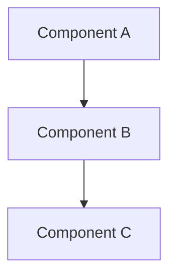

# AI Company Builder — Documentation Standards

> **Authority Level**: Layer 13 — derived from [03-ENGINEERING-STANDARDS.md](03-ENGINEERING-STANDARDS.md)
> **Last Updated**: 2026-07-16

---

## 1 Purpose

This document defines the documentation standards for AI Company Builder. Documentation is not an afterthought — it is a deliverable. Every change should include documentation updates where applicable.

---

## 2 Scope

This document covers:

- Markdown conventions
- README structure
- Architecture documentation
- Developer documentation
- API documentation
- Examples
- Diagrams
- Change logs

---

## 3 Markdown Conventions

### 3.1 Formatting

| Rule | Convention |
|------|-----------|
| Headings | ATX style (`#`, `##`, `###`) |
| Line length | 100 characters max |
| Lists | `-` for unordered, `1.` for ordered |
| Code blocks | Triple backticks with language |
| Tables | Pipe-delimited with header separator |
| Links | Relative paths for internal docs |
| Images | Mermaid diagrams preferred |

### 3.2 Structure

Every document must have:

1. **Title** — H1 heading
2. **Metadata** — Authority level, last updated
3. **Purpose** — Why this document exists
4. **Scope** — What it covers
5. **Content** — The body
6. **References** — Links to related documents

### 3.3 Code Examples

````markdown
```python
# Inline code examples use syntax highlighting
def example():
    return "hello"
```
````

---

## 4 README Structure

### 4.1 Template

```markdown
# Project Name

[One-line description]

## Quick Start

[Getting started in <5 steps]

## Architecture

[High-level overview with diagram]

## Development

[How to set up and contribute]

## Commands

[Common commands table]

## Documentation

[Links to detailed docs]

## License

[License information]
```

### 4.2 Rules

| Rule | Rationale |
|------|-----------|
| Quick start <5 steps | First impression matters |
| Architecture overview with diagram | Visual understanding |
| Common commands table | Quick reference |
| Links to detailed docs | Discoverability |

---

## 5 Architecture Documentation

### 5.1 Required Documents

| Document | Location | Purpose |
|----------|----------|---------|
| ARCHITECTURE.md | `docs/ARCHITECTURE.md` | Quick reference |
| Architecture guide | `.ai-company/constitution/02-ARCHITECTURE.md` | Full guide |
| Data flow diagrams | `.ai-company/diagrams/` | Visual reference |
| ADRs | `.ai-company/state/DECISIONS.md` | Decision history |

### 5.2 Diagram Standards

Use Mermaid for all diagrams:



ASCII diagrams are acceptable when Mermaid is not suitable.

---

## 6 Developer Documentation

### 6.1 Required Documentation

| Document | Location | Audience |
|----------|----------|----------|
| AGENTS.md | `AGENTS.md` | All developers (human + AI) |
| Bootstrap guide | `.ai-company/constitution/bootstrap.md` | Session startup |
| Coding standards | `.ai-company/constitution/04-CODING-STANDARDS.md` | All developers |
| Testing standards | `.ai-company/constitution/08-TESTING-STANDARDS.md` | All developers |
| Project structure | `.ai-company/constitution/05-PROJECT-STRUCTURE.md` | All developers |

### 6.2 Code Documentation

| Element | Standard |
|---------|----------|
| Module docstrings | Required for all modules |
| Function docstrings | Required for all public functions |
| Class docstrings | Required for all classes |
| Complex logic | Inline comments explaining why |

### 6.3 Docstring Format

```python
def evaluate_action(
    self,
    action_description: str,
    context: dict[str, Any] | None = None,
) -> dict[str, Any]:
    """Evaluate an action against the approval matrix.

    Args:
        action_description: Natural language description of the action.
        context: Optional additional context for evaluation.

    Returns:
        Dictionary with evaluation results including matching_rules,
        risk_level, and requires_approval.

    Raises:
        DecisionError: If evaluation cannot be completed.
    """
```

---

## 7 API Documentation

### 7.1 Public APIs

All public APIs must be documented with:

- Purpose
- Parameters
- Return values
- Exceptions
- Examples

### 7.2 CLI Documentation

Each CLI command must have:

- `--help` text
- Usage examples in docs
- Error message documentation

---

## 8 Examples

### 8.1 Required Examples

| Document Type | Must Include |
|--------------|-------------|
| Standards docs | Good and bad code examples |
| Architecture docs | Data flow diagrams |
| Generator docs | Before/after generation examples |
| CLI docs | Command usage examples |

### 8.2 Example Quality

Examples must be:

- **Complete**: Runnable without modification
- **Correct**: Actually work when executed
- **Current**: Match current API
- **Commented**: Explain what's happening

---

## 9 Diagrams

### 9.1 When to Include Diagrams

| Situation | Diagram Type |
|-----------|-------------|
| System overview | Architecture diagram |
| Data flow | Sequence diagram |
| Component relationships | Component diagram |
| Decision logic | Flowchart |
| State transitions | State diagram |

### 9.2 Diagram Tools

| Tool | Purpose |
|------|---------|
| Mermaid | Primary diagram tool (markdown-compatible) |
| ASCII | Fallback for simple diagrams |
| Mermaid live editor | Complex diagram creation |

---

## 10 Change Logs

### 10.1 Format

```markdown
# Changelog

## [0.2.0] - 2026-07-16

### Added
- Decision engine with approval matrix and risk assessment
- Workflow engine with 9 predefined workflows
- Memory engine with 6 memory types
- Graph engine with 4 graph types and pathfinding

### Changed
- Updated CLI to use engine classes directly

### Fixed
- Memory consolidation duplicate detection

### Deprecated
- Legacy registry parser (use new parser)
```

### 10.2 Rules

| Rule | Rationale |
|------|-----------|
| Follow Keep a Changelog format | Industry standard |
| Group by Added/Changed/Fixed/Deprecated | Readability |
| Include issue references | Traceability |
| Update with every version | Accuracy |

---

## 11 Documentation Locations

| Document | Location | Purpose |
|----------|----------|---------|
| README.md | Project root | Entry point |
| AGENTS.md | Project root | Agent operating guide |
| docs/ARCHITECTURE.md | docs/ | Quick architecture reference |
| docs/STATUS.md | docs/ | Current project status |
| docs/ECL.md | docs/ | Change lifecycle guide |
| .ai-company/constitution/ | .ai-company/ | Governance documents |
| .ai-company/state/ | .ai-company/ | Live project state |

---

## 12 Examples

### 12.1 Good Documentation

```markdown
# Decision Engine

## Purpose
The DecisionEngine evaluates organizational actions against governance rules.

## Usage
```python
from ai_company.decision.engine import DecisionEngine
from ai_company.config import load_config

registry = load_config()
engine = DecisionEngine(registry)

result = engine.evaluate_action("deploy to production")
print(result["requires_approval"])  # True
```
```

### 12.2 Bad Documentation

```markdown
# Decision Engine

This is the decision engine. It does decisions. See code for details.
```

---

## 13 Best Practices

1. **Write for your audience**: Developers need different docs than managers.
2. **Keep docs close to code**: Docs should live near the code they describe.
3. **Update docs with code changes**: Outdated docs are worse than no docs.
4. **Use examples liberally**: Show, don't just tell.
5. **Keep it concise**: Respect the reader's time.
6. **Use consistent formatting**: Makes docs scannable.

---

## 14 Common Mistakes

| Mistake | Why It's Wrong | Correct Approach |
|---------|---------------|-----------------|
| Documentation as afterthought | Docs get forgotten | Write docs with code |
| Outdated documentation | Misleads readers | Update with every change |
| No examples | Hard to understand | Include runnable examples |
| Giant walls of text | Hard to scan | Use headings, lists, tables |
| Missing diagrams | Hard to visualize | Include Mermaid diagrams |

---

## 15 Future Enhancements

- Automated doc generation from docstrings
- Documentation testing (verify examples work)
- Documentation freshness tracking
- Interactive documentation
- API reference auto-generation

---

## 16 References

| Document | Relationship |
|----------|-------------|
| [00-CONSTITUTION.md](00-CONSTITUTION.md) | Supreme authority |
| [03-ENGINEERING-STANDARDS.md](03-ENGINEERING-STANDARDS.md) | Engineering standards |
| [10-DEFINITION-OF-DONE.md](10-DEFINITION-OF-DONE.md) | Documentation completion criteria |
| [docs/](../../docs/) | Documentation directory |
