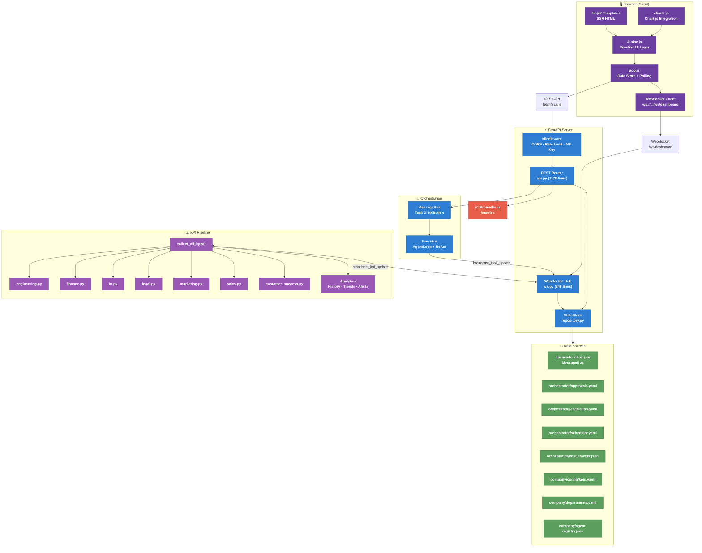
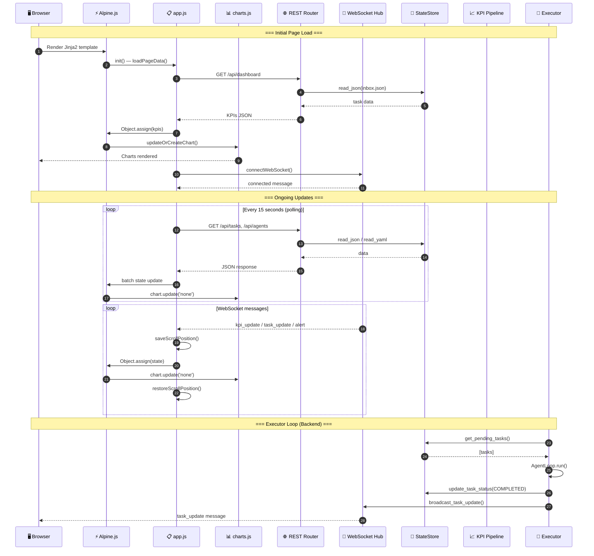

# Dashboard Architecture — Backend Interaction Diagram

> How the CEO Dashboard communicates with the backend.
> Generated 2026-07-22 from team review.

---

## System Overview

```
┌─────────────────────────────────────────────────────────────────────────────┐
│                         BROWSER (Client)                                    │
│                                                                             │
│  ┌──────────────────┐    ┌─────────────────┐    ┌──────────────────────┐   │
│  │   Alpine.js       │◄───│  app.js         │◄───│  WebSocket Client    │   │
│  │   (Reactive UI)   │    │  (Data Store)   │    │  /ws/dashboard       │   │
│  └────────┬─────────┘    └───────┬─────────┘    └──────────┬───────────┘   │
│           │                      │                          │               │
│           │  x-data bindings     │  fetch() calls           │  onmessage   │
│           │  (x-text, x-show,   │  (REST API)              │              │
│           │   x-for, :class)    │                          │              │
│           ▼                      ▼                          ▼              │
│  ┌──────────────────┐    ┌─────────────────┐    ┌──────────────────────┐   │
│  │   Jinja2          │    │  charts.js      │    │  Tailwind CSS        │   │
│  │   Templates       │    │  (Chart.js)     │    │  + style.css         │   │
│  │   (SSR HTML)      │    │                 │    │                      │   │
│  └──────────────────┘    └─────────────────┘    └──────────────────────┘   │
│                                                                             │
│  CDN Dependencies: tailwindcss, alpinejs, chart.js                         │
└──────────────────────────────────────┬──────────────────────────────────────┘
                                       │
                         HTTP REST + WebSocket (ws://)
                                       │
                                       ▼
┌─────────────────────────────────────────────────────────────────────────────┐
│                      FastAPI SERVER (app.py)                                 │
│                                                                             │
│  ┌───────────────────────────────────────────────────────────────────────┐  │
│  │                      MIDDLEWARE STACK                                  │  │
│  │  ┌─────────┐  ┌──────────────┐  ┌────────────────────────────────┐  │  │
│  │  │ CORS    │──│ Rate Limiter │──│ API Key Guard (POST/DELETE)     │  │  │
│  │  └─────────┘  └──────────────┘  └────────────────────────────────┘  │  │
│  └───────────────────────────────────────────────────────────────────────┘  │
│                                                                             │
│  ┌───────────────────────────────┬────────────────────────────────────────┐  │
│  │         ROUTERS (api.py)      │         WebSocket (ws.py)             │  │
│  │                               │                                        │  │
│  │  Page Routes:                 │  WS /ws/dashboard                     │  │
│  │  GET /        → index.html    │    ├── on message:                     │  │
│  │  GET /agents  → agents.html   │    │   ├── ping → pong                │  │
│  │  GET /tasks   → tasks.html    │    │   ├── subscribe topics            │  │
│  │  GET /kpis    → kpis.html     │    │   └── unsubscribe                 │  │
│  │  GET /costs   → costs.html    │    └── broadcast ←                     │  │
│  │                               │        ├── kpi_update                 │  │
│  │  API Routes:                  │        ├── alert                      │  │
│  │  GET /api/dashboard → KPIs    │        ├── task_update                 │  │
│  │  GET /api/agents   → List     │        ├── department_kpi              │  │
│  │  GET /api/tasks    → List     │        └── escalation                  │  │
│  │  POST /api/tasks   → Create   │                                        │  │
│  │  GET /api/approvals → List    │                                        │  │
│  │  POST /api/approvals/{id}/    │                                        │  │
│  │       approve                 │                                        │  │
│  │  POST /api/approvals/{id}/    │                                        │  │
│  │       reject                  │                                        │  │
│  │  GET /api/escalations → List  │                                        │  │
│  │  POST /api/escalations/{id}/  │                                        │  │
│  │       resolve                 │                                        │  │
│  │  GET /api/departments → List  │                                        │  │
│  │  GET /api/org-chart → Tree    │                                        │  │
│  │  GET /api/kpis/live → Live    │                                        │  │
│  │  GET /api/ceo-dashboard       │                                        │  │
│  │  GET /metrics → Prometheus    │                                        │  │
│  └───────────────────────────────┴────────────────────────────────────────┘  │
│                                                                             │
│  ┌───────────────────────────────────────────────────────────────────────┐  │
│  │                  DATA LAYER (repository.py → FileStore)               │  │
│  │                                                                       │  │
│  │  StateStore (allowlisted paths only)                                  │  │
│  │    ├── read_json() / write_json()                                     │  │
│  │    ├── read_yaml() / write_yaml()                                     │  │
│  │    ├── iter_jsonl() (audit log)                                       │  │
│  │    └── Atomic file I/O with validation                                │  │
│  │                                                                       │  │
│  │  Data Sources:                                                        │  │
│  │    ├── .opencode/inbox.json          (MessageBus → tasks)             │  │
│  │    ├── orchestrator/approvals.yaml   (approval queue)                 │  │
│  │    ├── orchestrator/escalation.yaml  (escalations)                    │  │
│  │    ├── orchestrator/scheduler.yaml   (scheduled tasks)                │  │
│  │    ├── orchestrator/cost_tracker.json (LLM costs)                     │  │
│  │    ├── company/config/kpis.yaml      (KPI definitions)                │  │
│  │    ├── company/departments.yaml      (departments)                    │  │
│  │    └── company/agent-registry.json   (agent metadata)                 │  │
│  └───────────────────────────────────────────────────────────────────────┘  │
│                                                                             │
│  ┌───────────────────────────────────────────────────────────────────────┐  │
│  │                   KPI COLLECTION PIPELINE                             │  │
│  │                                                                       │  │
│  │  7 Department Collectors (dashboard/kpis/)                            │  │
│  │    ├── engineering.py   (task rates, escalation rate)                 │  │
│  │    ├── finance.py       (budget, LLM spend, cost/agent)              │  │
│  │    ├── hr.py            (onboarding, turnover, satisfaction)          │  │
│  │    ├── legal.py         (compliance, contract processing)             │  │
│  │    ├── marketing.py     (campaigns, lead conversion)                  │  │
│  │    ├── sales.py         (pipeline, win rate, revenue)                 │  │
│  │    └── customer_success.py (NPS, churn, retention)                   │  │
│  │              │                                                        │  │
│  │              ▼                                                        │  │
│  │  collect_all_kpis() → /api/kpis/live → WS broadcast_kpi_update()     │  │
│  │                                                                       │  │
│  │  Analytics (dashboard/analytics.py)                                   │  │
│  │    ├── KPIHistoryStore (NDJSON + file locking)                        │  │
│  │    ├── AlertEngine (threshold rules)                                  │  │
│  │    ├── Trend Analysis (period-over-period)                            │  │
│  │    └── Summary Statistics (daily/weekly/monthly)                      │  │
│  └───────────────────────────────────────────────────────────────────────┘  │
│                                                                             │
│  ┌───────────────────────────────────────────────────────────────────────┐  │
│  │                   ORCHESTRATION LAYER                                  │  │
│  │                                                                       │  │
│  │  MessageBus (orchestrator/message_bus.py)                             │  │
│  │    ├── Task distribution (inbox.json)                                 │  │
│  │    ├── WebSocket broadcast callback (sync→async bridge)               │  │
│  │    └── Dead-letter queue for stale tasks                              │  │
│  │                                                                       │  │
│  │  Executor (executor/loop.py)                                          │  │
│  │    ├── Polls MessageBus for pending tasks                             │  │
│  │    ├── Runs AgentLoop (ReAct pattern)                                 │  │
│  │    ├── Cost tracking per task                                         │  │
│  │    └── Broadcasts task_update via WS                                  │  │
│  └───────────────────────────────────────────────────────────────────────┘  │
│                                                                             │
│  ┌───────────────────────────────────────────────────────────────────────┐  │
│  │                   MONITORING (monitoring.py)                           │  │
│  │                                                                       │  │
│  │  Prometheus /metrics endpoint                                         │  │
│  │    ├── Dashboard page load latency                                    │  │
│  │    ├── WS broadcast latency                                           │  │
│  │    ├── KPI collection cycle time                                      │  │
│  │    └── Active WS clients gauge                                        │  │
│  └───────────────────────────────────────────────────────────────────────┘  │
└─────────────────────────────────────────────────────────────────────────────┘
```

---

## Mermaid Diagram



---

## Data Flow Sequence



---

## Key Components

| Component | File | Purpose |
|-----------|------|---------|
| **Alpine.js** | Templates (`x-data`) | Reactive UI bindings for KPIs, tasks, agents |
| **app.js** | `static/js/app.js` | Data fetching, WebSocket, polling, scroll management |
| **charts.js** | `static/js/charts.js` | Chart.js wrapper with `updateOrCreateChart()` |
| **style.css** | `static/css/style.css` | Layout, CSS containment, scroll behavior, skeletons |
| **api.py** | `dashboard/api.py` | 70+ REST endpoints, CORS, rate limiting, API key auth |
| **ws.py** | `dashboard/ws.py` | WebSocket hub, topic-based broadcasting |
| **repository.py** | `dashboard/repository.py` | StateStore with atomic file I/O, path allowlist |
| **kpis/** | `dashboard/kpis/` | 7 department KPI collectors + `collect_all_kpis()` |
| **analytics.py** | `dashboard/analytics.py` | History store, trend analysis, alert engine |
| **message_bus.py** | `orchestrator/message_bus.py` | Task queue (inbox.json), broadcast callbacks |
| **monitoring.py** | `dashboard/monitoring.py` | Prometheus `/metrics` endpoint |

---

## Update Mechanisms

### REST Polling (Fallback)
- **Interval**: 15 seconds (was 10s — debounced for stability)
- **Trigger**: Page load + periodic `setInterval`
- **Suppressed**: When WebSocket is connected (avoids redundancy)
- **Scroll preservation**: `saveScrollPosition()` → fetch → `restoreScrollPosition()`

### WebSocket Push (Primary)
- **Endpoint**: `/ws/dashboard`
- **Topics**: `kpi_update`, `task_update`, `alert`, `department_kpi`, `escalation`
- **Reconnection**: Exponential backoff with jitter (max 30s)
- **Heartbeat**: Ping/pong every 25s

### Chart Updates
- **Method**: `chart.update('none')` — in-place data mutation, no destroy/recreate
- **Container**: `.chart-container` prevents layout collapse during updates
- **Debounce**: Max 2 updates per second via `_chartUpdatePending` flag

---

## CSS Containment Boundaries

The following elements use `contain: layout style` to prevent reflows from cascading to the viewport:

| Element | Class | Prevents |
|---------|-------|----------|
| KPI Cards | `.kpi-card` | Value updates → scroll jump |
| Chart Containers | `.chart-container` | Canvas resize → scroll jump |
| Table Wrappers | `.table-wrap` | Row changes → scroll jump |
| Kanban Columns | `.kanban-column` | Drag operations → scroll jump |
| WS Status Badge | `.ws-status` | "Live"↔"Offline" → header shift |
| Header | `<header>` | Sticky header → content shift |

---

## Security Layers

| Layer | Implementation | Scope |
|-------|----------------|-------|
| **CORS** | FastAPI CORSMiddleware | Allowed origins: `localhost:3000,5173` |
| **Rate Limiting** | Custom middleware | 100-200 req/min (configurable) |
| **API Key Auth** | Header-based (`X-API-Key`) | POST/DELETE endpoints only |
| **StateStore Allowlist** | Path validation | Only whitelisted directories accessible |
| **Input Validation** | Pydantic models | All request/response schemas validated |
