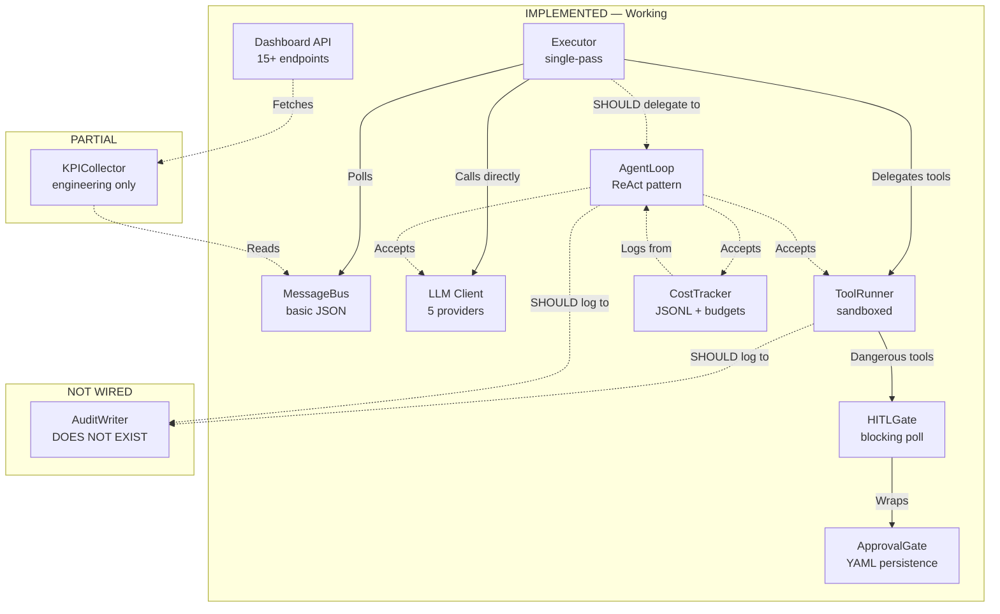
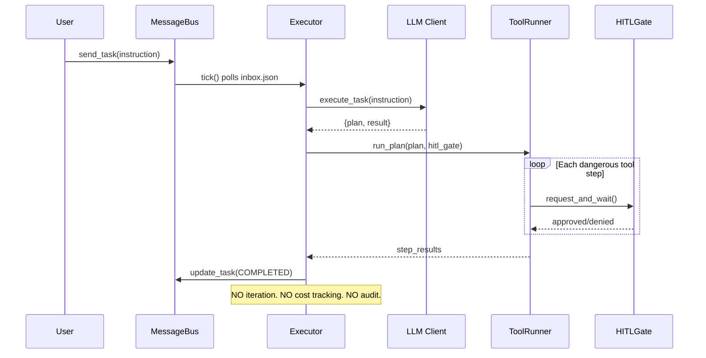
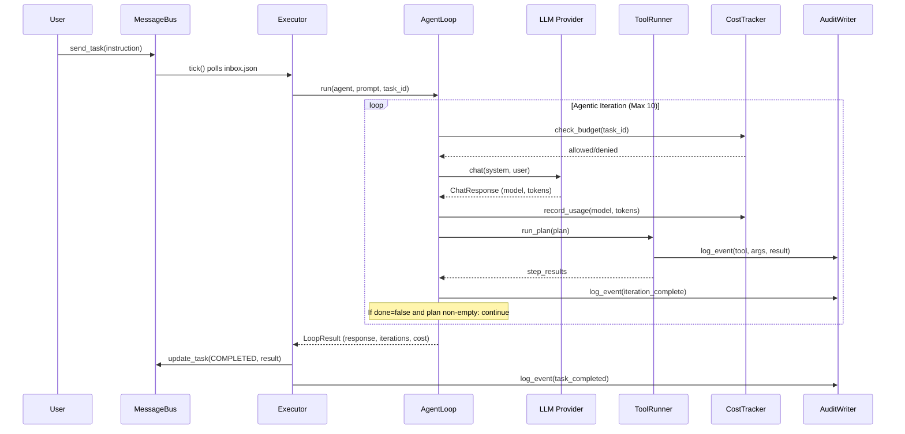
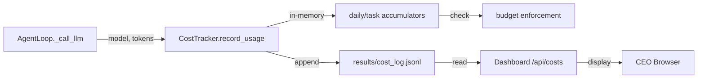

# Integration Architecture — AI Company Builder

> **Owner**: Chief Information Officer (CIO)  
> **Last Updated**: 2026-07-20  
> **Status**: Sprint 1 Complete — Phase 5 Integration Gap Closure in Progress

This document maps what is **implemented**, what is **partially wired**, and what remains **disconnected**. The goal is to identify the exact integration seams and close them.

---

## 1. Implementation Status Matrix

### 1.1 Module Status

| Module | File | Status | Wired Into Executor? | Tests? | Risk |
|--------|------|--------|---------------------|--------|------|
| **AgentLoop** | `executor/agent_loop.py` (351 lines) | **IMPLEMENTED** — full ReAct loop, budget checks, cost recording, 3-strategy JSON parsing, HITL gate | **YES** — Executor constructs and runs AgentLoop (loop.py:106-112) | Yes | LOW |
| **CostTracker** | `llm/cost_tracker.py` (289 lines) | **IMPLEMENTED** — JSONL logging, daily/task budgets, per-model pricing, summaries | **YES** — Instantiated by Executor, passed to AgentLoop (loop.py:94, 109) | Yes | LOW |
| **Executor** | `executor/loop.py` (383 lines) | **IMPLEMENTED** — polls inbox, runs AgentLoop, DLQ, memory recall, audit logging | N/A (is the integration point) | Yes | LOW |
| **MessageBus** | `orchestrator/message_bus.py` (31 lines) | **BASIC** — JSON read/write only | Partially (Executor reads inbox directly) | Yes | MEDIUM — no atomic writes |
| **ApprovalGate** | `orchestrator/approval.py` (112 lines) | **IMPLEMENTED** — request/approve/reject/expiry, YAML persistence | Yes (via HITLGate) | Yes | LOW — works, but no tier system |
| **HITLGate** | `executor/hitl_gate.py` (77 lines) | **IMPLEMENTED** — blocking poll for dangerous tools | Yes (ToolRunner + AgentLoop) | Yes | MEDIUM — blocking design |
| **ToolRunner** | `executor/tool_runner.py` (216 lines) | **IMPLEMENTED** — sandboxed execution, security path check, HITL | Yes (Executor + AgentLoop) | Yes | LOW |
| **KPICollector** | `dashboard/kpis/__init__.py` | **IMPLEMENTED** — all 7 department collectors wired | N/A (dashboard) | Yes | LOW |
| **Dashboard API** | `dashboard/api.py` (346 lines) | **IMPLEMENTED** — full REST endpoints | N/A (standalone) | Yes | MEDIUM — no auth |
| **AuditWriter** | `audit/writer.py` | **IMPLEMENTED** — JSONL append, query/filter | Yes (via integration.py) | Yes | LOW |
| **AuditTrail** | `audit/integration.py` | **IMPLEMENTED** — hooks for tool calls, task lifecycle, HITL decisions | Yes (Executor calls init_audit + log_task_status) | Yes | LOW |
| **DeadLetterQueue** | `executor/dead_letter.py` | **IMPLEMENTED** — stale task detection, DLQ with retry | Yes (Executor calls detect_stale_tasks on tick) | Yes | LOW |
| **CircuitBreaker** | `llm/circuit_breaker.py` | **IMPLEMENTED** — fail-fast after N errors | Yes (LLM client uses it) | Yes | LOW |
| **MemoryEngine** | `memory/engine.py` + `memory/integration.py` | **IMPLEMENTED** — 6 types, persistence, executor integration | Yes (Executor recalls context, records outcomes) | Yes | LOW |
| **WebSocket** | `dashboard/ws.py` | Exists (file present) | N/A (dashboard) | Yes | LOW — broadcast not wired |

### 1.2 Dependency Graph (Accurate)



**Legend**: Solid lines = active wiring. Dashed lines = exists in code but not connected, or does not exist yet.

---

## 2. Integration Gaps (Ordered by Priority)

### GAP 1: Executor → AgentLoop [RESOLVED]

**Problem**: `Executor._process_task()` calls `self.llm.execute_task()` directly — a single-pass LLM call that returns one JSON response. The `AgentLoop` class (351 lines) implements multi-turn ReAct with iteration, tool feedback loops, and cost enforcement.

**Status**: ✅ RESOLVED (2026-07-19)

**Current flow** (working):
```
Executor._process_task()
  → AgentLoop.run()
      → iteration 1: LLM → plan → tools → feedback
      → iteration 2: LLM → plan → tools → feedback
      → ...
      → done: LoopResult
  → mark complete
```

**What needs to change in `executor/loop.py`**:
1. Import `AgentLoop` and `LoopConfig`
2. Instantiate `CostTracker` and pass to `AgentLoop`
3. Replace lines 147-172 with:
   ```python
   agent_ctx = parse_agent_spec(task.receiver_id, self.agents_dir)
   loop = AgentLoop(
       llm=self.llm,
       runner=self.runner,
       cost_tracker=self.cost_tracker,
       config=LoopConfig(max_iterations=10),
   )
   result = loop.run(
       agent=agent_ctx,
       user_prompt=user_prompt,
       agent_name=task.receiver_id,
       task_id=task.id,
       priority=task.priority.value,
   )
   ```
4. Map `LoopResult` → existing `_complete_task()` and `_save_artifacts()` calls

**Dependencies**: `executor/context.py` (parse_agent_spec returns `AgentContext`), `executor/prompts.py` (build_system_prompt_typed, build_user_prompt_typed)

**Risk**: **HIGH** — Without this, the system is single-pass only. No tool iteration, no error recovery, no budget enforcement. Every task gets exactly one LLM call + one tool plan execution.

**Estimated effort**: 2-3 hours (surgical edit to `_process_task` + test updates)

---

### GAP 2: Audit Trail Package [RESOLVED]

**Problem**: There is no `src/ai_company/audit/` directory. The Integration Architecture references `AuditWriter` as a module to hook into `ToolRunner.run_step()`, but it does not exist. No file write, command execution, or code interpretation is logged to an audit trail.

**Status**: ✅ RESOLVED (2026-07-19)

**What now exists**:
```
src/ai_company/audit/
  __init__.py          # Public API: AuditEvent, AuditWriter, AuditReader
  events.py            # AuditEvent Pydantic model, AuditEventType enum
  writer.py            # AuditWriter — JSONL append
  reader.py            # AuditReader — query/filter by task, agent, type
  integration.py       # Executor hooks: log_tool_call, log_task_status, log_hitl_decision
```

**Integration points**:
1. ✅ `executor/loop.py` → `init_audit()` in __init__, `log_task_status()` on status transitions
2. ✅ `audit/integration.py` → `log_tool_call()`, `log_hitl_decision()` available for ToolRunner/HITL
3. `orchestrator/approval.py` → TODO: wire `log_hitl_decision()`
4. `orchestrator/message_bus.py` → TODO: wire task send/status change logging

---

### GAP 3: CostTracker Not Instantiated [RESOLVED]

**Problem**: `AgentLoop.__init__()` accepts `cost_tracker: CostTracker | None = None` and has full logic to check budgets and record usage (lines 144-180). But since Executor never creates a `CostTracker` instance and never passes one to `AgentLoop`, all cost tracking is dead code.

**Status**: ✅ RESOLVED (2026-07-19)

**What changed**:
1. ✅ `Executor.__init__()` creates `self.cost_tracker = CostTracker(results_dir=results_dir)` (loop.py:94)
2. ✅ `self.cost_tracker` passed when constructing `AgentLoop` (loop.py:109)

---

### GAP 4: MessageBus Lacks Response Correlation [MEDIUM RISK]

**Problem**: The current `MessageBus` (31 lines) is a thin JSON read/write wrapper. It has no concept of:
- **Response correlation**: When Agent A sends a task to Agent B, there's no mechanism for Agent A to wait for or receive the response
- **Atomic writes**: Multiple concurrent writes can corrupt `inbox.json`
- **Backup/recovery**: No `.bak` file or snapshot mechanism
- **Task status transitions**: No state machine enforcement (pending → in_progress → completed/failed)

**Current code** (entire class is 31 lines):
```python
class MessageBus:
    def send_task(self, task): ...       # append to JSON
    def get_inbox(self, agent_id): ...   # filter by receiver
    def get_sent(self, agent_id): ...    # filter by sender
```

**What the Integration Architecture spec requires**:
- Atomic writes (write to `.tmp` then `os.rename`)
- Backup file (`inbox.json.bak`)
- Response correlation (task_id → response mapping)
- State machine enforcement

**Risk**: **MEDIUM** — Concurrent executor ticks or multiple agents writing could corrupt the inbox. No response correlation means delegation is fire-and-forget.

**Estimated effort**: 3-4 hours

---

### GAP 5: Approval Tier System [MEDIUM RISK]

**Problem**: The `ApprovalGate` treats all actions uniformly — every approval request has the same process regardless of whether it's reading a file or deploying to production. The 3 approval UX spec documents (`APPROVAL-UX-SPEC.md`, `APPROVAL-DASHBOARD-UI.md`, `APPROVAL-CLI-COMMANDS.md`) define a 5-tier system:

| Tier | Actions | Approval Required | Timeout |
|------|---------|-------------------|---------|
| 1 - Auto | read, list, grep | None | N/A |
| 2 - Soft | write (non-critical) | Optional warning | None |
| 3 - Gate | write (critical), execute | Single approval | 30 min |
| 4 - Dual | deploy, financial | Two approvals | 60 min |
| 5 - Board | legal, budget >$1000 | Board vote | 24 hours |

**Current state**: `ToolRunner.DANGEROUS_TOOLS = {"write", "execute", "code_interpreter"}` — all treated as Tier 3 with single approval. No tier classification exists in the data model.

**What needs to change**:
1. Add `tier: int` field to `ApprovalRequest`
2. Add tier lookup logic in `ToolRunner` or `AgentLoop`
3. Implement dual-approval logic for Tier 4
4. Wire tier config to `company/approvals.yaml`

**Risk**: **MEDIUM** — All dangerous actions get the same friction. Low-risk writes block the executor unnecessarily. High-risk actions (deploy, financial) don't get sufficient protection.

**Estimated effort**: 4-5 hours

---

### GAP 6: HITLGate Blocking Design [LOW-MEDIUM RISK]

**Problem**: `HITLGate.request_and_wait()` uses `time.sleep()` polling in a blocking loop (lines 55-62 of `hitl_gate.py`). If a human doesn't respond within `timeout_minutes`, the entire executor is stalled for that task.

**Impact**:
- Executor `tick()` blocks on a single task waiting for approval
- Other tasks in the same batch are delayed
- No async/await pattern, no callback mechanism

**Risk**: **LOW-MEDIUM** — Works for low-volume, but becomes a bottleneck under load. Not blocking until the system scales beyond single-task processing.

**Estimated effort**: 2-3 hours (refactor to async or callback pattern)

---

### GAP 7: Missing Department SOPs [LOW RISK]

**Problem**: The project has 4 SOPs out of 8 required:
- ✅ `docs/sop-incident-response.md`
- ✅ `docs/sop-deployment.md`
- ✅ `docs/sop-hr-onboarding.md`
- ✅ `docs/sop-budget-approval.md`
- ❌ `docs/sop-legal-review.md`
- ❌ `docs/sop-sales-pipeline.md`
- ❌ `docs/sop-customer-escalation.md`
- ❌ `docs/sop-data-retention.md`

**Risk**: **LOW** — SOPs are documentation, not code. They don't block functionality but are needed for operational completeness and the 8-department coverage goal.

**Estimated effort**: 1-2 hours per SOP (template-driven, low complexity)

---

### GAP 8: KPI Collector — Only Engineering Department [LOW RISK]

**Problem**: `kpi_collector.py` only implements `collect_engineering_kpis()`. The KPI config (`company/config/kpis.yaml`) defines KPIs for 7 departments, but only engineering has a collector function. The `/api/kpis/live` endpoint returns only engineering data.

**Risk**: **LOW** — Dashboard shows partial data. Non-blocking for functionality but incomplete for CEO visibility.

**Estimated effort**: 2-3 hours (6 more collector functions, following the engineering pattern)

---

## 3. Data Flow Diagrams

### 3.1 Current Task Lifecycle (Single-Pass — What Actually Runs)



### 3.2 Target Task Lifecycle (Agentic Loop — What Should Run)



### 3.3 Cost Tracking Flow (Current vs Target)

**Current**: CostTracker exists but is never instantiated. No data flows.

**Target**:


---

## 4. Configuration Hierarchy

| Setting | Source | Override | Default | Status |
|---------|--------|----------|---------|--------|
| **LLM Budgets** | `company/models.yaml` | `LLM_BUDGET_LIMIT` (env) | None (Unlimited) | Code exists, not wired |
| **Approval Tiers** | `company/approvals.yaml` | CLI Flag | All Tier 3 | Design specs exist, not implemented |
| **KPI Targets** | `company/config/kpis.yaml` | None | Historical Average | Config exists, collector partial |
| **Audit Retention** | Code Constant | `AUDIT_RETENTION_DAYS` (env) | 30 days | Not implemented |
| **Agent Max Iterations** | `LoopConfig.max_iterations` | `AGENT_MAX_LOOPS` (env) | 10 | Code exists, not wired |
| **WS Heartbeat** | Code Constant | None | 30s | Exists in ws.py |

---

## 5. Error Handling Strategy

### 5.1 LLM Failure Chain (IMPLEMENTED in AgentLoop + LLMClient)
1. **AgentLoop fallback**: Iterates through provider chain in tier (lines 281-302 of `agent_loop.py`)
2. **LLMClient retry**: Up to 5 attempts for JSON parse failures (lines 95-121 of `client.py`)
3. **Escalate**: Task marked `failed` with detailed error message
4. **Budget guard**: `CostTracker.check_budget()` stops iteration before next LLM call

### 5.2 Tool Failure Chain (PARTIALLY IMPLEMENTED)
1. **ToolRunner**: Catches exceptions per step (lines 78-84 of `tool_runner.py`)
2. **AgentLoop feedback**: Tool errors are fed back to LLM via `build_iteration_feedback()` ✅
3. **HITL denial**: Tool denied → continues with remaining steps ✅
4. **Audit trail**: NOT IMPLEMENTED — no logging of tool failures

### 5.3 MessageBus Integrity (SPECIFIED BUT NOT IMPLEMENTED)
1. **Atomic Write**: NOT IMPLEMENTED — direct `write_text()` with no temp file
2. **Fallback**: NOT IMPLEMENTED — no `.bak` file mechanism
3. **Concurrent access**: NOT PROTECTED — multiple processes could corrupt JSON

### 5.4 KPI Collector Failure (IMPLEMENTED for engineering)
1. **Isolation**: `collect_all_kpis()` calls per-department functions ✅
2. **Partial Return**: Engineering-only for now; other departments return empty
3. **Error handling**: Not yet needed (only one collector exists)

---

## 6. Risk Summary

| # | Gap | Risk | Impact if Not Fixed | Effort to Fix | Status | Dependencies |
|---|-----|------|---------------------|---------------|--------|-------------|
| 1 | Executor → AgentLoop | ~~HIGH~~ | ~~Single-pass only~~ | ~~2-3h~~ | ✅ RESOLVED | — |
| 2 | No audit trail package | ~~HIGH~~ | ~~No compliance, no forensics~~ | ~~4-6h~~ | ✅ RESOLVED | — |
| 3 | CostTracker not instantiated | ~~MEDIUM~~ | ~~Untracked LLM spend~~ | ~~30min~~ | ✅ RESOLVED | — |
| 4 | MessageBus lacks correlation | MEDIUM | Fire-and-forget delegation, possible JSON corruption | 3-4h | 🔴 Open | S2-01, S2-02 |
| 5 | No approval tier system | MEDIUM | Uniform friction for all actions | 4-5h | 🔴 Open | S2-04 |
| 6 | HITLGate blocking design | LOW-MED | Executor stalls on pending approvals | 2-3h | 🔴 Open | S2-05 |
| 7 | Missing department SOPs (4/8) | LOW | Incomplete operational docs | 4-8h total | 🔴 Open | S2-11 |
| 8 | KPI collector partial (1/7) | ~~LOW~~ | ~~Dashboard shows only engineering~~ | ~~2-3h~~ | ✅ RESOLVED | — |

### Recommended Implementation Order

1. **GAP 4** (MessageBus hardening) — 3-4h, reliability foundation (Sprint 2)
2. **GAP 5** (Approval tier system) — 4-5h, security refinement (Sprint 2)
3. **GAP 7** (Remaining SOPs) — 4-8h, can run in parallel (Sprint 2)
4. **GAP 6** (HITL async refactor) — 2-3h, optimization (Sprint 2)

**Total remaining integration work**: ~13-20 hours across all gaps.
