# Architecture Diagrams 4–6

## Diagram 4: Agent Hierarchy & Communication Topology

```mermaid
%%{init: {'theme': 'base', 'themeVariables': {'fontSize': '12px'}}}%%
graph TD
    %% ═══════════════════════════════════════════════════════════════
    %% BOARD OF DIRECTORS
    %% ═══════════════════════════════════════════════════════════════
    subgraph BOARD ["🏛 Board of Directors"]
        direction LR
        BC["board_chair<br/><i>Board Chair</i>"]
        B_FIN["board_finance<br/><i>Finance Committee</i>"]
        B_TECH["board_technology<br/><i>Tech Committee</i>"]
        B_RISK["board_risk<br/><i>Risk Committee</i>"]
        B_STRAT["board_strategy<br/><i>Strategy Committee</i>"]
        B_CUST["board_customer<br/><i>Customer Committee</i>"]
        B_PROD["board_product<br/><i>Product Committee</i>"]
    end

    %% ═══════════════════════════════════════════════════════════════
    %% CEO — PREMIUM MODEL TIER
    %% ═══════════════════════════════════════════════════════════════
    CEO["👤 human_ceo<br/><b>Chief Executive Officer</b><br/><i>⚡ PREMIUM MODEL</i><br/>Strategy · Vision · Culture"]

    BC -.->|"governance"| CEO

    %% ═══════════════════════════════════════════════════════════════
    %% CHIEF OF STAFF — PRIMARY ORCHESTRATOR
    %% ═══════════════════════════════════════════════════════════════
    COS["🎯 chief_of_staff<br/><b>Chief of Staff</b><br/><i>Orchestrator</i><br/>Span: 14 direct reports"]

    CEO -->|"delegates execution"| COS

    %% ═══════════════════════════════════════════════════════════════
    %% CEO DIRECT REPORTS (bypass Chief of Staff)
    %% ═══════════════════════════════════════════════════════════════
    CFO["💰 cfo<br/><b>CFO</b><br/>Finance · Budgets<br/>Span: 2"]
    CISO["🔒 ciso<br/><b>CISO</b><br/>Security · Compliance<br/>Span: 8"]
    CLO["⚖️ clo<br/><b>CLO</b><br/>Legal · Contracts<br/>Span: 3"]
    CSO["🧭 cso<br/><b>CSO</b><br/>Strategy · M&A<br/>Span: 5"]
    CEO_ADV["📋 ceo_advisor<br/><b>CEO Advisor</b><br/>Strategic Counsel"]

    CEO --> CFO
    CEO --> CISO
    CEO --> CLO
    CEO --> CSO
    CEO --> CEO_ADV

    %% ═══════════════════════════════════════════════════════════════
    %% C-SUITE UNDER CHIEF OF STAFF
    %% ═══════════════════════════════════════════════════════════════
    CTO["⚙️ cto<br/><b>CTO</b><br/>Technology · Engineering<br/>Span: 21"]
    COO["🔄 coo<br/><b>COO</b><br/>Operations · Processes<br/>Span: 10"]
    CAIO["🧠 caio<br/><b>CAIO</b><br/>AI Research · Models<br/>Span: 8"]
    CPO["📦 cpo<br/><b>CPO</b><br/>Product · Roadmap<br/>Span: 8"]
    CMO["📣 cmo<br/><b>CMO</b><br/>Marketing · Brand<br/>Span: 7"]
    CHRO["👥 hr<br/><b>CHRO</b><br/>People · Culture<br/>Span: 4"]
    CIO["🖥️ cio<br/><b>CIO</b><br/>IT Infrastructure"]
    HEAD_CS["🤝 customer_success<br/><b>Head of CS</b><br/>Onboarding · Retention<br/>Span: 2"]
    HEAD_SALES["💼 sales<br/><b>Head of Sales</b><br/>Pipeline · Revenue<br/>Span: 4"]
    LEGAL_ADV["📜 legal<br/><b>Legal Advisor</b><br/>Contracts · IP<br/>Span: 2"]
    HEAD_BD["🤝 head_of_business_development<br/><b>Head of BD</b><br/>Partnerships"]
    CULTURE["❤️ culture_values_officer<br/><b>Culture Officer</b><br/>Values · Behavior"]
    ETHICS_CHAIR["🏛 ai_ethics_board_chair<br/><b>Ethics Board Chair</b><br/>AI Ethics Governance"]
    INT_COMMS["📢 internal_comms_lead<br/><b>Internal Comms</b><br/>Change Mgmt"]

    COS --> CTO
    COS --> COO
    COS --> CAIO
    COS --> CPO
    COS --> CMO
    COS --> CHRO
    COS --> CIO
    COS --> HEAD_CS
    COS --> HEAD_SALES
    COS --> LEGAL_ADV
    COS --> HEAD_BD
    COS --> CULTURE
    COS --> ETHICS_CHAIR
    COS --> INT_COMMS

    %% ═══════════════════════════════════════════════════════════════
    %% TECHNOLOGY DEPARTMENT — Under CTO
    %% ═══════════════════════════════════════════════════════════════
    subgraph TECH_DEPT ["⚙️ Technology Department"]
        direction TB
        VPENG["vp_engineering<br/><b>VP Engineering</b><br/>Span: 9"]
        LEAD_BE["lead-backend<br/><b>Lead Backend</b><br/>Span: 3"]
        LEAD_FE["lead-frontend<br/><b>Lead Frontend</b><br/>Span: 3"]
        SOL_ARCH["solution_architect<br/><b>Solution Architect</b>"]
        DEVOPS["devops_lead<br/><b>DevOps Lead</b>"]
        QA_LEAD["qa-lead<br/><b>QA Lead</b><br/>Span: 2"]
        CDO["cdo<br/><b>CDO</b><br/>Data Strategy<br/>Span: 3"]
        REG_OWNER["registry_owner<br/><b>Registry Owner</b>"]
        GEN_OWNER["generator_owner<br/><b>Generator Owner</b>"]
        DASH_OWNER["dashboard_owner<br/><b>Dashboard Owner</b>"]
        GRAPH_OWNER["graph_owner<br/><b>Graph Owner</b>"]
        AUDIT_OWNER["audit_trail_owner<br/><b>Audit Trail Owner</b>"]
        PLATFORM_REL["platform_reliability_engineer<br/><b>Platform Reliability</b>"]
        PLATFORM_ENG["platform_engineer<br/><b>Platform Engineer</b>"]
        FE_ARCH["frontend_architect<br/><b>Frontend Architect</b>"]
        API_ARCH["api_architect<br/><b>API Architect</b>"]
        OBS_ENG["observability_engineer<br/><b>Observability Engineer</b>"]
        SCALE_ARCH["scalability_architect<br/><b>Scalability Architect</b>"]
        SW_ARCH["software_architect<br/><b>Software Architect</b>"]
        LEAD_DO["lead-devops<br/><b>Lead DevOps</b>"]
        CLOUD_ARCH["cloud-architect<br/><b>Cloud Architect</b>"]
    end

    CTO --> VPENG
    CTO --> LEAD_BE
    CTO --> LEAD_FE
    CTO --> SOL_ARCH
    CTO --> QA_LEAD
    CTO --> CDO

    %% ═══════════════════════════════════════════════════════════════
    %% ENGINEERING SPECIALISTS
    %% ═══════════════════════════════════════════════════════════════
    SEN_BE["senior_backend_engineer"]
    BE_ENG["backend_engineer"]
    FS_ENG["fullstack-engineer"]
    SEN_FE["senior_frontend_engineer"]
    FE_ENG["frontend_engineer"]
    MOB_DEV["mobile-developer"]

    LEAD_BE --> SEN_BE
    LEAD_BE --> BE_ENG
    LEAD_BE --> FS_ENG
    LEAD_FE --> SEN_FE
    LEAD_FE --> FE_ENG
    LEAD_FE --> MOB_DEV

    VPENG --> DEVOPS
    VPENG --> PLATFORM_REL
    VPENG --> AUDIT_OWNER
    VPENG --> GRAPH_OWNER
    VPENG --> DASH_OWNER
    VPENG --> REG_OWNER
    VPENG --> GEN_OWNER
    VPENG --> QA_LEAD

    CTO -.->|"cross-dept delegation"| PLATFORM_ENG
    CTO -.->|"cross-dept delegation"| FE_ARCH
    CTO -.->|"cross-dept delegation"| API_ARCH
    CTO -.->|"cross-dept delegation"| OBS_ENG
    CTO -.->|"cross-dept delegation"| SCALE_ARCH
    CTO -.->|"cross-dept delegation"| SW_ARCH
    CTO -.->|"cross-dept delegation"| LEAD_DO
    CTO -.->|"cross-dept delegation"| CLOUD_ARCH

    QA_LEAD --> TEST_ENG_LEAD["test_engineering_lead<br/><b>Test Engineering Lead</b>"]
    QA_LEAD --> REL_MGR["release_manager<br/><b>Release Manager</b>"]
    TEST_ENG_LEAD --> QA_AUTO["qa-automation-engineer<br/><b>QA Automation</b>"]

    %% ═══════════════════════════════════════════════════════════════
    %% DATA DEPARTMENT — Under CDO (under CTO)
    %% ═══════════════════════════════════════════════════════════════
    subgraph DATA_DEPT ["📊 Data Department"]
        DATA_ENG["data-engineer<br/><b>Data Engineer</b>"]
        DATA_SCIST["data-scientist<br/><b>Data Scientist</b>"]
        BI_ENG["business_intelligence_engineer<br/><b>BI Engineer</b>"]
    end

    CDO --> DATA_ENG
    CDO --> DATA_SCIST
    CDO --> BI_ENG

    %% ═══════════════════════════════════════════════════════════════
    %% AI RESEARCH DEPARTMENT — Under CAIO
    %% ═══════════════════════════════════════════════════════════════
    subgraph AI_DEPT ["🧠 AI Research Department"]
        ML_ENG["ml-engineer<br/><b>ML Engineer</b>"]
        ML_SERV["ml_services_owner<br/><b>ML Services Owner</b>"]
        MEM_OWNER["memory_owner<br/><b>Memory Owner</b>"]
        LLM_OWNER["llm_platform_owner<br/><b>LLM Platform Owner</b>"]
        MLOPS["mlops_engineer<br/><b>MLOps Engineer</b>"]
        AI_SAFETY["ai_safety_lead<br/><b>AI Safety Lead</b><br/>Span: 4"]
        EVAL_ENG["eval_benchmarks_engineer<br/><b>Eval Benchmarks</b>"]
        PROMPT_ENG["prompt-engineer<br/><b>Prompt Engineer</b>"]
    end

    CAIO --> ML_ENG
    CAIO --> ML_SERV
    CAIO --> MEM_OWNER
    CAIO --> LLM_OWNER
    CAIO --> MLOPS
    CAIO --> AI_SAFETY
    CAIO --> EVAL_ENG
    CAIO --> PROMPT_ENG

    RED_TEAM["red_team_engineer<br/><b>Red Team Engineer</b>"]
    CONSTIT["constitutional_ai_owner<br/><b>Constitutional AI</b>"]
    ETHICS["ai_ethics_officer<br/><b>AI Ethics Officer</b>"]
    HAI["hai_designer<br/><b>HAI Designer</b>"]

    AI_SAFETY --> RED_TEAM
    AI_SAFETY --> CONSTIT
    AI_SAFETY --> ETHICS
    AI_SAFETY --> HAI

    %% ═══════════════════════════════════════════════════════════════
    %% OPERATIONS DEPARTMENT — Under COO
    %% ═══════════════════════════════════════════════════════════════
    subgraph OPS_DEPT ["🔄 Operations Department"]
        WF_OWNER["workflow_owner<br/><b>Workflow Owner</b>"]
        ORCH_OWNER["orchestration_owner<br/><b>Orchestration Owner</b>"]
        DOCTOR["doctor_owner<br/><b>Doctor Owner</b>"]
        SOP_OWN["sop_owner<br/><b>SOP Owner</b>"]
        PROG_MGR["program_manager<br/><b>Program Manager</b>"]
        VENDOR["vendor_manager<br/><b>Vendor Manager</b>"]
        CAPACITY["capacity_planner<br/><b>Capacity Planner</b>"]
        BCM["business_continuity_manager<br/><b>BC Manager</b>"]
        KNOWLEDGE["knowledge_manager<br/><b>Knowledge Manager</b>"]
        PROCESS["process_quality_manager<br/><b>Process Quality</b>"]
    end

    COO --> WF_OWNER
    COO --> ORCH_OWNER
    COO --> DOCTOR
    COO --> SOP_OWN
    COO --> PROG_MGR
    COO --> VENDOR
    COO --> CAPACITY
    COO --> BCM
    COO --> KNOWLEDGE
    COO --> PROCESS

    %% ═══════════════════════════════════════════════════════════════
    %% PRODUCT DEPARTMENT — Under CPO
    %% ═══════════════════════════════════════════════════════════════
    subgraph PROD_DEPT ["📦 Product Department"]
        UX_RES["ux_research_lead<br/><b>UX Research</b>"]
        UX_ANAL["ux_analytics_lead<br/><b>Product Analytics</b>"]
        TECH_DOC["technical_documentation_lead<br/><b>Tech Docs</b>"]
        GPM["growth_product_manager<br/><b>Growth PM</b>"]
        DEXP["developer_experience_engineer<br/><b>DX Engineer</b>"]
        PROD_DES["product_designer<br/><b>Product Designer</b>"]
        PROD_OWNER["product_owner<br/><b>Product Owner</b>"]
        TECH_WRITER["prompt-engineer_specialist<br/><b>Technical Writer</b>"]
    end

    CPO --> UX_RES
    CPO --> UX_ANAL
    CPO --> TECH_DOC
    CPO --> GPM
    CPO --> DEXP
    CPO --> PROD_DES
    CPO --> PROD_OWNER
    CPO --> TECH_WRITER

    %% ═══════════════════════════════════════════════════════════════
    %% MARKETING DEPARTMENT — Under CMO
    %% ═══════════════════════════════════════════════════════════════
    subgraph MKTG_DEPT ["📣 Marketing Department"]
        MKT_OWNER["marketing_owner<br/><b>Marketing Owner</b>"]
        HEAD_DR["head_of_developer_relations<br/><b>Head of DevRel</b>"]
        PMM["product_marketing_manager<br/><b>Product Marketing</b>"]
        IARM["industry-analyst-relations-manager<br/><b>Analyst Relations</b>"]
        CONTENT_WR["content-writer<br/><b>Content Writer</b>"]
        CONTENT_CR["content-creator<br/><b>Content Creator</b>"]
        GH["growth-hacker<br/><b>Growth Hacker</b>"]
    end

    CMO --> MKT_OWNER
    CMO --> HEAD_DR
    CMO --> PMM
    CMO --> IARM
    CMO --> CONTENT_WR
    CMO --> CONTENT_CR
    CMO --> GH

    %% ═══════════════════════════════════════════════════════════════
    %% PEOPLE DEPARTMENT — Under CHRO
    %% ═══════════════════════════════════════════════════════════════
    subgraph PEOPLE_DEPT ["👥 People Department"]
        HR_OWNER["hr_owner<br/><b>HR Owner</b>"]
        LND["learning-development-lead<br/><b>Learning & Dev</b>"]
        EE_LEAD["employee-experience-lead<br/><b>Employee Experience</b>"]
        RECRUITER["recruiter<br/><b>Recruiter</b>"]
    end

    CHRO --> HR_OWNER
    CHRO --> LND
    CHRO --> EE_LEAD
    CHRO --> RECRUITER

    %% ═══════════════════════════════════════════════════════════════
    %% SECURITY — Under CISO
    %% ═══════════════════════════════════════════════════════════════
    subgraph SEC_DEPT ["🔒 Security Department"]
        SEC_ARCH["security_architect<br/><b>Security Architect</b>"]
        SEC_COMP["security_compliance_lead<br/><b>Security Compliance</b>"]
        AI_SEC["ai_security_specialist<br/><b>AI Security</b>"]
        PEN_TEST["penetration_testing_lead<br/><b>Pen Testing</b>"]
        IR_LEAD["incident_response_lead<br/><b>Incident Response</b>"]
        DS_LEAD["devsecops_lead<br/><b>DevSecOps</b>"]
        SCSE["supply_chain_security_engineer<br/><b>Supply Chain Sec</b>"]
        THREAT["threat_intelligence_analyst<br/><b>Threat Intel</b>"]
        SOC2["soc2_audit_readiness_analyst<br/><b>SOC 2 Analyst</b>"]
    end

    CISO --> SEC_ARCH
    CISO --> SEC_COMP
    CISO --> AI_SEC
    CISO --> PEN_TEST
    CISO --> IR_LEAD
    CISO --> DS_LEAD
    CISO --> SCSE
    CISO --> THREAT
    SEC_COMP --> SOC2

    %% ═══════════════════════════════════════════════════════════════
    %% LEGAL — Under CLO
    %% ═══════════════════════════════════════════════════════════════
    subgraph LEGAL_DEPT ["⚖️ Legal Department"]
        LEGAL_OWNER["legal_owner<br/><b>Legal Owner</b>"]
        COMPLIANCE["compliance-officer<br/><b>Compliance Officer</b>"]
        DPO["data_privacy_officer<br/><b>Data Privacy Officer</b>"]
    end

    CLO --> LEGAL_OWNER
    CLO --> COMPLIANCE
    CLO --> DPO

    %% ═══════════════════════════════════════════════════════════════
    %% FINANCE — Under CFO
    %% ═══════════════════════════════════════════════════════════════
    subgraph FIN_DEPT ["💰 Finance Department"]
        FIN_ANA["financial-analyst<br/><b>Financial Analyst</b>"]
        IR_LEAD["investor_relations_lead<br/><b>Investor Relations</b>"]
    end

    CFO --> FIN_ANA
    CFO --> IR_LEAD

    %% ═══════════════════════════════════════════════════════════════
    %% STRATEGY — Under CSO
    %% ═══════════════════════════════════════════════════════════════
    subgraph STRAT_DEPT ["🧭 Strategy Department"]
        COMP_INT["head_of_competitive_intelligence<br/><b>Competitive Intel</b>"]
        CORP_DEV["corporate_development_lead<br/><b>Corp Development</b>"]
        REV_OPS["revenue_operations_analyst<br/><b>Revenue Ops</b>"]
        SOL_ENG["solutions_engineer<br/><b>Solutions Engineer</b>"]
        MKT_ANA["market-analyst<br/><b>Market Analyst</b>"]
    end

    CSO --> COMP_INT
    CSO --> CORP_DEV
    CSO --> REV_OPS
    CSO --> SOL_ENG
    CSO --> MKT_ANA

    %% ═══════════════════════════════════════════════════════════════
    %% SALES
    %% ═══════════════════════════════════════════════════════════════
    subgraph SALES_DEPT ["💼 Sales Department"]
        SALES_OWNER["sales_owner<br/><b>Sales Owner</b>"]
        BIZ_DEV["business-developer<br/><b>Business Developer</b>"]
    end

    HEAD_SALES --> SALES_OWNER
    HEAD_SALES --> BIZ_DEV
    HEAD_SALES -.-> REV_OPS
    HEAD_SALES -.-> SOL_ENG

    %% ═══════════════════════════════════════════════════════════════
    %% CUSTOMER SUCCESS
    %% ═══════════════════════════════════════════════════════════════
    subgraph CS_DEPT ["🤝 Customer Success"]
        CS_OWNER["customer-success-owner<br/><b>CS Owner</b>"]
        SUPPORT["support-agent<br/><b>Support Agent</b>"]
    end

    HEAD_CS --> CS_OWNER
    HEAD_CS --> SUPPORT

    %% ═══════════════════════════════════════════════════════════════
    %% LEGAL ADVISOR (parallel to CLO)
    %% ═══════════════════════════════════════════════════════════════
    LEGAL_ADV -.-> LEGAL_OWNER
    LEGAL_ADV -.-> COMPLIANCE

    %% ═══════════════════════════════════════════════════════════════
    %% TASK ROUTING FLOW (right side)
    %% ═══════════════════════════════════════════════════════════════
    subgraph TASK_FLOW ["📋 Task Routing Flow"]
        direction LR
        T1["1️⃣ CEO Issues<br/>Strategic Instruction"]
        T2["2️⃣ Chief of Staff<br/>Decomposes & Routes"]
        T3["3️⃣ C-Suite Executive<br/>Refines & Delegates"]
        T4["4️⃣ Department Head<br/>Assigns Specialist"]
        T5["5️⃣ Specialist<br/>Executes Task"]
        T6["6️⃣ Audit Trail<br/>Records Everything"]

        T1 --> T2 --> T3 --> T4 --> T5 --> T6
    end

    %% ═══════════════════════════════════════════════════════════════
    %% LEGEND
    %% ═══════════════════════════════════════════════════════════════
    subgraph LEGEND ["Legend"]
        direction LR
        L1["━━ Direct Report<br/>(reports_to)"]
        L2["╌╌ Cross-Dept Delegation"]
        L3["⚡ Premium Model Tier<br/>(CEO, select execs)"]
        L4["📋 Standard Model Tier<br/>(all specialists)"]
    end

    %% ═══════════════════════════════════════════════════════════════
    %% STYLING
    %% ═══════════════════════════════════════════════════════════════
    classDef premiumModel fill:#FFD700,stroke:#B8860B,stroke-width:3px,color:#000
    classDef execModel fill:#4A90D9,stroke:#2C5F8A,stroke-width:2px,color:#fff
    classDef specialistModel fill:#7B9E89,stroke:#4A6B52,stroke-width:1px,color:#fff
    classDef boardModel fill:#8B5CF6,stroke:#6D28D9,stroke-width:2px,color:#fff
    classDef taskFlow fill:#FEF3C7,stroke:#F59E0B,stroke-width:2px,color:#000

    class CEO premiumModel
    class COS,CTO,COO,CAIO,CFO,CPO,CMO,CHRO,CIO,CISO,CSO,CLO,CEO_ADV,HEAD_CS,HEAD_SALES,LEGAL_ADV,HEAD_BD,CULTURE,ETHICS_CHAIR,INT_COMMS execModel
    class BC,B_FIN,B_TECH,B_RISK,B_STRAT,B_CUST,B_PROD boardModel
    class VPENG,LEAD_BE,LEAD_FE,SOL_ARCH,DEVOPS,QA_LEAD,CDO,REG_OWNER,GEN_OWNER,DASH_OWNER,GRAPH_OWNER,AUDIT_OWNER,PLATFORM_REL,PLATFORM_ENG,FE_ARCH,API_ARCH,OBS_ENG,SCALE_ARCH,SW_ARCH,LEAD_DO,CLOUD_ARCH specialistModel
    class ML_ENG,ML_SERV,MEM_OWNER,LLM_OWNER,MLOPS,AI_SAFETY,EVAL_ENG,PROMPT_ENG,RED_TEAM,CONSTIT,ETHICS,HAI specialistModel
    class WF_OWNER,ORCH_OWNER,DOCTOR,SOP_OWN,PROG_MGR,VENDOR,CAPACITY,BCM,KNOWLEDGE,PROCESS specialistModel
    class UX_RES,UX_ANAL,TECH_DOC,GPM,DEXP,PROD_DES,PROD_OWNER,TECH_WRITER specialistModel
    class MKT_OWNER,HEAD_DR,PMM,IARM,CONTENT_WR,CONTENT_CR,GH specialistModel
    class HR_OWNER,LND,EE_LEAD,RECRUITER specialistModel
    class SEC_ARCH,SEC_COMP,AI_SEC,PEN_TEST,IR_LEAD,DS_LEAD,SCSE,THREAT,SOC2 specialistModel
    class LEGAL_OWNER,COMPLIANCE,DPO specialistModel
    class FIN_ANA,IR_LEAD specialistModel
    class COMP_INT,CORP_DEV,REV_OPS,SOL_ENG,MKT_ANA specialistModel
    class SALES_OWNER,BIZ_DEV specialistModel
    class CS_OWNER,SUPPORT specialistModel
    class SEN_BE,BE_ENG,FS_ENG,SEN_FE,FE_ENG,MOB_DEV specialistModel
    class DATA_ENG,DATA_SCIST,BI_ENG specialistModel
    class TEST_ENG_LEAD,REL_MGR,QA_AUTO specialistModel
    class T1,T2,T3,T4,T5,T6 taskFlow
```

### Span of Control Summary

| Executive | Direct Reports | Span |
|-----------|---------------|------|
| Board Chair | 7 board members | 7 |
| Human CEO | 6 (COS + CFO + CISO + CLO + CSO + Advisor) | 6 |
| Chief of Staff | 14 (CTO + COO + CAIO + CPO + CMO + CHRO + CIO + CS + Sales + Legal + BD + Culture + Ethics + Comms) | 14 |
| CTO | 21 (VP Eng + Leads + Architects + Owners + CDO) | 21 |
| COO | 10 (Workflow + Orchestration + Doctor + SOP + PM + Vendor + Capacity + BCM + Knowledge + Process) | 10 |
| CAIO | 8 (ML + Memory + LLM + Safety + Eval + Prompt + MLOps + Services) | 8 |
| CPO | 8 (UX + Analytics + Docs + Growth + DX + Design + Owner + Writer) | 8 |
| CMO | 7 (Marketing + DevRel + PMM + Analyst + Writer + Creator + Growth) | 7 |
| CISO | 9 (Architect + Compliance + AI Sec + Pen Test + IR + DevSecOps + Supply Chain + Threat + SOC2) | 9 |
| CFO | 2 (Financial Analyst + IR Lead) | 2 |
| CLO | 3 (Legal Owner + Compliance + Privacy) | 3 |
| CSO | 5 (Competitive Intel + Corp Dev + Rev Ops + Solutions + Market) | 5 |

**Total agents: 70+** across 12 departments and 4 organizational tiers.

---

## Diagram 5: Module Dependency & Layering

```mermaid
%%{init: {'theme': 'base', 'themeVariables': {'fontSize': '11px'}}}%%
graph TB
    %% ═══════════════════════════════════════════════════════════════
    %% LAYER 1: CLI — User-Facing Surface
    %% ═══════════════════════════════════════════════════════════════
    subgraph L1_CLI ["Layer 1 · CLI — User-Facing Surface (24 subcommands)"]
        direction LR
        CLI_MAIN["cli/main.py<br/><b>Typer App Entry</b>"]
        subgraph CLI_CMDS ["Subcommand Modules"]
            direction LR
            CLI_AGENTS["cli/agents.py"]
            CLI_BOARD["cli/board.py"]
            CLI_COMPANY["cli/company.py"]
            CLI_CUST["cli/customer_success.py"]
            CLI_DASH["cli/dashboard.py"]
            CLI_DECISION["cli/decision.py"]
            CLI_DEPT["cli/departments.py"]
            CLI_DOCTOR["cli/doctor.py"]
            CLI_EXEC["cli/executives.py"]
            CLI_EXE["cli/executor.py"]
            CLI_GRAPH["cli/graph.py"]
            CLI_HR["cli/hr.py"]
            CLI_LEGAL["cli/legal.py"]
            CLI_MARKETING["cli/marketing.py"]
            CLI_MEMORY["cli/memory.py"]
            CLI_MODELS["cli/models.py"]
            CLI_ORCH["cli/orchestrator.py"]
            CLI_SALES["cli/sales.py"]
            CLI_SECURITY["cli/security.py"]
            CLI_SPECIALISTS["cli/specialists.py"]
            CLI_WORKFLOWS["cli/workflows.py"]
        end
    end

    %% ═══════════════════════════════════════════════════════════════
    %% LAYER 2: ENGINES — Business Logic
    %% ═══════════════════════════════════════════════════════════════
    subgraph L2_ENGINES ["Layer 2 · Engines — Business Logic"]
        direction LR

        subgraph EXEC_ENGINE ["executor/"]
            EX_LOOP["loop.py<br/><i>Main tick loop</i>"]
            EX_AGENT["agent_loop.py<br/><i>ReAct agent</i>"]
            EX_TOOL["tool_runner.py<br/><i>Sandboxed exec</i>"]
            EX_HITL["hitl_gate.py<br/><i>HITL blocking/park</i>"]
            EX_DEAD["dead_letter.py<br/><i>DLQ + retry</i>"]
            EX_CTX["context.py<br/><i>Task context</i>"]
            EX_AUTO["autonomous.py<br/><i>Auto-pilot mode</i>"]
            EX_PROMPTS["prompts.py<br/><i>System prompts</i>"]
        end

        subgraph DECISION_ENGINE ["decision/"]
            DEC_ENGINE["engine.py<br/><i>Approval matrix</i><br/><i>Risk scoring</i>"]
        end

        subgraph WORKFLOW_ENGINE ["workflow/"]
            WF_ENGINE["engine.py<br/><i>9 workflow defs</i><br/><i>Step tracking</i><br/><i>SLA monitoring</i>"]
        end

        subgraph GRAPH_ENGINE ["graph/"]
            GR_ENGINE["engine.py<br/><i>4 graph types</i><br/><i>BFS pathfinding</i>"]
        end

        subgraph MEMORY_ENGINE ["memory/"]
            *(Note: memory engine referenced by memory_owner but
            integrated within data/layer)
        end

        subgraph DASHBOARD_ENGINE ["dashboard/"]
            DASH_WS["ws.py<br/><i>WebSocket broadcast</i>"]
        end

        subgraph SERVICES ["services/"]
            SVC_BASE["base.py"]
            SVC_SALES["sales.py"]
            SVC_MKTG["marketing.py"]
            SVC_LEGAL["legal.py"]
            SVC_HR["hr.py"]
            SVC_CS["customer_success.py"]
        end

        subgraph DOCTOR ["doctor/"]
            DOC_MAIN["doctor.py<br/><i>Diagnostics</i>"]
            DOC_CHECKS["checks.py<br/><i>Health checks</i>"]
            DOC_REPORT["report.py<br/><i>Self-healing</i>"]
        end
    end

    %% ═══════════════════════════════════════════════════════════════
    %% LAYER 3: INFRASTRUCTURE
    %% ═══════════════════════════════════════════════════════════════
    subgraph L3_INFRA ["Layer 3 · Infrastructure — Shared Services"]
        direction LR

        subgraph LLM_MOD ["llm/"]
            LLM_CLIENT["client.py<br/><i>Multi-provider</i>"]
            LLM_COST["cost_tracker.py<br/><i>Token/cost acct</i>"]
            LLM_BREAK["circuit_breaker.py<br/><i>Provider fallback</i>"]
            LLM_JSON["json_parser.py<br/><i>Response parsing</i>"]
            subgraph LLM_PROVIDERS ["providers/"]
                LLM_BASE["base.py"]
                LLM_OPENAI["openai_compatible.py"]
                LLM_OLLAMA["ollama.py"]
            end
        end

        subgraph ORCH_MOD ["orchestrator/"]
            ORCH_BUS["message_bus.py<br/><i>Inbox queue</i>"]
            ORCH_APPROVAL["approval.py<br/><i>ApprovalGate</i>"]
            ORCH_TIER["tier_rules.py<br/><i>5-tier classify</i>"]
            ORCH_SCHED["scheduler.py<br/><i>Task scheduler</i>"]
            ORCH_ESC["escalation.py<br/><i>Escalation rules</i>"]
            ORCH_BRIEF["briefing.py<br/><i>Executive briefs</i>"]
            ORCH_PROMPTS["approval_prompts.py"]
            ORCH_PROTO["agent_protocol.py"]
        end

        subgraph AUDIT_MOD ["audit/"]
            AUDIT_EVENTS["events.py<br/><i>AuditEvent model</i>"]
            AUDIT_WRITER["writer.py<br/><i>JSONL append</i>"]
            AUDIT_READER["reader.py<br/><i>Query API</i>"]
            AUDIT_INT["integration.py<br/><i>Executor hooks</i>"]
        end

        subgraph STORE_MOD ["store/"]
            STORE_FILE["file_store.py<br/><i>YAML/JSON</i>"]
            STORE_LOCK["file_lock.py<br/><i>Cross-platform</i>"]
        end

        subgraph DATA_MOD ["data/"]
            DATA_DB["database.py<br/><i>SQLite wrapper</i>"]
            DATA_AUDIT["audit_store.py<br/><i>SQLite audit</i>"]
            DATA_TASK["task_store.py<br/><i>Task persistence</i>"]
            DATA_MEM["memory_store.py<br/><i>Agent memory</i>"]
            DATA_KPI["kpi_pipeline.py<br/><i>KPI collectors</i>"]
            DATA_GROWTH["growth_metrics.py"]
            DATA_GOV["governance.py"]
            DATA_ESC["escalation_store.py"]
            DATA_COST["cost_analytics.py"]
            DATA_AGENT["agent_analytics.py"]
        end

        subgraph SECURITY_MOD ["security/"]
            SEC_CONTENT["content_filter.py<br/><i>Injection/XSS</i>"]
            SEC_PII["pii_detector.py<br/><i>PII masking</i>"]
            SEC_SECRETS["secrets_scanner.py<br/><i>Secret detection</i>"]
            SEC_MEM_ENC["memory_encryption.py<br/><i>AES-256-GCM</i>"]
            SEC_KEY_MGR["encryption_key_manager.py"]
            SEC_MIGRATE["migrate_memory_encrypt.py"]
        end
    end

    %% ═══════════════════════════════════════════════════════════════
    %% LAYER 4: FOUNDATION
    %% ═══════════════════════════════════════════════════════════════
    subgraph L4_FOUND ["Layer 4 · Foundation — Core Domain"]
        direction LR

        subgraph MODELS_MOD ["models/"]
            MOD_MODELS["models.py<br/><i>Pydantic models</i>"]
            MOD_AGENT["agent.py"]
            MOD_EXEC["executive.py"]
            MOD_DEPT["department.py"]
            MOD_COMPANY["company.py"]
            MOD_BOARD["board.py"]
            MOD_TASK["task.py"]
            MOD_WORKFLOW["workflow.py"]
            MOD_PROJECT["project.py"]
            MOD_MEETING["meeting.py"]
        end

        subgraph REGISTRY_MOD ["registry/"]
            REG_LOADER["loader.py<br/><i>YAML load</i>"]
            REG_PARSER["parser.py<br/><i>Schema parse</i>"]
            REG_RESOLVER["resolver.py<br/><i>Ref resolution</i>"]
            REG_VALID["validator.py<br/><i>19 configs</i>"]
        end

        subgraph CONFIG_MOD ["config/"]
            CONFIG_TOOL_ALLOW["tool_allowlist.yaml<br/><i>Command allowlist</i>"]
            CONFIG_APPROVAL["decision/<br/>approval_matrix.yaml"]
            CONFIG_AGENTS["agents/*.yaml"]
        end

        GENERATOR["generator.py<br/><i>Jinja2 → .md</i>"]
    end

    %% ═══════════════════════════════════════════════════════════════
    %% CROSS-CUTTING MODULES
    %% ═══════════════════════════════════════════════════════════════
    subgraph CROSS_CUT ["Cross-Cutting Concerns"]
        direction LR

        subgraph ML_MOD ["ml/"]
            ML_ANOMALY["anomaly.py<br/><i>Anomaly detect</i>"]
            ML_COMPLEX["complexity.py<br/><i>Task complexity</i>"]
            ML_EMBED["embeddings.py<br/><i>Sentence embed</i>"]
            ML_PERF["performance.py"]
            ML_SCALE["predictive_scaling.py"]
            ML_PROMPT["prompt_optimizer.py"]
        end

        subgraph UTILS_MOD ["utils/"]
            UTILS_LOCK["file_lock.py<br/><i>msvcrt/fcntl</i>"]
            UTILS_LOG["logging.py<br/><i>Structured log</i>"]
        end

        MODEL_ROUTER["model_router.py<br/><i>Agent ↔ Model</i>"]

        subgraph PROMPTS_MOD ["prompts/"]
            PROMPTS_REG["registry.py<br/><i>Prompt templates</i>"]
            PROMPTS_TMPL["templates/<br/><i>Jinja2 prompts</i>"]
        end
    end

    %% ═══════════════════════════════════════════════════════════════
    %% EXTERNAL DEPENDENCIES
    %% ═══════════════════════════════════════════════════════════════
    subgraph EXTERNAL ["External Dependencies (pyproject.toml)"]
        direction LR
        EXT_PYDANTIC["pydantic ≥2.8<br/><i>Data validation</i>"]
        EXT_PYYAML["pyyaml<br/><i>YAML parsing</i>"]
        EXT_JINJA["jinja2<br/><i>Templating</i>"]
        EXT_TYPER["typer<br/><i>CLI framework</i>"]
        EXT_FASTAPI["fastapi<br/><i>Dashboard API</i>"]
        EXT_HTTPX["httpx<br/><i>HTTP client</i>"]
        EXT_NX["networkx<br/><i>Graph engine</i>"]
        EXT_CRYPTO["cryptography ≥42<br/><i>Memory encryption</i>"]
        EXT_SENTENCE["sentence-transformers<br/><i>Embeddings</i>"]
        EXT_SKLEARN["scikit-learn<br/><i>Anomaly/ML</i>"]
        EXT_NUMPY["numpy ≥1.26<br/><i>Numerical</i>"]
        EXT_RICH["rich<br/><i>CLI output</i>"]
    end

    %% ═══════════════════════════════════════════════════════════════
    %% DEPENDENCY ARROWS
    %% ═══════════════════════════════════════════════════════════════
    %% Layer 1 → Layer 2
    CLI_EXE --> EX_LOOP
    CLI_DASH --> DASH_WS
    CLI_DECISION --> DEC_ENGINE
    CLI_GRAPH --> GR_ENGINE
    CLI_MEMORY --> DATA_MEM
    CLI_ORCH --> ORCH_BUS
    CLI_SECURITY --> SEC_CONTENT
    CLI_WORKFLOWS --> WF_ENGINE
    CLI_DOCTOR --> DOC_MAIN
    CLI_COMPANY --> GENERATOR

    %% Layer 2 → Layer 3
    EX_TOOL --> ORCH_TIER
    EX_TOOL --> SEC_CONTENT
    EX_TOOL --> SEC_PII
    EX_HITL --> ORCH_APPROVAL
    EX_LOOP --> ORCH_BUS
    EX_LOOP --> EX_DEAD
    EX_AGENT --> LLM_CLIENT
    EX_CTX --> DATA_TASK
    DEC_ENGINE --> ORCH_TIER
    WF_ENGINE --> ORCH_BUS
    DASH_WS --> DATA_KPI

    %% Layer 2 → Layer 4
    EX_LOOP --> MOD_TASK
    EX_AGENT --> MOD_AGENT
    GR_ENGINE --> MOD_AGENT

    %% Layer 3 internal
    ORCH_APPROVAL --> STORE_FILE
    ORCH_ESC --> GR_ENGINE
    AUDIT_INT --> AUDIT_WRITER
    AUDIT_WRITER --> AUDIT_EVENTS
    LLM_CLIENT --> LLM_BREAK
    LLM_CLIENT --> LLM_COST
    LLM_CLIENT --> LLM_JSON
    DATA_AUDIT --> DATA_DB
    DATA_TASK --> DATA_DB
    DATA_MEM --> DATA_DB

    %% Layer 3 → Layer 4
    ORCH_BUS --> MOD_TASK
    ORCH_TIER --> CONFIG_TOOL_ALLOW
    ORCH_TIER --> CONFIG_APPROVAL
    REG_LOADER --> MOD_MODELS
    REG_LOADER --> EXT_PYYAML
    GENERATOR --> REG_LOADER
    GENERATOR --> EXT_JINJA

    %% Layer 4 → External
    MOD_MODELS --> EXT_PYDANTIC
    GR_ENGINE --> EXT_NX
    LLM_CLIENT --> EXT_HTTPX
    DASH_WS --> EXT_FASTAPI

    %% Cross-cutting connections
    ML_EMBED --> EXT_SENTENCE
    ML_ANOMALY --> EXT_SKLEARN
    ML_COMPLEX --> EXT_SKLEARN
    UTILS_LOCK --> STORE_LOCK

    %% ═══════════════════════════════════════════════════════════════
    %% LEGEND
    %% ═══════════════════════════════════════════════════════════════
    subgraph LEGEND5 ["Legend"]
        direction LR
        L5_1["━━ Layer Dependency"]
        L5_2["╌╌ Cross-Cutting"]
        L5_3["📦 Package Module"]
        L5_4["📄 Single File"]
        L5_5["LEGACY: builder.py,<br/>graph.py (replaced by<br/>graph/engine.py)"]
    end

    %% ═══════════════════════════════════════════════════════════════
    %% STYLING
    %% ═══════════════════════════════════════════════════════════════
    classDef layer1 fill:#3B82F6,stroke:#1E40AF,stroke-width:2px,color:#fff
    classDef layer2 fill:#8B5CF6,stroke:#6D28D9,stroke-width:2px,color:#fff
    classDef layer3 fill:#F59E0B,stroke:#D97706,stroke-width:2px,color:#000
    classDef layer4 fill:#10B981,stroke:#059669,stroke-width:2px,color:#fff
    classDef crossCut fill:#EC4899,stroke:#BE185D,stroke-width:2px,color:#fff
    classDef external fill:#6B7280,stroke:#4B5563,stroke-width:1px,color:#fff

    class CLI_MAIN,CLI_AGENTS,CLI_BOARD,CLI_COMPANY,CLI_CUST,CLI_DASH,CLI_DECISION,CLI_DEPT,CLI_DOCTOR,CLI_EXEC,CLI_EXE,CLI_GRAPH,CLI_HR,CLI_LEGAL,CLI_MARKETING,CLI_MEMORY,CLI_MODELS,CLI_ORCH,CLI_SALES,CLI_SECURITY,CLI_SPECIALISTS,CLI_WORKFLOWS layer1
    class EX_LOOP,EX_AGENT,EX_TOOL,EX_HITL,EX_DEAD,EX_CTX,EX_AUTO,EX_PROMPTS,DEC_ENGINE,WF_ENGINE,GR_ENGINE,DASH_WS,SVC_BASE,SVC_SALES,SVC_MKTG,SVC_LEGAL,SVC_HR,SVC_CS,DOC_MAIN,DOC_CHECKS,DOC_REPORT layer2
    class LLM_CLIENT,LLM_COST,LLM_BREAK,LLM_JSON,LLM_BASE,LLM_OPENAI,LLM_OLLAMA,ORCH_BUS,ORCH_APPROVAL,ORCH_TIER,ORCH_SCHED,ORCH_ESC,ORCH_BRIEF,ORCH_PROMPTS,ORCH_PROTO,AUDIT_EVENTS,AUDIT_WRITER,AUDIT_READER,AUDIT_INT,STORE_FILE,STORE_LOCK,DATA_DB,DATA_AUDIT,DATA_TASK,DATA_MEM,DATA_KPI,DATA_GROWTH,DATA_GOV,DATA_ESC,DATA_COST,DATA_AGENT,SEC_CONTENT,SEC_PII,SEC_SECRETS,SEC_MEM_ENC,SEC_KEY_MGR,SEC_MIGRATE layer3
    class MOD_MODELS,MOD_AGENT,MOD_EXEC,MOD_DEPT,MOD_COMPANY,MOD_BOARD,MOD_TASK,MOD_WORKFLOW,MOD_PROJECT,MOD_MEETING,REG_LOADER,REG_PARSER,REG_RESOLVER,REG_VALID,CONFIG_TOOL_ALLOW,CONFIG_APPROVAL,CONFIG_AGENTS,GENERATOR layer4
    class ML_ANOMALY,ML_COMPLEX,ML_EMBED,ML_PERF,ML_SCALE,ML_PROMPT,UTILS_LOCK,UTILS_LOG,MODEL_ROUTER,PROMPTS_REG,PROMPTS_TMPL crossCut
    class EXT_PYDANTIC,EXT_PYYAML,EXT_JINJA,EXT_TYPER,EXT_FASTAPI,EXT_HTTPX,EXT_NX,EXT_CRYPTO,EXT_SENTENCE,EXT_SKLEARN,EXT_NUMPY,EXT_RICH external
```



### Module Count Summary

| Layer | Package | Files | Purpose |
|-------|---------|-------|---------|
| L1 CLI | `cli/` | 24 | User-facing subcommands |
| L2 Engine | `executor/` | 8 | ReAct loop, tool execution, HITL |
| L2 Engine | `decision/` | 1 | Approval matrix, risk scoring |
| L2 Engine | `workflow/` | 1 | 9 workflow DAGs, SLA monitoring |
| L2 Engine | `graph/` | 1 | 4 graph types, BFS pathfinding |
| L2 Engine | `dashboard/` | 1 | WebSocket broadcast |
| L2 Engine | `services/` | 6 | Department service modules |
| L2 Engine | `doctor/` | 3 | Diagnostics, health, self-healing |
| L3 Infra | `llm/` | 6 | Multi-provider client, cost, circuit breaker |
| L3 Infra | `orchestrator/` | 8 | MessageBus, approvals, tier rules, escalation |
| L3 Infra | `audit/` | 4 | AuditEvent, writer, reader, integration hooks |
| L3 Infra | `store/` | 2 | FileStore, cross-platform file locking |
| L3 Infra | `data/` | 9 | SQLite DB, audit store, task store, KPI pipeline |
| L3 Infra | `security/` | 6 | Content filter, PII detector, encryption, secrets |
| L4 Found | `models/` | 10 | Pydantic domain models |
| L4 Found | `registry/` | 4 | YAML loader, parser, resolver, validator |
| L4 Found | `generator.py` | 1 | Jinja2 template → agent .md |
| Cross | `ml/` | 6 | Anomaly, complexity, embeddings, scaling |
| Cross | `utils/` | 2 | File locking, structured logging |
| Cross | `prompts/` | 2 | Prompt registry, templates |
| Cross | `model_router.py` | 1 | Agent ↔ model tier routing |
| **Total** | | **~106** | |

---

## Diagram 6: Security & HITL Approval Flow

```mermaid
%%{init: {'theme': 'base', 'themeVariables': {'fontSize': '11px'}}}%%
graph TB
    %% ═══════════════════════════════════════════════════════════════
    %% DEFENSE-IN-DEPTH LAYERS (left column)
    %% ═══════════════════════════════════════════════════════════════
    subgraph DEFENSE ["🛡️ Defense-in-Depth Security Architecture"]
        direction TB

        subgraph L7 ["Layer 7 · Supply Chain Security"]
            L7_DESC["<b>Pre-commit hooks</b><br/>ruff (lint+format)<br/>mypy (type checking)<br/>bandit (security scan)<br/>detect-private-key<br/>check-yaml<br/>.gitignore for secrets"]
            L7_NOTES["Prevents: dependency injection,<br/>secret leakage, code quality<br/>regressions at commit time"]
        end

        subgraph L6 ["Layer 6 · Audit Trail"]
            L6_DESC["<b>AuditWriter (JSONL)</b><br/>→ AuditStore (SQLite)<br/>Every tool call logged<br/>Every task status change<br/>Every HITL decision<br/>Escalation events"]
            L6_QUERY["Query API:<br/>by_task · by_agent<br/>by_type · by_date_range<br/>by_severity · count_*"]
        end

        subgraph L5 ["Layer 5 · Data Security"]
            L5_DESC["<b>File locking</b><br/>Windows: msvcrt.locking()<br/>Unix: fcntl.flock()<br/>Atomic writes via<br/>tempfile + os.replace()"]
            L5_MEM["<b>Memory encryption</b><br/>AES-256-GCM via<br/>cryptography ≥42<br/>Key management via<br/>encryption_key_manager"]
        end

        subgraph L4 ["Layer 4 · HITL Gate"]
            L4_DESC["<b>ApprovalGate</b><br/>YAML persistence<br/>Request → Pending → Approved/Rejected<br/>Multi-approver support<br/>Expiration timeouts"]
            L4_HITL["<b>HITLGate</b><br/>Blocking: request_and_wait_sync()<br/>Non-blocking: request_and_park()<br/>Future-based resolution<br/>Background polling thread"]
        end

        subgraph L3 ["Layer 3 · Tool Security"]
            L3_DESC["<b>ToolRunner sandbox</b><br/>shlex.split() — no shell=True<br/>Path sandboxing: resolve + relative_to<br/>Symlink traversal prevention<br/>Shell metacharacter blocking"]
            L3_ALLOW["<b>tool_allowlist.yaml</b><br/>python · pip · pytest · ruff · mypy<br/>git · ls · cat · grep · find<br/>npm · node · npx<br/>56 allowed commands total"]
            L3_FILTER["<b>ContentFilter</b><br/>Injection · XSS · Exec detection<br/><b>PIIDetector</b><br/>Email · Phone · SSN · Credit Card"]
        end

        subgraph L2_LAYER ["Layer 2 · Authentication"]
            L2_DESC["<b>Dashboard API key auth</b><br/>X-API-Key header validation<br/>Required for all dashboard<br/>write operations<br/>GAP-011 enforcement"]
        end

        subgraph L1_LAYER ["Layer 1 · Network Security"]
            L1_DESC["<b>CORS lockdown</b><br/>Explicit origin allowlist<br/>No wildcard origins<br/>GAP-010 enforcement<br/><b>Rate limiting</b><br/>slowapi on all endpoints<br/>Health check endpoints<br/>exempt from throttling"]
        end
    end

    %% ═══════════════════════════════════════════════════════════════
    %% 5-TIER APPROVAL SYSTEM (right column)
    %% ═══════════════════════════════════════════════════════════════
    subgraph TIERS ["📋 5-Tier Approval System"]
        direction TB

        subgraph T0 ["Tier 0 · Auto-Approve"]
            T0_DESC["<b>No approval needed</b><br/>read · list · grep · glob<br/>search · ping · view<br/>required_approvers: 0<br/>timeout: N/A"]
            T0_EXAMPLE["Examples:<br/>Reading source files<br/>Listing directories<br/>Searching code patterns"]
        end

        subgraph T1 ["Tier 1 · Notify"]
            T1_DESC["<b>Auto-approved + logged</b><br/>delegate tool<br/>Config/doc writes (.md, .github/)<br/>required_approvers: 0<br/>notify: slack + email"]
            T1_EXAMPLE["Examples:<br/>Writing documentation<br/>Updating config files<br/>Delegating subtasks"]
        end

        subgraph T2 ["Tier 2 · Single Approver"]
            T2_DESC["<b>One human must approve</b><br/>write · execute · edit<br/>code_interpreter<br/>required_approvers: 1<br/>timeout: 4 hours"]
            T2_SENIOR["<b>Seniority bypass:</b><br/>executive/lead: auto if ≤Tier 2<br/>mid/senior: auto if ≤Tier 1<br/>junior: no bypass"]
            T2_EXAMPLE["Examples:<br/>Source code changes<br/>Test execution<br/>Python code execution"]
        end

        subgraph T3 ["Tier 3 · Two-Person Rule"]
            T3_DESC["<b>Two humans must approve</b><br/>Production deploys<br/>Database changes<br/>required_approvers: 2<br/>timeout: 2 hours<br/>notify: slack + email + pager"]
            T3_EXAMPLE["Examples:<br/>docker push · kubectl apply<br/>terraform apply/destroy<br/>npm publish · pip install"]
        end

        subgraph T4 ["Tier 4 · CEO Only"]
            T4_DESC["<b>Direct CEO approval required</b><br/>Secret/credential access<br/>Dangerous commands<br/>required_approvers: 1 (CEO)<br/>timeout: 1 hour<br/>notify: slack + email + pager + SMS"]
            T4_EXAMPLE["Examples:<br/>rm -rf · drop table<br/>chmod 777 · sudo rm<br/>.env / secrets / audit paths"]
        end
    end

    %% ═══════════════════════════════════════════════════════════════
    %% APPROVAL FLOW — CENTER
    %% ═══════════════════════════════════════════════════════════════
    subgraph FLOW ["🔄 Tool Execution → Approval Flow"]
        direction TB

        START(("🤖 Agent<br/>Requests<br/>Tool Call"))
        
        TOOL_RUNNER["ToolRunner.run_plan()<br/>for each step in plan"]

        CLASSIFY["classify_tool_action()<br/>━━━━━━━━━━━━━━━━━━<br/>1. Default tier for tool type<br/>2. Path sensitivity check<br/>3. Command sensitivity check<br/>4. Task risk context<br/>5. Agent seniority override"]

        TIER_CHECK{"Tier<br/>Decision"}

        T0_EXEC["✅ Execute Immediately<br/>(Tier 0: auto)"]
        T1_EXEC["✅ Execute + Notify<br/>(Tier 1: logged)"]

        SENIORITY{"Agent<br/>Seniority<br/>≥ Tier?"}
        SENIOR_OK["✅ Executive/Lead<br/>Auto-approve (Tier 2)"]

        HITL_GATE["🔒 HITLGate<br/>━━━━━━━━━━━━━━━━━<br/>request_and_park()<br/>or<br/>request_and_wait_sync()"]

        MODE{"Approval<br/>Mode?"}

        BLOCKING["⏳ Blocking Wait<br/>request_and_wait_sync()<br/>Background poll thread<br/>Future.result(timeout)"]

        PARKING["⏸️ Park Task<br/>request_and_park()<br/>Task → WAITING_APPROVAL<br/>Executor moves to next task"]

        APPROVAL_Q["📋 Approval Queue<br/>━━━━━━━━━━━━━━━━━<br/>Dashboard WebSocket<br/>notification broadcast"]

        HUMAN_DECISION{"👤 Human<br/>Decision"}

        APPROVE["✅ APPROVED<br/>status = approved<br/>responded_at logged"]
        REJECT["❌ REJECTED<br/>status = rejected<br/>reason logged"]
        TIMEOUT_CHECK{"⏰ Timeout<br/>Expired?"}
        TIMEOUT_DENY["❌ DENIED<br/>(auto-timeout)"]

        EXECUTE["🔧 Execute Tool<br/>subprocess.run(tokens)<br/>capture_output=True<br/>timeout=120s"]

        CONTENT_SCAN["🛡️ Output Scan<br/>━━━━━━━━━━━━━━━━━<br/>ContentFilter.scan()<br/>PIIDetector.scan()<br/>Threats blocked<br/>PII masked"]

        AUDIT_LOG["📝 Audit Log<br/>━━━━━━━━━━━━━━━━━<br/>log_tool_call()<br/>log_hitl_decision()<br/>JSONL → SQLite"]

        RESULT[("📤 Result<br/>returned to<br/>Agent")]

        %% Flow connections
        START --> TOOL_RUNNER
        TOOL_RUNNER --> CLASSIFY
        CLASSIFY --> TIER_CHECK

        TIER_CHECK -->|"Tier 0<br/>Auto"| T0_EXEC
        TIER_CHECK -->|"Tier 1<br/>Notify"| T1_EXEC
        TIER_CHECK -->|"Tier 2-4<br/>Needs HITL"| SENIORITY

        T0_EXEC --> AUDIT_LOG
        T1_EXEC --> AUDIT_LOG

        SENIORITY -->|"Yes"| SENIOR_OK
        SENIORITY -->|"No"| HITL_GATE

        SENIOR_OK --> EXECUTE

        HITL_GATE --> MODE

        MODE -->|"Blocking"| BLOCKING
        MODE -->|"Non-blocking"| PARKING

        BLOCKING --> APPROVAL_Q
        PARKING -.->|"Human decides later"| APPROVAL_Q

        APPROVAL_Q --> HUMAN_DECISION

        HUMAN_DECISION -->|"Approve"| APPROVE
        HUMAN_DECISION -->|"Reject"| REJECT
        HUMAN_DECISION -->|"Pending"| TIMEOUT_CHECK

        TIMEOUT_CHECK -->|"Yes"| TIMEOUT_DENY
        TIMEOUT_CHECK -->|"No"| APPROVAL_Q

        APPROVE --> EXECUTE
        REJECT --> AUDIT_LOG
        TIMEOUT_DENY --> AUDIT_LOG

        EXECUTE --> CONTENT_SCAN
        CONTENT_SCAN --> AUDIT_LOG
        AUDIT_LOG --> RESULT
    end

    %% ═══════════════════════════════════════════════════════════════
    %% CLASSIFICATION DETAIL (bottom)
    %% ═══════════════════════════════════════════════════════════════
    subgraph CLASSIFY_DETAIL ["🔍 Path & Command Classification"]
        direction LR

        subgraph SENSITIVE_PATHS ["Tier 4 Paths"]
            SP["/secrets/<br/>.env<br/>config/secrets.yaml<br/>security/<br/>audit/<br/>legal/<br/>compliance/"]
        end

        subgraph PROD_PATHS ["Tier 3 Paths"]
            PP["/production/<br/>deploy/<br/>terraform/<br/>k8s/<br/>docker-compose<br/>Makefile"]
        end

        subgraph CODE_PATHS ["Tier 2 Paths"]
            CP["src/<br/>tests/<br/>app/<br/>lib/<br/>requirements<br/>pyproject.toml"]
        end

        subgraph CONFIG_PATHS ["Tier 1 Paths"]
            CF["config/<br/>.github/<br/>docs/<br/>.md · .rst<br/>.gitignore"]
        end

        subgraph DANG_CMDS ["Tier 4 Commands"]
            DC["rm -rf<br/>drop table<br/>sudo rm<br/>shutdown<br/>chmod 777<br/>dd if="]
        end

        subgraph PROD_CMDS ["Tier 3 Commands"]
            PC["docker push<br/>kubectl apply<br/>terraform apply<br/>npm publish<br/>fly deploy<br/>vercel --prod"]
        end
    end

    %% ═══════════════════════════════════════════════════════════════
    %% CONNECT DEFENSE LAYERS TO FLOW
    %% ═══════════════════════════════════════════════════════════════
    L1_LAYER -.->|"CORS + Rate Limit"| TOOL_RUNNER
    L2_LAYER -.->|"API Key Auth"| APPROVAL_Q
    L3_ALLOW -.->|"Command Allowlist"| EXECUTE
    L3_FILTER -.->|"Content + PII Scan"| CONTENT_SCAN
    L4_HITL -.->|"ApprovalGate"| HITL_GATE
    L5_DESC -.->|"File Locking"| EXECUTE
    L6_DESC -.->|"Audit Trail"| AUDIT_LOG
    L7_DESC -.->|"Pre-commit Gates"| TOOL_RUNNER

    CLASSIFY -.-> TIER_CHECK
    SENSITIVE_PATHS -.-> CLASSIFY
    PROD_PATHS -.-> CLASSIFY
    CODE_PATHS -.-> CLASSIFY
    CONFIG_PATHS -.-> CLASSIFY
    DANG_CMDS -.-> CLASSIFY
    PROD_CMDS -.-> CLASSIFY

    %% ═══════════════════════════════════════════════════════════════
    %% LEGEND
    %% ═══════════════════════════════════════════════════════════════
    subgraph LEGEND6 ["Legend"]
        direction LR
        L6_A["━━ Flow (primary path)"]
        L6_B["╌╌ Layer enforcement"]
        L6_C["⏳ Blocking approval"]
        L6_D["⏸️ Non-blocking park"]
        L6_E["✅ Auto-approve"]
        L6_F["❌ Denied/Timeout"]
    end

    %% ═══════════════════════════════════════════════════════════════
    %% STYLING
    %% ═══════════════════════════════════════════════════════════════
    classDef tier0 fill:#10B981,stroke:#059669,stroke-width:2px,color:#fff
    classDef tier1 fill:#34D399,stroke:#10B981,stroke-width:2px,color:#000
    classDef tier2 fill:#FBBF24,stroke:#D97706,stroke-width:2px,color:#000
    classDef tier3 fill:#F97316,stroke:#EA580C,stroke-width:2px,color:#fff
    classDef tier4 fill:#EF4444,stroke:#DC2626,stroke-width:3px,color:#fff
    classDef security fill:#6366F1,stroke:#4F46E5,stroke-width:2px,color:#fff
    classDef flow fill:#E0E7FF,stroke:#6366F1,stroke-width:2px,color:#000
    classDef decision fill:#FEF3C7,stroke:#F59E0B,stroke-width:2px,color:#000

    class T0,T0_EXEC tier0
    class T1,T1_EXEC tier1
    class T2,SENIOR_OK tier2
    class T3 tier3
    class T4 tier4
    class L7_DESC,L7_NOTES,L6_DESC,L6_QUERY,L5_DESC,L5_MEM,L4_DESC,L4_HITL,L3_DESC,L3_ALLOW,L3_FILTER,L2_LAYER,L1_LAYER security
    class START,TOOL_RUNNER,CLASSIFY,HITL_GATE,BLOCKING,PARKING,APPROVAL_Q,EXECUTE,CONTENT_SCAN,AUDIT_LOG,RESULT flow
    class TIER_CHECK,SENIORITY,MODE,HUMAN_DECISION,TIMEOUT_CHECK decision
```



### Security Layer Summary

| Layer | Mechanism | Protects Against |
|-------|-----------|-----------------|
| L7 Supply Chain | pre-commit (ruff, mypy, bandit, detect-private-key) | Vulnerable deps, leaked secrets, code quality |
| L6 Audit Trail | AuditWriter → AuditStore (JSONL + SQLite) | Undetected malicious activity, compliance gaps |
| L5 Data Security | File locking (msvcrt/fcntl), atomic writes, AES-256-GCM | Race conditions, partial writes, memory exposure |
| L4 HITL Gate | ApprovalGate + HITLGate (blocking/parking) | Unauthorized privileged operations |
| L3 Tool Security | Allowlist, path sandboxing, shell blocking, ContentFilter, PIIDetector | Command injection, path traversal, PII leaks |
| L2 Authentication | X-API-Key header validation | Unauthorized dashboard writes |
| L1 Network | CORS allowlist, slowapi rate limiting | Cross-origin attacks, DDoS, abuse |

### Tier Classification Decision Tree

```
Tool Action → classify_tool_action()
  │
  ├─ Default tier from TOOL_DEFAULT_TIERS dict
  │    read/list/grep/glob/search → Tier 0
  │    delegate → Tier 1
  │    write/execute/code_interpreter/edit → Tier 2
  │
  ├─ Path analysis (_check_sensitive_path)
  │    Matches SENSITIVE_PATHS → escalate to Tier 4
  │    Matches PRODUCTION_PATHS → escalate to Tier 3
  │    Matches CODE_PATHS → stays Tier 2
  │    Matches CONFIG_PATHS → de-escalate to Tier 1
  │
  ├─ Command analysis (_check_command_sensitivity)
  │    Matches DANGEROUS_COMMANDS → escalate to Tier 4
  │    Matches PRODUCTION_COMMANDS → escalate to Tier 3
  │
  ├─ Task risk context
  │    risk_level=high + tier≥2 → escalate to Tier 3
  │    risk_level=critical → escalate to Tier 4
  │
  └─ Agent seniority override (de-escalation only)
       executive/lead → auto-approve if tier ≤ 2
       mid/senior → auto-approve if tier ≤ 1
       junior → no bypass
```
