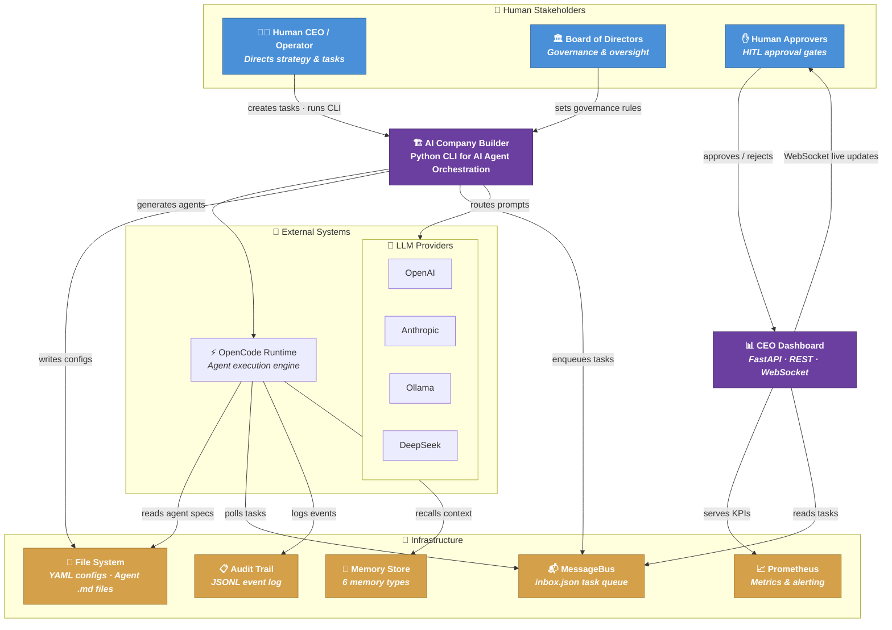
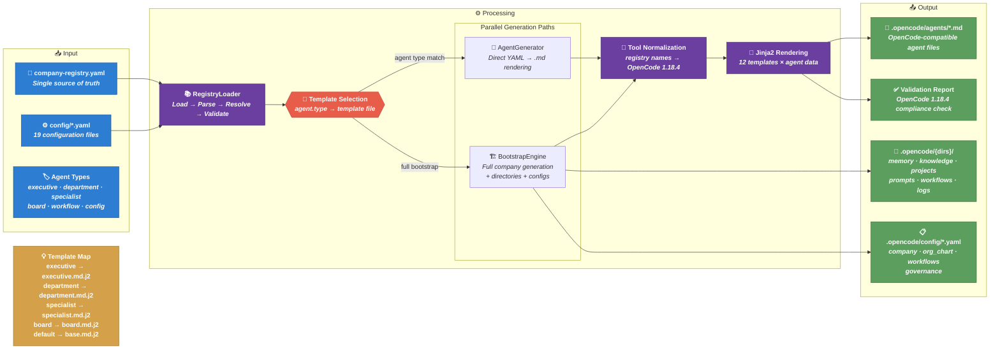
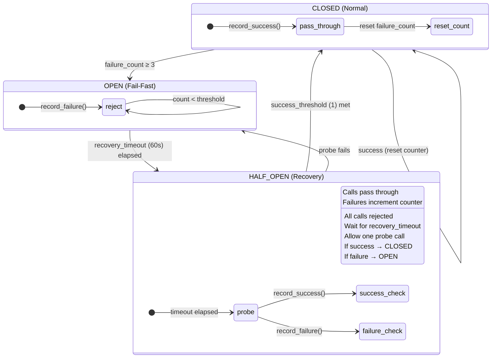
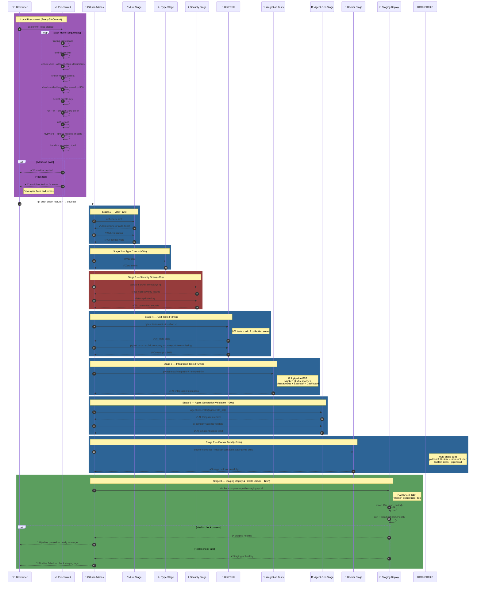

# Light Speed Holdings — System Diagrams

> Production-quality Mermaid diagrams for the AI Company Builder.
> Generated 2026-07-21 from codebase analysis.

---

## Diagram 1: System Context (C4 Level 1)



---

## Diagram 2: Agent Generation Pipeline



---

## Diagram 3: Executor Task Lifecycle (ReAct Loop)

```mermaid
sequenceDiagram
    autonumber

    %% ── Participants ─────────────────────────────────────────
    participant MB as 📬 MessageBus<br/><i>inbox.json</i>
    participant EXEC as 🔄 Executor<br/><i>tick() loop</i>
    participant MEM as 🧠 Memory<br/><i>recall + store</i>
    participant CTX as 📋 Context<br/><i>Agent spec parser</i>
    participant LOOP as 🎯 AgentLoop<br/><i>ReAct pattern</i>
    participant LLM as 🤖 LLM Client<br/><i>Multi-provider</i>
    participant TR as 🔧 ToolRunner<br/><i>Plan executor</i>
    participant HITL as ✋ HITL Gate<br/><i>Approval queue</i>
    participant AUD as 📋 Audit Trail<br/><i>JSONL events</i>

    %% ── Phase 1: Task Pickup ─────────────────────────────────
    rect rgb(45, 55, 72)
        Note over MB,EXEC: Phase 1 — Task Acquisition
        EXEC->>MB: get_pending_tasks()
        MB-->>EXEC: [task_1, task_2, ...]
        EXEC->>MB: detect_stale_tasks() → DLQ
        EXEC->>EXEC: _resume_parked_tasks()
    end

    %% ── Phase 2: Pre-Execution Setup ─────────────────────────
    rect rgb(55, 45, 72)
        Note over EXEC,MEM: Phase 2 — Context Loading
        EXEC->>MB: update_task_status(IN_PROGRESS)
        EXEC->>MEM: recall_context(instruction)
        MEM-->>EXEC: relevant memories (best-effort)
        EXEC->>CTX: parse_agent_spec(receiver_id)
        CTX-->>EXEC: AgentContext (type, tools, permissions)
    end

    %% ── Phase 3: ReAct Loop ──────────────────────────────────
    rect rgb(40, 55, 40)
        Note over LOOP,TR: Phase 3 — ReAct Iteration Loop (max 10)
        
        loop Each Iteration (i = 1..10)
            %% Budget check
            EXEC->>LOOP: run(agent, prompt, task_id)
            
            %% LLM Call
            LOOP->>LOOP: Build system + user prompt
            LOOP->>LLM: chat(system, conversation_history)
            LLM-->>LOOP: ChatResponse {content, usage, model}
            LOOP->>LOOP: parse_llm_json(response)

            alt Valid JSON with plan[]
                %% Tool Execution
                LOOP->>TR: run_plan(plan, hitl_gate)
                
                alt HITL-gated tool
                    TR->>HITL: request_and_wait(action)
                    HITL-->>TR: ⏸️ HITLParked (non-blocking)
                    TR-->>LOOP: HITLParked exception
                    LOOP-->>EXEC: PARK → WAITING_APPROVAL
                    Note right of EXEC: Task parked, executor<br/>continues with other tasks
                else Normal tool
                    TR->>TR: shlex.split() → execute
                    TR-->>LOOP: step_results[]
                end

                %% Feedback loop
                LOOP->>LOOP: build_iteration_feedback()
                LOOP->>LOOP: conversation_history.append(results)

                opt Agent signals done=true
                    LOOP-->>EXEC: LoopResult(done=true)
                end

            else No plan (raw text)
                LOOP-->>EXEC: LoopResult(done=true, text)
            end

            opt Budget exceeded
                LOOP-->>EXEC: LoopResult(error="Budget exceeded")
            end

            opt Max iterations reached
                LOOP-->>EXEC: LoopResult(error="Max iterations")
            end
        end
    end

    %% ── Phase 4: Completion ──────────────────────────────────
    rect rgb(55, 45, 35)
        Note over EXEC,AUD: Phase 4 — Completion & Audit
        
        alt Task Succeeded
            EXEC->>MB: update_task_status(COMPLETED)
            EXEC->>AUD: log_task_status(pending → completed)
            EXEC->>MEM: record_task_outcome(completed)
        else Task Failed
            EXEC->>MB: update_task_status(FAILED)
            EXEC->>AUD: log_task_status(pending → failed)
            EXEC->>MEM: record_task_outcome(failed)
        else HITL Parked
            EXEC->>MB: update_task_status(WAITING_APPROVAL)
            EXEC->>AUD: log_task_status(in_progress → waiting_approval)
        end

        EXEC->>EXEC: save_loop_artifacts() → results/{task_id}/
        EXEC->>EXEC: Update ExecutorStats
    end
```

---

## Diagram 9: LLM Provider Abstraction & Model Routing

```mermaid
graph TB
    %% ── Styling ──────────────────────────────────────────────
    classDef client fill:#6B3FA0,stroke:#4A2D70,color:#FFFFFF,font-weight:bold,font-size:14px
    classDef router fill:#D4A04A,stroke:#A07830,color:#FFFFFF,font-weight:bold
    classDef config fill:#4A90D9,stroke:#2C5F8A,color:#FFFFFF,font-weight:bold
    classDef provider fill:#5B9E5E,stroke:#3A6B3C,color:#FFFFFF,font-weight:bold
    classDef safety fill:#E85D4A,stroke:#B8423A,color:#FFFFFF,font-weight:bold
    classDef parser fill:#9B59B6,stroke:#7D3C98,color:#FFFFFF,font-weight:bold
    classDef streaming fill:#3498DB,stroke:#2471A3,color:#FFFFFF,font-weight:bold
    classDef tier fill:none,stroke:#CBD5E0,color:#CBD5E0,stroke-dasharray:5 5

    %% ── Config Layer ─────────────────────────────────────────
    subgraph config_layer ["📋 Configuration Sources"]
        direction LR
        MODELS_YAML["📄 company/models.yaml<br/><i>Provider definitions · Tier mappings<br/>Routing rules</i>"]
        REGISTRY_JSON["📄 company/agent-registry.json<br/><i>Per-agent model overrides</i>"]
        ENV_KEYS["🔐 Environment Variables<br/><i>OPENCODE_API_KEY · DEEPSEEK_API_KEY<br/>OPENAI_API_KEY · ANTHROPIC_API_KEY</i>"]
    end

    %% ── Entry Point ──────────────────────────────────────────
    subgraph entry ["🚀 Unified Entry Point"]
        LLM_CLIENT["🤖 LLMClient<br/><i>llm/client.py<br/>Unified API · Retry orchestration<br/>Provider fallback chain</i>"]
    end

    %% ── Routing Intelligence ─────────────────────────────────
    subgraph routing_layer ["🔀 Model Routing Intelligence"]
        direction TB
        ROUTER["🧭 ModelRouter<br/><i>model_router.py<br/>5-layer resolution strategy</i>"]

        subgraph routing_priority ["Routing Resolution Priority"]
            direction TB
            P1["1️⃣ Per-Agent Override<br/><i>registry 'model' field</i>"]
            P2["2️⃣ Explicit Context<br/><i>escalation → premium</i>"]
            P3["3️⃣ Domain Detection<br/><i>finance · legal · security<br/>code_review · deployment · data_science</i>"]
            P4["4️⃣ Agent Type + Priority<br/><i>Board→fast · Exec/Spec→std/premium</i>"]
            P5["5️⃣ Fallback → standard tier<br/><i>Default for unmatched agents</i>"]
        end

        ROUTER --> P1
        P1 -.->|"no override"| P2
        P2 -.->|"no context"| P3
        P3 -.->|"no domain"| P4
        P4 -.->|"no rule"| P5
    end

    %% ── Tier System ──────────────────────────────────────────
    subgraph tier_system ["📊 Cost/Capability Tier System"]
        direction LR
        TIER_FAST["⚡ FAST<br/><i>OpenCode big-pickle<br/>+ Ollama llama3.1:8b</i><br/>Low latency · Low cost"]
        TIER_STD["⚖️ STANDARD<br/><i>DeepSeek deepseek-chat<br/>+ OpenCode big-pickle</i><br/>Balanced capability"]
        TIER_PREM["💎 PREMIUM<br/><i>DeepSeek deepseek-coder<br/>+ OpenCode big-pickle</i><br/>Max reasoning"]

        TIER_FAST -.->|"quality fallback"| TIER_STD
        TIER_STD -.->|"quality fallback"| TIER_PREM
    end

    %% ── Provider Hierarchy ───────────────────────────────────
    subgraph provider_layer ["🔌 Provider Hierarchy (Strategy Pattern)"]
        direction TB

        BASE["🏷️ LLMProvider (ABC)<br/><i>providers/base.py<br/>chat() · chat_stream() · is_available()</i>"]

        subgraph compatible_providers ["OpenAI-Compatible Providers"]
            direction LR
            OPENCODE_PROV["⚡ OpenCode<br/><i>big-pickle model<br/>api.opencode.ai</i>"]
            DEEPSEEK_PROV["🔍 DeepSeek<br/><i>deepseek-chat · deepseek-coder<br/>api.deepseek.com</i>"]
            OPENAI_PROV["🟢 OpenAI<br/><i>gpt-4o-mini<br/>api.openai.com</i>"]
            ANTHROPIC_PROV["🟣 Anthropic<br/><i>claude-sonnet-4<br/>x-api-key auth</i>"]
        end

        OLLAMA_PROV["🏠 Ollama (Local)<br/><i>llama3.1:8b<br/>localhost:11434</i>"]

        BASE --> compatible_providers
        BASE --> OLLAMA_PROV
    end

    %% ── Safety & Resilience ──────────────────────────────────
    subgraph safety_layer ["🛡️ Safety & Resilience Layer"]
        direction LR
        CB["🔴 CircuitBreaker<br/><i>circuit_breaker.py<br/>Per-provider · 3 states</i>"]
        CB_STATES{{"🔄 State Machine<br/>CLOSED → OPEN<br/>↓ recovery_timeout<br/>HALF_OPEN → CLOSED<br/>on success_threshold"}}
        CT["💰 CostTracker<br/><i>cost_tracker.py<br/>JSONL logging · Budget enforcement</i>"]
        BUDGETS{{"📏 Budget Limits<br/>Daily: configurable USD cap<br/>Per-task: configurable USD cap<br/>Per-model: MODEL_COSTS pricing"}}

        CB --> CB_STATES
        CT --> BUDGETS
    end

    %% ── Response Parsing ─────────────────────────────────────
    subgraph parse_layer ["🔧 JSON Response Parsing"]
        direction TB
        JSON_PARSER["🧩 JsonParser<br/><i>json_parser.py<br/>parse_llm_json()</i>"]

        subgraph fallback_strategies ["3 Fallback Strategies"]
            direction TB
            S1["Strategy 1: Direct json.loads()"]
            S2["Strategy 2: Extract from ```json block"]
            S3["Strategy 3: Find first { } brace block"]
        end

        JSON_PARSER --> fallback_strategies
    end

    %% ── Streaming ────────────────────────────────────────────
    subgraph streaming_layer ["🌊 Streaming Support"]
        direction LR
        STREAM_METHOD["📡 LLMClient.execute_task_stream()<br/><i>Generator[StreamChunk]</i>"]
        STREAM_CHUNK["📦 StreamChunk<br/><i>delta · finish_reason · usage</i>"]
        SSE["📡 SSE Parsers<br/><i>OpenAI SSE format<br/>Anthropic SSE format<br/>Ollama newline-delimited JSON</i>"]

        STREAM_METHOD --> STREAM_CHUNK
        STREAM_METHOD --> SSE
    end

    %% ── Data Flow ────────────────────────────────────────────
    CONFIGS["📋 Config Sources"] --> ROUTER
    MODELS_YAML --> ROUTER
    REGISTRY_JSON --> ROUTER

    LLM_CLIENT -->|"resolve()"| ROUTER
    LLM_CLIENT -->|"get_tier() + fallback chain"| tier_system
    LLM_CLIENT -->|"chat() / chat_stream()"| provider_layer
    LLM_CLIENT -->|"check circuit breaker"| CB
    LLM_CLIENT -->|"record_usage()"| CT
    LLM_CLIENT -->|"parse_llm_json()"| JSON_PARSER

    provider_layer -->|"ChatResponse / StreamChunk"| LLM_CLIENT

    subgraph config_label ["Config"]
        direction LR
        CONFIGS["📋 Config Sources"]
    end

    %% ── Apply styles ─────────────────────────────────────────
    class LLM_CLIENT client
    class ROUTER router
    class MODELS_YAML,REGISTRY_JSON,ENV_KEYS config
    class BASE,OPENCODE_PROV,DEEPSEEK_PROV,OPENAI_PROV,ANTHROPIC_PROV,OLLAMA_PROV provider
    class CB,CT safety
    class JSON_PARSER parser
    class STREAM_METHOD,STREAM_CHUNK,SSE streaming
    class P1,P2,P3,P4,P5 tier
```



### Routing Decision Flow (Sequence View)

```mermaid
sequenceDiagram
    autonumber

    %% ── Participants ─────────────────────────────────────────
    participant EXEC as 🔄 Executor
    participant CLIENT as 🤖 LLMClient
    participant ROUTER as 🧭 ModelRouter
    participant CB as 🔴 CircuitBreaker
    participant PROV as 🔌 Provider
    participant JSON as 🧩 JsonParser
    participant CT as 💰 CostTracker

    %% ── Phase 1: Route Resolution ────────────────────────────
    rect rgb(45, 55, 72)
        Note over EXEC,ROUTER: Phase 1 — Model Route Resolution (<1ms)
        EXEC->>CLIENT: execute_task(agent, instruction, priority, context)
        CLIENT->>ROUTER: resolve(agent_name, priority, context, task_prompt)
        
        alt Per-agent override in registry
            ROUTER-->>CLIENT: Route(model=override, tier=override)
        else Domain detected (finance/legal/security/etc.)
            ROUTER->>ROUTER: detect_domain(task_prompt)
            ROUTER->>ROUTER: domain_to_context(domain)
            ROUTER-->>CLIENT: Route(provider, model, tier, reason)
        else Routing rule matched (agent_type + priority)
            ROUTER-->>CLIENT: Route(provider, model, tier, reason)
        else Fallback
            ROUTER-->>CLIENT: Route(provider=deepseek, tier=standard)
        end
    end

    %% ── Phase 2: Provider Selection with Circuit Breaker ─────
    rect rgb(55, 45, 72)
        Note over CLIENT,PROV: Phase 2 — Provider Execution with Resilience
        CLIENT->>ROUTER: get_tier(route.tier) → provider chain
        ROUTER-->>CLIENT: [(deepseek, chat), (opencode, big-pickle)]

        loop For each attempt (max 5)
            CLIENT->>CB: is_available?
            
            alt Circuit CLOSED or HALF_OPEN
                CB-->>CLIENT: ✅ available
                CLIENT->>PROV: chat(system_prompt, user_prompt, model)
                
                alt Success
                    PROV-->>CLIENT: ChatResponse {content, tokens}
                    CLIENT->>CB: record_success()
                    CB->>CB: reset failure_count / transition to CLOSED
                else Provider Error (timeout, HTTP, rate limit)
                    PROV-->>CLIENT: ❌ LLMProviderError
                    CLIENT->>CB: record_failure()
                    CB->>CB: increment failure_count
                    
                    alt Failures ≥ threshold (3)
                        CB->>CB: State → OPEN (reject next calls)
                    end
                    
                    CLIENT->>ROUTER: try next provider in tier chain
                end
            else Circuit OPEN (fail-fast)
                CB-->>CLIENT: ❌ unavailable
                CLIENT->>CLIENT: skip → next provider
            end

            opt Recovery timeout elapsed (60s)
                CB->>CB: State → HALF_OPEN (allow one probe)
            end
        end
    end

    %% ── Phase 3: Response Parsing ────────────────────────────
    rect rgb(40, 55, 40)
        Note over CLIENT,JSON: Phase 3 — JSON Parsing with 3 Strategies
        CLIENT->>JSON: parse_llm_json(response.content)
        
        alt Strategy 1: Direct parse
            JSON->>JSON: json.loads(content)
            JSON-->>CLIENT: ✅ dict (parsed)
        else Strategy 2: Markdown code block
            JSON->>JSON: regex ```json...```
            JSON->>JSON: json.loads(extracted)
            JSON-->>CLIENT: ✅ dict (parsed)
        else Strategy 3: Brace extraction
            JSON->>JSON: find first { ... } block
            JSON->>JSON: json.loads(braces)
            JSON-->>CLIENT: ✅ dict (parsed)
        else All strategies fail
            JSON-->>CLIENT: None (retry with next provider)
        end
    end

    %% ── Phase 4: Cost Recording ──────────────────────────────
    rect rgb(55, 45, 35)
        Note over CLIENT,CT: Phase 4 — Cost Tracking & Budget Enforcement
        CLIENT->>CT: check_budget(task_id, estimated_cost)
        
        alt Within budget
            CT-->>CLIENT: ✅ allowed
            CLIENT->>CT: record_usage(model, provider, tokens)
            CT->>CT: calculate_cost(model, prompt_tokens, comp_tokens)
            CT->>CT: append to results/cost_log.jsonl
            CT->>CT: update daily + task accumulators
        else Budget exceeded
            CT-->>CLIENT: ❌ budget_exceeded
            CLIENT-->>EXEC: raise LLMResponseError (budget)
        end
    end

    CLIENT-->>EXEC: ✅ parsed JSON response
```



### Circuit Breaker State Diagram



---

## Diagram 10: CI/CD & Quality Gate Pipeline

```mermaid
graph TB
    %% ── Styling ──────────────────────────────────────────────
    classDef trigger fill:#6B3FA0,stroke:#4A2D70,color:#FFFFFF,font-weight:bold,font-size:14px
    classDef stage fill:#2D7DD2,stroke:#1B5A96,color:#FFFFFF,font-weight:bold
    classDef gate fill:#E85D4A,stroke:#B8423A,color:#FFFFFF,font-weight:bold
    classDef deploy fill:#5B9E5E,stroke:#3A6B3C,color:#FFFFFF,font-weight:bold
    classDef branch fill:#D4A04A,stroke:#A07830,color:#FFFFFF,font-weight:bold
    classDef precommit fill:#9B59B6,stroke:#7D3C98,color:#FFFFFF,font-weight:bold
    classDef output fill:none,stroke:#CBD5E0,color:#CBD5E0,stroke-dasharray:5 5

    %% ── Branch Strategy ──────────────────────────────────────
    subgraph branches ["🌿 Branch Strategy"]
        direction LR
        FEATURE["feature/*<br/><i>Feature branches<br/>from develop</i>"]
        DEVELOP["develop<br/><i>Integration branch<br/>All features merge here</i>"]
        MAIN["main<br/><i>Production branch<br/>Release-ready code</i>"]
        HOTFIX["hotfix/*<br/><i>Emergency fixes<br/>→ main + develop</i>"]

        FEATURE -->|"PR → merge"| DEVELOP
        DEVELOP -->|"PR → release gate"| MAIN
        HOTFIX -->|"fast-track"| MAIN
        HOTFIX -->|"backport"| DEVELOP
    end

    %% ── Pre-commit Hooks ─────────────────────────────────────
    subgraph precommit_layer ["🪝 Pre-commit Hooks (Local, Every Commit)"]
        direction TB
        HOOKS["⚙️ .pre-commit-config.yaml"]

        subgraph hook_list ["Hook Pipeline (Run Sequentially)"]
            direction LR
            H1["trailing-whitespace"]
            H2["end-of-file-fixer"]
            H3["check-yaml<br/><i>--allow-multiple-documents</i>"]
            H4["check-merge-conflict"]
            H5["check-added-large-files<br/><i>--maxkb=500</i>"]
            H6["detect-private-key"]
        end

        subgraph hook_lint ["Lint & Format Hooks"]
            direction LR
            H7["ruff<br/><i>--fix --exit-non-zero-on-fix</i>"]
            H8["ruff-format"]
        end

        subgraph hook_quality ["Quality Hooks"]
            direction LR
            H9["mypy<br/><i>src/ --ignore-missing-imports</i>"]
            H10["bandit<br/><i>-c pyproject.toml</i>"]
        end

        HOOKS --> hook_list
        HOOKS --> hook_lint
        HOOKS --> hook_quality
    end

    %% ── CI Pipeline Stages ───────────────────────────────────
    subgraph pipeline ["🔄 CI/CD Pipeline (GitHub Actions)"]
        direction TB

        TRIGGER{{"🚀 Trigger<br/><i>git push · PR creation<br/>→ develop / main</i>"}}

        subgraph stage1 ["Stage 1 — Lint"]
            direction LR
            S1_RUFF["ruff check src/<br/><i>Zero errors required</i>"]
            S1_YAML["yamllint<br/><i>YAML validation</i>"]
            S1_FILES["trailing-whitespace<br/>end-of-file-fixer"]
        end

        subgraph stage2 ["Stage 2 — Type Check"]
            S2_MYPY["mypy src/<br/><i>Zero errors required<br/>--strict (future)</i>"]
        end

        subgraph stage3 ["Stage 3 — Security"]
            S3_BANDIT["bandit -r src/ai_company/ -q<br/><i>No high-severity issues</i>"]
            S3_CHECK["detect-private-key<br/><i>No committed secrets</i>"]
        end

        subgraph stage4 ["Stage 4 — Unit Tests"]
            S4_PYTEST["pytest tests/unit/<br/><i>962 tests · skip 2 collection errors<br/>--tb=short -q</i>"]
            S4_COV["pytest --cov=src/ai_company<br/><i>Coverage report ≥ 60%</i>"]
        end

        subgraph stage5 ["Stage 5 — Integration Tests"]
            S5_INT["pytest tests/integration/<br/><i>Mocked LLM responses<br/>Full pipeline E2E</i>"]
        end

        subgraph stage6 ["Stage 6 — Agent Generation"]
            S6_GEN["AgentGenerator().generate_all()<br/><i>Template validation<br/>OpenCode 1.18.4 compliance</i>"]
            S6_VALIDATE["ai-company agents validate<br/><i>All 52 agent spec files</i>"]
        end

        subgraph stage7 ["Stage 7 — Docker Build"]
            S7_BUILD["docker compose -f docker-compose.staging.yml build<br/><i>Multi-stage Dockerfile<br/>python:3.12-slim base</i>"]
        end

        subgraph stage8 ["Stage 8 — Staging Deploy"]
            S8_DEPLOY["docker compose --profile staging up<br/><i>Dashboard :8420 → staging :8421<br/>Worker: orchestrator tick</i>"]
            S8_HEALTH["Health Check<br/><i>curl -f localhost:8420/health<br/>interval: 30s · retries: 3</i>"]
            S8_PROM["Prometheus :9091<br/><i>Metrics collection<br/>Optional monitoring profile</i>"]
        end

        TRIGGER --> stage1
        stage1 -->|"✅ pass"| stage2
        stage1 -->|"❌ fail"| BLOCKED["🛑 Pipeline Blocked"]
        stage2 -->|"✅ pass"| stage3
        stage2 -->|"❌ fail"| BLOCKED
        stage3 -->|"✅ pass"| stage4
        stage3 -->|"❌ fail"| BLOCKED
        stage4 -->|"✅ pass"| stage5
        stage4 -->|"❌ fail"| BLOCKED
        stage5 -->|"✅ pass"| stage6
        stage5 -->|"❌ fail"| BLOCKED
        stage6 -->|"✅ pass"| stage7
        stage6 -->|"❌ fail"| BLOCKED
        stage7 -->|"✅ pass"| stage8
        stage7 -->|"❌ fail"| BLOCKED
        stage8 -->|"✅ health OK"| MERGE["✅ Ready to Merge"]
    end

    %% ── Quality Gates (Sprint Mapped) ────────────────────────
    subgraph quality_gates ["📏 Quality Gates (Sprint-mapped from ORCHESTRATION-PLAN.md)"]
        direction LR

        subgraph gate_sprint3 ["Sprint 3 Gate"]
            G3A["ruff check → 0 errors"]
            G3B["mypy src/ → 0 errors"]
            G3C["pytest → 785+ pass"]
            G3D["WebSocket + Memory verified"]
        end

        subgraph gate_sprint4 ["Sprint 4 Gate"]
            G4A["ruff check → 0 errors"]
            G4B["mypy src/ → 0 errors"]
            G4C["pytest → all new suites pass"]
            G4D["bandit → no high-severity"]
            G4E["E2E integration test passes"]
        end

        subgraph gate_final ["Final Release Gate"]
            GFA["ruff + mypy → 0 errors"]
            GFB["pytest --cov → ≥ 60%"]
            GFC["bandit → no high-severity"]
            GFD["pre-commit run --all-files"]
            GFE["ai-company --help + dry-run"]
        end
    end

    %% ── Docker Staging Architecture ──────────────────────────
    subgraph docker_staging ["🐳 Docker Staging Environment"]
        direction LR
        DOCKERFILE["📄 Dockerfile<br/><i>python:3.12-slim<br/>Non-root appuser<br/>Health check built-in</i>"]

        subgraph services ["Staging Services"]
            direction TB
            DASH["📊 Dashboard<br/><i>Container: ai-company-dashboard-staging<br/>Port: 8420 (internal)<br/>CORS: localhost:3000,5173</i>"]
            WORKER["⚙️ Worker<br/><i>Container: ai-company-worker-staging<br/>Command: orchestrator tick<br/>Same image, different entrypoint</i>"]
            PROM["📈 Prometheus<br/><i>prom/prometheus:v2.51.0<br/>Port: 9091<br/>Profile: monitoring</i>"]
        end

        ENV_STAGING["🔐 .env.staging<br/><i>Separate API keys<br/>Staging URLs</i>"]
        VOLUMES["📁 Volumes<br/><i>.opencode/ · company/ · logs/</i>"]

        DOCKERFILE --> services
        ENV_STAGING --> DASH
        ENV_STAGING --> WORKER
        VOLUMES --> DASH
        VOLUMES --> WORKER
    end

    %% ── Connect the Flow ─────────────────────────────────────
    TRIGGER -->|"push/PR"| pipeline

    %% ── Apply styles ─────────────────────────────────────────
    class TRIGGER trigger
    class S1_RUFF,S1_YAML,S1_FILES,S2_MYPY,S3_BANDIT,S3_CHECK,S4_PYTEST,S4_COV,S5_INT,S6_GEN,S6_VALIDATE,S7_BUILD,S8_DEPLOY,S8_HEALTH,S8_PROM stage
    class BLOCKED gate
    class MERGE deploy
    class FEATURE,DEVELOP,MAIN,HOTFIX branch
    class HOOKS,H1,H2,H3,H4,H5,H6,H7,H8,H9,H10 precommit
    class G3A,G3B,G3C,G3D,G4A,G4B,G4C,G4D,G4E,GFA,GFB,GFC,GFD,GFE gate
    class DOCKERFILE,DASH,WORKER,PROM,ENV_STAGING,VOLUMES deploy
```



### Pipeline Stage Detail (Sequence View)



### Quality Gate Mapping (Sprint → Pipeline)

```mermaid
graph LR
    %% ── Styling ──────────────────────────────────────────────
    classDef sprint fill:#6B3FA0,stroke:#4A2D70,color:#FFFFFF,font-weight:bold
    classDef gate fill:#E85D4A,stroke:#B8423A,color:#FFFFFF,font-weight:bold
    classDef stage fill:#2D7DD2,stroke:#1B5A96,color:#FFFFFF,font-weight:bold
    classDef check fill:#5B9E5E,stroke:#3A6B3C,color:#FFFFFF,font-weight:bold

    %% ── Sprint 3 Gates ──────────────────────────────────────
    subgraph sprint3_gates ["Sprint 3 Exit Gate"]
        S3["📋 Sprint 3<br/>Feature Completion"]
        S3 --> G3_LINT["ruff → 0 errors"]:::check
        S3 --> G3_MYPY["mypy → 0 errors"]:::check
        S3 --> G3_TEST["pytest → 785+ pass"]:::check
        S3 --> G3_WS["WebSocket E2E verified"]:::check
        S3 --> G3_MEM["Memory consolidation working"]:::check
        S3 --> G3_SCHED["Scheduler daemon running"]:::check
    end

    %% ── Sprint 4 Gates ──────────────────────────────────────
    subgraph sprint4_gates ["Sprint 4 Exit Gate"]
        S4["📋 Sprint 4<br/>Quality Hardening"]
        S4 --> G4_LINT["ruff → 0 errors"]:::check
        S4 --> G4_MYPY["mypy → 0 errors"]:::check
        S4 --> G4_TEST["pytest → all new suites pass"]:::check
        S4 --> G4_BANDIT["bandit → no high-sev"]:::check
        S4 --> G4_LOG["Structured logging verified"]:::check
        S4 --> G4_E2E["E2E integration test passes"]:::check
    end

    %% ── Final Release Gate ──────────────────────────────────
    subgraph final_gate ["Final Release Gate (Sprint 5)"]
        S5["📋 Sprint 5<br/>Final Release"]
        S5 --> GF_LINT["ruff + mypy → 0 errors"]:::check
        S5 --> GF_COV["pytest --cov → ≥ 60%"]:::check
        S5 --> GF_BANDIT["bandit → no high-sev"]:::check
        S5 --> GF_HOOKS["pre-commit --all-files"]:::check
        S5 --> GF_CLI["ai-company --help"]:::check
        S5 --> GF_BOOT["ai-company company run --dry-run"]:::check
    end

    %% ── Pipeline Stages ─────────────────────────────────────
    subgraph pipeline_map ["Pipeline Stage → Gate Mapping"]
        P1["Stage 1: Lint"] -->|"ruff check"| G3_LINT
        P1 -->|"ruff check"| G4_LINT
        P1 -->|"ruff check"| GF_LINT

        P2["Stage 2: Type Check"] -->|"mypy"| G3_MYPY
        P2 -->|"mypy"| G4_MYPY
        P2 -->|"mypy"| GF_LINT

        P3["Stage 3: Security"] -->|"bandit"| G4_BANDIT
        P3 -->|"bandit"| GF_BANDIT

        P4["Stage 4: Unit Tests"] -->|"pytest"| G3_TEST
        P4 -->|"pytest"| G4_TEST
        P4 -->|"pytest --cov"| GF_COV

        P5["Stage 5: Integration"] -->|"pytest integration"| G4_E2E

        P6["Stage 6: Agent Gen"] -->|"generate_all()"| GF_BOOT
    end

    %% ── Apply styles ─────────────────────────────────────────
    class S3,S4,S5 sprint
    class P1,P2,P3,P4,P5,P6 stage
```



---

## Diagram 7: Deployment Architecture (C4 Level 3)

```mermaid
graph TB
    %% ── Styling ──────────────────────────────────────────────
    classDef devMode fill:#2D7DD2,stroke:#1B5A96,color:#FFFFFF,font-weight:bold
    classDef stagingMode fill:#D4A04A,stroke:#A07830,color:#FFFFFF,font-weight:bold
    classDef prodMode fill:#5B9E5E,stroke:#3A6B3C,color:#FFFFFF,font-weight:bold
    classDef container fill:#6B3FA0,stroke:#4A2D70,color:#FFFFFF,font-weight:bold
    classDef volume fill:#3A3A5C,stroke:#5A5A8A,color:#E0E0FF,font-weight:bold
    classDef network fill:#2A4A2A,stroke:#4A8A4A,color:#A0FFA0,font-weight:bold
    classDef config fill:#5A3A2A,stroke:#8A6A4A,color:#FFDDB0,font-weight:bold
    classDef profile fill:#4A2A4A,stroke:#7A4A7A,color:#FFB0FF,font-style:italic
    classDef title fill:none,stroke:none,color:#FFFFFF,font-weight:bold,font-size:18px

    %% ═══════════════════════════════════════════════════════════
    %%  DEPLOYMENT MODE 1: LOCAL DEV
    %% ═══════════════════════════════════════════════════════════
    subgraph LOCAL ["🖥️  LOCAL DEV — Single Process"]
        direction TB

        subgraph localProc ["Python 3.12+ Process"]
            direction LR
            CLI["⌨️ CLI<br/><i>ai-company</i><br/>Typer · 17 commands"]
            DASH_LOCAL["📊 Dashboard<br/>port 8420<br/>FastAPI + CORS"]
            CLI --- DASH_LOCAL
        end

        subgraph localFS ["📁 Local Filesystem"]
            direction LR
            localOC[".opencode/<br/>agents · memory · logs"]
            localCompany["company/<br/>registry · configs"]
            localTemplates["templates/<br/>Jinja2 · 12 files"]
        end

        subgraph localHooks ["🪝 Pre-commit Hooks"]
            direction LR
            HC1["ruff check"]
            HC2["mypy"]
            HC3["bandit"]
            HC4["check-yaml"]
        end

        localFS --- localProc
        localHooks -.->|"git commit"| localProc
    end

    %% ═══════════════════════════════════════════════════════════
    %%  DEPLOYMENT MODE 2: STAGING (Docker Compose)
    %% ═══════════════════════════════════════════════════════════
    subgraph STAGING ["🐳  STAGING — docker-compose.staging.yml"]
        direction TB

        subgraph stagingNetwork ["🔗 staging network (bridge)"]
            direction TB

            subgraph dashContainer ["📦 dashboard-staging"]
                direction TB
                DASH_S["📊 FastAPI Dashboard<br/>:8421 → :8420<br/>health: /health · /metrics<br/>restart: unless-stopped"]
                DASH_S -.- dashHC["🏥 HEALTHCHECK<br/>curl -f localhost:8420/health<br/>interval 30s · timeout 5s<br/>start_period 15s · retries 3"]
            end

            subgraph workerContainer ["📦 worker-staging"]
                direction TB
                WORKER_S["⚙️ Orchestrator Tick<br/>python -m ai_company.cli.main<br/>orchestrator tick<br/>restart: unless-stopped"]
            end

            subgraph promContainer ["📦 prometheus-staging"]
                direction TB
                PROM_S["📈 Prometheus<br/>:9091 → :9090<br/>scrape_interval: 15s<br/>scrapes dashboard:8420"]
            end

            %% Inter-container communication
            PROM_S -->|"scrape /metrics<br/>every 10s"| DASH_S
            PROM_S -->|"scrape /health<br/>every 30s"| DASH_S
        end

        subgraph stagingVolumes ["💾 Shared Volumes"]
            direction LR
            volOC[".opencode/ → /app/.opencode"]
            volComp["company/ → /app/company"]
            volLogs["logs/ → /app/logs"]
        end

        subgraph stagingProfiles ["🏷️ Composable Profiles"]
            direction LR
            profStaging["profile: staging<br/><i>dashboard + worker + prom</i>"]
            profWorker["profile: worker<br/><i>worker only</i>"]
            profMonitor["profile: monitoring<br/><i>prometheus only</i>"]
        end

        subgraph stagingEnv ["🔐 Environment"]
            direction LR
            envStaging[".env.staging<br/>separate API keys"]
            envVars["AI_COMPANY_LOG_JSON=1<br/>AI_COMPANY_ENV=staging<br/>DASHBOARD_CORS_ORIGINS=...<br/>DASHBOARD_RATE_LIMIT=200"]
        end

        stagingVolumes --> stagingNetwork
        stagingProfiles -.->|"docker compose --profile"| stagingNetwork
        stagingEnv --> stagingNetwork
    end

    %% ═══════════════════════════════════════════════════════════
    %%  DEPLOYMENT MODE 3: PRODUCTION (Docker Compose)
    %% ═══════════════════════════════════════════════════════════
    subgraph PROD ["🚀  PRODUCTION — docker-compose.yml"]
        direction TB

        subgraph prodNetwork ["🔗 default network"]
            direction TB

            subgraph dashProd ["📦 dashboard"]
                direction TB
                DASH_P["📊 FastAPI Dashboard<br/>:8420 → :8420<br/>health: /health<br/>restart: unless-stopped"]
                DASH_P -.- dashProdHC["🏥 HEALTHCHECK<br/>curl -f localhost:8420/health<br/>interval 30s · timeout 5s<br/>start_period 10s · retries 3"]
            end

            subgraph workerProd ["📦 worker (profile: worker)"]
                direction TB
                WORKER_P["⚙️ Orchestrator Tick<br/>python -m ai_company.cli.main<br/>orchestrator tick<br/>restart: unless-stopped"]
            end
        end

        subgraph prodVolumes ["💾 Shared Volumes"]
            direction LR
            volOC_P[".opencode/ → /app/.opencode"]
            volComp_P["company/ → /app/company"]
        end

        subgraph prodEnv ["🔐 Environment"]
            direction LR
            envProd["OPENCODE_API_KEY=${OPENCODE_API_KEY}<br/>DEEPSEEK_API_KEY=${DEEPSEEK_API_KEY}<br/>OPENAI_API_KEY=${OPENAI_API_KEY}<br/>ANTHROPIC_API_KEY=${ANTHROPIC_API_KEY}"]
        end

        prodVolumes --> prodNetwork
        prodEnv --> prodNetwork
    end

    %% ═══════════════════════════════════════════════════════════
    %%  CROSS-MODE RELATIONSHIPS
    %% ═══════════════════════════════════════════════════════════
    LOCAL -->|"promote to staging<br/>docker compose up --build"| STAGING
    STAGING -->|"promote to production<br/>docker compose up -d"| PROD

    %% ── Apply styles ─────────────────────────────────────────
    class CLI,DASH_LOCAL devMode
    class DASH_S,WORKER_S,PROM_S,DASH_P,WORKER_P container
    class volOC,volComp,volLogs,volOC_P,volComp_P volume
    class stagingNetwork,prodNetwork network
    class envStaging,envVars,envProd config
    class profStaging,profWorker,profMonitor profile
```



---

## Diagram 8: Domain Model Relationships (ERD / Class Diagram)

```mermaid
classDiagram
    %% ── Styling Notes ────────────────────────────────────────
    %% Inheritance: ──|>
    %% Composition: ◆──
    %% Aggregation: ◇──
    %% Dependency: ..>

    %% ═══════════════════════════════════════════════════════════
    %%  ENUMS
    %% ═══════════════════════════════════════════════════════════
    class AgentType {
        <<enum>>
        HUMAN = "human"
        AI = "ai"
    }

    class Seniority {
        <<enum>>
        JUNIOR = "junior"
        MID = "mid"
        SENIOR = "senior"
        LEAD = "lead"
        EXECUTIVE = "executive"
    }

    class TaskStatus {
        <<enum>>
        PENDING
        IN_PROGRESS
        BLOCKED
        WAITING_APPROVAL
        COMPLETED
        FAILED
        ESCALATED
        CANCELLED
    }

    class TaskPriority {
        <<enum>>
        LOW
        MEDIUM
        HIGH
        CRITICAL
    }

    class RiskLevel {
        <<enum>>
        LOW
        MEDIUM
        HIGH
        CRITICAL
    }

    class MeetingFrequency {
        <<enum>>
        DAILY
        WEEKLY
        BIWEEKLY
        MONTHLY
        QUARTERLY
        ANNUAL
    }

    class EnforcementType {
        <<enum>>
        AUTOMATED
        MANUAL
    }

    class VotingMajority {
        <<enum>>
        SIMPLE
        SUPER
        UNANIMOUS
    }

    %% ═══════════════════════════════════════════════════════════
    %%  BASE CLASS
    %% ═══════════════════════════════════════════════════════════
    class EntityBase {
        <<abstract>>
        +str id
        +str name
    }

    %% ═══════════════════════════════════════════════════════════
    %%  COMPANY DOMAIN (Root Aggregate)
    %% ═══════════════════════════════════════════════════════════
    class Company {
        +str legal_name
        +str founded
        +str industry
        +str headquarters
        +str website
        +str ceo
        +str mission
        +str vision
        +list~str~ values
    }

    class CompanyStructure {
        +str type
        +bool board_of_directors
        +bool executive_team
        +bool departments
    }

    class Vision {
        +str mission
    }

    class LongTermGoal {
        +str goal
        +str timeline
        +list~str~ metrics
    }

    class QuarterlyObjective {
        +str quarter
        +list~str~ objectives
    }

    class Strategy {
        +QuarterlyFocus quarterly_focus
    }

    class StrategyPillar {
        +str name
        +str description
        +list~str~ priorities
    }

    class StrategyKPI {
        +str name
        +float target
        +str unit
    }

    class QuarterlyFocus {
        +str current_quarter
        +str focus_area
    }

    %% ═══════════════════════════════════════════════════════════
    %%  CULTURE DOMAIN
    %% ═══════════════════════════════════════════════════════════
    class Culture {
        +list~CultureValue~ values
        +CommunicationConfig communication
        +list~str~ norms
    }

    class CultureValue {
        +str name
        +str description
        +list~str~ behaviors
    }

    class CommunicationConfig {
        +str style
        +list~str~ tools
        +MeetingCadence meeting_cadence
    }

    class MeetingCadence {
        +bool daily_standup
        +bool weekly_sync
        +bool monthly_all_hands
        +bool quarterly_review
    }

    %% ═══════════════════════════════════════════════════════════
    %%  GOVERNANCE DOMAIN
    %% ═══════════════════════════════════════════════════════════
    class Governance {
        +list~DecisionRight~ decision_rights
        +list~EscalationRule~ escalation_rules
        +list~GovernanceApproval~ approval_matrix
    }

    class DecisionRight {
        +str level
        +str authority
        +list~str~ scope
    }

    class EscalationRule {
        +str trigger
        +str action
    }

    class GovernanceApproval {
        +str action
        +list~str~ required_approvals
        +int sla_hours
    }

    %% ═══════════════════════════════════════════════════════════
    %%  BOARD DOMAIN
    %% ═══════════════════════════════════════════════════════════
    class BoardMember {
        +str role
        +str type
        +list~str~ expertise
        +list~str~ responsibilities
        +str term_start
        +str term_end
    }

    class Committee {
        +str chair
        +list~str~ members
        +list~str~ responsibilities
        +str meeting_frequency
    }

    class BoardMeeting {
        +str frequency
        +list~str~ agenda_items
        +list~str~ required_attendees
        +int quorum
    }

    class VotingRule {
        +str type
        +int quorum
        +VotingMajority majority
        +bool requires_unanimous
    }

    class VotingConfig {
        +VotingRule default_rules
        +list~VotingRule~ decisions
    }

    %% ═══════════════════════════════════════════════════════════
    %%  EXECUTIVE / AGENT / DEPARTMENT
    %% ═══════════════════════════════════════════════════════════
    class Executive {
        +str title
        +str department
        +str reports_to
        +AgentType type
        +str mission
        +list~str~ responsibilities
        +list~str~ decision_rights
        +list~str~ tools
    }

    class Department {
        +str executive
        +str mission
        +str budget_category
        +int headcount_target
    }

    class Agent {
        +str department
        +str reports_to
        +str mission
        +AgentType type
        +list~str~ responsibilities
        +list~str~ tools
        +Seniority seniority
    }

    %% ═══════════════════════════════════════════════════════════
    %%  TASK / WORKFLOW / PROJECT / MEETING
    %% ═══════════════════════════════════════════════════════════
    class Task {
        +str name
        +str description
        +str assignee
        +str sender_id
        +str receiver_id
        +str instruction
        +TaskStatus status
        +TaskPriority priority
        +list~str~ dependencies
        +str due_date
        +list~str~ tags
        +str created_at
        +str completed_at
        +str result
        +bool requires_approval
        +str approved_by
        +str correlation_id
        +str parent_task_id
        +str acknowledged_by
    }

    class Workflow {
        +str description
        +str trigger
        +str owner
        +list~WorkflowStep~ steps
    }

    class WorkflowStep {
        +str id
        +str name
        +str action
        +str owner
        +list~str~ inputs
        +list~str~ outputs
        +int sla_hours
        +int sla_minutes
        +int sla_days
    }

    class Project {
        +str department
        +str owner
        +str description
        +list~ProjectPhase~ phases
        +float budget
        +str start_date
        +str end_date
    }

    class ProjectPhase {
        +str name
        +str description
        +int duration_weeks
        +list~str~ deliverables
    }

    class Meeting {
        +str date
        +list~str~ attendees
        +list~MeetingAgendaItem~ agenda
        +list~MeetingDecision~ decisions
        +str notes
    }

    class MeetingAgendaItem {
        +str topic
        +str presenter
        +int duration_minutes
        +str notes
    }

    class MeetingDecision {
        +str decision
        +str owner
        +str deadline
    }

    %% ═══════════════════════════════════════════════════════════
    %%  OPERATIONAL: Policy, KPI, Budget
    %% ═══════════════════════════════════════════════════════════
    class Policy {
        +str category
        +str description
        +list~str~ rules
        +EnforcementType enforcement
        +bool ci_check
    }

    class KPI {
        +str category
        +float target
        +float current
        +str unit
        +str frequency
        +str owner
    }

    class Budget {
        +int fiscal_year
        +float total_budget
        +str currency
        +list~DepartmentBudget~ departments
        +Contingency contingency
    }

    class DepartmentBudget {
        +str name
        +float budget
        +int headcount
        +list~str~ priorities
    }

    class Contingency {
        +float percentage
        +float amount
        +str approval_required
    }

    %% ═══════════════════════════════════════════════════════════
    %%  RISK / DECISION / PERMISSION / TOOL / INTEGRATION
    %% ═══════════════════════════════════════════════════════════
    class Risk {
        +str category
        +str description
        +int likelihood
        +int impact
        +RiskLevel level
        +str mitigation
        +str owner
    }

    class DecisionRecord {
        +str description
        +str decision_maker
        +list~str~ alternatives
        +str chosen_option
        +str rationale
        +str date
        +str status
    }

    class Permission {
        +bool read
        +bool grep
        +bool list
        +bool edit
        +bool bash
        +bool task
    }

    class Tool {
        +str description
        +str category
        +Permission permissions
    }

    class Integration {
        +str type
        +str description
        +dict config
        +bool enabled
    }

    %% ═══════════════════════════════════════════════════════════
    %%  DECISION ENGINE
    %% ═══════════════════════════════════════════════════════════
    class ApprovalEntry {
        +str action
        +str risk_level
        +list~str~ required_approvals
        +int sla_hours
        +bool auto_approve
    }

    class DecisionNode {
        +str id
        +str question
        +str action
        +str authority
        +str type
        +list~str~ children
        +int sla_hours
    }

    class DecisionTreeConfig {
        +list~DecisionNode~ nodes
    }

    class RiskCategory {
        +str name
        +str description
        +str owner
    }

    class RiskLevelConfig {
        +int min_score
        +int max_score
        +str level
        +str action
        +str review_frequency
    }

    class RiskMatrixConfig {
        +list~RiskCategory~ categories
        +list~RiskLevelConfig~ risk_levels
    }

    %% ═══════════════════════════════════════════════════════════
    %%  TOP-LEVEL AGGREGATE
    %% ═══════════════════════════════════════════════════════════
    class CompanyRegistry {
        <<aggregate>>
        +Company company
        +Vision vision
        +Strategy strategy
        +Culture culture
        +Governance governance
        +list~Policy~ policies
        +list~KPI~ kpis
        +Budget budget
        +list~BoardMember~ board
        +list~Committee~ committees
        +list~BoardMeeting~ board_meetings
        +VotingConfig voting
        +list~Executive~ executives
        +list~Department~ departments
        +list~Agent~ specialists
        +list~Workflow~ workflows
        +list~ApprovalEntry~ approval_matrix
        +RiskMatrixConfig risk_matrix
        +DecisionTreeConfig decision_tree
    }

    %% ═══════════════════════════════════════════════════════════
    %%  INHERITANCE RELATIONSHIPS
    %% ═══════════════════════════════════════════════════════════
    EntityBase <|-- Company
    EntityBase <|-- Policy
    EntityBase <|-- KPI
    EntityBase <|-- BoardMember
    EntityBase <|-- Committee
    EntityBase <|-- BoardMeeting
    EntityBase <|-- Executive
    EntityBase <|-- Department
    EntityBase <|-- Agent
    EntityBase <|-- Task
    EntityBase <|-- Workflow
    EntityBase <|-- Project
    EntityBase <|-- Meeting
    EntityBase <|-- Risk
    EntityBase <|-- DecisionRecord
    EntityBase <|-- Tool
    EntityBase <|-- Integration

    %% ═══════════════════════════════════════════════════════════
    %%  ENUM USAGE
    %% ═══════════════════════════════════════════════════════════
    AgentType -- Executive
    AgentType -- Agent
    Seniority -- Agent
    TaskStatus -- Task
    TaskPriority -- Task
    RiskLevel -- Risk
    EnforcementType -- Policy
    VotingMajority -- VotingRule

    %% ═══════════════════════════════════════════════════════════
    %%  COMPOSITION (◆──)  — Whole owns its parts
    %% ═══════════════════════════════════════════════════════════
    Company *-- CompanyStructure : structure
    Vision *-- LongTermGoal : long_term_goals
    Vision *-- QuarterlyObjective : quarterly_objectives
    Strategy *-- StrategyPillar : pillars
    Strategy *-- QuarterlyFocus : quarterly_focus
    StrategyPillar *-- StrategyKPI : kpis
    Culture *-- CultureValue : values
    Culture *-- CommunicationConfig : communication
    CommunicationConfig *-- MeetingCadence : meeting_cadence
    Governance *-- DecisionRight : decision_rights
    Governance *-- EscalationRule : escalation_rules
    Governance *-- GovernanceApproval : approval_matrix
    BoardMeeting *-- VotingRule : voting
    VotingConfig *-- VotingRule : default_rules
    VotingConfig *-- VotingRule : decisions
    Workflow *-- WorkflowStep : steps
    Project *-- ProjectPhase : phases
    Meeting *-- MeetingAgendaItem : agenda
    Meeting *-- MeetingDecision : decisions
    Budget *-- DepartmentBudget : departments
    Budget *-- Contingency : contingency
    Tool *-- Permission : permissions
    RiskMatrixConfig *-- RiskCategory : categories
    RiskMatrixConfig *-- RiskLevelConfig : risk_levels
    DecisionTreeConfig *-- DecisionNode : nodes

    %% ═══════════════════════════════════════════════════════════
    %%  AGGREGATION (◇──)  — Registry holds references
    %% ═══════════════════════════════════════════════════════════
    CompanyRegistry o-- Company : company
    CompanyRegistry o-- Vision : vision
    CompanyRegistry o-- Strategy : strategy
    CompanyRegistry o-- Culture : culture
    CompanyRegistry o-- Governance : governance
    CompanyRegistry o-- Policy : policies
    CompanyRegistry o-- KPI : kpis
    CompanyRegistry o-- Budget : budget
    CompanyRegistry o-- BoardMember : board
    CompanyRegistry o-- Committee : committees
    CompanyRegistry o-- BoardMeeting : board_meetings
    CompanyRegistry o-- VotingConfig : voting
    CompanyRegistry o-- Executive : executives
    CompanyRegistry o-- Department : departments
    CompanyRegistry o-- Agent : specialists
    CompanyRegistry o-- Workflow : workflows
    CompanyRegistry o-- ApprovalEntry : approval_matrix
    CompanyRegistry o-- RiskMatrixConfig : risk_matrix
    CompanyRegistry o-- DecisionTreeConfig : decision_tree
```



> **Reading guide for Diagram 8:**
> - **Solid arrow with hollow triangle `──|>`** = inheritance (`Company` extends `EntityBase`)
> - **Solid diamond `◆──`** = composition (parent owns & creates its children)
> - **Hollow diamond `◇──`** = aggregation (`CompanyRegistry` references but doesn't own its children)
> - **Dashed line `..>`** = enum usage (enum values referenced as field types)
> - All models live in `src/ai_company/models/models.py` (578 lines, 40+ Pydantic classes)
