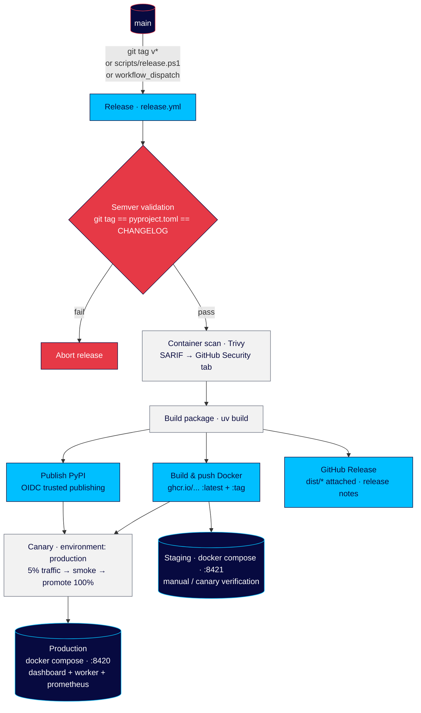
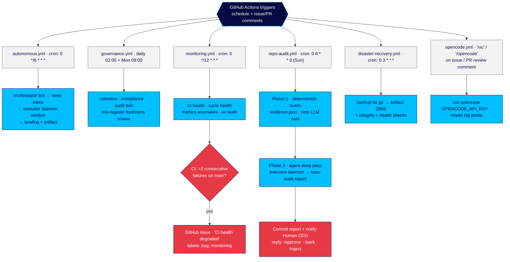

# CI/CD Setup, GitHub Workflows & Branch Model

How `light-speed-holdings` ships: branch model → CI merge gate → release pipeline → scheduled automation. Source diagrams in `docs/diagrams/cicd-*.mmd` (rendered SVGs alongside), authored with LightSpeed brand tokens via Mermaid v11 (`@mermaid-js` renderer driven by Playwright chromium).

## Trigger map

| Workflow | File | Triggers |
|---|---|---|
| CI Gate | `.github/workflows/ci.yml` | push to `main`, PR → `main`, `workflow_dispatch` |
| Site Build + Principles Gate | `.github/workflows/site-principles-gate.yml` | PR/push touching `src/`, `index.html`, `vercel.json`, `vite.config.ts`, `tsconfig.json`, `package.json`, `bun.lock` |
| Release | `.github/workflows/release.yml` | tag `v*`, `workflow_dispatch` |
| Autonomous Orchestrator | `.github/workflows/autonomous.yml` | cron `0 */6 * * *`, manual |
| Governance | `.github/workflows/governance.yml` | cron daily `0 2 * * *` + Mon `0 9 * * 1`, manual |
| Monitoring & Alerts | `.github/workflows/monitoring.yml` | cron `0 */12 * * *`, manual |
| Disaster Recovery Backup | `.github/workflows/disaster-recovery.yml` | cron `0 3 * * *`, manual |
| Weekly Repository Audit | `.github/workflows/repo-audit.yml` | cron Sun `0 6 * * 0`, manual |
| opencode | `.github/workflows/opencode.yml` | issue / PR-review comments containing `/oc` or `/opencode` |

## 1. Branch model & the merge gate

Branch conventions in use: `main` (protected trunk) accepts changes only through pull requests; work happens on topic branches (`feat/`, `fix/`, `build/`, `chore/`, `research/`, `governance/`, `resolve/`) plus automated `dependabot/*` branches.

`ci.yml` is the **authoritative merge gate** — local pre-commit hooks (ruff, mypy, bandit) can be bypassed with `--no-verify`, so the server-side gate is the enforced source of truth. Required jobs: ruff lint, mypy typecheck, pytest covering unit + integration on an Ubuntu/Windows matrix with a 72% coverage floor, ECL harness lint, bandit security scan, uv-audit dependency scan, generated-agent drift check, Archify diagram check, and version-sync check (pyproject == CHANGELOG == latest semver tag). Two non-blocking extra jobs run alongside: Playwright E2E (deliberately excluded from `gate.needs` until stable) and Graph build + health.

```mermaid
flowchart TD
    classDef branch fill:#070A40,stroke:#00BFFF,color:#fff
    classDef main fill:#070A40,stroke:#E63946,color:#fff
    classDef work fill:#fff,stroke:#070A40,color:#070A40
    classDef opt fill:#F2F2F2,stroke:#6B7280,color:#070A40
    classDef acc fill:#00BFFF,stroke:#070A40,color:#070A40
    classDef stop fill:#E63946,stroke:#070A40,color:#fff

    M[(main · protected)]:::main
    TOPIC["Topic branches<br/>feat/*  fix/*  build/*  chore/*<br/>research/*  governance/*  resolve/*"]:::branch
    DEV["Developer / Human CEO"]:::work
    AGT["AI agents · opencode<br/>'/oc' on PR / issue comment"]:::work
    DEP["Dependabot · weekly updates<br/>(github-actions + pip)"]:::work
    HOOKS["Local pre-commit hooks<br/>ruff · mypy · bandit<br/>bypassable via --no-verify"]:::opt

    DEV -->|push| TOPIC
    AGT -->|"/oc /opencode"| TOPIC
    DEP -->|auto PR| TOPIC
    HOOKS -.->|local gate only| DEV
    TOPIC -->|"pull_request → main"| GATE
    GATE["CI Gate · ci.yml<br/>push main · PR → main · workflow_dispatch"]:::acc
    GATE --> L["Lint · ruff"]:::opt
    GATE --> T["Typecheck · mypy"]:::opt
    GATE --> X["Tests · pytest<br/>ubuntu + windows matrix<br/>coverage ≥ 72%"]:::opt
    GATE --> H["ECL harness lint · pwsh"]:::opt
    GATE --> S["Security · bandit"]:::opt
    GATE --> U["Dependencies · uv-audit"]:::opt
    GATE --> G["Generated-files drift check"]:::opt
    GATE --> A["Archify diagram check"]:::opt
    GATE --> V["Version sync check"]:::opt
    GATE -.-> E["E2E · Playwright<br/>non-blocking"]:::opt
    GATE -.-> GR["Graph build + health<br/>non-blocking"]:::opt

    L & T & X & H & S & U & G & A & V --> Q{"All required jobs green?<br/>+ review approval"}:::stop
    Q -->|"no · fix + re-push"| TOPIC
    Q -->|"yes · squash merge"| M
    M -->|"push to main<br/>(CI re-runs)"| CI2["CI re-runs on main"]:::opt
    M -->|"paths: src/ index.html vercel.json<br/>vite.config.ts tsconfig package.json"| SITE["Site Build + Principles Gate · site-principles-gate.yml<br/>bun install · bun run build (tsc + vite)<br/>no fake-success forms"]:::opt
    M -->|"git tag v*"| REL["Release pipeline · release.yml"]:::acc
```

> Note: where `main` means GHCR tagging, the `push to main` leg re-runs CI and the site gate fires only on the website path set. `vite.config.ts`/`package.json`/`bun.lock` are also gated by the site workflow so a broken toolchain cannot silently land.

## 2. Release pipeline

Releases are tag-driven: publish `semver` tag → version-sync checks (pyproject == CHANGELOG == tag) → Trivy container scan (SARIF to GitHub Security) → build with `uv build` → publish wheel/sdist to PyPI via OIDC trusted publishing, push Docker image to GHCR (`:latest` + `:tag`) → GitHub Release with `dist/*` → simulated canary rollout in the `production` environment (5% traffic, smoke, promote to 100%, verified via monitoring). Package consumers + Docker images feed production (`:8420`) and staging (`:8421`).

## 3. Scheduled & automation workflows

Beyond merge/release, the repo runs a set of cadence workflows that keep the agent company healthy: the 6-hourly autonomous orchestrator cycle, daily governance (retention/compliance/audit trail) and disaster-recovery backups, 12-hourly monitoring that opens a `bug,monitoring` alert when more than two CI runs on `main` fail consecutively, and the weekly repository audit whose report is committed and escalated to the Human CEO with `/approve`, `/park`, `/reject` options. `opencode.yml` lets the AI coding agent act on `/oc` comments.

## Rendering

- **Engine:** Mermaid v11, rendered locally via `@mermaid-js/mermaid-cli`-style headless Playwright (Python playwright + chromium); no external diagram service.
- **Brand:** navy `#070A40` / red `#E63946` / cyan `#00BFFF` / neutral `#F2F2F2` + `#6B7280` from the LightSpeed design system; Arial type.
- **Source files:** `docs/diagrams/cicd-branches-gate.mmd`, `cicd-release.mmd`, `cicd-scheduled.mmd` (rendered `*.svg` alongside). GitHub renders the embedded `mermaid` blocks natively in this doc.
