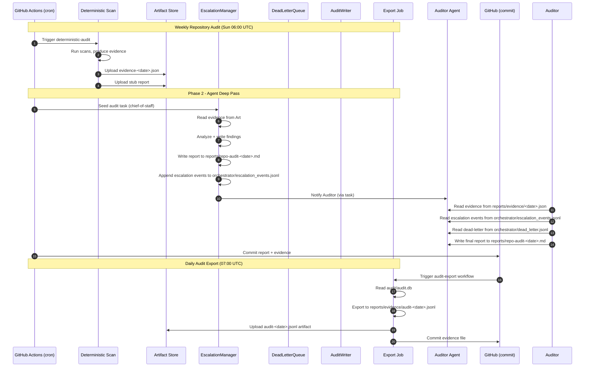
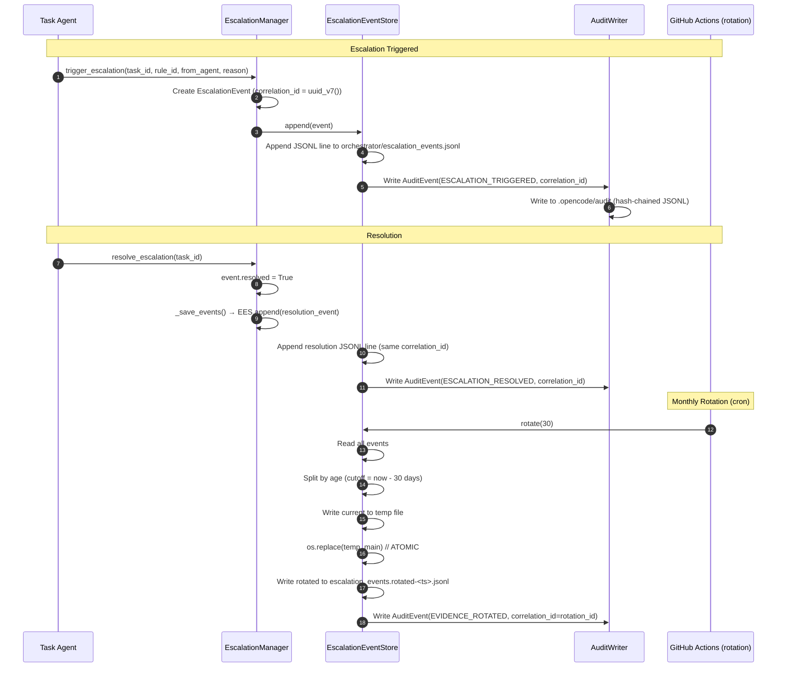
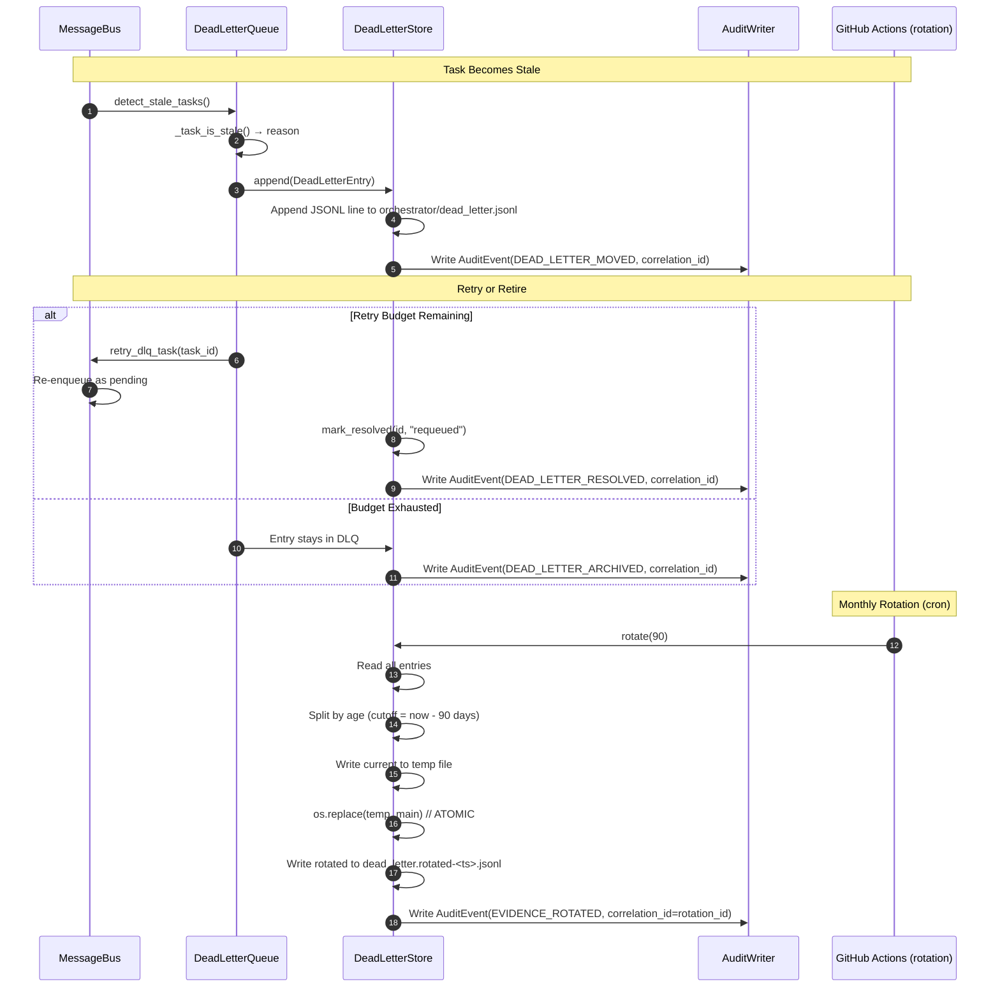
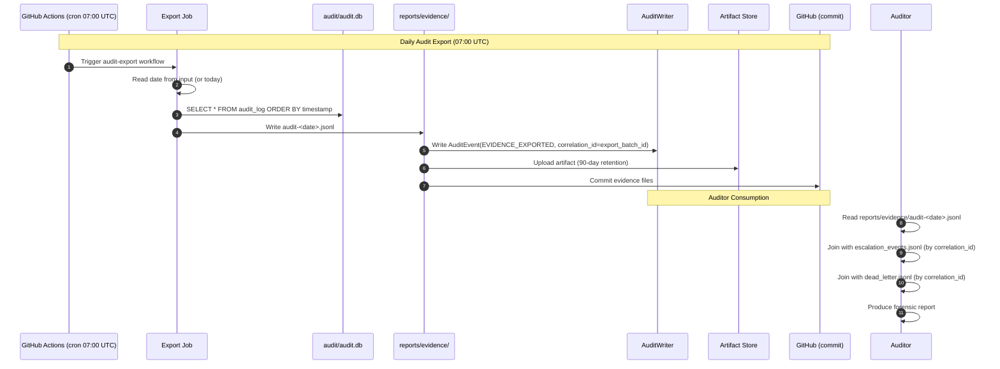
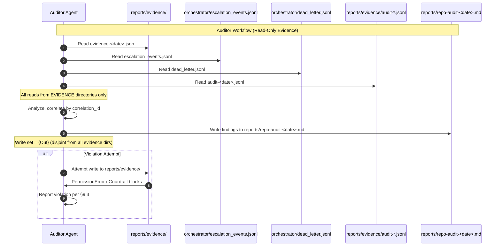
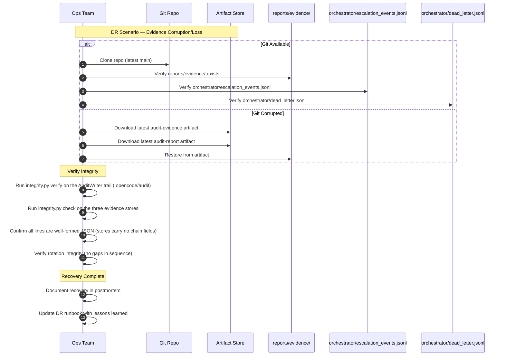

# Evidence Separation — Sequence Diagrams

This document contains Mermaid sequence diagrams for the evidence separation architecture.

---

## 1. Weekly Repository Audit — Evidence Flow



---

## 2. Escalation Event Lifecycle



---

## 3. Dead-Letter Queue Lifecycle



---

## 4. Daily Audit Export



---

## 5. Auditor Workflow — Evidence Separation Enforcement



---

## 6. Cross-Store Correlation ID Flow

```mermaid
sequenceDiagram
    autonumber
    participant Trigger as Task Trigger
    participant EM as EscalationManager
    participant DLQ as DeadLetterQueue
    participant Exp as Export Job
    participant Corr as correlation_id

    Note over Trigger,Exp: Single Incident, Three Stores, One correlation_id

    Trigger->>EM: Task fails → trigger_escalation()
    EM->>EM: correlation_id = uuid_v7()
    EM->>EES: Append {correlation_id, ...}

    alt Task Also Goes to DLQ
        Task->>DLQ: move_task()
        DLQ->>DLS: Append {correlation_id, ...}
    end

    alt Task Audited
        Exp->>Exp: export_audit_log()
        Exp->>EV: Append {correlation_id, ...}
    end

    Note over EES,DLS,EV: All three stores now have events with SAME correlation_id

    Auditor->>Auditor: Query all three stores by correlation_id
    Auditor->>Auditor: Reconstruct full incident timeline
```

---

## 7. DR Recovery Flow



---

## Legend

| Symbol | Meaning |
|--------|---------|
| → | Synchronous call |
| →> | Asynchronous / event |
| alt/else | Conditional branch |
| Note over | Annotation |
| /// | Evidence separation boundary |

---

*Generated as part of ADR-008 Evidence Separation Architecture*
