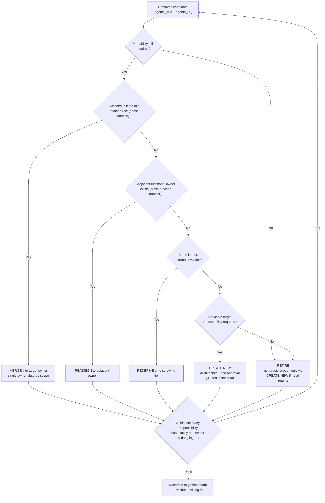

# Agent Consolidation Matrix: 152 → 90

**Supports primary:** `LIGHTSPEED_AI_COMPANY_BUILDER_WEB_ARCHITECTURE_V2.md`
**Companion:** [AI_WORKFORCE_90.md](AI_WORKFORCE_90.md) (target org model + ownership schema)
**ECL change:** LightSpeed AI Company Builder + Web Experience Architecture v2.0
**Status:** Authoritative migration record (docs-only; no registry/code edits)

## 1. Scope And Sources

| Item | Value |
|------|-------|
| Pre-trim roster | 152 IDs — `harness/changes/active/ref/agents_152.txt` |
| Post-trim roster | 90 IDs — `harness/changes/active/ref/agents_90.txt` |
| Retained | 90 (all post-trim IDs present in pre-trim set) |
| Removed | 62 (set difference: `agents_152.txt` − `agents_90.txt`) |
| Added | 0 (pure retirement/merge; no new IDs) |
| Commit of record | `e2bdb0c7` — "chore(registry): trim 152->90 agents…" |
| Departments | 20, unchanged before/after (same set) |
| Canonical claim | 90 agents = 89 AI + 1 human CEO; 20 departments (`docs/source-of-truth.yaml`) |
| Registry triple-count | `company-registry.yaml` = 90, `.opencode/agents/*.md` = 90, `company/agent-registry.json` = 90 |

152/90 figures are historical facts about the `e2bdb0c7` trim; the live canonical roster is **90 agents / 20 departments**.

## 2. Methodology (§8 Consolidation Classification Rules)

Every removed ID receives exactly one class. `RETAIN` applies only to kept IDs (§5).

| Order | Class | Rule | Count |
|------:|-------|------|------:|
| 1 | **RETIRE** | Capability intentionally dropped; no product/process requires it. No target. | 1 |
| 2 | **MERGE** | Removed role's domain is a strict subset of, or a duplicate/title-variant of, a retained target role (same function family). Target absorbs the capability; one owner remains. | 49 |
| 3 | **REASSIGN** | Responsibilities transfer to an adjacent functional owner (cross-function move — different department or an executive) without subset/duplicate semantics. | 10 |
| 4 | **REDEFINE** | Same functional identity surviving at a different level/tier of the same ladder; scope re-based onto the surviving tier. | 2 |
| 5 | **CREATE NEW** | No viable retained target AND capability still required. Requires Architecture Lead approval. | 0 |
| — | **RETAIN** | ID present in both rosters; no action. | 90 |

**Removed totals: 1 + 10 + 49 + 2 + 0 = 62. ✓**

Decision procedure:

**Column semantics (MERGE / REASSIGN / REDEFINE rows):**

- **Old Agent(s)** — removed ID(s).
- **Target Agent** — retained ID(s) owning the capability post-trim.
- **Why** — one-line rationale for the class.
- **Responsibilities retained** — scope the target absorbs/keeps.
- **Responsibilities removed** — duplication dropped or duties leaving the org surface.
- **Decision rights** — named retained ID that decides what the old role used to decide.
- **Dependencies** — retained IDs / systems the mapping assumes.

## 3. Summary Counts

| Class | Count | Notes |
|-------|------:|-------|
| RETAIN | 90 | §5 confirmation table |
| MERGE | 49 | §4.1 — includes all 6 ls-stack designer/QA fold-ins → `creative_director` |
| REASSIGN | 10 | §4.2 — includes `fullstack_engineer` dual-target split |
| REDEFINE | 2 | §4.3 — leveling collapses |
| RETIRE | 1 | §4.4 — `mobile_developer` |
| CREATE NEW | 0 | §4.5 — no orphaned required capability |
| **Removed total** | **62** | 49 + 10 + 2 + 1 |
| **Added** | **0** | Pure retirement/merge |

## 4. Removed-Agent Migration Matrix (All 62)

### 4.1 MERGE (49)

| Old Agent(s) | Target Agent | Why | Responsibilities retained (target) | Responsibilities removed | Decision rights (post-trim) | Dependencies |
|---|---|---|---|---|---|---|
| legal | legal_owner | Parallel legal-execution role; `legal_owner` is retained dept owner | Contract review support, legal ops execution under CLO | Standalone legal agent identity; duplicate contract triage | clo owns contract/regulatory decisions; legal_owner executes | clo, data_privacy_officer |
| data_scientist | ml_engineer | Duplicate modeling role under CAIO | Model development, experimentation, evaluation support | Separate DS ladder / duplicate analysis silo | caio owns model strategy; ml_engineer executes | caio, data_engineer |
| compliance_officer | security_compliance_lead | Compliance execution folds into retained security-compliance owner | Compliance checklists, control tracking | Standalone compliance-officer identity | security_compliance_lead within CISO posture; ciso owns exceptions | ciso, decision_engine_owner |
| audit_trail_owner | security_compliance_lead | Audit-trail duties are a control under compliance | Audit logging checks, privileged-call audit coordination | Separate audit-trail ownership | security_compliance_lead owns audit evidence | dashboard_owner, decision_engine_owner |
| graph_owner | memory_owner | Knowledge-graph scope ⊂ memory store scope | Graph-backed recall/structure inside 6-type memory | Dedicated graph-owner identity | memory_owner owns memory/graph policy | memory_owner, caio |
| generator_owner | registry_owner | Generator correctness is downstream of registry config integrity | YAML→card generation as registry pipeline concern | Standalone generator-owner identity | registry_owner owns config validity; generation defects route here | registry_owner, templates |
| ml_services_owner | llm_platform_owner | Serving/routing ⊂ LLM platform scope | Provider routing, model-service health | Separate ML-services ownership | llm_platform_owner for routing/fallback; caio for model choice | llm_platform_owner, cost_tracker |
| qa_automation_engineer | test_engineering_lead | Automation engineering ⊂ test-engineering ownership | Automation suites, CI test gates | Standalone automation-engineer identity | test_engineering_lead owns automation standards | test_engineering_lead, qa_lead |
| eval_benchmarks_engineer | test_engineering_lead | Evals/benchmarks are quality gates | Eval harnesses, benchmark runs as QA scope | Dedicated eval-engineer identity | test_engineering_lead owns eval gates; ai_safety_lead owns safety evals | test_engineering_lead, ai_safety_lead |
| constitutional_ai_owner | ai_safety_lead | Constitutional-AI policy ⊂ AI safety | Constitutional/policy checks in model lifecycle | Separate constitutional-owner identity | ai_safety_lead owns policy enforcement; ai_ethics_board_chair owns board ethics | ai_safety_lead, ai_ethics_board_chair |
| mlops_engineer | platform_engineer | MLOps ⊂ platform/infra scope | Model deployment pipelines, runtime ops | Separate MLOps identity | platform_engineer for infra; llm_platform_owner for model runtime | platform_engineer, llm_platform_owner |
| head_of_competitive_intelligence | market_analyst | CI is an analysis function under market analysis | Competitive scans, market signals → cso | Head-of-CI identity and separate reporting line | cso owns strategy synthesis; market_analyst produces analysis | cso, market_analyst |
| penetration_testing_lead | red_team_engineer | Pen-test lead ⊂ offensive security execution | Adversarial testing, exploit validation | Lead title / separate pen-test identity | red_team_engineer executes; ciso approves scope | red_team_engineer, ciso |
| ux_analytics_lead | ux_research_lead | Analytics ⊂ research remit | Product analytics research, funnel insight | Separate UX-analytics identity | ux_research_lead owns research findings; cpo owns product decisions | ux_research_lead, cpo |
| ai_ethics_officer | ai_ethics_board_chair | Officer/chair duplicate ethics mandate | Ethics review, values alignment | Second ethics-office identity (single ethics owner) | ai_ethics_board_chair owns ethics escalation to CEO/Board | culture_values_officer, human_ceo |
| frontend_architect | lead_frontend | Architect role duplicate of retained FE lead | Frontend architecture standards, UI system boundaries | Standalone FE-architect identity | lead_frontend decides FE architecture | lead_frontend, solution_architect |
| api_architect | lead_backend | API design ⊂ backend lead scope | API contracts, service interface standards | Standalone API-architect identity | lead_backend decides API design; solution_architect arbitrates cross-service | lead_backend, solution_architect |
| observability_engineer | platform_reliability_engineer | Observability ⊂ reliability scope | Metrics/logging/alerting tied to reliability SLOs | Separate observability-engineer identity | platform_reliability_engineer owns observability reliability | dashboard_owner, vp_engineering |
| scalability_architect | solution_architect | Scaling design ⊂ solution architecture | Capacity/scalability design reviews | Separate scalability-architect identity | solution_architect owns architecture decisions | solution_architect, cto |
| supply_chain_security_engineer | devsecops_lead | Supply-chain controls ⊂ DevSecOps | Dependency/SBOM/CI supply-chain gates | Separate supply-chain-engineer identity | devsecops_lead owns pipeline security gates | devsecops_lead, vendor_manager |
| soc2_audit_readiness_analyst | security_compliance_lead | SOC2 readiness ⊂ compliance program | SOC2 control prep, evidence collection | Separate SOC2-analyst identity | security_compliance_lead owns audit readiness; ciso reports posture | ciso, decision_engine_owner |
| growth_product_manager | product_owner | Growth PM duplicate of retained product owner | Growth-experiment backlog, funnel features | Separate growth-PM identity | product_owner prioritizes backlog; cpo owns roadmap | growth_hacker, cpo |
| developer_experience_engineer | head_of_developer_relations | DevEx ⊂ dev-rel ownership | Developer tooling experience, DX feedback loops | Standalone DevEx-engineer identity | head_of_developer_relations owns DX roadmap | cmo, head_of_developer_relations |
| prompt_engineer_specialist | prompt_engineer | Tier duplicate of retained prompt engineer | Prompt design, prompt testing | Specialist-tier duplicate identity | prompt_engineer owns prompt standards; caio owns strategy | caio, ml_engineer |
| revenue_operations_analyst | financial_analyst | RevOps analysis ⊂ financial analysis | Pipeline/revenue reporting, funnel metric math | Separate RevOps-analyst identity | cfo owns revenue forecasts; financial_analyst produces models | cfo, sales |
| corporate_development_lead | head_of_business_development | Corp-dev duplicate of retained BD head | M&A/partnership origination support, deal pipeline | Second BD leadership identity | head_of_business_development owns BD pipeline; cso owns M&A strategy | cso, chief_of_staff |
| knowledge_manager | memory_owner | KM process ⊂ memory-store ownership | Knowledge capture/retention feeding memory | Separate KM identity | memory_owner owns memory lifecycle; KM practices as guideline | technical_documentation_lead, caio |
| process_quality_manager | sop_owner | Process quality ⊂ SOP ownership | SOP quality checks, process conformance | Separate process-quality identity | sop_owner owns SOP validity; coo owns process outcomes | coo, workflow_owner |
| industry_analyst_relations_manager | product_marketing_manager | Analyst relations ⊂ product marketing comms | Industry-analyst narrative and briefings | Separate AR-manager identity | product_marketing_manager owns analyst messaging; cmo approves | cmo, market_analyst |
| hai_designer | product_designer | HAI design ⊂ product design scope | Human-AI interaction patterns as design concerns | Separate HAI-designer identity | product_designer owns UX patterns; cpo owns product UX bar | ux_research_lead, cpo |
| threat_intelligence_analyst | ai_security_specialist | Threat intel ⊂ AI security remit | Threat monitoring for AI surfaces, intel to IR | Separate threat-intel identity | ai_security_specialist produces intel; incident_response_lead executes response | incident_response_lead, ciso |
| lead_devops | devops_lead | Title-variant duplicate of retained DevOps lead | CI/CD, infra automation as devops_lead | Second DevOps-lead title/ID | devops_lead owns DevOps execution; cto owns standards | vp_engineering, platform_engineer |
| cloud_architect | platform_engineer | Cloud design ⊂ platform scope | Cloud topology design, IaC standards | Separate cloud-architect identity | platform_engineer owns cloud implementation; solution_architect reviews | solution_architect, devops_lead |
| content_writer | content_creator | Writer/creator duplicate under marketing | Long-form and campaign content production | Separate writer identity (one content production owner) | content_creator executes; marketing_owner/cmo own editorial direction | marketing_owner, cmo |
| software_architect | solution_architect | Duplicate architect title of retained SA | System design, technical reviews, ADR input | Second architect identity | solution_architect owns architecture decisions | cto, lead_backend, lead_frontend |
| qa_engineer | qa_lead | Tester role ⊂ QA lead scope | Test execution oversight, quality gates | Standalone QA-engineer identity | qa_lead owns QA department decisions | test_engineering_lead, vp_engineering |
| brand_strategist | creative_director | Brand strategy ⊂ creative direction | Brand positioning inputs, visual language direction | Separate brand-strategy identity | creative_director owns creative/brand execution; cmo owns brand claims | cmo, media_generation_owner |
| conversation_designer | prompt_engineer | Dialogue design ⊂ prompt engineering | Conversation flows as prompt/dialogue patterns | Separate conversation-design identity | prompt_engineer owns dialogue prompt patterns | product_designer, ux_research_lead |
| survey_researcher | ux_research_lead | Research tactic ⊂ research lead | Survey design/analysis inside research ops | Separate survey-researcher identity | ux_research_lead owns research methods | cpo |
| interview_agent | ux_research_lead | Research tactic ⊂ research lead | User-interview orchestration inside research ops | Separate interview-agent identity | ux_research_lead owns interview protocol | cpo |
| workflow_mapper | workflow_owner | Mapping ⊂ workflow-engine ownership | Process mapping feeding workflow DAG definitions | Separate mapper identity | workflow_owner owns workflow definitions | orchestration_owner, coo |
| opportunity_identifier | growth_hacker | Opportunity discovery ⊂ growth experimentation | Opportunity scans feeding growth experiments | Separate opportunity-scout identity | growth_hacker runs experiments; cmo owns growth targets | market_analyst, cmo |
| media_pr_relations | product_marketing_manager | PR/media ⊂ product marketing communications | Media narratives, PR outreach support | Separate PR identity (single external-comms owner under marketing) | product_marketing_manager owns external narrative; internal_comms_lead owns internal | internal_comms_lead, cmo |
| presentation_designer | creative_director | ls-stack production fold-in (§34 ls-stack) | Deck/slide production standards under creative direction | Standalone presentation-designer agent (skill `ls-presentation-design` remains) | creative_director owns artifact approval path; cmo approves external | media_generation_owner, cmo |
| document_designer | creative_director | ls-stack fold-in | Whitepaper/report layout standards | Standalone document-designer agent (skill remains) | creative_director | technical_documentation_lead |
| diagram_designer | creative_director | ls-stack fold-in | Diagram/visual standards | Standalone diagram-designer agent (skill remains) | creative_director | solution_architect |
| visual_storyteller | creative_director | ls-stack fold-in | Data-story/narrative visuals | Standalone visual-storyteller agent (skill remains) | creative_director | product_marketing_manager |
| brand_advertising_designer | creative_director | ls-stack fold-in | Ad/campaign creative production | Standalone ad-designer agent (skill remains) | creative_director; cmo owns brand spend | cmo |
| artifact_qa_reviewer | creative_director | ls-stack fold-in (QA gate travels with creative) | Visual/brand/UX artifact QA gate (`ls-artifact-qa` skill) | Standalone artifact-QA agent identity | creative_director owns fix-loop; no ship without QA pass | qa_lead, cmo |

**49 rows.** Every §4.1 ID appears in the removed set exactly once.

### 4.2 REASSIGN (10)

| Old Agent(s) | Target Agent | Why | Responsibilities retained (target) | Responsibilities removed | Decision rights (post-trim) | Dependencies |
|---|---|---|---|---|---|---|
| program_manager | chief_of_staff | Program coordination is the chief-of-staff's orchestration remit | Cross-department program tracking, status synthesis into briefings | Standalone PMO/program-manager identity | chief_of_staff sequences cross-dept programs; executives own delivery | workflow_owner, orchestration_owner |
| capacity_planner | financial_analyst | Capacity forecasting is a financial-planning input | Headcount/capacity forecasts folded into financial models | Dedicated capacity-planner identity | cfo owns budget/capacity trade-offs; financial_analyst models | cfo, hr (workforce inputs) |
| business_continuity_manager | incident_response_lead | BC/DR planning adjacent to incident response | Continuity/DR playbooks coordinated with IR runbooks | Dedicated BC-manager identity (residual risk R2 §6) | incident_response_lead owns response; ciso owns continuity posture | ciso, platform_reliability_engineer |
| learning_development_lead | hr | L&D is an HR function | Learning programs, skills pathways | Separate L&D-lead identity | hr owns L&D budget/priority | hr_owner, culture_values_officer |
| employee_experience_lead | hr | Employee experience is an HR function | Engagement/experience surveys and rituals | Separate EX-lead identity | hr owns engagement outcomes | hr_owner, culture_values_officer |
| talent_academy_lead | hr | Academy is an HR-run program, not a duplicate CHRO scope | Academy curriculum, enablement programs | Separate academy-lead identity | hr owns academy outcomes; CEO approves academy charter | hr_owner, learning paths via hr |
| investor_relations_lead | cfo | IR is a finance-executive function | Investor/board financial narrative support | Standalone IR-lead identity | cfo owns investor communications; human_ceo approves external claims | board_finance, human_ceo |
| support_agent | customer_success_owner | Tier-1 support folds into CS owner | Frontline ticket triage, helpdesk responses under CS | Separate support-agent identity | customer_success_owner owns support SLAs; customer_success owns metrics | customer_success |
| fullstack_engineer | lead_backend + lead_frontend | Generalist delivery splits to two stack owners (explicit dual target) | Full-stack feature work routed to stack leads | Third parallel IC ladder; ambiguous single owner | lead_backend decides BE split; lead_frontend decides FE split; vp_engineering arbitrates | senior_frontend_engineer, senior_backend_engineer, vp_engineering |
| business_developer | sales_owner | Outbound/new-business prospecting is sales execution — chosen over head_of_developer_relations (evangelism already owned there; partnerships already owned by head_of_business_development) | Prospecting, outbound pipeline motions | Separate business-developer identity | sales_owner owns prospecting queue; sales owns pipeline stages | sales, head_of_business_development |

**10 rows.**

### 4.3 REDEFINE (2)

| Old Agent(s) | Target Agent | Why | Responsibilities retained (target) | Responsibilities removed | Decision rights (post-trim) | Dependencies |
|---|---|---|---|---|---|---|
| frontend_engineer | senior_frontend_engineer | Leveling collapse: single surviving FE IC tier | Feature implementation, UI bugs, component work | Junior/non-senior FE ladder tier; duplicate IC identity | senior_frontend_engineer executes to lead_frontend standards; lead_frontend decides architecture | lead_frontend |
| backend_engineer | senior_backend_engineer | Leveling collapse: single surviving BE IC tier | Feature implementation, service code, API implementation | Junior/non-senior BE ladder tier; duplicate IC identity | senior_backend_engineer executes to lead_backend standards; lead_backend decides service boundaries | lead_backend |

**2 rows.**

### 4.4 RETIRE (1)

| Old Agent(s) | Target Agent | Why | Responsibilities retained | Responsibilities removed | Decision rights | Dependencies |
|---|---|---|---|---|---|---|
| mobile_developer | — (RETIRE) | No mobile product in roadmap; capability not required | None — mobile development dropped from workforce surface | All mobile app development duties | human_ceo + cto jointly approve any future CREATE NEW for mobile | CREATE NEW path (§2) with Architecture Lead approval |

**1 row.**

### 4.5 CREATE NEW (0)

No removed capability failed all target tests while remaining required. Zero CREATE NEW rows. If a residual-risk item (§6) materializes into a product requirement, open a new ECL change — do not silently reintroduce IDs.

**Class check: 49 + 10 + 2 + 1 + 0 = 62 removed. ✓ (Plus 90 RETAIN in §5 = 152 pre-trim total. ✓)**

## 5. RETAIN Confirmation (All 90)

Every ID below exists in both `agents_152.txt` and `agents_90.txt`. Class = RETAIN. Type/department/reports_to read from live `company-registry.yaml`.

| # | ID | Type | Department | Reports to |
|--:|----|------|------------|------------|
| 1 | chief_of_staff | executive | Executive | human_ceo |
| 2 | cto | executive | Technology | chief_of_staff |
| 3 | coo | executive | Operations | chief_of_staff |
| 4 | caio | executive | AI Research | chief_of_staff |
| 5 | human_ceo | executive | Executive | board |
| 6 | cfo | executive | Finance | chief_of_staff |
| 7 | cpo | executive | Product | chief_of_staff |
| 8 | cmo | executive | Marketing | chief_of_staff |
| 9 | hr | executive | People | chief_of_staff |
| 10 | ciso | executive | Security | chief_of_staff |
| 11 | cio | executive | IT | chief_of_staff |
| 12 | cdo | executive | Data | cto |
| 13 | clo | executive | Legal | chief_of_staff |
| 14 | cso | executive | Strategy | chief_of_staff |
| 15 | ceo_advisor | executive | Executive | human_ceo |
| 16 | customer_success | executive | Customer Success | chief_of_staff |
| 17 | sales | executive | Sales | chief_of_staff |
| 18 | financial_analyst | specialist | Finance | cfo |
| 19 | devops_lead | specialist | Technology | vp_engineering |
| 20 | platform_reliability_engineer | specialist | Technology | vp_engineering |
| 21 | security_compliance_lead | specialist | Security | ciso |
| 22 | memory_owner | specialist | AI Research | caio |
| 23 | decision_engine_owner | specialist | Security | ciso |
| 24 | workflow_owner | specialist | Operations | coo |
| 25 | dashboard_owner | specialist | Technology | vp_engineering |
| 26 | llm_platform_owner | specialist | AI Research | caio |
| 27 | orchestration_owner | specialist | Operations | coo |
| 28 | registry_owner | specialist | Technology | vp_engineering |
| 29 | doctor_owner | specialist | Operations | coo |
| 30 | sales_owner | specialist | Sales | sales |
| 31 | marketing_owner | specialist | Marketing | cmo |
| 32 | social_media_manager | specialist | Marketing | cmo |
| 33 | customer_success_owner | specialist | Customer Success | customer_success |
| 34 | legal_owner | specialist | Legal | clo |
| 35 | hr_owner | specialist | People | hr |
| 36 | sop_owner | specialist | Operations | coo |
| 37 | qa_lead | specialist | QA | vp_engineering |
| 38 | test_engineering_lead | specialist | QA | qa_lead |
| 39 | release_manager | specialist | QA | vp_engineering |
| 40 | vp_engineering | specialist | Technology | cto |
| 41 | data_engineer | specialist | Data | cdo |
| 42 | ai_safety_lead | specialist | AI Research | caio |
| 43 | ux_research_lead | specialist | Product | cpo |
| 44 | technical_documentation_lead | specialist | Product | cpo |
| 45 | head_of_developer_relations | specialist | Marketing | cmo |
| 46 | culture_values_officer | specialist | Executive | chief_of_staff |
| 47 | red_team_engineer | specialist | AI Research | ai_safety_lead |
| 48 | platform_engineer | specialist | Technology | cto |
| 49 | product_marketing_manager | specialist | Marketing | cmo |
| 50 | head_of_business_development | specialist | Business Development | chief_of_staff |
| 51 | ai_security_specialist | specialist | Security | ciso |
| 52 | incident_response_lead | specialist | Security | ciso |
| 53 | devsecops_lead | specialist | Security | ciso |
| 54 | prompt_engineer | specialist | AI Research | caio |
| 55 | data_privacy_officer | specialist | Legal | clo |
| 56 | security_architect | specialist | Security | ciso |
| 57 | product_designer | specialist | Product | cpo |
| 58 | vendor_manager | specialist | Operations | coo |
| 59 | solutions_engineer | specialist | Sales | sales |
| 60 | internal_comms_lead | specialist | Executive | chief_of_staff |
| 61 | business_intelligence_engineer | specialist | Data | cdo |
| 62 | ai_ethics_board_chair | specialist | Executive | chief_of_staff |
| 63 | lead_backend | specialist | Technology | cto |
| 64 | lead_frontend | specialist | Technology | cto |
| 65 | solution_architect | specialist | Technology | cto |
| 66 | senior_frontend_engineer | specialist | Technology | lead_frontend |
| 67 | senior_backend_engineer | specialist | Technology | lead_backend |
| 68 | product_owner | specialist | Product | cpo |
| 69 | growth_hacker | specialist | Marketing | cmo |
| 70 | market_analyst | specialist | Strategy | cso |
| 71 | recruiter | specialist | People | hr |
| 72 | content_creator | specialist | Marketing | cmo |
| 73 | ml_engineer | specialist | AI Research | caio |
| 74 | integration_engineer | specialist | Technology | lead_backend |
| 75 | consulting_lead | executive | Consulting | chief_of_staff |
| 76 | board_chair | board | Board | — |
| 77 | board_finance | board | Board | board_chair |
| 78 | board_risk | board | Board | board_chair |
| 79 | board_strategy | board | Board | board_chair |
| 80 | board_technology | board | Board | board_chair |
| 81 | board_customer | board | Board | board_chair |
| 82 | board_product | board | Board | board_chair |
| 83 | thought_leadership_lead | executive | Pharos | chief_of_staff |
| 84 | agentic_research_lead | specialist | Pharos | thought_leadership_lead |
| 85 | thought_leadership_author | specialist | Pharos | thought_leadership_lead |
| 86 | agentic_policy_analyst | specialist | Pharos | thought_leadership_lead |
| 87 | speaker_engagement_lead | specialist | Pharos | thought_leadership_lead |
| 88 | community_ecosystem_builder | specialist | Pharos | thought_leadership_lead |
| 89 | media_generation_owner | specialist | Marketing | cmo |
| 90 | creative_director | specialist | Marketing | cmo |

**RETAIN = 90/90.** Type breakdown: 19 executive + 64 specialist + 7 board = 90. Unique departments: 20.

## 6. Residual Risks (Orphaned / Thinned Capabilities)

| # | Capability at risk | Mapping | Risk | Mitigation / watch signal |
|--:|--------------------|---------|------|---------------------------|
| R1 | Mobile product development | RETIRE | No owner if mobile product is approved | CREATE NEW path (§2) requires cto + human_ceo + Architecture Lead |
| R2 | Business continuity / DR depth | REASSIGN → incident_response_lead | BCP tests, vendor failover thinner than IR response | Quarterly continuity review owned by ciso; expand IR scope or CREATE NEW if audits demand |
| R3 | Investor relations depth | REASSIGN → cfo | Fundraising narrative load on single executive | board_finance review each raise; consultant fallback |
| R4 | Program management rigor | REASSIGN → chief_of_staff | chief_of_staff already carries 19 direct_reports — span overload | Track chief_of_staff queue depth; offload to workflow_owner if SLA breaches rise |
| R5 | Tier-1 support capacity | REASSIGN → customer_success_owner | Single CS execution point for support + success | Monitor CSAT/ticket aging; CS headcount_target (5) available |
| R6 | Visual artifact QA independence | MERGE → creative_director | QA gate inside creative function (self-QA conflict) | `ls-artifact-qa` skill remains an independent gate; qa_lead samples brand QA |
| R7 | Full-stack routing ambiguity | REASSIGN → dual target | Work may stall between lead_backend and lead_frontend | Intake rule: BE-heavy → lead_backend; UI-first → lead_frontend; disputes → vp_engineering |
| R8 | Research volume (survey + interview) | MERGE → ux_research_lead | Single research owner throughput | ux_research_lead prioritizes; cpo arbitrates research backlog |
| R9 | QA dual-lead boundary | both retained | qa_lead vs test_engineering_lead decision rights not encoded in registry | Encode `decision_rights` per §9 schema (AI_WORKFORCE_90.md gap G3) |
| R10 | ls-stack production agents | MERGE → creative_director | Designer skills remain but agent IDs gone — agents invoke skills, not deleted subagents | Namespace rule: `skill` ≠ `subagent_type` (AGENTS.md dispatch guardrails) |

No residual risk currently justifies CREATE NEW. Re-evaluate at each quarterly org review.

## 7. Decision Framework Application (§37 — Q1–Q10)

Brief answers per major recommendation of this document. (Q wording reconstructed from handoff — confirm exact §37 text with Architecture Lead.)

| Q | Recommendation A: Classification methodology (§2) | Recommendation B: MERGE-heavy mapping set (§4.1) | Recommendation C: RETIRE `mobile_developer` |
|---|----------------------------------------------------|--------------------------------------------------|--------------------------------------------|
| Q1 Problem | 152→90 needed reproducible classification, not ad-hoc deletions | 62 removals need exactly one named owner per capability | Mobile duties had no product consuming them |
| Q2 Alternatives | Free-text notes; no matrix; per-agent prose | Keep duplicates; flatten everything to executives; CREATE NEW per gap | Keep idle role; soft-deprecate; RETIRE |
| Q3 Decision | 6-class ordered rules + Mermaid procedure | Subset/duplicate → MERGE to named retained owner | RETIRE, zero target |
| Q4 Trade-off | Rules cost upfront; prevent orphaned capabilities | MERGE preserves capability with one owner vs REASSIGN sprawl | Loses mobile capacity; roadmap has no mobile surface |
| Q5 Blast radius | Docs + review only (no code) | Targets absorb scope — 49 merge targets gain duties | Removes 1 ID; no downstream consumers post-trim |
| Q6 Risks | Mis-classification → residual §6 log | Overloaded targets (creative_director, security_compliance_lead, hr, ux_research_lead) | Re-hire cost if product pivots |
| Q7 Dependencies | Both ref rosters + `e2bdb0c7` + live registry | Every target exists in agents_90.txt (§5) | None |
| Q8 Success metrics | 62/62 classified; 0 CREATE NEW; lint-ecl green | Every responsibility ≥1 owner; no dangling refs at load | Zero tasks routed to mobile post-trim |
| Q9 Reversibility | Docs reversible; matrix records shipped commit | Mappings adjustable in a follow-up ECL change | CREATE NEW restores under a fresh ID |
| Q10 Owner / approval | registry_owner authors; Architecture Lead approves | registry_owner maintains; cto arbitrates technical targets | cto + human_ceo approve any mobile revival |

## 8. Cross-Links

- **Supports primary:** `docs/architecture/LIGHTSPEED_AI_COMPANY_BUILDER_WEB_ARCHITECTURE_V2.md`
- **Companion:** [AI_WORKFORCE_90.md](AI_WORKFORCE_90.md) — target hierarchy, §9 ownership schema, single-owner violations, §37 org-model answers
- Inputs: `harness/changes/active/ref/agents_152.txt`, `ref/agents_90.txt`, `company-registry.yaml`, `company/departments.yaml`, `docs/source-of-truth.yaml`, commit `e2bdb0c7`
