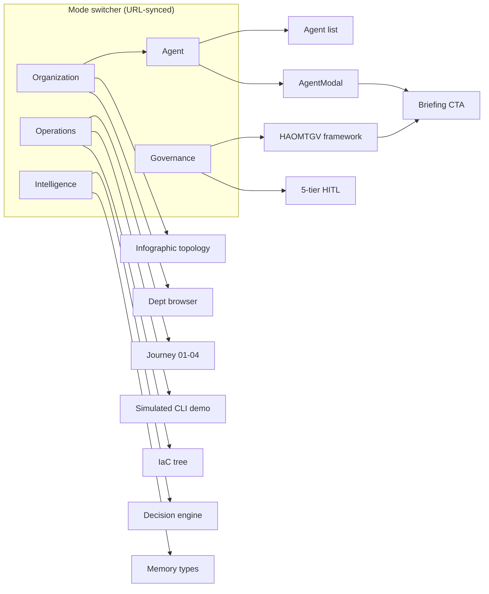
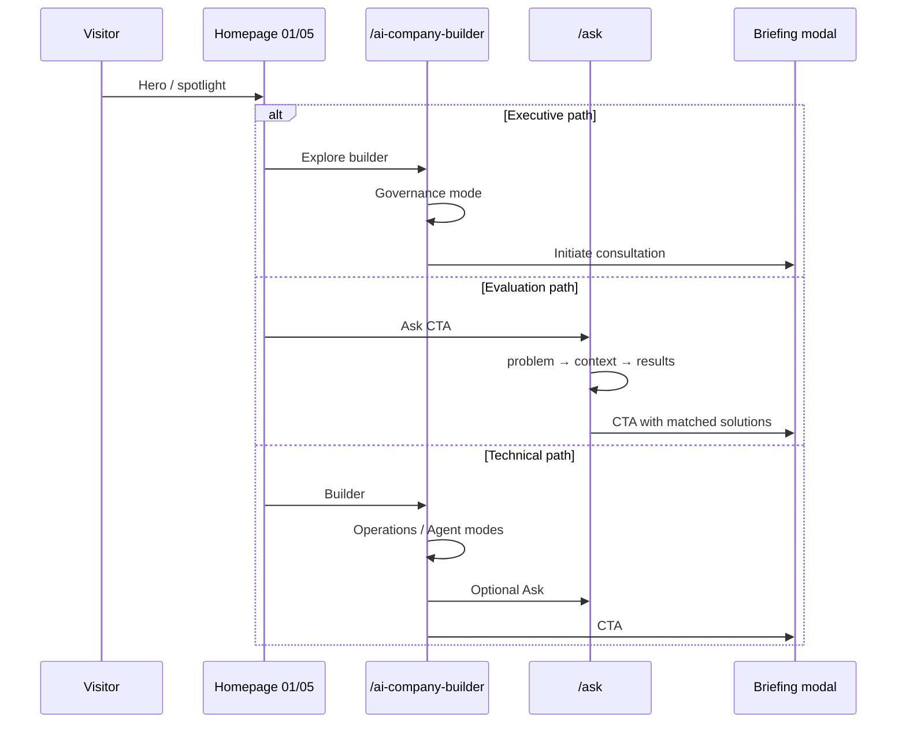
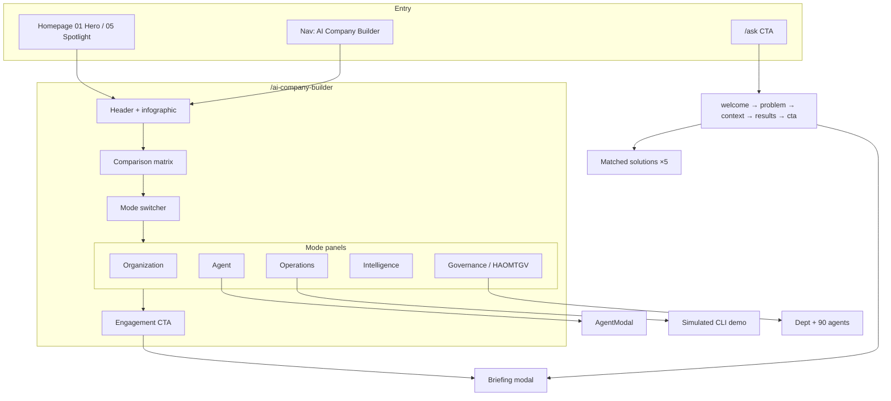

# AI Company Builder UX

**ECL:** LightSpeed AI Company Builder + Web Experience Architecture v2.0
**Task:** T010 (`harness/changes/active/tasks.md`)
**Status:** Draft for review · Docs-only · No React code changes in this artifact
**Date:** 2026-09-24
**Sources of truth:** `src/pages/AiCompanyBuilderPage.tsx`, `src/components/AiCompanyBuilderSection.tsx`, `src/components/AiCompanyBuilderOsExplorer.tsx`, `src/components/AskLightSpeed.tsx`, `src/components/AgentModal.tsx`, `src/components/HaomtgvGovernanceFramework.tsx`, `src/data/companyData.ts` (+ `src/__tests__/companyData.test.ts`), `src/data/siteContent.ts`, `src/App.tsx` routes `/ai-company-builder` and `/ask`, ADR-020, brief §15 (modes), §20 (Ask evaluation), §34#8 (this deliverable), §38 (progressive disclosure).

---

## 1. Purpose

Define the v2 user experience for the AI Company Builder product surface and its evaluation entry (Ask LightSpeed): exploration modes, executive vs technical journeys, component disposition (retain / refine / replace), Ask-as-central-entry recommendation, motion/3D guidance, and accessibility/empty-state requirements. This is an interaction and information-architecture spec — visual language stays locked to ADR-020 brand tokens (navy / red / cyan, Arial scale); no palette invention.

Companion: `WEB_INFORMATION_ARCHITECTURE_V2.md` (route map, homepage 13 sections, nav).

---

## 2. Scope and routes

| Surface | Route | Component tree |
|---------|-------|----------------|
| Builder landing | `/ai-company-builder` | `AiCompanyBuilderPage` → `AiCompanyBuilderSection` → hero chassis, comparison matrix, 5 tabs, `AiCompanyBuilderOsExplorer`, `HaomtgvGovernanceFramework` (governance tab), CTA |
| Evaluation / discovery | `/ask` | `AskLightSpeed` (rule-based step machine) → match `solutions[]` → `ExecutiveBriefingModal` via `onRequestBriefing` |
| Agent detail (modal) | in-page (no dedicated route) | `AgentModal` over roster data from `companyData.ts` |
| Roster source | — | `agentsList` (90), `departmentsList` (20); asserted by `companyData.test.ts` |

Public vs internal boundary (dashboard, CLI, inbox) is out of scope — see `PUBLIC_INTERNAL_BOUNDARY.md` (T005). The builder page presents **simulated/illustrative** CLI and org-graph output only; it must never imply live tenant execution (ADR-020: no fake success states for real transactions; demo affordances must be labeled).

---

## 3. Exploration modes (brief §15)

Five modes: **Organization · Agent · Operations · Intelligence · Governance.** These are the visitor’s conceptual lenses. Map each to existing UI (retain / refine / replace).

| Mode | Visitor question | Existing surface | Disposition | v2 treatment |
|------|------------------|------------------|-------------|--------------|
| **Organization** | “What does the company structure look like?” | `AiCompanyBuilderSection` tab **operating-model** (workflow collapse, HITL, semantic fabric cards); `AiCompanyBuilderOsExplorer` tab **mission**; infographic banner (90-agent swarm, 20-dept topology) | **Refine** | Elevate org topology as the default first glance: keep infographic, add explicit link from Organization mode → `HaomtgvGovernanceFramework` department browser (already uses `departmentsList` × `agentsList`). |
| **Agent** | “Who are the agents and what can they do?” | `AgentModal` (type, department, tools, permissions); workforce tab (“Domain-Expert Agent Swarms”, dispatch protocol); `HaomtgvGovernanceFramework` roster filter | **Retain + refine** | Make Agent mode reachable from Organization (click department → agent list → `AgentModal`). Ensure modal is keyboard-trap-safe and documents canonical 7-tool vocabulary (see AGENTS.md §8) without leaking internal paths. |
| **Operations** | “How does work actually flow?” | Workforce tab (message bus, queues); `AiCompanyBuilderOsExplorer` tabs **models**, **decision-engine**, **cli**; journey tab (Discover→Architect→Pilot→Scale) | **Retain** | Operations mode owns the simulated CLI (`ai-company bootstrap|doctor|graph|memory`) — label explicitly as **demo**. Journey tab is the narrative spine for operators. |
| **Intelligence** | “How does it learn and decide?” | OsExplorer **decision-engine**, **memory** CLI demo; comparison matrix “Unified Enterprise Semantic Fabric”; `siteContent` responsible-AI / techPhilosophy | **Refine** | Surface memory six-type story (episodic…aggregate) under Intelligence; keep claims aligned with `trustEvidence` / honesty badges — no invented benchmark numbers. |
| **Governance** | “How is it controlled and audited?” | Governance tab → `HaomtgvGovernanceFramework` (H-A-O-M-T-G-V); 5-tier HITL copy; Trust/Proof routes | **Retain (primary)** | Governance is the differentiator: default secondary CTA from every mode → governance tab deep-link (`/ai-company-builder#governance` — freeze fragment). |

### 3.1 Mode navigation pattern (v2)

Current UI uses two stacked tab systems (section tabs + OsExplorer tabs) which fragment the five modes. Recommendation:

- **Top-level mode switcher** = the five brief modes (Organization, Agent, Operations, Intelligence, Governance) — single source of orientation (roving tabindex, URL-synced via hash or `?mode=`).
- **Inner panels** keep domain-specific sub-tabs (IaC tree, CLI, models) as secondary controls within a mode, not as peer navigation to modes.
- Map current tabs: `operating-model`+infographic → Organization; `workforce`+AgentModal → Agent; `architecture`+`journey`+OsExplorer CLI/models → Operations; decision-engine/memory/semantic fabric → Intelligence; `governance` → Governance.
- **Disposition of current labels:** replace tab chrome labels with mode names in nav; keep rich inner headings (“Architectural Comparison Matrix”, “4-Stage Transformation Journey”) as content titles.

---

## 4. Journeys (brief §38 progressive disclosure)

### 4.1 Executive-first journey

Audience: boards, CEOs, ministers, donors — time-poor, evidence-seeking.

| Step | Goal | Surface | Exit |
|------|------|---------|------|
| 1 | 5-second value | `/` Hero + Builder spotlight (homepage §01, §05) | `/ai-company-builder` or briefing CTA |
| 2 | Credibility | Infographic (90 / 20 / 5-tier) + honesty badges | Scroll to comparison matrix |
| 3 | Differentiation | Governance mode (default recommended for execs) or Trust band on Proof | Deep governance detail |
| 4 | Commit | Briefing CTA / `/ask` short path | `ExecutiveBriefingModal` with SLA copy |

Rules: no CLI, no IaC tree, no tool-permission tables on the critical path; technical depth one click deeper (mode switch or “For technical teams” toggle).

### 4.2 Technical-second journey

Audience: CTOs, platform engineers, integration leads.

| Step | Goal | Surface | Exit |
|------|------|---------|------|
| 1 | Architecture fit | Operations mode → IaC tree, decision-engine | `/what-we-do#technology` |
| 2 | Roster & permissions | Agent mode → `AgentModal` (canonical tools, scopes) | Public registry schema doc (T007) when published |
| 3 | Runtime semantics | Simulated CLI (bootstrap/doctor/graph/memory) — labeled demo | Docs / contact for real trial |
| 4 | Governance integration | Governance mode → HITL gates, audit trails | Proof / Trust evidence |
| 5 | Commit | `/ask` full flow or briefing | Lead capture |

### 4.3 Ask LightSpeed evaluation flow (brief §20)

**Current machine** (`AskLightSpeed`): steps `welcome → problem → context → results → cta`.

| Step | UI | Data |
|------|-----|------|
| welcome | Assistant intro + quick questions | Static `WELCOME_MESSAGE` |
| problem | Free text or 6 canned problems | Match against `PROBLEM_QUESTIONS` |
| context | Industry + timeline pickers | Sector options aligned to `industries[]` names |
| results | Matched solution cards | Heuristic filter on `solutions[]` + `HonestyBadge` |
| cta | Briefing / contact | `onRequestBriefing` → `ExecutiveBriefingModal` |

**Constraints:** rule-based only (archived decisions: no LLM in this component). Do not present as live AI chat; “discovery layer / briefing prep assistant” framing is correct.

**Central-entry recommendation (§20 evaluation):**

| Option | Pros | Cons | Recommendation |
|--------|------|------|----------------|
| A. `/ask` remains separate; promoted to primary nav CTA | Clear IA; keeps homepage spine stable (§13 tree has no Ask item) | One extra hop from home | **Recommended default** |
| B. Ask embedded in homepage hero | Lowest friction | Hero density; conflicts with outcome-led 5-second hero (ADR-020); mode creep | Not recommended for v1 |
| C. Ask becomes central site entry (replace browse) | Strong product-led motion | Premature; audiences (gov, donors) need proof before chat | Defer until funnel data supports |

**Refinements regardless of option:**

1. Sector options in `context` step must match `industries[]` slugs/titles (incl. Education; resolve development/donor gap).
2. `results` must only offer solutions that exist in `solutions[]` (five canonical slugs).
3. Empty match → honest empty state (“No exact match — book a briefing”) — never fabricate a solution card.
4. Deep-link support: `/ask?problem=…` optional later; not required for v2.
5. A11y: full keyboard path through pickers; `aria-live` on assistant turns; do not rely on color alone for match strength.

---

## 5. Component disposition detail

### 5.1 `AiCompanyBuilderSection`

| Element | Disposition | Notes |
|---------|-------------|-------|
| Category header + flagship badge | Retain | Aligns with progressive disclosure eyebrow pattern |
| Swarm infographic banner | Retain | Organization mode anchor; ensure alt text describes topology (a11y) |
| Traditional vs AI-Native comparison matrix | Retain | Strong IA for Operations/Organization; keep claims evidence-qualified |
| 5 tab strip | **Refine** → five brief modes (§3.1) | URL-sync tabs |
| Tab panels (operating-model, workforce, architecture, journey, governance) | Retain content, re-home under modes | Journey stays Operations |
| `AiCompanyBuilderOsExplorer` embed | Retain as Operations/Intelligence inner panel | |
| Engagement CTA chassis | Retain | SLA-adjacent copy; primary = briefing |

### 5.2 `AiCompanyBuilderOsExplorer`

| Element | Disposition | Notes |
|---------|-------------|-------|
| Tabs mission / iac-tree / models / decision-engine / cli | Retain as inner secondary nav | Not peer to top-level modes |
| Simulated CLI (`bootstrap`, `doctor`, `graph`, `memory`) | Retain + **label DEMO** | Hard-code numbers must match source-of-truth (90 agents, 20 departments, 2,373 tests) — already align; forbid fake “deployment success” for real tenants |
| IaC folder tree | Retain | Show illustrative paths only; no internal absolute filesystem paths |
| Folder selection state | Refine | Keyboard listbox pattern; `aria-activedescendant` |

### 5.3 `AgentModal`

| Element | Disposition | Notes |
|---------|-------------|-------|
| Header (type badge, department, name) | Retain | Types: Executive / Board / Specialist from data |
| Body (role, tools, permissions) | Retain | Canonical 7 tools vocabulary; no secrets fields |
| `onDispatchTask` | **Do not surface** as real dispatch in public UI | Demo-only if shown; label clearly |
| Dialog behavior | Refine | Focus trap, Escape to close, `role="dialog"`, restore focus to invoker |

### 5.4 `HaomtgvGovernanceFramework`

| Element | Disposition | Notes |
|---------|-------------|-------|
| Department selector (`departmentsList`) | Retain | Governance mode default panel |
| Agent counts per department | Retain | Must equal 90 total (test-backed) |
| HITL tier explanation | Retain | 5-tier matrix; align wording with Proof stats |

### 5.5 `AskLightSpeed`

| Element | Disposition | Notes |
|---------|-------------|-------|
| Step machine | Retain | No LLM |
| Quick-question chips | Retain | |
| Solution matching | Refine | Canonical slugs only |
| CTA → briefing modal | Retain | Include form SLA copy (ADR-020) |
| `CtaBand` / related links | Retain | |

---

## 6. Motion, 3D, and performance guidance

Brief context: builder uses tactile hardware chrome (`StatusLedPip`, `MachineScrewHead`, `AcousticVentGrille`, chassis panels) and large infographic imagery.

| Guidance | Rule |
|----------|------|
| Motion budget | Subtle: LED pulse, hover lifts already used on cards; no parallax hero. Respect `prefers-reduced-motion: reduce` (disable pulse and transform animations). |
| 3D / WebGL | Not required for v2 builder UX; infographic is static image. Do not add WebGL without a measured UX reason (brief §23: redesign only with reason). |
| Imagery | Infographic alt text required; decorative chassis elements `aria-hidden`. |
| Performance | Avoid animating layout properties; keep tab switches instant (content swap, no route change for mode switch). |
| Theme | Light/dark via existing `theme` prop; chassis classes (`chassis-milled-light/dark`) retained — no new surface colors. |

---

## 7. Accessibility and empty states

| Area | Requirement |
|------|-------------|
| Mode switcher | Tablist pattern, arrow-key navigation, visible focus ring (cyan/navy per theme), mode reflected in URL for shareability. |
| Comparison matrix | Readable linear order for screen readers (Traditional → AI-Native); not two disconnected columns without reading order. |
| Journey 01–04 | Ordered list semantics. |
| CLI demo | `role="log"` or polite live region for output; keyboard-operable Run control; do not auto-focus terminal on load. |
| AgentModal | Focus trap, Escape, labelled heading. |
| Ask | Live region for assistant messages; fieldset/legend for context questions; error text on empty required answer. |
| Empty states | No solution match → explanation + briefing CTA; agent roster empty (should never happen if 90) → message + link to Proof; sector unknown slug → index link (IA doc §4.1). |
| Honesty badges | Text label + not color-only (already `HonestyBadge` pattern). |
| Contrast | Navy on white / white on navy; red/cyan accents meet WCAG AA for text sizes used; verify in implementation QA (ls-artifact-qa / building-accessible-interfaces). |
| Language | en; executive copy plain-language; jargon (HITL, IaC) expanded on first use per mode. |

---

## 8. Data contracts (UX-relevant)

| Contract | Value | Source |
|----------|-------|--------|
| Agent count | 90 | `agentsList`, test `toBe(90)` |
| Department count | 20 | `departmentsList`, test |
| Solution slugs (5) | `ai-company-builder`, `digital-presence`, `business-automation`, `enterprise-deployment`, `boardroom-briefing` | `siteContent.solutions` |
| Sector slugs (5) | `financial-services`, `healthcare`, `agriculture`, `education`, `government` | `siteContent.industries` |
| Proof stats | 90 agents, 2373 tests, 20 departments, 5-tier approval | `HomePage.PROOF_STATS` |
| Canonical tools (modal) | `read`, `edit`, `grep`, `list`, `bash`, `webfetch`, `task` | AGENTS.md §8 |
| Geography stages | malawi → sadc → africa → global | `siteContent.geography` |

Any UX copy that states counts must read from these constants or mirrored data — not hard-coded divergent numbers (e.g. avoid “140+ agents” on homepage About band — stale vs 90; flag as content fix under Content workstream).

---

## 9. Mermaid — builder UX information architecture

---

## 10. Open questions

1. **Mode URL strategy** — hash (`#agent`) vs query (`?mode=agent`); recommend hash to avoid server config and align with merged-route fragments in IA doc.
2. **Ask central-entry (§20)** — confirm Option A (nav CTA) vs embed; IA doc Q3.
3. **Simulated CLI honesty label** — exact badge copy (“Interactive demo · not a live session”) needs CMO/content owner sign-off under ADR-020.
4. **`onDispatchTask`** — confirm permanently demo-only or remove from public modal props entirely.
5. **Infographic refresh** — static JPG vs regenerated diagram (ls-diagramming) when counts change; owner + cadence.
6. **Homepage “140+ AI Agents”** — stale claim vs 90; who patches in Content pass?
7. **Five-mode labels** — confirm brief §15 exact wording vs internal tab names (e.g. “Operations” vs “Product Factory”).
8. **Ask LLM later** — if evaluation upgrades to LLM, where does policy live (vendor allow-list §9.2 AGENTS.md) — out of scope for v2 docs but note for roadmap T011.
9. **Deep-link from Solutions** — `/solutions/ai-company-builder` detail vs `/ai-company-builder` product page: consolidate or cross-link?
10. **i18n / SADC languages** — not in v2; note for later progressive enhancement.

---

## 11. Verification checklist (for this artifact)

- [x] All five §15 modes mapped to concrete components with disposition.
- [x] Journeys cover executive-first and technical-second (§38).
- [x] Ask evaluation flow documented with central-entry recommendation (§20).
- [x] Retain/refine/replace stated for Section, OsExplorer, AgentModal, HAOMTGV, Ask.
- [x] Counts use 90 / 20 / 2373 / 5-tier; no 145/152 revival.
- [x] Motion/3D constrained; a11y and empty states specified.
- [x] No brand color invention; ADR-020 referenced.
- [x] Simulated CLI flagged demo-only (no fake production success).
- [ ] Confirm brief §15 mode labels and §20 decision with product owner (open Q1–2, Q7).
- [ ] Cross-link from primary v2 doc (T012) and IA doc (T006).
