# AI Workforce 90 — Target Organization Model

**Supports primary:** `LIGHTSPEED_AI_COMPANY_BUILDER_WEB_ARCHITECTURE_V2.md`
**Companion:** [AGENT_CONSOLIDATION_152_TO_90.md](AGENT_CONSOLIDATION_152_TO_90.md) (152→90 migration matrix)
**ECL change:** LightSpeed AI Company Builder + Web Experience Architecture v2.0
**Status:** Target org model + §9 ownership schema design (docs-only; no registry/code edits)

## 1. Canonical Facts

| Claim | Value | Source |
|-------|-------|--------|
| Agents | **90** (89 AI + 1 human CEO) | `docs/source-of-truth.yaml`, `company-registry.yaml` |
| Departments | **20** | `company/departments.yaml`, registry |
| Type breakdown | 19 executive · 64 specialist · 7 board | registry `type:` field census |
| Trim provenance | 152→90 at `e2bdb0c7`; 62 removed, 0 added | [consolidation matrix](AGENT_CONSOLIDATION_152_TO_90.md) |
| Triple-count | registry YAML 90 = `.opencode/agents/*.md` 90 = `company/agent-registry.json` 90 | discovery 2026-09-24 |

## 2. Hierarchy

Reporting spine: `board` ← `human_ceo` → `chief_of_staff` → executives → specialists.

- **human_ceo** (1 human): final authority; reports to `board` (7 board agents); direct reports `chief_of_staff`, `ceo_advisor`.
- **chief_of_staff**: operational orchestrator; 19 direct reports (C-suite + department heads + cross-cutting leads: `culture_values_officer`, `internal_comms_lead`, `ai_ethics_board_chair`, `head_of_business_development`, `consulting_lead`, `thought_leadership_lead`).
- **Executives (19)**: chief_of_staff, cto, coo, caio, human_ceo, cfo, cpo, cmo, hr, ciso, cio, cdo, clo, cso, ceo_advisor, customer_success, sales, consulting_lead, thought_leadership_lead.
- **Board (7)**: board_chair + board_finance/risk/strategy/technology/customer/product; oversight only (no execution).
- **Specialists (64)**: task executors under executives/leads; escalate upward per registry `reports_to`.

### 2.1 Org chart (Mermaid — department groups, not all 90 nodes)

```mermaid
flowchart TD
    Board["Board · 7<br/>board_chair + 6 seats<br/>governance oversight"] --> CEO["human_ceo · 1<br/>FINAL AUTHORITY"]
    CEO --> CoS["chief_of_staff<br/>orchestration · 19 reports"]
    CEO --> Advisor["ceo_advisor<br/>briefings"]

    CoS --> Execs["Executive cabinet<br/>cto · coo · caio · cfo · cpo · cmo<br/>hr · ciso · cio · cdo · clo · cso<br/>customer_success · sales<br/>consulting_lead · thought_leadership_lead<br/>+ culture_values_officer · internal_comms_lead · ai_ethics_board_chair"]

    subgraph Tech["Technology · 13 — exec: cto"]
        T1["vp_engineering → devops_lead · platform_reliability_engineer<br/>dashboard_owner · registry_owner · qa_lead · release_manager"]
        T2["lead_backend → senior_backend_engineer · integration_engineer<br/>lead_frontend → senior_frontend_engineer<br/>solution_architect · platform_engineer"]
    end

    subgraph AI["AI Research · 7 — exec: caio"]
        A1["memory_owner · llm_platform_owner · ai_safety_lead<br/>prompt_engineer · ml_engineer · red_team_engineer"]
    end

    subgraph Ops["Operations · 6 — exec: coo"]
        O1["workflow_owner · orchestration_owner · doctor_owner<br/>sop_owner · vendor_manager"]
    end

    subgraph Sec["Security · 7 — exec: ciso"]
        S1["security_architect · security_compliance_lead · ai_security_specialist<br/>incident_response_lead · devsecops_lead · decision_engine_owner"]
    end

    subgraph Prod["Product · 5 — exec: cpo"]
        P1["product_owner · product_designer · ux_research_lead<br/>technical_documentation_lead"]
    end

    subgraph Mkt["Marketing · 9 — exec: cmo"]
        M1["marketing_owner · social_media_manager · product_marketing_manager<br/>head_of_developer_relations · growth_hacker · content_creator<br/>media_generation_owner · creative_director"]
    end

    subgraph PharosD["Pharos · 6 — exec: thought_leadership_lead"]
        PH1["agentic_research_lead · thought_leadership_author<br/>agentic_policy_analyst · speaker_engagement_lead<br/>community_ecosystem_builder"]
    end

    subgraph PeopleD["People · 4 — exec: hr"]
        PE1["hr_owner · recruiter · culture_values_officer*"]
    end

    subgraph SalesD["Sales · 3 — exec: sales"]
        SA1["sales_owner · solutions_engineer"]
    end

    subgraph CS["Customer Success · 2 — exec: customer_success"]
        C1["customer_success_owner"]
    end

    subgraph DataD["Data · 3 — exec: cdo"]
        D1["data_engineer · business_intelligence_engineer"]
    end

    subgraph LegalD["Legal · 3 — exec: clo"]
        L1["legal_owner · data_privacy_officer"]
    end

    subgraph QAD["QA · 3 — exec: qa_lead (under vp_engineering)"]
        Q1["test_engineering_lead · release_manager*"]
    end

    subgraph Strat["Strategy · 2 — exec: cso"]
        ST1["market_analyst"]
    end

    subgraph FinD["Finance · 2 — exec: cfo"]
        F1["financial_analyst"]
    end

    subgraph ExecD["Executive · 5 — exec: human_ceo"]
        E1["chief_of_staff* · ceo_advisor* · internal_comms_lead<br/>ai_ethics_board_chair"]
    end

    subgraph BizD["Business Development · 1 — executive: cso (dual)"]
        B1["head_of_business_development"]
    end

    subgraph ITD["IT · 1 — exec: cio"]
        I1["(no specialists)"]
    end

    subgraph ConsD["Consulting · 1 — exec: consulting_lead"]
        CO1["(no specialists)"]
    end

    Execs --> Tech
    Execs --> AI
    Execs --> Ops
    Execs --> Sec
    Execs --> Prod
    Execs --> Mkt
    Execs --> PharosD
    Execs --> PeopleD
    Execs --> SalesD
    Execs --> CS
    Execs --> DataD
    Execs --> LegalD
    Execs --> QAD
    Execs --> Strat
    Execs --> FinD
    Execs --> ExecD
    Execs --> BizD
    Execs --> ITD
    Execs --> ConsD
```

\* Agents shown in multiple groups appear once in the registry under their `department` field; group placement here is illustrative of reporting reach, not a second source of truth. Registry `department` values remain canonical.

## 3. Department Table (20 — from `company/departments.yaml`)

| # | id | Name | Executive | Budget category | Headcount target | Actual (registry) |
|--:|----|------|-----------|-----------------|-----------------:|------------------:|
| 1 | board | Board | board-chair | operations | 7 | 7 |
| 2 | ai_research | AI Research | caio | product_development | 10 | 7 |
| 3 | business_development | Business Development | cso | growth | 3 | 1 |
| 4 | customer_success | Customer Success | customer-success | growth | 5 | 2 |
| 5 | data | Data | cdo | product_development | 5 | 3 |
| 6 | executive | Executive | human-ceo | operations | 3 | 5 |
| 7 | finance | Finance | cfo | operations | 3 | 2 |
| 8 | it | IT | cio | infrastructure | 4 | 1 |
| 9 | legal | Legal | clo | operations | 3 | 3 |
| 10 | marketing | Marketing | cmo | growth | 8 | 9 |
| 11 | operations | Operations | coo | operations | 8 | 6 |
| 12 | people | People | hr | people | 5 | 4 |
| 13 | product | Product | cpo | product_development | 5 | 5 |
| 14 | qa | QA | qa-lead | product_development | 4 | 3 |
| 15 | sales | Sales | sales | growth | 10 | 3 |
| 16 | security | Security | ciso | infrastructure | 5 | 7 |
| 17 | strategy | Strategy | cso | operations | 3 | 2 |
| 18 | consulting | Consulting | consulting-lead | growth | 4 | 1 |
| 19 | technology | Technology | cto | product_development | 25 | 13 |
| 20 | pharos | Pharos | thought-leadership-lead | growth | 7 | 6 |
| | | | | **Totals** | **127** | **90** |

Notes:
- Department set unchanged across the 152→90 trim (same 20).
- Headcount targets (127) are aspirational planning numbers, not drift-gated; actuals sum to canonical 90.
- `business_development` and `strategy` both list executive `cso` — single-owner violation V1 (§6).

## 4. Type Breakdown

| Type | Count | Composition |
|------|------:|-------------|
| executive | 19 | 13 C-suite/chief roles + chief_of_staff + ceo_advisor + customer_success + sales + consulting_lead + thought_leadership_lead |
| specialist | 64 | Task executors (owners, leads, engineers, analysts, creators) |
| board | 7 | board_chair + 6 committee seats |
| **Total** | **90** | 89 AI + 1 human (`human_ceo`) |

Human/AI split: `human_ceo` is the sole human; all other 89 IDs are AI agents.

## 5. Agent Ownership Schema (§9)

### 5.1 Standard schema — MANDATORY vs OPTIONAL

Target YAML shape for every registry entry (superset of today's fields). MANDATORY fields must be present and non-empty for load/validation to pass; OPTIONAL fields may be omitted without failing validation.

| # | Field | Mandate | Type | Purpose |
|--:|-------|---------|------|---------|
| 1 | `id` | **MANDATORY** | string (snake_case, unique) | Stable identity |
| 2 | `name` | **MANDATORY** | string | Display name |
| 3 | `type` | **MANDATORY** | enum: executive \| specialist \| board | Roster class |
| 4 | `department` | **MANDATORY** | string (must resolve to departments.yaml) | Home department |
| 5 | `reports_to` | **MANDATORY** | id (must resolve; board_chair → `board`/null exempt) | Hierarchy edge |
| 6 | `responsibilities` | **MANDATORY** | list[string] (≥1) | What the owner does |
| 7 | `decision_rights` | **MANDATORY** | list[string] | What the owner decides without escalation (§5.2 chain) |
| 8 | `approval_level` | **MANDATORY** | enum: self \| lead \| exec \| ceo \| board | Tier for gated actions (maps to 5-tier matrix) |
| 9 | `escalation_path` | **MANDATORY** | list[id] (ordered, terminal = human_ceo/board) | Where blockers go |
| 10 | `kpis` | **MANDATORY** | list[string] (≥1 measurable) | Measurement link in accountability chain |
| 11 | `title` | OPTIONAL | string | Role title (defaults from name) |
| 12 | `description` | OPTIONAL | string | One-paragraph summary ("mission" surface) |
| 13 | `direct_reports` | OPTIONAL | list[id] | Inverse edges (derived OK) |
| 14 | `guidelines` | OPTIONAL | string | Operating principles |
| 15 | `tools` | OPTIONAL | list[canonical 7] | Tool vocabulary (AGENTS.md §8) |
| 16 | `model_tier` | OPTIONAL | enum: standard \| premium | LLM tier |
| 17 | `technical_domain` | OPTIONAL | string | Specialist domain label |
| 18 | `workflows` | OPTIONAL | list[workflow ids] | Workflows this agent participates in |
| 19 | `inputs` | OPTIONAL | list[string] | Artifacts/events consumed |
| 20 | `outputs` | OPTIONAL | list[string] | Artifacts/events produced |

Reference implementation of the chain each entry must express: **Capability → Owner → Decision Rights → Workflow → Execution → Measurement (KPIs) → Accountability (escalation_path + approval_level)** (§5.2).

### 5.2 Gap analysis vs current `company-registry.yaml`

Field census across all 90 entries (live file, 2026-09-24):

| Schema field | Present? | Coverage | Gap ID | Severity |
|--------------|----------|----------|--------|----------|
| `id` | Yes | 90/90 | — | — |
| `name` | Yes | 90/90 | — | — |
| `title` | Yes | 90/90 | — | — |
| `type` | Yes | 90/90 | — | — |
| `department` | Yes | 90/90 | — | — |
| `reports_to` | Yes | 90/90 | — | — |
| `direct_reports` | Yes | 90/90 | — | — |
| `description` | Yes | 90/90 | — | — |
| `responsibilities` | Yes | 90/90 | — | — |
| `tools` | Yes | 90/90 | — | — |
| `model_tier` | Partial | 86/90 (missing: chief_of_staff, cto, coo, caio) | G1 | Low |
| `guidelines` | Partial | 83/90 (missing: all 7 board seats) | G2 | Low–Med (board ops undocumented) |
| `technical_domain` | Partial | 63/90 (executives/board mostly) | G3n | Low (specialist-focused field) |
| `decision_rights` | **No** | 0/90 | **G3** | **High** — §5.2 chain broken at decision node |
| `kpis` | **No** | 0/90 (KPIs live separately in `company/config/kpis.yaml`, 25 KPIs / 8 depts) | **G4** | **High** — measurement not per-agent |
| `approval_level` | **No** | 0/90 (5-tier matrix lives in decision engine, not registry) | **G5** | **High** — approval tier not declarative per agent |
| `escalation_path` | **No** | 0/90 (implicit via reports_to chain only) | **G6** | **Med** — escalation = reporting by default; no explicit overrides |
| `workflows` | **No** | 0/90 (workflow defs separate; agents not linked) | G7 | Med |
| `inputs` | **No** | 0/90 | G8 | Med |
| `outputs` | **No** | 0/90 | G8 | Med |
| `mission` | No (naming) | Registry uses `description`; departments.yaml uses `mission` | G9 | Low — align naming in schema v2 |

**Schema gaps found: 7 distinct missing fields (`decision_rights`, `kpis`, `approval_level`, `escalation_path`, `workflows`, `inputs`, `outputs`) + 3 partial-coverage fields + 1 naming misalignment.** No field in the live registry is *extra* relative to §9 (all current fields map into the standard schema).

Remediation is schema/loader work for a later implementation ECL change (validator must fail-fast on missing MANDATORY fields — registry_owner mandate). Not executed in this docs-only change.

## 6. Single-Owner Architecture Principle (§5.2)

**Principle:** Every capability has exactly one accountable owner. Full chain, end to end:

**Capability → Owner → Decision Rights → Workflow → Execution → Measurement → Accountability**

No capability may have two owners; shared *execution* is allowed, shared *accountability* is not. Dual mandates must be either split into two capabilities or explicitly re-owned with a documented primary.

### 6.1 Known violations (from discovery)

| # | Violation | Evidence | Status post-trim | Recommended resolution |
|--:|-----------|----------|------------------|------------------------|
| V1 | `cso` is executive of **two** departments: `business_development` + `strategy` | `company/departments.yaml` (both `executive: "cso"`) | **Open** — unchanged by trim | Split: make `head_of_business_development` the BD department executive; cso remains Strategy exec. OR document cso dual mandate as explicit primary/secondary with separate KPIs. Architecture Lead decision. |
| V2 | Dual content production roles: `content_writer` vs `content_creator` | pre-trim roster | **Resolved** at `e2bdb0c7` — writer merged → `content_creator` | None (record only) |
| V3 | Dual/triple creative production: `brand_strategist` + 5 designers + `artifact_qa_reviewer` vs `creative_director` | pre-trim roster | **Resolved** — all 6 merged → `creative_director` | Watch R6: creative self-QA; `ls-artifact-qa` skill stays independent gate |
| V4 | Dual social/external comms: `media_pr_relations` vs `product_marketing_manager` / `social_media_manager` | pre-trim roster | **Resolved** — PR merged → `product_marketing_manager`; social retained under cmo | Encode external-comms decision_rights on product_marketing_manager |
| V5 | Dual legal execution: `legal` vs `legal_owner` (+ clo) | pre-trim roster | **Resolved** — `legal` merged → `legal_owner` | None |
| V6 | Dual DevOps lead titles: `lead_devops` vs `devops_lead` | pre-trim roster | **Resolved** — lead_devops merged → `devops_lead` | None |
| V7 | Dual prompt tiers: `prompt_engineer_specialist` vs `prompt_engineer` | pre-trim roster | **Resolved** — specialist merged → `prompt_engineer` | None |
| V8 | Dual FE/BE IC ladders: `frontend_engineer` vs `senior_frontend_engineer` (same for BE) | pre-trim roster | **Resolved** — REDEFINE onto senior tier | None |
| V9 | **Residual:** dual QA leadership: `qa_lead` + `test_engineering_lead` both retained | registry (test_engineering_lead reports to qa_lead) | **Open — bounded** | Boundary exists (hierarchy), but decision_rights not encoded. Encode per §5.1 fields: qa_lead = quality policy/gates; test_engineering_lead = automation/eval execution |
| V10 | **Residual:** `fullstack_engineer` reassigned to **two** targets (`lead_backend` + `lead_frontend`) | consolidation matrix §4.2 | **Open — bounded** | Intake routing rule (matrix R7); no shared accountability — vp_engineering arbitrates |
| V11 | Chief-of-staff span: 19 direct_reports (+ program duties absorbed) | registry `direct_reports`; matrix R4 | **Open — watch** | Not a dual-owner violation; capacity risk. Monitor; offload program tracking to workflow_owner if needed |

V1 is the only **structural** single-owner violation still open in `departments.yaml`. V9/V10 are bounded by hierarchy/rules but lack declarative `decision_rights` (gap G3). V2–V8 closed by the trim.

## 7. Operating Principles (§5.4)

1. **90 is not the product.** The deliverable is a working AI company builder and web experience; agent count is an internal headcount fact, not a marketing metric.
2. **Communicate accountability, not agent-count marketing.** External and internal narratives lead with ownership chains, decision rights, and outcomes (Capability→…→Accountability) — never with roster size as a boast.
3. **Counts are derived, never asserted.** 90/20 flow from registry + departments.yaml via `docs/source-of-truth.yaml` drift gates; prose follows facts.
4. **One owner per capability** (§5.2, §6). Ambiguity is a bug in the registry, not a feature of collaboration.
5. **Fail fast on invalid config.** Missing MANDATORY §9 fields must fail validation at load (registry_owner non-negotiable).
6. **90 can change; the schema cannot weaken.** Future trims/expansions re-run the [consolidation methodology](AGENT_CONSOLIDATION_152_TO_90.md §2); they do not drop `decision_rights`/`kpis`/`approval_level`/`escalation_path`.

## 8. Decision Framework (§37 — Q1–Q10)

Short answers for the consolidation approach and this target model. (Q wording reconstructed from handoff — confirm exact §37 text with Architecture Lead.)

| Q | A: Ship 90-agent target model as canonical | B: Adopt §9 ownership schema (add missing MANDATORY fields) | C: Enforce single-owner chain (§5.2) |
|---|---------------------------------------------|-------------------------------------------------------------|--------------------------------------|
| Q1 Problem | Post-trim org needs one authoritative model; stale 145/152 claims still circulate | Registry cannot express who *decides*, how measured, or how escalated — chain incomplete | Dual mandates (V1) and implicit escalation create accountability gaps |
| Q2 Alternatives | Keep 152; shrink further; publish no model; per-department docs only | Leave schema as-is; add fields only to new agents; move fields to sidecar files | Ignore dual execs; fix case-by-case; make ownership a doc convention |
| Q3 Decision | Publish AI_WORKFORCE_90 as the target model: hierarchy + 20-dept table + type census | Extend registry schema with 7 missing MANDATORY fields; backfill all 90 before next trim | Resolve V1 (split BD exec or document dual mandate); encode V9 decision_rights; routing rule for V10 |
| Q4 Trade-off | Model freezes current 90 — must be re-issued on any roster change vs staying informal | Backfill cost (90 entries × schema validation) vs runtime ambiguity cost | Splitting BD changes departments.yaml executive refs vs leaving structural violation open |
| Q5 Blast radius | Docs + drift gates only | registry loader/validator + all 90 cards regenerate (implementation ECL) | departments.yaml, registry direct_reports, org-chart docs |
| Q6 Risks | Doc drift if roster changes without re-issue → mitigate via source-of-truth gates | Validator too strict breaks generation → mitigate with staged rollout (warn→fail) | BD split orphans reporting edges → mitigate by rewiring head_of_business_development reports_to chief_of_staff (already true) |
| Q7 Dependencies | Consolidation matrix (companion), source-of-truth.yaml, departments.yaml | registry_owner (loader/validator), generator templates, ToolRunner tier map | V1 needs Architecture Lead ruling; V9 needs §5.1 field add |
| Q8 Success metrics | Counts match 90/20 everywhere; lint-ecl + validate-drift green | 90/90 entries pass MANDATORY validation; zero dangling escalation refs | 0 multi-exec departments; every specialist decision_rights non-empty |
| Q9 Reversibility | High (docs) | Medium (schema migration script + regen) | Medium (YAML rewiring; reversible by revert) |
| Q10 Owner / approval | registry_owner authors; Architecture Lead approves | registry_owner implements; vp_engineering approves schema ADR | Architecture Lead decides V1; cso/clo stakeholders consulted |

## 9. Cross-Links

- **Supports primary:** `docs/architecture/LIGHTSPEED_AI_COMPANY_BUILDER_WEB_ARCHITECTURE_V2.md`
- **Companion:** [AGENT_CONSOLIDATION_152_TO_90.md](AGENT_CONSOLIDATION_152_TO_90.md) — how the roster became 90 (matrix, residual risks R1–R10)
- Inputs: `company-registry.yaml`, `company/departments.yaml`, `company/config/kpis.yaml`, `docs/source-of-truth.yaml`, `docs/ORGANIZATION.md`, `harness/changes/active/ref/agents_90.txt`
- Related gaps feed `docs/architecture/PUBLIC_AGENT_REGISTRY_SCHEMA.md` (YAML↔JSON↔TS contract) and registry validator work (implementation ECL, not this change)
