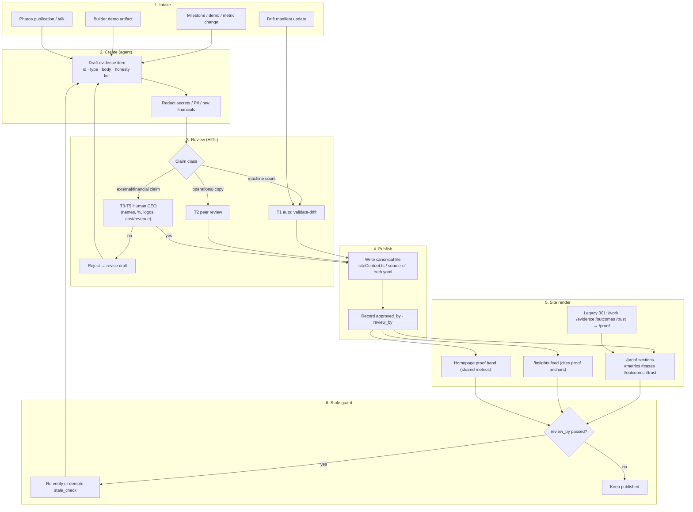

# Evidence Architecture

**ECL change:** LightSpeed AI Company Builder + Web Experience Architecture v2.0
**Deliverable:** §34 support artifact 7 — `EVIDENCE_ARCHITECTURE.md` (tasks.md T009)
**Workstream:** Content (Technical Documentation Lead). Cross-ref: [`WEB_INFORMATION_ARCHITECTURE_V2.md`](WEB_INFORMATION_ARCHITECTURE_V2.md) (T006), [`ROUTE_MIGRATION_V2.md`](ROUTE_MIGRATION_V2.md) (T008).
**Primary doc:** [`LIGHTSPEED_AI_COMPANY_BUILDER_WEB_ARCHITECTURE_V2.md`](LIGHTSPEED_AI_COMPANY_BUILDER_WEB_ARCHITECTURE_V2.md)
**Baseline (verified 2026-09-24):** `src/App.tsx` (work/evidence redirect entries), `vercel.json` (2 edge redirects), `src/pages/{ProofPage,EvidencePage,WorkPage,TrustPage,OutcomesPage,InsightsPage}.tsx`, `src/data/siteContent.ts` (`workCaseStudies`, `workPolicy`, `trustEvidence`, `honestyPolicy`), `docs/source-of-truth.yaml`, ADR-020 (evidence-backed claims).
**Scope:** Docs only — content model, governance, and ops; no React or data-file changes in this artifact.

> **Brief references:** §4 (audiences), §27 (page template — materialized in WEB_IA §8), §34 deliverable 7 (this file), §37 (ten-answer decision framework). ADR-011 does not exist in `docs/adr/` (gap noted in summary.md); ADR-001–003 are CLI/message-bus/agent-loop foundations, not site content decisions. Site evidence posture is governed by ADR-020 (client-facing site guiding principles) + ADR-020 (Pharos content intelligence, duplicate number — flagged).

---

## 1. Problem statement — three paths, one story, split ownership

### 1.1 The three paths

Today the public site presents "proof" across **three competing URLs** with a broken redirect chain between them:

| Path | Component | Role today | Status |
|------|-----------|------------|--------|
| `/proof` | `ProofPage.tsx` | Evidence hub: honesty ladder, platform metrics, case studies, policy track, verify CTAs | Live, intended canonical |
| `/evidence` | `EvidencePage.tsx` (dead import) | SPA `Navigate` → `/proof`; edge does not claim it | Redirect only |
| `/work` | `WorkPage.tsx` (dead import) | Edge 301 → `/evidence` → SPA → `/proof` (**double hop**) | Redirect only |

Additional evidence-bearing pages that merge into Proof (WEB_IA §4): `/outcomes` → `/proof#outcomes`, `/trust` → `/proof#trust`.

### 1.2 Redirect chain (current, broken)

```text
GET /work
  → Vercel edge 301 → /evidence        (vercel.json, permanent)
  → SPA Navigate    → /proof           (App.tsx)
  = two hops; SEO signal lands on intermediate /evidence.

GET /evidence
  → SPA Navigate    → /proof           (single hop; no edge rule)

In-app: TrustPage.tsx links to="/evidence" (SPA hop);
relatedLinksByRoute['/trust'] still lists { to: '/evidence' } in siteContent.ts.
```

Both T006 (WEB_IA §5.1) and T008 (ROUTE_MIGRATION §2) already specify the fix: **edge destination = SPA final** (`/work` → `/proof`, `/evidence` → `/proof`, one hop). This doc owns the *content* consolidation that must land with that redirect fix.

### 1.3 Content owner split risk

Evidence content is currently **owned by whichever page happens to render it**, with no single editorial source:

| Content asset | Defined in | Rendered by | Risk |
|---------------|------------|-------------|------|
| `workCaseStudies[]` (3 case studies) | `siteContent.ts` | `ProofPage` only | Name says "work" but WorkPage is dead — naming drift invites a second consumer |
| `workPolicy[]` (4 policy cards) | `siteContent.ts` | `ProofPage` only | Same |
| `trustEvidence[]` (6 governance controls) | `siteContent.ts` | TrustPage (live → merges to `/proof#trust`) | Two pages will compete for the same array after merge |
| `PLATFORM_METRICS` (90 / 2,373 / 20 / 5-tier) | hard-coded in `ProofPage.tsx` | ProofPage, HomePage proof band (separate copy) | **Metric duplicated in two components** — drift risk vs `source-of-truth.yaml` |
| Honesty ladder (4 tiers) | hard-coded in `ProofPage.tsx` | ProofPage | Mirrors `honestyPolicy[]` in data — two sources of the same doctrine |
| Outcomes (`outcomeCategories[]`) | `siteContent.ts` | OutcomesPage (merges → `/proof#outcomes`) | Parallel taxonomy to case-study outcomes |
| Insights teasers (`insightTeasers[]`, `insightCategories[]`) | `siteContent.ts` | InsightsPage / PharosSection | Fine as separate route, but must not duplicate proof claims |

**Risks if unaddressed:** (a) after route merge, Trust + Outcomes + Proof each restate metrics with different numbers; (b) agents drafting new evidence write to page components instead of data files; (c) stale 145/152-style claims re-enter a claim-bearing surface (homepage proof band, ProofPage) where drift gates do not currently scan React sources; (d) client-identifying or cost/revenue figures ship without HITL approval (ADR-020: no unqualified claims, no fabricated metrics/testimonials/logos).

---

## 2. Target — single canonical `/proof`

**Confirm against both architecture inputs:** WEB_INFORMATION_ARCHITECTURE_V2 and ROUTE_MIGRATION_V2 **agree** on the proof consolidation:

| Source | Statement |
|--------|-----------|
| WEB_IA §3.1 | Primary nav: Proof `/proof` — "Absorbs Evidence, Work, Outcomes, Trust as sections." |
| WEB_IA §4 rows 9, 10, 31, 33 | `/work` redirect → `/proof`; `/evidence` merge → `/proof`; `/outcomes` merge → `/proof#outcomes`; `/trust` merge → `/proof#trust` |
| WEB_IA §5.1 | Edge targets: `/work`→`/proof`, `/evidence`→`/proof`, `/outcomes`→`/proof`, `/trust`→`/proof` |
| ROUTE_MIGRATION §1.2, §2.2 | SPA `/work`→`/proof`, `/evidence`→`/proof`; edge after fix: `/work`→`/proof`, `/evidence`→`/proof` |

**Target model (content view):**

- **`/proof` is the only public evidence surface.** No `/work`, `/evidence`, `/outcomes`, or `/trust` as first-class content routes — they become single-hop 301s / SPA fallbacks to `/proof` or stable fragment IDs.
- **Section map on `/proof`:** `#metrics` (already exists) · `#honesty` · `#cases` · `#outcomes` · `#trust` · `#verify` · CTA band. Fragment IDs frozen per WEB_IA open question 9.
- **`/insights` stays a separate canonical route** (Pharos thought leadership) — publications and talks *index* on Insights but *cite* Proof; they never become a second proof hub.
- Dead page files (`WorkPage`, `EvidencePage`) are delete candidates after prose salvage (ROUTE_MIGRATION §3.1); this doc claims any remaining unique prose before deletion.

### 2.1 ⚠ Divergence flag for Architecture Lead (not proof-path, but adjacent)

The two sibling docs **disagree on non-proof edge targets**, which affects where evidence CTAs in the footer point for solutions browse:

| Legacy path | WEB_IA §5.1 target | ROUTE_MIGRATION §2.2 target |
|-------------|--------------------|-----------------------------|
| `/offerings` | `/solutions` (live index — IA "create") | `/what-we-do` (optional `/solutions` edge) |
| `/solutions` index | live page (create) | redirect → `/what-we-do` (optional edge) |
| `/industries` | `/sectors` (rename — IA create) | `/what-we-do` (optional edge) |

Proof-path targets are **identical** in both docs — no flag there. The `/solutions` live-vs-redirect and `/sectors` rename question is outside this deliverable; **Architecture Lead must reconcile before implementation ECL** (ROUTE_MIGRATION open items 1–2; WEB_IA open questions 1, 4).

---

## 3. Evidence model

### 3.1 Evidence types

| Type | Example (current) | Data location | Public shape | Honesty constraint |
|------|-------------------|---------------|--------------|--------------------|
| **Platform metric** | 90 agent configs · 2,373 tests · 20 departments · 5-tier approval | `source-of-truth.yaml` (canonical counts); rendered in ProofPage `PLATFORM_METRICS` + HomePage proof band | Stat card + **Source:** line | Must match drift manifest; no 145/152/127 claims |
| **Case study** | `workCaseStudies` ws-01..03 (compliance, agri coop, university) | `siteContent.ts` | Card: title, text, honesty badge, period, scope, outcome | Badge required (`proven` / `pilot` / `fieldable` / `development`); no client name without approval |
| **Trust / control evidence** | `trustEvidence` (gates, approval matrix, audit, RBAC, DPA, ownership) | `siteContent.ts` | `#trust` band cards with `proof.tone` | Operational controls only — "no invented seals" (file comment) |
| **Policy / standards track** | `workPolicy` (data protection, sovereignty, payments, cadence) | `siteContent.ts` | Card grid under Proof | Status badge per card |
| **Outcomes** | `outcomeCategories[]` | `siteContent.ts` | `#outcomes` section (merged from OutcomesPage) | Qualified claims only (ADR-020 §5) |
| **Logo / partner** | partnerships[] categories | `siteContent.ts` | About + Proof cross-link | **Never** invent logos — honestyPolicy: "No fabricated metrics, testimonials, or client logos" |
| **Testimonial** | *(none today — correctly absent)* | — | If added: quote + role + org, approval-gated | Synthetic testimonials banned by honestyPolicy |
| **Publication / talk** | Pharos briefings, insight teasers | `insightTeasers[]`, `insightCategories[]`, PharosSection | Insights index → deep link | Evidence *about thinking*, not a substitute for delivery proof |
| **Repo / test artifact** | CI, pytest suite, lint gates | Referenced by value + source string on metrics | "Code & Test Suite Review" verify path | Counts from live run, not marketing copy |
| **Builder demo artifact** | Agent roster, approval queue, audit log screenshots | `companyData.ts` (site) / runtime dashboard | Builder page + Proof `#verify` | Screenshot scrub of secrets/PII before publish (see §5.3) |

### 3.2 Lifecycle

```text
draft → in_review → approved → published → stale_check → archived
         ↑______________| (rejected / revise)
```

| State | Meaning | Who can set | Site visibility |
|-------|---------|-------------|-----------------|
| `draft` | Agent-authored candidate; unverified claim | Content agents | None |
| `in_review` | Submitted for claim review | Content agents | None |
| `approved` | HITL sign-off recorded (§3.3) | Human approver (CEO / delegated approver role) | None until publish |
| `published` | In `siteContent` (or equivalent) and rendered on `/proof` or `/insights` | Content ops publish step | Public |
| `stale_check` | Past cadence window; re-verify or unpublish | Automated guard + owner | Flagged; auto-demote if failed |
| `archived` | Removed from render; kept in history | Owner | None (301/section note if URL existed) |

Every published item carries: `id`, `type`, `title`, `body`, `honestyBadge`/`proof.tone`, `source` (file or run reference), `owner`, `approved_by`, `approved_at`, `review_by` (next check date).

### 3.3 Ownership and approval (mapped to governance HITL)

Map evidence publishing onto the existing **5-tier approval matrix** (ApprovalGate / `trustEvidence` id `approval`) rather than inventing a parallel workflow:

| Tier | Evidence class | Examples | Approver | Rule |
|------|----------------|----------|----------|------|
| T1 (auto) | Machine-verified counts with drift-manifest source | 90 agents, 20 departments, 25 KPIs | Automation + `validate-drift.ps1` | Value must equal `source-of-truth.yaml`; human spot-check quarterly |
| T2 (peer) | Operational control descriptions, policy cards with no external claim | `trustEvidence`, `workPolicy` text edits | Content owner agent + second-agent review | Honesty badge mandatory |
| T3 (human) | Case studies, outcome numbers, any % or volume claim | ws-01 "40% reduction", pilot member counts | **Human CEO (or approve-role)** via HITL gate | `approved_by` + date stored; no publish without it |
| T4 (human + legal/brand) | Client names, logos, testimonials, quotes | Partner logos, named banks/universities | Human CEO + explicit client consent artifact | Consent reference recorded; refuse = archive |
| T5 (executive) | Financial claims: cost, revenue, pricing realized values, funding | Internal cost/revenue figures | **Human CEO only** | Default **internal-only** — see §3.4 |

Rejected items return to `draft` with reason; expired review requests behave like governance `EXPIRED` (AGENTS.md §9.1) — re-submission required, never silent publish.

**Agents may draft; only HITL may approve claim-bearing evidence.** This mirrors "Agents execute; human CEO owns outcome" (`GOVERNANCE_SOLUTION.keyPrinciples`).

### 3.4 Public-safe vs internal

| Class | Public default | Condition for public |
|-------|----------------|----------------------|
| Registry/test/governance counts (90/20/2,373/5-tier) | ✅ Public | Source cited; matches drift manifest |
| Honesty-tiered delivery claims (pilot, fieldable) | ✅ Public | Badge + no client-identifying detail beyond consent |
| Client names, logos, testimonials | ⛔ Until T4 approval | Written consent on file |
| **Cost / revenue / margin / pricing realized** | ⛔ **Internal only** | **T5 CEO approval + explicitly public-safe framing** (ranges OK; raw ledger numbers never) |
| Employee/agent PII, secrets, API keys, inbox payloads | ⛔ Never | Not applicable — redact before any screenshot |
| Security control descriptions (RBAC, audit, DPA posture) | ✅ Public | Already `trustEvidence`; no exploit detail |

Internal variants of an evidence item may live in dashboard/memory surfaces but **must not** be imported into `siteContent.ts` (public boundary: `PUBLIC_INTERNAL_BOUNDARY.md`).

---

## 4. Page / content templates (§27)

Reuse the nine-part §27 template already recorded in **WEB_INFORMATION_ARCHITECTURE_V2 §8** — this section specializes it for Proof and Insights. Do not fork a second template.

### 4.1 Shared §27 skeleton (all first-class pages)

1. Header block — H1, one-sentence purpose, honesty badge if claim-bearing, primary CTA
2. Outcome lead (5-second rule, ADR-020 §4)
3. Evidence strip — verified stats / `trustEvidence` excerpt
4. Body modules — `siteContent`-driven cards (no hard-coded copy where avoidable)
5. Audience/sector cross-links — `relatedLinksByRoute`
6. Geography note — stage-appropriate status where relevant
7. CTA band — briefing + Ask dual path; form SLA copy
8. Related links footer
9. SEO — `ROUTE_TITLES` title, ≤160-char honesty-safe meta

### 4.2 Proof page template (`/proof`)

| # | Section | Content shape | Data source | Anchor |
|---|---------|---------------|-------------|--------|
| 1 | Header | "Evidence, not promises" positioning + briefing CTA + metrics jump | Page (retain current PageIntro pattern) | — |
| 2 | Institutional problem | Why proof matters (vaporware context) | Page modules | — |
| 3 | Honesty ladder | 4-tier doctrine | Promote hard-coded ladder → `honestyPolicy[]` / single export | `#honesty` |
| 4 | Platform metrics | Stat grid + Source line | **Single metric export** shared with homepage band (must read drift-canonical values) | `#metrics` |
| 5 | Case studies | Cards with badge, period, scope, outcome | `workCaseStudies[]` (consider rename `proofCaseStudies` in migration) | `#cases` |
| 6 | Outcomes | Absorbed OutcomesPage body | `outcomeCategories[]` | `#outcomes` |
| 7 | Trust band | Absorbed TrustPage body | `trustEvidence[]` + governance posture | `#trust` |
| 8 | Policy track | Regional policy/standards cards | `workPolicy[]` | `#cases` or `#policy` |
| 9 | How to verify | Code review · governance walkthrough · governed pilot | Page modules (retain) | `#verify` |
| 10 | CTA | Executive proof walkthrough → `/contact` + Ask | `CtaBand` | — |

### 4.3 Insights page template (`/insights`)

| # | Section | Content shape | Data source |
|---|---------|---------------|-------------|
| 1 | Header | Pharos positioning: research & agentic AI canon | Page (current) |
| 2 | Featured research | PharosSection feed | Pharos / `insightCategories[]` |
| 3 | Evidence link strip | "Backed by platform proof" → `/proof#metrics` | Static link (new, one line) |
| 4 | Related links | News / Resources / Events | `relatedLinksByRoute['/insights']` |
| 5 | Newsletter | Signup | `NewsletterSignup` |

**Rule:** Insights articles may *cite* Proof anchors; Proof never embeds full articles. Publications/talks as evidence type live in the Insights feed with a `type: publication|talk` tag that Proof `#cases` can optionally surface as a compact list — one data source, two renderers.

---

## 5. Storytelling spine

### 5.1 Narrative arc: problem → approach → system → outcome → CTA

This is the fixed spine for every proof-bearing surface (brief storytelling requirement). Current `ProofPage.tsx` already maps cleanly — the architecture makes the mapping explicit:

| Beat | Question answered | ProofPage section | Evidence type |
|------|-------------------|-------------------|---------------|
| **Problem** | Why should I be skeptical? | §2 Institutional problem (vanity claims, opaque benchmarks, unguarded execution) | Editorial framing (no metrics) |
| **Approach** | What do you promise about truth-telling? | §3 Honesty ladder (4 tiers) | Doctrine (`honestyPolicy`) |
| **System** | What did you actually build/run? | §4 Platform metrics + trust band | Metrics + `trustEvidence` |
| **Outcome** | What changed for someone? | Case studies + outcomes | `workCaseStudies` outcomes, `outcomeCategories` |
| **CTA** | What do I do next? | Verify paths + CTA band | Briefing / Ask / pilot |

Cross-surface consistency: **homepage §07 Proof band** = System beat only (stats + link to full spine); **solution detail pages** enter at Problem/Outcome for that solution and deep-link `/proof`; **Insights** enters at Problem (research) and cites System.

### 5.2 AI Company Builder demos → evidence

The builder is the **demo engine** for the System beat. Conversion path:

```text
Builder surface (/ai-company-builder, Ask)
  │  shows: 90-agent roster, departments, approval queue, audit log, KPI board
  │  (companyData.ts mirrors registry — same canonical counts)
  ▼
Demo artifact captured (screenshot, transcript, run summary)
  │  redact secrets/PII; record registry/test source refs
  ▼
Draft evidence item (type=case_study | metric | repo_artifact)
  │  honesty tier assigned; claim fields marked for HITL
  ▼
HITL approval (T3/T4/T5 as applicable)
  ▼
Published to siteContent → rendered in /proof (and/or builder page #verify)
  ▼
CTA: "Inspect Platform Metrics" / Executive Walkthrough  →  briefing
```

Concrete demo-to-evidence mappings:

| Demo moment | Becomes | Tier |
|-------------|---------|------|
| Roster shows 90 agents / 20 departments | Platform metric cards (already live) | T1 |
| Approval queue demonstrates 5-tier gates | `trustEvidence` approval card (already live) | T2 |
| Audit log SHA-256 entries | `trustEvidence` audit card; optional scrubbed sample | T2/T3 |
| Test suite run (2,373) | Metric + "Code & Test Suite Review" verify path | T1 |
| New client pilot milestone | Case study draft | T3 (+T4 if named) |
| Cost/revenue from internal ops dashboard | **Internal only** unless T5 CEO approves public framing | T5 |

**Never** publish a demo screenshot containing secrets, raw inbox payloads, or unapproved financials (AGENTS.md §9 safety; PUBLIC_INTERNAL_BOUNDARY).

---

## 6. Content operations

### 6.1 Source-of-truth files (single write path)

| Concern | Canonical file | Consumers |
|---------|----------------|-----------|
| Numeric claims (agents, depts, KPIs, templates, providers) | `docs/source-of-truth.yaml` ← `company-registry.yaml`, `company/config/kpis.yaml`, etc. | `scripts/validate-drift.ps1`, README, site metric export |
| Public evidence arrays | `src/data/siteContent.ts` (`workCaseStudies`, `workPolicy`, `trustEvidence`, `honestyPolicy`, `outcomeCategories`, `insightTeasers`) | ProofPage, TrustPage→Proof, HomePage, Insights |
| Builder-mirrored org data | `src/data/companyData.ts` | AiCompanyBuilderPage, homepage spotlight |
| Claims ledger / honesty review | ADR-020 evidence ledger + Appendix A gate (wayfinder T1/T8 — track location in migration) | Review gate |
| This architecture | `docs/architecture/EVIDENCE_ARCHITECTURE.md` | Content agents, primary v2 doc |

**Rule:** Agents edit evidence **only** in the canonical file above — never by hard-coding new stats into page components. `PLATFORM_METRICS` in `ProofPage.tsx` is an explicit debt item: extract to a shared export keyed to drift values during the route/content migration ECL.

### 6.2 Update cadence

| Trigger | Action |
|---------|--------|
| Registry or KPI change (any) | `validate-drift.ps1` + refresh site metric export same PR |
| Shipped milestone / pilot phase change | Draft case-study update within 5 business days; HITL before publish |
| Quarterly | Full stale sweep: every `published` item's `review_by` ≤ now → re-verify or demote to `stale_check` |
| Honesty tier change (pilot → proven) | Badge update requires T3 approval; never auto-promote tiers |
| Route/redirect migration | Fix `relatedLinksByRoute['/trust']` `/evidence` link; repoint TrustPage link (ROUTE_MIGRATION M2) |

### 6.3 Who publishes

| Role | May do | May not do |
|------|--------|------------|
| Content / documentation agents | Draft items, propose badges, run drift checks, assemble sections | Approve T3+ claims; invent logos/testimonials; publish cost/revenue |
| Frontend agent (migration ECL) | Move prose from dead pages into Proof sections; extract shared metric export | Change claim values |
| Human CEO / approve role | Approve T3–T5, consent-gated names/logos | — (final authority) |
| Automation (CI) | Block merge on drift fail; block `145 agents`/`152 agents` patterns in non-historical architecture docs (T015) | Silently rewrite claims |

### 6.4 Stale-count guard (no 145/152 claims)

- Canonical: **90 agents (89 AI + 1 human CEO), 20 departments** (`source-of-truth.yaml`; registry triple-count 90/90/90).
- `validate-drift.ps1` already gates README/USER-GUIDE/API-REFERENCE/ORGANIZATION.
- **Extension required for site content:** treat `PLATFORM_METRICS`, homepage proof band, and any new evidence export as drift-manifest consumers — value 90 must be sourced, not typed.
- Known stale locations (do not copy into Proof/Insights): `docs/STATUS.md` (historical, gate-exempt), `docs/EXECUTIVE-STRATEGY-EXPANSION.md` ("145 specialized agents" — live doc, fix in doc pass), narrative/parking harness files.
- Grep gate before publish: `145 agent|152 agent|135 agent|127 agent` in `src/data/*` and Proof/Insights pages → must be zero (except changelog/history).

---

## 7. Mermaid — evidence lifecycle flow



---

## 8. §37 — ten answers: one canonical proof surface

Decision framework applied to the recommendation **"one canonical `/proof` surface for all delivery evidence"** (keep / redirect / delete / alias · evidence · risk if deferred). Complements ROUTE_MIGRATION D1–D10 (redirect mechanics) with content-architecture rulings.

| # | Question | Decision | Rationale / evidence | Risk if deferred |
|---|----------|----------|----------------------|------------------|
| E1 | One canonical proof URL? | **Yes — `/proof` only** | WEB_IA §3.1/§4 + ROUTE_MIGRATION §2.2 agree; SPA already treats `/proof` as sink | Split ownership continues; nav/footer disagree |
| E2 | Keep `/work` or `/evidence` as content? | **Redirect both → `/proof`, single hop** | Double-hop today (`/work`→`/evidence`→`/proof`); dead page imports | SEO dilution; TrustPage keeps `/evidence` links |
| E3 | Absorb `/outcomes` + `/trust` into Proof? | **Yes — as `#outcomes`, `#trust` fragments** | WEB_IA rows 31/33; evidence types are proof material | Two more "proof-like" hubs; metrics restated |
| E4 | Separate Insights proof section? | **No — Insights cites Proof** | Insights = thinking leadership; mixing weakens both | Duplicate honesty badges and stats |
| E5 | Where do numeric claims live? | **`source-of-truth.yaml` + single site metric export** | Drift manifest exists; ProofPage hard-codes metrics today | 145/152-class drift on a claim-bearing page |
| E6 | Who approves claim-bearing evidence? | **HITL T3–T5 (human CEO); agents draft only** | 5-tier ApprovalGate already in product story; honestyPolicy bans fabrication | Legal/brand exposure; ADR-020 violation |
| E7 | Publish client logos/testimonials? | **Only with T4 consent artifact; none today stays none** | honestyPolicy line: no fabricated logos/testimonials | Trust collapse if inventory is invented |
| E8 | Publish cost/revenue publicly? | **Default no; T5 CEO + public-safe framing only** | Brief constraint: internal vs public-safe | Competitor/regulator misuse; boundary violation |
| E9 | Retire dead page files in migration? | **Yes after prose salvage into Proof sections** | ROUTE_MIGRATION §3.1 (WorkPage, EvidencePage, …) | Dead code implies live routes; bundle weight |
| E10 | Stale-count guard scope? | **Extend drift-style grep to site data + Proof/Insights** | Plan verification: no 145/152 in new docs; site not yet covered | Marketing page outranks README as the visible claim |

**Recommendation:** Adopt one canonical `/proof` surface with the section map in §4.2, the evidence lifecycle in §7, and HITL mapping in §3.3 as the content-law for all evidence types; execute redirect/code changes only in the follow-on implementation ECL (ROUTE_MIGRATION M1–M8), after Architecture Lead resolves the §2.1 `/solutions`·`/sectors` divergence.

---

## 9. Open questions (for Architecture Lead / Content owner)

1. **§2.1 divergence:** Confirm `/offerings`→`/solutions` (WEB_IA) vs `/offerings`→`/what-we-do` (ROUTE_MIGRATION) — affects footer evidence CTAs into solutions, not `/proof` itself.
2. **Metric export extraction:** Approve moving `PLATFORM_METRICS` out of `ProofPage.tsx` into `siteContent`/`src/data/metrics.ts` keyed to drift values — which migration step owns it (content PR vs ROUTE_MIGRATION M-step)?
3. **Rename `workCaseStudies` / `workPolicy`:** Rename to `proofCaseStudies` / `proofPolicy` during dead-page cleanup, or keep names to minimize diff?
4. **Fragment freeze:** Confirm `#honesty`, `#cases`, `#policy`, `#verify` additions to the fragment list (WEB_IA open question 9 covers merges only).
5. **Evidence ledger location:** ADR-020 references a 65-claim public claims ledger (wayfinder T1) — confirm path/owner so §6.1 can cite it as a canonical file.
6. **Test-count claim (2,373):** Not in `source-of-truth.yaml` (dynamic `test_count` extractor exists but `pattern: null`) — add a hard claim for the site metric or label it "as of <date>"?
7. **ADR-011 gap / duplicate ADR-020:** Content decisions here should land as ADR-025+ under the agreed path (`docs/architecture/adr/` per BRIEF_LOCK) — confirm numbering when T013 runs.
8. **Publications/talks data:** No dedicated `publications[]` array today — add one for Insights→Proof compact list, or defer until Pharos emits items?

---

## 10. Verification checklist (for this artifact)

- [x] Problem statement covers three paths + redirect chain + owner split (§1).
- [x] Target `/proof` confirmed against WEB_IA **and** ROUTE_MIGRATION; divergence flagged for Architecture Lead (§2, §2.1).
- [x] Evidence types, lifecycle, HITL tiers, public-safe vs internal incl. cost/revenue rule (§3).
- [x] §27 template reused from WEB_IA §8; Proof + Insights specializations (§4).
- [x] Storytelling spine + builder-demo→evidence path (§5).
- [x] Content ops: SoT files, cadence, publishers, stale-count guard (no 145/152) (§6).
- [x] Mermaid intake→create→review→publish→render→guard (§7).
- [x] §37 ten answers E1–E10 (§8).
- [x] No code/data changes; docs only.
- [ ] Cross-link from primary v2 doc when T012 exists.
- [ ] Resolve open questions 1–8 at Architecture Lead review.
