# LightSpeed AI Company Builder + Web Experience Architecture v2.0

**Primary architecture document (T012)**
**ECL change:** LightSpeed AI Company Builder + Web Experience Architecture v2.0
**Workstream:** Architecture Lead (synthesis). Approver: Architecture Lead + CEO.
**Date:** 2026-09-24 · **Status:** Draft for P1 freeze · **Scope:** Docs-only (no code or registry mutation in this change)
**Baseline:** `harness/changes/active/{BRIEF_LOCK,summary,spec,tasks}.md` · `docs/source-of-truth.yaml` (90 agents / 20 departments)
**Supporting artifacts:** nine files under `docs/architecture/` (§16 Artifact Index — no orphans)

---

## 1. Status & Executive Summary

| Field | Value |
|-------|-------|
| **Change status** | Discovery (P0) complete · nine support artifacts authored · primary doc (this file) drafted for P1 freeze |
| **Canonical workforce** | **90 agents** (89 AI + 1 human CEO) · **20 departments** · type split 19 executive / 64 specialist / 7 board |
| **Registry integrity** | Triple-count green: `company-registry.yaml` = `.opencode/agents/*.md` = `company/agent-registry.json` = 90 |
| **Web surface** | 32 `App.tsx` child routes + edge redirects in `vercel.json` · double-hop conflicts on `/offerings` and `/work` |
| **Critical risks** | R-01 double-hop SEO · R-02 public registry leak (full internal JSON → `src/`) · R-03 dual production frontends |
| **This document’s job** | Synthesize the nine supporting artifacts into one architecture: current state → target layers → 12 diagrams → workstreams → rulings → roadmap pointer → decision log → artifact index |

**Executive summary.** LightSpeed Holdings runs a hybrid repo: a Python AI Company Builder (Typer CLI, registry, orchestrator, HITL, memory, RBAC) and a Vite React public experience (marketing, proof, builder UX, Ask). A completed registry trim (152→90 at `e2bdb0c7`) left the code, routes, and public copy mid-transition: the SPA can import the full internal registry, two production hosts disagree, and three URL families still double-hop. v2 freezes a single target architecture—boundary-safe public data, single-hop IA, one canonical host, single-owner governance—and sequences implementation as a follow-up ECL (P2–P7) behind a P1 doc-freeze gate. This change authors documentation only.

---

## 2. Scope, Constraints, Non-Goals

### 2.1 In scope (this ECL)

- Author primary doc + nine supporting artifacts + ADRs 025+ + 12 Mermaid diagrams under `docs/architecture/`.
- Harness updates under `harness/changes/active/`.
- Read-only discovery; `lint-ecl` / `validate-drift` gates.
- Architecture-level rulings recorded in §15 (applied at implementation kickoff, not executed here).

### 2.2 Constraints

- **Docs-only lock:** no edits to `company-registry.yaml`, no card regeneration, no `src/` or `vercel.json` changes, no live deploy cutover.
- **Counts:** only **90 / 20** are live claims; 145/152/140+ appear only as footnoted history (R-04).
- **Tool vocabulary:** public surfaces bind to canonical seven tools (`read` `edit` `grep` `list` `bash` `webfetch` `task`); legacy aliases never appear in new public contracts (AGENTS.md §8).
- **Brand / ADR-020:** honesty badges, evidence-backed claims, no fabricated metrics; migrate in place (no framework rewrite).
- **One active ECL:** do not hand-edit `harness/changes/INDEX.json`.

### 2.3 Non-goals

- Python/React implementation, transform-script build, route code migration, DNS/host cutover, roster re-trim, LLM in Ask (remains rule-based), i18n / WebGL / router rewrites.

---

## 3. Current State

### 3.1 Hybrid runtime

1. **Python AI Company Builder** — `src/ai_company/` (Typer, uv, Python 3.12+): generator (YAML→md cards), registry loader/validator, orchestrator (message_bus, approval/HITL, escalation), executor (daemon, tool_runner, dead_letter), multi-provider LLM, memory (ADR-019), security (RBAC, PII, content filter), dashboard (FastAPI + RBAC keys).
2. **React web experience** — repo-root `src/`: Vite 6 + React 18 + TS 5.7 + Tailwind 4 + react-router-dom 7. Data modules `src/data/{companyData,siteContent,useCaseCatalogData}.ts`. Edge `vercel.json`: SPA rewrite, two redirects, `api/enquiry.ts` (cpt1).

### 3.2 Route & redirect problems (live)

| Path | Edge (`vercel.json`) | SPA (`App.tsx`) | Result |
|------|----------------------|-----------------|--------|
| `/offerings` | → `/solutions` | `/solutions` → `/what-we-do` | **Two hops** |
| `/work` | → `/evidence` | `/evidence` → `/proof` | **Two hops** |
| `/evidence` | (none) | → `/proof` | One hop |
| Dead imports | — | `WorkPage`, `OfferingsPage`, `EvidencePage` (+ more per T008) | Unused components still bundled |

### 3.3 Boundary violations (discovery V1–V5)

Full `company/agent-registry.json` importable into `src/`; `guidelines` / `permission` / raw KPI/cost fields can reach the client; legacy tool names persist in registry JSON; ops fixtures public; no allowlist transform yet. Detail: [`PUBLIC_INTERNAL_BOUNDARY.md`](PUBLIC_INTERNAL_BOUNDARY.md).

### 3.4 Organization & deployment

- Hierarchy: `board` (7) ← `human_ceo` → `chief_of_staff` (19 direct reports) → executives (19) → specialists (64). Departments: 20 in `company/departments.yaml` (includes `pharos`).
- Governance finding **V1:** single-owner tension on BD (`head_of_business_development` vs `cso`) — resolved by **Ruling 3** (§15).
- Dual front doors: Vercel SPA (`light-speed-holdings.vercel.app` / production custom domain) vs `lightspeedholdings.ai.studio`; remote GitHub README still shows stale 152-class claims. Detail: `harness/changes/active/ref/deployment-comparison.md`.

### 3.5 ADR inventory

Live ADRs `docs/adr/`: 001–005, 010, 012–020, 022–024 (19 files). Gaps: 006–009, 011, 021. **Duplicate number:** two files numbered 020 (`pharos-content-intelligence`, `client-facing-site-guiding-principles`). New v2 ADRs: **025+ under `docs/architecture/adr/`** (**Ruling 5**); history under `docs/adr/` is not renamed.

---

## 4. Target Architecture Layers

Five layers, one-way data flow public←private through a single transform (boundary deny-by-default):

| Layer | Name | Contents | Trust |
|------:|------|----------|-------|
| L1 | Internal SoT | `company-registry.yaml`, `company/departments.yaml`, generator + validator, CI/pre-commit | Private |
| L2 | Internal runtime | `company/agent-registry.json`, orchestrator/inbox/approvals, dashboard (RBAC), memory, security | Private |
| L3 | Public transform | Allowlist projection → `src/data/generated/agent-registry.public.json` (**Ruling 2**) | Boundary |
| L4 | Public data modules | `src/data/*.ts` + `siteContent` editorial; typed `PublicAgent` (no `guidelines`/`permission`) | Public |
| L5 | Public experience | Vercel SPA routes, builder UX, Ask, proof surfaces | Public |

**Rules:** no arrow L2→L4/L5 except via L3; no `src/` import of `company/agent-registry.json`; NEVER-EXPOSE classes stay L1–L2; EXPOSE-OK allowlist only (boundary §2–§3).

---

## 5. Architecture Diagrams (D1–D12)

Exactly twelve diagrams. Fence-balanced Mermaid; labels D1–D12 for citation from ADRs and tasks.

### D1 — Current architecture

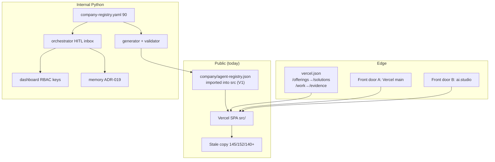

### D2 — Target architecture

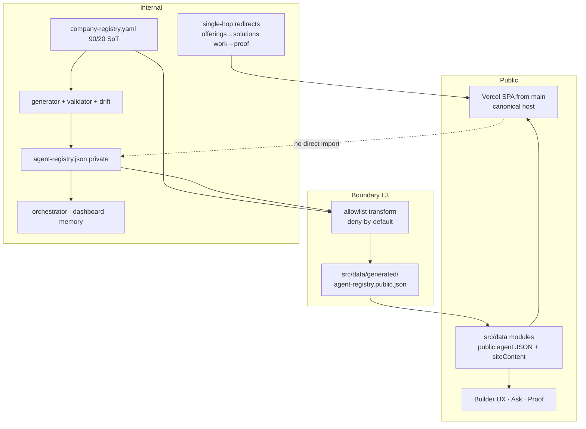

### D3 — 90-agent organization

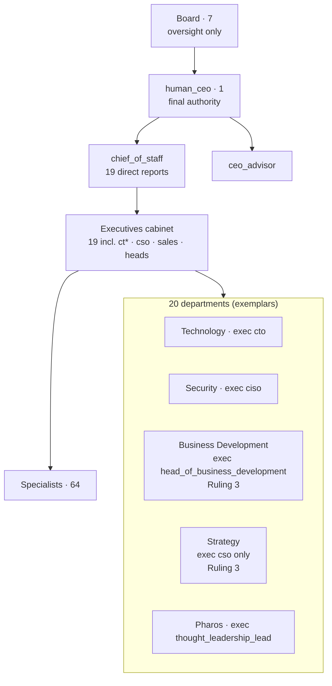

### D4 — Single-owner resolution (Ruling 3)

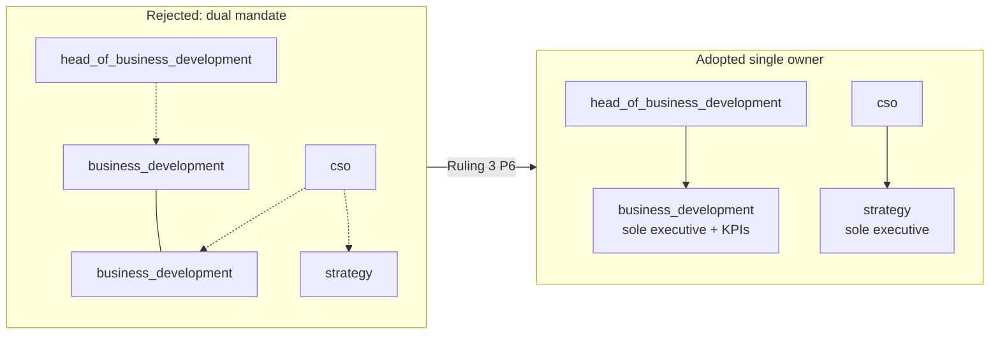

### D5 — Agent lifecycle

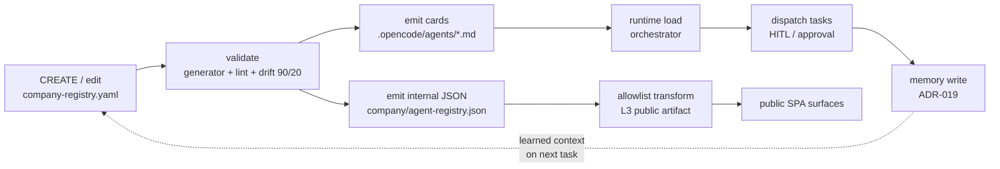

### D6 — Task dispatch (orchestration)

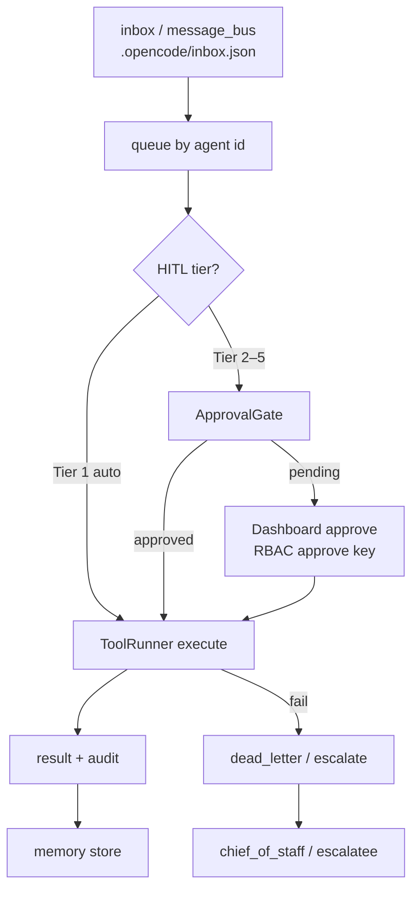

### D7 — Public / private boundary

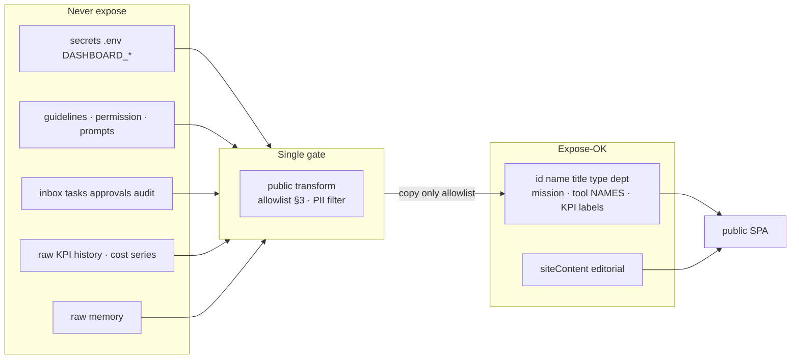

### D8 — Registry dataflow (L1→L4)

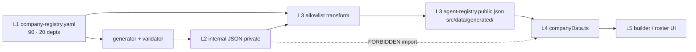

### D9 — LSOS (LightSpeed Operating System) layers

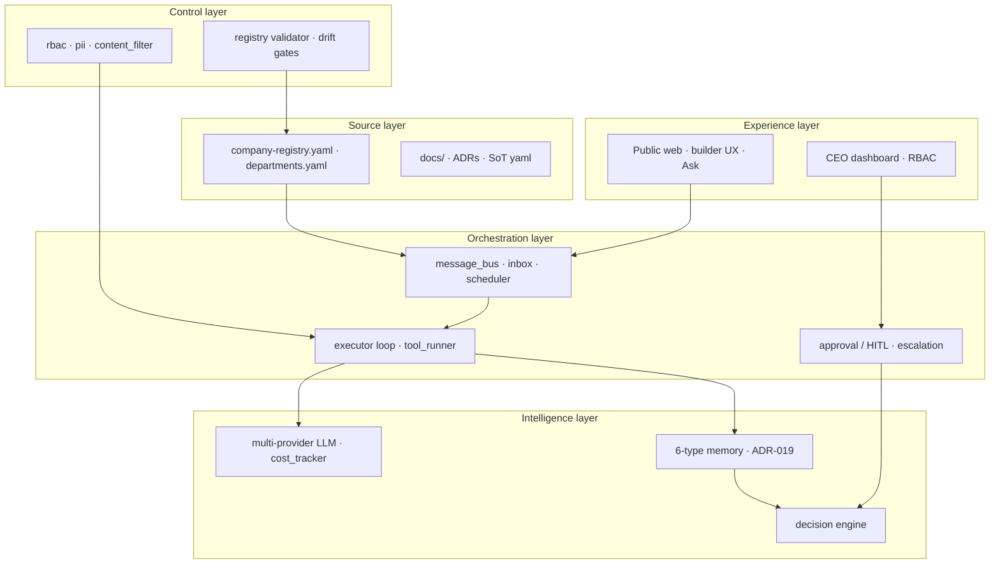

### D10 — Builder UX (five modes)

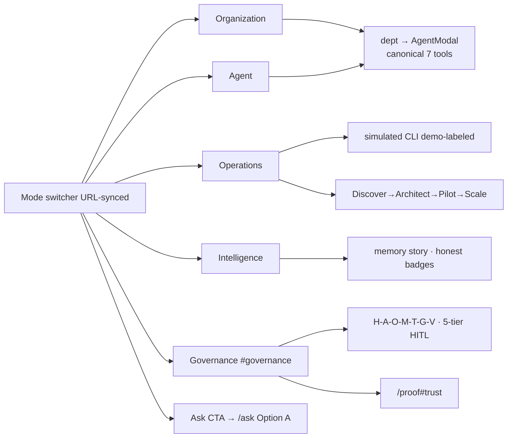

### D11 — Web IA (target tree + single-hop)

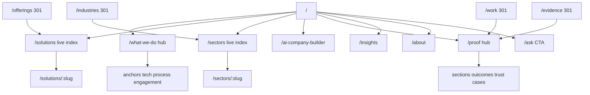

### D12 — Migration phases (P0–P7 depends-on)

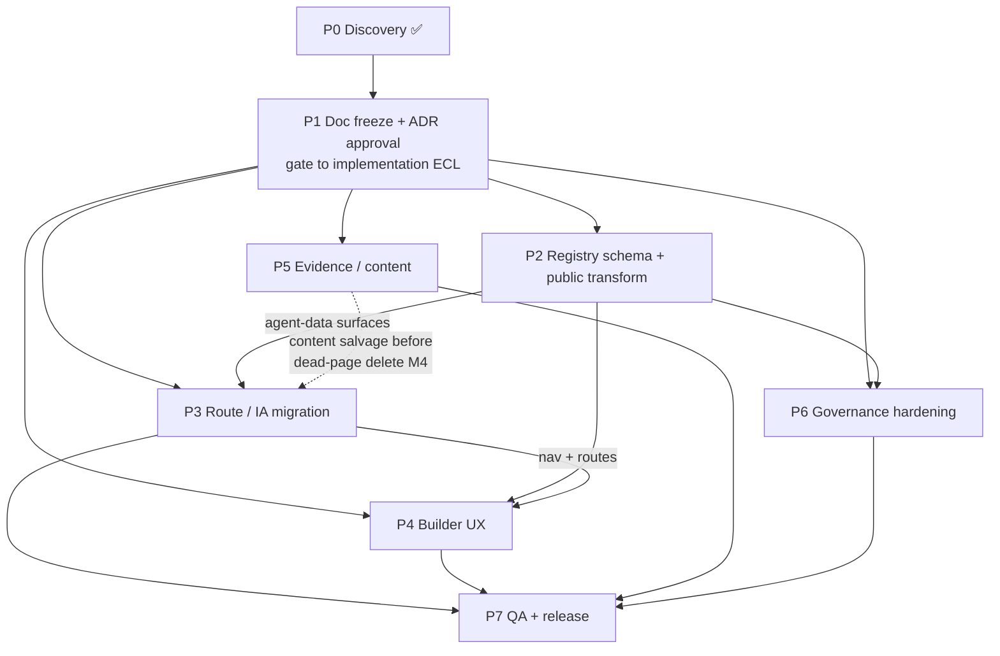

**Index:** D1 current · D2 target · D3 org · D4 single-owner · D5 lifecycle · D6 dispatch · D7 boundary · D8 registry dataflow · D9 LSOS · D10 builder UX · D11 web IA · D12 migration.

---

## 6. AI Workforce Consolidation (152→90 → steady state)

| Item | Value | Source |
|------|-------|--------|
| Pre-trim | 152 IDs | `ref/agents_152.txt` |
| Post-trim (live) | **90 IDs** | `ref/agents_90.txt`, `source-of-truth.yaml` |
| Removed | 62 = 49 MERGE + 10 REASSIGN + 2 REDEFINE + 1 RETIRE | [`AGENT_CONSOLIDATION_152_TO_90.md`](AGENT_CONSOLIDATION_152_TO_90.md) |
| Added | 0 | same |
| Commit | `e2bdb0c7` | same |
| Departments | 20 before and after | `company/departments.yaml` |

**Ruling 6:** public and internal docs cite **only 90 / 20** as current; pre-trim figures are historical footnotes (never live badges). Ownership schema gaps (7 MANDATORY §9 fields missing 0/90) are designed here and backfilled only in follow-up P2 — see [`AI_WORKFORCE_90.md`](AI_WORKFORCE_90.md).

---

## 7. Workstreams (brief §33)

| # | Workstream | Primary ownership in v2 | Key artifacts |
|---|------------|-------------------------|---------------|
| 1 | Architecture Lead | Synthesis, rulings, P1 freeze approval | This doc · ADRs 025+ |
| 2 | AI Workforce | Org model, ownership fields, V1 org rewiring | AI_WORKFORCE_90 · AGENT_CONSOLIDATION |
| 3 | Orchestration | Dispatch, HITL tiers, inbox/approval encoding | D5–D6 · roadmap P6 |
| 4 | Governance | Boundary policy, decision rights, ADRs | PUBLIC_INTERNAL_BOUNDARY · P6 |
| 5 | Web Experience | Nav, IA labels, homepage sections, builder modes | WEB_IA_V2 · AI_COMPANY_BUILDER_UX |
| 6 | Content | Proof consolidation, stale-count sweep, honesty copy | EVIDENCE_ARCHITECTURE · P5 |
| 7 | Frontend | `vercel.json`, `App.tsx` redirects, dead imports | ROUTE_MIGRATION_V2 · P3 |
| 8 | Data | Allowlist schema, transform, SoT drift | PUBLIC_AGENT_REGISTRY_SCHEMA · P2 |
| 9 | QA | Redirect matrix, schema tests, a11y, lint/drift | Roadmap P7 · DoD §6 |

---

## 8. Consolidation Table (route disposition → proof / hubs)

Full 32-row table lives in [`WEB_INFORMATION_ARCHITECTURE_V2.md`](WEB_INFORMATION_ARCHITECTURE_V2.md) §4. Synthesis:

| Action | Count | Canonical outcome |
|--------|------:|-------------------|
| Keep | 15 | First-class v2 paths unchanged |
| Merge | 12 | Content absorbed into `/what-we-do`, `/proof`, `/about` sections |
| Redirect | 4 | Single-hop 301/SPA to hub or rename target |
| Retire | 0 | — |
| Create | 3 | `/solutions`, `/sectors`, `/sectors/:slug` |
| Catch-all | 1 | `*` → `/` |

**Proof consolidation:** `/work`, `/evidence`, `/outcomes`, `/trust` → `/proof` (+ anchors). Content salvage map: [`EVIDENCE_ARCHITECTURE.md`](EVIDENCE_ARCHITECTURE.md). Dead-file deletion gated on P5 (roadmap R-10).

---

## 9. Governance & Public/Internal Boundary

- **Policy:** deny by default; exposure only via EXPOSE-OK allowlist; NEVER-EXPOSE includes secrets, `guidelines`, permissions, inbox/tasks, raw KPIs/costs, raw memory (boundary §2–§3).
- **Ruling 2:** normative public sink = **`src/data/generated/agent-registry.public.json`** (static Vite module import, CI schema gate pre-bundle). Boundary doc’s illustrative `public/agent-registry.json` path is **non-normative** (optional raw-URL mirror only).
- **HITL / tiers:** five-tier approval matrix declarative per agent; ApprovalGate EXPIRED terminal state (AGENTS.md §9.1); dashboard keys never public (R-02).
- **Span watch:** `chief_of_staff` 19 reports instrumented at P6 (roadmap R-05).
- **V9/V10 decision rights** encoded in `decision_rights` at P2 backfill (qa_lead policy vs test_engineering_lead automation; intake routing rule).

Control mechanics are diagrammed in **D7** (boundary) and **D6** (HITL dispatch); no additional D-series diagram is defined here.

---

## 10. Web Information Architecture & Route Rulings

**Ruling 1 (normative route model):**

1. **Hub:** `/what-we-do` is the capabilities hub; **live child indexes** `/solutions` and `/sectors` (not SPA-redirects to the hub).
2. **Edge single-hop:** `/offerings` → **`/solutions`** (one 301; destination equals SPA final for that legacy name).
3. **Rename single-hop:** `/industries` → **`/sectors`**; `/industries/:slug` → `/sectors/:slug` (prefer `/sectors` as canonical name; if rename rejected, keep `/industries` as the sector index name only — default is `/sectors`).
4. **Details retained:** `/solutions/:slug`, `/sectors/:slug`.
5. **Proof family:** `/work` → `/proof`, `/evidence` → `/proof` — **single hop** each; edge destination = SPA final.
6. **Ruling 4 (canonical host):** **Vercel SPA from `main`** is the sole production origin; `lightspeedholdings.ai.studio` must **redirect or re-scope** (roadmap R-03; verify at P7).

Nav target tree: HOME · WHAT WE DO · SOLUTIONS · SECTORS · AI COMPANY BUILDER · PROOF · INSIGHTS · ABOUT · Ask CTA. Implementation plan: [`ROUTE_MIGRATION_V2.md`](ROUTE_MIGRATION_V2.md) M1–M8. Diagram **D11**.

---

## 11. Evidence Architecture

- **Canonical URL:** `/proof` only; honesty ladder + platform metrics single-sourced (fix dual `PLATFORM_METRICS` copies — EVIDENCE §1.3).
- **Salvage order:** Trust/Outcomes/Work/Evidence prose → Proof sections **before** deleting dead page files (P5 gates P3 M4).
- **Claims:** ADR-020 honesty badges; no unqualified metrics; historical 145/152 lines footnoted, not rewritten as current.
- **Cross-links:** IA §4 merge rows; Content owns P5 sweep; QA grep gate for `145 agents|152 agents|140+` outside exempt history.

---

## 12. AI Company Builder UX

- **Five modes** (Organization · Agent · Operations · Intelligence · Governance): top-level URL-synced switcher; inner tabs demoted; `#governance` fragment frozen.
- **Journeys:** executive (Org→Governance→Proof→Ask) and technical (Agent→Operations→Intelligence); Ask = Option A nav CTA, rule-based, honest empty state.
- **AgentModal:** canonical 7-tool names only; keyboard-trap-safe; consumes **public** roster (post-P2).
- **Demo labeling:** simulated CLI never implies live tenant success (ADR-020).
- **Counts in UI:** 90 / 20 / 2373 / 5-tier from test-backed constants — no “140+ agents”.
- Spec: [`AI_COMPANY_BUILDER_UX.md`](AI_COMPANY_BUILDER_UX.md); diagram **D10**.

---

## 13. Implementation Roadmap Pointer

Full plan: [`V2_IMPLEMENTATION_ROADMAP.md`](V2_IMPLEMENTATION_ROADMAP.md) (P0–P7, risk register R-01–R-12, DoD §6, §37 answers).

| Phase | Goal | Depends |
|-------|------|---------|
| P0 | Discovery baseline | ✅ complete |
| P1 | **Doc freeze + ADR approval** — opens implementation ECL | This doc + 9 artifacts + ADRs + lint/drift |
| P2 | Schema backfill + public transform (**Ruling 2** sink) | P1, boundary/schema artifacts |
| P3 | Route/IA single-hop migration (**Ruling 1**) | P1, P2 for agent-data UI; P5 gates deletions |
| P4 | Builder UX five-mode ship | P1, P2, P3 |
| P5 | Proof/content + stale-count sweep | P1, EVIDENCE |
| P6 | Governance hardening (V1 **Ruling 3**, tiers, span) | P1, P2 |
| P7 | QA + canonical host cutover (**Ruling 4**) | P2–P6 |

**Brief “Phases 0–10” note:** locked set for this package is **P0–P7**; reconcile numbering only if verbatim brief enumerates otherwise at P1 (roadmap §2).

---

## 14. Risks & Open Items

| ID | Risk | Phase owner |
|----|------|-------------|
| R-01 | Double-hop redirects (live) | P3 Frontend |
| R-02 | Public leak of internal registry | P2 Data + Governance |
| R-03 | Dual frontends / stale remote README | P1 ruling + P7 |
| R-04 | Stale 145/152/140+ claims | P1 T015 + P5 Content |
| R-05 | chief_of_staff span overload | P6 |
| R-06 | 7 MANDATORY schema fields 0/90 | P2 |
| R-07 | Artifact stubs / orphan links | P1 T012 (this doc) |
| R-08 | ADR path + duplicate 020 | **Ruling 5** / T013 |
| R-09 | Slug drift / soft-404s | P3 |
| R-10 | Delete pages before salvage | P5→P3 gate |
| R-11 | Legacy tool names in public modal | P2 + P4 |
| R-12 | Scope creep into code during docs ECL | §2 constraints |

**Open at freeze:** confirm brief verbatim labels (IA/UX open Qs); phase-number reconcile if needed; schedule V1 into P6 backlog with named decider (Architecture Lead → Governance).

---

## 15. Decision Log (rulings for this package)

| # | Decision | Status |
|---|----------|--------|
| **1** | Route model: `/what-we-do` hub; live `/solutions` + `/sectors` indexes; edge `/offerings`→`/solutions` single hop; `/industries`→`/sectors` single hop (prefer `/sectors`); details `/solutions/:slug`, `/sectors/:slug`; `/work`→`/proof`, `/evidence`→`/proof` single hop | **Adopted** (§10) |
| **2** | Public registry sink = `src/data/generated/agent-registry.public.json` (static import); boundary `public/` path non-normative | **Adopted** (§4, §9) |
| **3** | `head_of_business_development` = sole executive of `business_development`; `cso` = sole executive of `strategy`; dual mandate **rejected** | **Adopted** (D4; implement P6) |
| **4** | Canonical production host = Vercel SPA from `main`; `ai.studio` redirect/re-scope | **Adopted** (§10; enforce P7) |
| **5** | New ADRs **025+** path `docs/architecture/adr/`; historical `docs/adr/` kept; duplicate 020 recorded, not silently renamed | **Adopted** (§3.5; T013) |
| **6** | Live counts only **90 agents / 20 departments**; 145/152 historical footnotes only | **Adopted** (§6) |

Supporting ADR templates (Context / Decision / Alternatives / Rationale / Consequences / Status) filed in T013 under Ruling 5 path.

---

## 16. Artifact Index

| # | Artifact | Path (relative from `docs/architecture/`) | Task | Role |
|---|----------|-------------------------------------------|------|------|
| — | **Primary (this doc)** | `LIGHTSPEED_AI_COMPANY_BUILDER_WEB_ARCHITECTURE_V2.md` | T012 | Synthesis + rulings + D1–D12 |
| 1 | Agent Consolidation 152→90 | [`AGENT_CONSOLIDATION_152_TO_90.md`](AGENT_CONSOLIDATION_152_TO_90.md) | T003 | Migration matrix |
| 2 | AI Workforce 90 | [`AI_WORKFORCE_90.md`](AI_WORKFORCE_90.md) | T004 | Target org + §9 schema |
| 3 | Public Internal Boundary | [`PUBLIC_INTERNAL_BOUNDARY.md`](PUBLIC_INTERNAL_BOUNDARY.md) | T005 | NEVER/EXPOSE policy |
| 4 | Web Information Architecture v2 | [`WEB_INFORMATION_ARCHITECTURE_V2.md`](WEB_INFORMATION_ARCHITECTURE_V2.md) | T006 | 32-route table, nav |
| 5 | Public Agent Registry Schema | [`PUBLIC_AGENT_REGISTRY_SCHEMA.md`](PUBLIC_AGENT_REGISTRY_SCHEMA.md) | T007 | Allowlist field map |
| 6 | Route Migration v2 | [`ROUTE_MIGRATION_V2.md`](ROUTE_MIGRATION_V2.md) | T008 | Single-hop plan M1–M8 |
| 7 | Evidence Architecture | [`EVIDENCE_ARCHITECTURE.md`](EVIDENCE_ARCHITECTURE.md) | T009 | `/proof` consolidation |
| 8 | AI Company Builder UX | [`AI_COMPANY_BUILDER_UX.md`](AI_COMPANY_BUILDER_UX.md) | T010 | Five modes, Ask, a11y |
| 9 | V2 Implementation Roadmap | [`V2_IMPLEMENTATION_ROADMAP.md`](V2_IMPLEMENTATION_ROADMAP.md) | T011 | P0–P7, risks, DoD |
| — | ADRs 025+ (planned) | `adr/` (this directory per Ruling 5) | T013 | One decision each |
| — | ADRs 001–024 (history) | [`../adr/`](../adr/) (dup 020 noted) | pre-existing | Not renumbered |
| — | Deployment comparison | `../../harness/changes/active/ref/deployment-comparison.md` | T017 | Dual host evidence |
| — | Source of truth | [`../source-of-truth.yaml`](../source-of-truth.yaml) | — | 90/20 drift root |
| — | Brief lock | `../../harness/changes/active/BRIEF_LOCK.md` | T002 | Deliverable filenames |

**Orphan check:** all nine support artifacts link here and are linked back (§16). No support file left unreferenced.

---

## 17. Appendix

### A. Validation commands (P1 gate)

```powershell
pwsh scripts/lint-ecl.ps1
pwsh scripts/validate-drift.ps1
# Mermaid: exactly 12 ```mermaid fences labeled D1–D12 in this file
# Counts: no live 145/152/140+ in new architecture docs (T015)
```

### B. Related harness / standards

- `harness/changes/active/` — spec, plan, tasks, summary, BRIEF_LOCK.
- `AGENTS.md` §8 canonical tools · §9 governance (HITL expiry, skill transmission ban).
- `docs/adr/020-client-facing-site-guiding-principles.md` — honesty / brand constraints for public surfaces.
- ADR-012/013/019/024 — RBAC, sessions, memory governance, dual-environment compatibility (referenced, not renumbered).

### C. Diagram checklist

| ID | Title | Section |
|----|-------|---------|
| D1 | Current architecture | §5 |
| D2 | Target architecture | §5 |
| D3 | 90-agent organization | §5 |
| D4 | Single-owner resolution | §5 |
| D5 | Agent lifecycle | §5 |
| D6 | Task dispatch | §5 |
| D7 | Public/private boundary | §5 |
| D8 | Registry dataflow | §5 |
| D9 | LSOS layers | §5 |
| D10 | Builder UX | §5 |
| D11 | Web IA | §5 |
| D12 | Migration P0–P7 | §5 |

### D. Document control

| Version | Date | Author | Change |
|---------|------|--------|--------|
| 0.1 | 2026-09-24 | Architecture Lead | Initial synthesis — T012 draft for review |

**Next:** T013 ADRs 025+ · T014 lint/drift · T015 count audit · T016 summary Outcome update · P1 approval → open implementation ECL.
