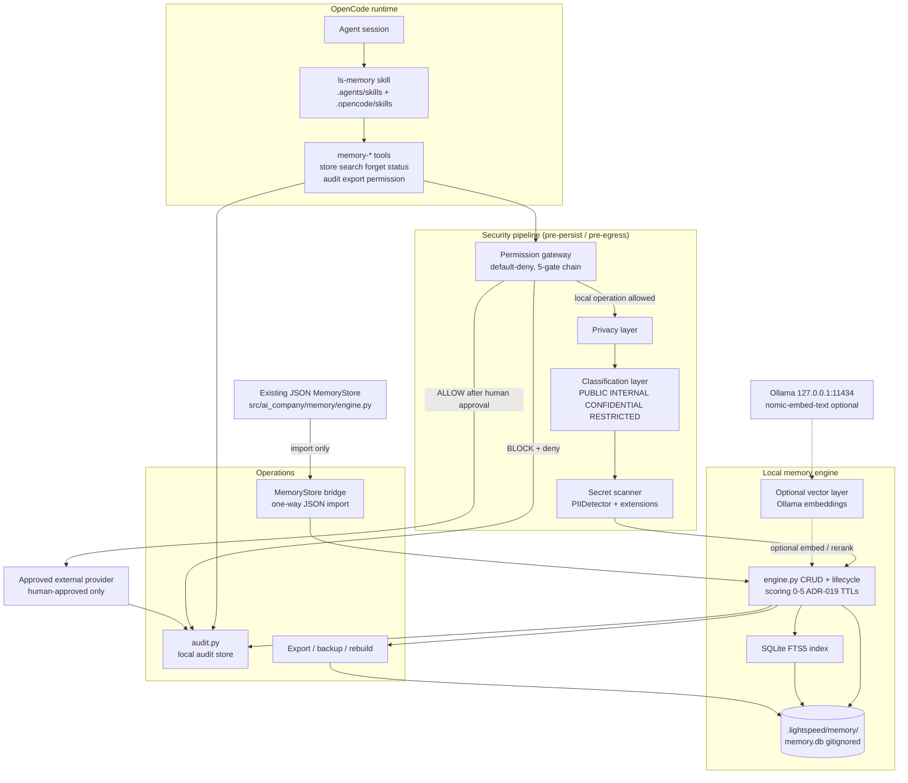

# LS-MEM Phase 2 — Architecture

**Project:** LightSpeed Holdings — LIGHTSPEED MEMORY (LS-MEM)
**Date:** 2026-09-24
**Status:** Phase 2 Architecture (Approved threat model Phase 1 — signed off 2026-09-24)
**Security classification:** Internal
**Related docs:**
- Master plan: [`docs/LS-MEM-OPENCODE-IMPLEMENTATION-HANDOFF.md`](../LS-MEM-OPENCODE-IMPLEMENTATION-HANDOFF.md) (§7, §9, §10, §12, §13, §14, §18, §19, §31, §34)
- Threat model (approved): [`docs/security/LS-MEM-THREAT-MODEL.md`](../security/LS-MEM-THREAT-MODEL.md) (T01–T28)
- Reconnaissance: [`docs/architecture/LS-MEM-RECONNAISSANCE.md`](LS-MEM-RECONNAISSANCE.md) (reusable components 1–10, conflicts C1–C9)
- Governance: [`docs/adr/019-memory-knowledge-governance.md`](../adr/019-memory-knowledge-governance.md) (TTLs, staleness, conflict→superseded, pin)
- Curation: [`docs/SKILL_CURATION_POLICY.md`](../SKILL_CURATION_POLICY.md) (discovery authority, third-party transmission ban)
- Engine coexistence: **ADR-025** (`docs/adr/025-lsmem-sqlite-engine-coexistence.md` — Accepted 2026-09-24; records the SQLite+bridge decision; this doc references it)

**Locked decisions (CEO-approved, non-negotiable):**
1. **Dual skill paths** — skill lives at BOTH `.agents/skills/ls-memory/` AND `.opencode/skills/ls-memory/`, content-identical copies (hash check in tests). Discovery authority = `.agents/skills/` (SKILL_CURATION_POLICY); `.opencode/skills/` is a parallel deploy target for OpenCode-native loading. Global dual deploy also allowed: `C:\Users\jmlus\.agents\skills\ls-memory` + project.
2. **New SQLite + FTS5 engine + one-way import bridge** FROM existing JSON `MemoryStore` — do NOT replace MemoryStore in early phases (ADR-025 records this).
3. **Offline-first** — network deny-by-default; Restricted never plaintext; when uncertain → BLOCK.
4. **Redaction token** — `[REDACTED_SECRET]` canonical; `[REDACTED]` legacy alias accepted by matcher.
5. **Ollama optional** semantic layer only after deterministic FTS works; never cloud embedding fallback.
6. **Storage path** — workspace-relative `.lightspeed/memory/` (gitignored); global skill fallback `~/.lightspeed/memory/` when no workspace.

---

## Overview

LS-MEM is a project-local, local-first persistent memory and context system for the LightSpeed AI-agent workforce — the sanctioned replacement for the retired `claude-mem-*` family (recon C8; SKILL_CURATION_POLICY retired 2026-09-23). It provides persistent memory across sessions, keyword/semantic retrieval, provenance, auditing, deletion, and session injection, with **no project information leaving the local machine by default** (handoff §1–§2).

### Goals
- Persistent local memory with deterministic FTS5 search that works fully offline (handoff §7, §31 Core/Testing).
- Pre-write secret scan + 4-tier classification so Restricted content is never persisted plaintext (handoff §9–§10; threat T01–T04).
- Default-deny permission gateway for any external transfer, with human approval and local audit (handoff §19–§22; threat T14–T18, T24).
- OpenCode skill + project-local tools for remember/search/forget/export/audit/status/permission (handoff §18).
- Session continuity: rank + inject only relevant memories under quota (handoff §15–§16).
- Coexistence with the existing JSON `MemoryStore` via a one-way import bridge (recon C1; ADR-025).

### Non-goals (Phase 2)
- Replacing `src/ai_company/memory/engine.py` `MemoryStore` (bridged, not rewritten — ADR-025).
- Vector database of any kind; cloud embeddings; external AI providers (handoff §13, §14; threat T17–T18).
- MCP integration or routing memory through MCP/LLM providers (recon C6; threat T13).
- Remote dashboard, telemetry, remote logging, auto-sync (handoff §2 principles 4, 7; threat T19–T20).
- Human approval gate on every capture (ADR-019 standing preference: automatic capture with veto+flag).
- Implementation code — this document is architecture only.

### Constraints
| Constraint | Source |
|------------|--------|
| Offline-first; network deny-by-default; works with internet completely disabled | Handoff §1, §23; threat model default posture |
| No cloud, no telemetry, no remote logging, no auto external sync | Handoff §2 (principles 3–7); T19, T20 |
| No vector DB in v1 — deterministic FTS5 first | Handoff §13; recon C3 |
| No external providers before local system + security controls work | Handoff §34 (order: local → security → intelligence) |
| Zero new runtime deps for core — stdlib `sqlite3`, `json`, `hashlib`, `re` | Threat T10; recon §6.6, §7 |
| Restricted never plaintext; ambiguity → BLOCK | Handoff §9; threat model default posture |
| No global OpenCode config changes without explicit approval | Handoff §18; Rule 3 |
| Memory DB never committed to Git | Handoff §26; Rule 5; T21–T22 (gitignore now present, `.gitignore:92`) |
| Skill transmissions third-party ban unless vendor on APPROVED-VENDORS within 90-day window | SKILL_CURATION_POLICY § Transmission Ban |

---

## Component diagram



**Invariant:** every path from Skill/Tools to the network passes through the permission gateway; every path to disk passes through privacy → classification → secret scan; every gateway decision and every CRUD mutation writes a local audit row.

---

## 1. Memory engine

Single authoritative engine for LS-MEM records: CRUD, lifecycle, scoring, governance hooks. Lives in `src/ai_company/lsmem/engine.py` (recon §5).

**Operations** (handoff §12): `remember`, `search`, `recall`, `inspect`, `forget`, `purge`, `export`, `status`, `audit`, `rebuild`. Agents call these via tools; they never speak SQL directly (handoff §12: “Agents should not need to understand the underlying database”).

**Record shape** — handoff §8 minimum fields (`id`, `type`, `title`, `content`, `source`, `project`, `created_at`, `updated_at`, `classification`, `confidence`, `tags`, `provenance`, `created_by`, `verified_by`, `approved_for_external_use`); exact schema deferred to Phase 3 (`LS-MEM-DATA-MODEL.md`).

**13 memory types** (handoff §8): `observation`, `decision`, `architecture`, `requirement`, `preference`, `task`, `milestone`, `bug`, `solution`, `lesson`, `entity`, `document`, `session`.

**Quality controls** (handoff §17): dedup, confidence, provenance, verification, contradiction detection, expiration, source tracking, timestamps. Value score 0–5 (`scoring.py`): 0–1 discard, 2→Tier 1, 3–4→Tier 2, 5→Tier 3 (recon §9). Only 3+ persist long-term (threat T08).

**Governance** — reuse `MemoryGovernance` (ADR-019, `src/ai_company/memory/governance.py`): constitutional capture veto; per-type TTLs; staleness flag at 180 days; conflict → newest wins, loser marked `superseded`, **pinned entries win** (curator `pin`/`unpin` is the tie-breaker); superseded/vetoed excluded from `recall()`/`search()`. No silent overwrite of conflicting institutional memory (handoff §17; Rule 8).

**Engine coexistence:** the existing JSON `MemoryStore` (6 types, `src/ai_company/memory/engine.py`) remains the system of record for the continuous-learning pipeline. LS-MEM is a new local engine; a **one-way import bridge** copies selected JSON records into SQLite. No write-back. Recorded by **ADR-025** (recon C1; locked decision 2).

**Retrieval is untrusted data:** all recalled memory is tagged as data, never instructions; memory must never bypass system/security policy, external-access policy, user approval, or secret protection (handoff §25; Rule 7; threats T05, T07, T09).

---

## 2. Storage

| Aspect | Decision |
|--------|----------|
| Engine | SQLite via **stdlib `sqlite3` only** (zero new deps; threat T10; recon §6.6) |
| Path (workspace) | `<workspace>/.lightspeed/memory/` — `config.yaml`, `memory.db`, `observations/`, `sessions/`, `decisions/`, `summaries/`, `audit/` (handoff §4) |
| Path (global skill, no workspace) | `~/.lightspeed/memory/` (locked decision 6; recon C9/§5) |
| Git | `.lightspeed/memory/` + `memory.db*` ignored (`.gitignore:92–96`; C4 **resolved** — added Phase 2). LS-MEM never `git add`/`commit`/`push`es memory (Rule 5; T21–T22) |
| Concurrency | WAL mode; atomic transactions (threat T27) |
| Integrity | `PRAGMA integrity_check` on open; schema version column for migration (threat T27; handoff §27) |
| At-rest encryption | Optional: reuse `security/memory_encryption.py` + `encryption_key_manager.py` if master secret present (recon component 7) |
| SQL safety | Parameter binding only; no new bandit B608 suppressions (recon §6.7) |

Data-dir resolution rule (recon C9/§5): when the global skill is opened inside a project workspace, it uses `<workspace>/.lightspeed/memory/`; otherwise `~/.lightspeed/memory/`. Memory DBs are never shared across machines.

---

## 3. FTS5 search

Primary retrieval — deterministic, local, offline (handoff §13; locked decision 5: FTS before any vector work).

- SQLite FTS5 virtual table over memory content + title, joined to structured metadata (timestamps, tags, classification, provenance) (handoff §13).
- Create/search patterns copied from proven implementations: `src/ai_company/data/database.py`, `src/ai_company/audit_store.py`, `src/ai_company/data/search.py` — including fallback-to-LIKE when FTS index unavailable (recon component 5).
- Ranking: FTS5 `bm25` rank + value score + recency; conflict/staleness filters applied post-query (ADR-019: superseded/vetoed excluded).
- **Quota:** 5–15 results, ~1–2k tokens per injection (threat T08; handoff §15: never inject the whole database).
- `rebuild` operation rebuilds the FTS index after corruption (handoff §12; threat T27).
- Tests: `tests/memory/test_fts_search.py` (recon §9).

---

## 4. Optional vector search

Deferred and optional (handoff §13–§15; recon C3).

- **Not in Phase 2 core.** Phase order: SQLite engine → FTS5 → privacy → tools → gateway → audit → tests; Ollama semantic is implementation step 14 (handoff §34).
- When enabled: hybrid retrieval = FTS5 candidates ∪ optional vector candidates → relevance rank → dedup → concise context (handoff §15).
- Vector storage stays local inside `.lightspeed/memory/` (no cloud vector DB — handoff §2 principle 6; recon §7 avoids Pinecone/Weaviate Cloud/Chroma cloud).
- Existing `VectorStore` (`src/ai_company/memory/vector_store.py`, sentence-transformers) remains for the legacy `memory/vector_index` path; the **new LS-MEM path uses Ollama**, not sentence-transformers (recon C3, §7).
- If vector layer unavailable → FTS-only, silently degraded but functional (threat T18).

---

## 5. Ollama integration

Optional semantic layer only — strictly after deterministic FTS works (locked decision 5; handoff §14).

```
Agent → LS-MEM → SQLite/FTS5 (always)
                → Ollama (optional, local embeddings only)
```

- Endpoint: `127.0.0.1:11434` / `localhost` only — the sole permitted non-file I/O, and it is loopback (threat T14 mitigation; recon §6.6). Client via stdlib `urllib` (or existing `httpx` restricted to loopback); no other hosts.
- Model: `nomic-embed-text` (installed, 274 MB; recon §2). Locally installed models only.
- **If Ollama is unavailable: LS-MEM continues on FTS5. Never fall back to a cloud embedding provider** (handoff §14; threat T18; locked decision 5).
- Network-deny tests must show zero non-localhost sockets during embed attempts (threat T14/T16 tests).
- Tests: `tests/memory/test_ollama_optional.py` — skip if down; assert no HTTP to embedding SaaS (recon §9).

---

## 6. Privacy layer

Sits between gateway approval and persistence for every local write, and before any egress payload is formed (handoff §10, §19).

- **Network deny-by-default:** LS-MEM code paths make no external requests; no `requests`/`httpx` calls to non-allowlisted origins in engine core (threat T14–T15).
- **No telemetry / no remote logging:** no analytics deps, no OTel export from LS-MEM; stdlib logging to local files under `.lightspeed/memory/` only (threat T19–T20).
- **Pre-write security filter:** every content blob passes secret scan (§8) + classification (§7) before it becomes a persistent row (handoff §10).
- **Explicit markers** (handoff §11): `<memory>`, `<no-memory>`, `<private>`, `<external-approved>` — or OpenCode-equivalent commands. `<no-memory>`/`<private>` suppress persistence; `<external-approved>` is a prerequisite flag for egress of otherwise-blocked content.
- **Export privacy:** second redaction pass; Restricted excluded by default (threat T26; §15).
- **Reuses:** `src/ai_company/security/pii_detector.py`, `content_filter.py` (recon components 1–2).

---

## 7. Classification layer (PUBLIC / INTERNAL / CONFIDENTIAL / RESTRICTED)

Four-tier classification on every record, per handoff §9 (column `classification`):

| Class | Definition | Examples | Egress default |
|-------|-----------|----------|----------------|
| **PUBLIC** | Intended for public release | published site content, public docs, articles | blocked (allowlist still empty by default) |
| **INTERNAL** | Normal internal info | architecture, roadmaps, agent instructions | blocked |
| **CONFIDENTIAL** | Business-sensitive | client info, proposals, pricing, contracts, strategy; system prompts ≥ CONFIDENTIAL (T05) | blocked |
| **RESTRICTED** | Highly sensitive | passwords, API keys, tokens, private keys, credentials, highly sensitive PII | **never plaintext at rest; always blocked from export/egress** |

- **Rule:** Restricted information must never be persisted in plaintext (handoff §9; locked decision 3). Secret scanner forces the classification upward on hit (threat T01–T04).
- Classification gates: injection respect class + optional `agent_id` scoping (T23); export default excludes Restricted (T26); gateway `data_classes_allowed` all `false` by default (handoff §19).
- Auto-classification may err — human can override upward/downward, but never downward past a scanner hit on Restricted content (threat T06 residual).
- Policy doc: skill `policies/classification.md`.

---

## 8. Secret scanner

Mandatory pre-persist filter (handoff §10; threats T01–T04, T26).

**Detect at minimum:** API keys (`sk-…`, `AKIA…`, `ghp_…`), access tokens, passwords, JWTs, private keys (PEM), cloud credentials (AWS/GCP/Azure), OAuth tokens (`ya29.`, `Bearer`, `xoxb-`/`xoxp-`), database connection strings, `.env` secrets, GitHub tokens — scan **content**, not filenames (handoff §10).

**Implementation:** `PIIDetector` + patterns (`src/ai_company/security/pii_detector.py`, includes `PRIVATE_KEY_PATTERN`) extended in Phase 5 for JWT, `.env` assignments, connection strings, SSH PEM gaps (recon §6.3). Complement with `content_filter.py` injection/exfil phrase screen.

**Redaction:**
- Canonical token: **`[REDACTED_SECRET]`**; legacy alias `[REDACTED]` accepted by the matcher (locked decision 4; threat model §4.2).
- Default FULL mask before any disk write (threat T01).
- High-confidence hits → classify RESTRICTED → refuse persist or store only the redacted form; optional explicit human override gate (threat T01).
- Private-key PEM blocks: redact the entire block, never just the header; never export raw (T04).
- Export re-runs the scanner (T26).

**Tests:** `tests/memory/test_redaction.py` + `secret` suite — store samples → assert raw bytes absent from DB, audit shows `secret_blocked` (recon §9; threat T01 test).

---

## 9. Permission gateway (default-deny)

Core component (handoff §19). **Any** request that could leave the machine — including Ollama non-loopback misconfig, MCP calls, cloud AI, embedding SaaS, telemetry — routes here.

**Default config semantics** (schema may differ; semantics must not):

```yaml
external_access:
  enabled: false
approved_providers: []
approved_domains: []
approved_operations: []
data_classes_allowed:
  public: false
  internal: false
  confidential: false
  restricted: false
```

**Five-gate chain** (handoff §19; threat T24):
`enabled? → provider approved? → domain approved? → operation approved? → classification permitted? → [human approval with payload preview] → transmit → audit`. Any NO → **BLOCK** + audit denial. **When uncertain → BLOCK** (locked decision 3; Rule 9).

- Human approval interface shows agent, provider, operation, destination, classification, payload preview, reason, status BLOCKED, Approve? (handoff §20). User must inspect payload before approving.
- LS-MEM tools **never call MCP**; memory content is not passed to MCP/LLM tools without gateway + human approval (recon C6; threat T13).
- Implementation: `src/ai_company/lsmem/gateway.py`.
- Tests: `tests/memory/test_permission_gateway.py` — default deny; allowlist triple-check; ambiguous→BLOCK (recon §9).

---

## 10. Audit subsystem

Local-only, hash-preferring audit trail (handoff §21–§22; threat model cross-cutting control).

**Audited events:** memory creation, modification, deletion; searches where appropriate; permission requests/grants/denials; blocked external requests; approved external transfers; plus provider, destination, data classification, timestamp, actor (handoff §22).

**External transfer record minimum** (handoff §21): `request_id`, `agent`, `provider`, `operation`, `destination`, `data_classification`, `payload_hash` (sha256), `approved_by`, `approved_at`, `result_stored_locally`. Prefer hashes/metadata — do not store sensitive payloads in audit logs.

**Implementation:** `src/ai_company/lsmem/audit.py` appending to the existing local audit store (`src/ai_company/security`/`data/audit_store.py` patterns — recon component 8), FTS over audit events already proven. Logs remain local by default; no remote handlers (threat T20).

**Independence:** security auditor ≠ implementing agent for control approval (handoff §29; threat model §4.3).

---

## 11. OpenCode integration (skill + tools)

**Dual skill paths (locked decision 1):**

| Path | Role |
|------|------|
| `.agents/skills/ls-memory/` | **Discovery authority** — OpenCode scans `.agents/skills/` at session start (SKILL_CURATION_POLICY “Skill Discovery Mechanism”) |
| `.opencode/skills/ls-memory/` | Parallel deploy target for OpenCode-native loading (handoff §18 layout) |
| `C:\Users\jmlus\.agents\skills\ls-memory` | Global user-scope copy (optional global dual deploy) |

Copies are **content-identical** — hash check in tests (threat model §4.4; recon §9 dual-path verify). Divergence = test failure (failure mode FM4).

**Skill package** (both paths): `SKILL.md`, `README.md`, `policies/{privacy,classification,external-access,retention}.md`, `schemas/memory.schema.json`, `scripts/` (CLI entrypoints), `tests/` (or repo `tests/memory/`).

**SKILL.md must cover** (handoff §18): when to remember / not remember; search; recall; citation; sensitive data handling; forget; requesting external access; reporting blocked external access; conflicting memories; explicit anti-patterns for poisoned-memory instructions (threat T09).

**Tools** (project-local, handoff §18): `memory-store`, `memory-search`, `memory-forget`, `memory-status`, `memory-audit`, `memory-export`, `memory-permission` — thin wrappers over `lsmem/cli.py` using existing tool conventions. **No global OpenCode config modification** (Rule 3).

**Curation:** `ls-memory` runs the full SKILL_CURATION_POLICY vetting checklist (identity/format/license/security/dependency) + third-party transmission scan. Zero outbound hosts in skill scripts (local-only tier).

**C7 distinction:** `tree-ring-memory` = lifecycle practice-notes skill (how agents keep notes); `ls-memory` = storage engine + OpenCode skill tools (where memories persist, searchable, governed). Semantic collision documented, both retained per curation collision rule.

---

## 12. Session initialization

Handoff §16 sequence at session start:

1. Identify repository/project.
2. Identify current branch where useful.
3. Identify current task.
4. Search relevant memory (FTS5, quota-bounded).
5. Rank results (bm25 + value score + recency; exclude superseded/vetoed — ADR-019).
6. Generate concise context.
7. Inject only relevant context (§13).

Integration point: optional hook in the executor recall path **only after quota caps exist** (recon §5: `executor/loop.py` already has best-effort pre-exec recall). Initialization must stay lightweight and must fail open to “no injection” on any engine error (§17) — never block the session.

---

## 13. Memory injection

Context injection is bounded and distrustful (handoff §15–§16; threats T05, T08, T09, T23).

- **Quota:** 5–15 memories, ~1–2k tokens per injection. Never inject the entire database.
- **Structure:** header (`LIGHTSPEED MEMORY CONTEXT` — project, current task) → relevant decisions → recent unresolved issues → relevant architecture (handoff §16 example).
- **Classification-aware:** confidential/restricted rows not injected into unscoped/low-privilege queries (T23); redaction on untrusted boundaries.
- **Untrusted marker:** every injected block tagged as data-not-instructions; poisoned “ignore previous instructions” style content must not auto-override current user/system/security directives (Rule 7; T05/T09 tests).
- **Flood resistance:** value-score + quota keep high-score canonical set on top even under junk flooding (T08 test).
- Output assembled by `scoring.py` ranker; injection performed by session-init path (§12), not by raw `recall()` dumping.

---

## 14. Deletion (forget / purge)

Two-tier deletion (handoff §12; threat T28).

| Operation | Semantics | Guardrails |
|-----------|-----------|------------|
| `forget` | **Soft-delete** — row marked deleted, excluded from recall/search | Audited (actor, id, timestamp); reversible within retention window |
| `purge` | **Hard-delete** — row + FTS entry physically removed | Requires explicit elevated confirmation; audit records actor; Tier 3 (human-verified) harder to delete — extra confirm; optional backup snapshot before purge (T28) |

- Unauthorized deletion denied + audited (T28 test: purge without confirm → denied).
- TTL-driven expiry (`EXPIRED`/`ARCHIVED` per ADR-019) is separate from operator `forget`/`purge` — expiry respects pins (pinned exempt from age pruning).
- Complete wipe procedure documented in `docs/LS-MEM-USER-GUIDE.md` (handoff §27) — “how can the user completely delete LS-MEM” is a Phase 5 verification question (§33 Q20).
- Root user can still delete files at OS level — residual accepted (T28 residual).

---

## 15. Export

Handoff §12 `export`; threats T06, T26.

- **Re-run secret scanner on export** — second redaction pass mandatory (T26).
- **Default scope excludes RESTRICTED** rows; including them requires explicit flag + human confirmation of scope (T26; T06).
- `approved_for_external_use` defaults `false`; confidential docs need that flag or `<external-approved>` marker before appearing in an egress-shaped export (T06).
- Export is a **local file write** — never auto-uploaded; any subsequent send goes through the gateway (§9).
- Audit: export event with scope + row count + payload hash; hashes preferred over content in audit (handoff §21).
- Format: JSON per `schemas/memory.schema.json`, schema-versioned for migration (handoff §8, §27).
- Tests: `secret` + export e2e — no plaintext secrets in file; Restricted absent by default (T26 test).

---

## 16. Backup / recovery

Handoff §27 operations — all local, all offline:

| Operation | Mechanism |
|-----------|-----------|
| Back up | Copy `.lightspeed/memory/memory.db` (+ WAL/SHM after checkpoint) to user-chosen local destination; or `backup` CLI |
| Restore | Replace db file + `PRAGMA integrity_check` on open |
| Export | §15 (logical backup) |
| Migrate schema | Schema version gate on open; forward migrations only, documented |
| Rebuild indexes | `rebuild` — recreates FTS5 index (threat T27) |
| Recover corruption | integrity_check fail → restore from backup → else rebuild from export/JSON bridge source |
| Complete delete | Remove `.lightspeed/memory/` per user guide; also remove global `~/.lightspeed/memory/` if used |

Existing disaster-recovery convention: `scripts/backup.ps1` pattern for `.opencode/`, `company/`, `results/` — extend user guide with LS-MEM section rather than new tooling in Phase 2. Operational instructions live in `docs/LS-MEM-USER-GUIDE.md` (handoff §27).

---

## 17. Failure behavior

Design rule: **fail closed on security, fail open on availability** — never leak, never block the agent session.

| Failure mode | ID | Detection | Behavior | Audit |
|--------------|----|-----------|----------|-------|
| SQLite DB corrupt / partial write | FM1 | `PRAGMA integrity_check` on open; WAL recovery | Refuse writes; serve read-only if recoverable; else prompt restore from backup; `rebuild` for FTS-only damage (T27) | `db_integrity_fail` |
| Ollama down / unreachable | FM2 | Loopback connect timeout | **Degrade to FTS5-only**; never cloud embedding fallback; session continues (T18) | `embed_unavailable` (info) |
| Disk full / write error | FM3 | `sqlite3.OperationalError` | Transaction rolled back (atomicity); remember returns explicit failure to caller; no partial row | `write_failed` |
| Dual-path skill hash mismatch | FM4 | Test hash check of `.agents/skills/ls-memory` vs `.opencode/skills/ls-memory` | CI/test failure — deploy blocked until copies re-synced; runtime uses discovery-authority copy (`.agents`) | test report |
| Gateway deny (or ambiguity) | FM5 | Gate chain NO or uncertain | **BLOCK**; return denial to caller with reason; human-approval prompt if eligible; never transmit (§9) | `gateway_denied` |
| Secret detected pre-persist | FM6 | Scanner hit | Redact to `[REDACTED_SECRET]` or refuse store; classify RESTRICTED; never plaintext on disk (§8) | `secret_blocked` |
| FTS index unavailable | FM7 | FTS query error | Fallback to LIKE/substring search (proven pattern, recon component 5) | `fts_fallback` |
| Session-init injection error | FM8 | Exception in §12 path | Skip injection entirely; session proceeds without memory context (fail-open availability) | `inject_skipped` |

---

## 18. Offline behavior

**Full operation with network disabled** is a Phase 5 acceptance test (handoff §30 offline test; §31 Testing) and a hard architectural requirement (§7: “must work when internet connectivity is completely disabled”).

With network disabled, LS-MEM can: create, store, search, retrieve, delete, audit, export, and rebuild indexes (handoff §30). Specifically:

- **Engine + FTS5:** pure local disk — unaffected.
- **Secret scan / classification / privacy:** pure local compute — unaffected.
- **Gateway:** already default-deny; offline simply means nothing to allow — all egress paths BLOCK by config anyway.
- **Ollama (optional):** if the local Ollama daemon is running on loopback, embeddings work with zero internet; if not, FM2 degrades to FTS5. Either way no cloud fallback.
- **Bridge import:** reads local JSON files — unaffected.
- **Audit/export/backup:** local filesystem — unaffected.
- **DNS/HTTP:** no `getaddrinfo` for non-allowlisted names during full CRUD (threat T16 test); no package update checks from LS-MEM paths.
- **Skills/tools:** no outbound hosts in `scripts/` (curation transmission scan).

Offline suite lives at `tests/memory/` with network mocked/denied (recon §9 e2e offline).

---

## Data flows

### remember (store)
```
Agent → memory-store tool → gateway (local op: allowed) →
privacy markers (<no-memory>/<private>? abort) →
classification assign → secret scanner (hit? redact [REDACTED_SECRET] / refuse) →
value score 0–5 (0–1 discard) → ADR-019 constitutional veto →
engine INSERT (transaction) + FTS5 index update → audit row (create)
```

### search
```
Agent → memory-search tool → engine.query →
FTS5 bm25 (+ LIKE fallback) → filter superseded/vetoed/expired (ADR-019) →
[optional Ollama vector rerank] → value/recency rank →
quota 5–15 / ~1–2k tokens → results to agent (tagged untrusted data) →
audit row (search, where appropriate)
```

### forget
```
Agent → memory-forget tool → gateway (local) →
soft-delete mark (forget) | elevated confirm (purge) →
FTS entry remove (purge) / hide (forget) → audit row (delete, actor)
```

### export
```
Agent/operator → memory-export tool → gateway (local file write) →
scope select (exclude RESTRICTED by default) → secret scanner re-pass →
human confirm scope if restricted/over-broad → write local JSON →
audit row (export, scope, payload hash) → no upload
```

### session-inject
```
Session init → identify project/branch/task →
engine search (FTS5, ranked) → classification + quota filter →
build concise context (decisions / unresolved / architecture) →
inject with untrusted-data marker → audit row (inject) →
on any error: skip injection, session continues (FM8)
```

---

## Integration with existing reusable components

| # | Component | Path | LS-MEM use |
|---|-----------|------|------------|
| 1 | `PIIDetector` + API/private key patterns | `src/ai_company/security/pii_detector.py` | §8 secret scanner core; extend JWT/.env/conn-string |
| 2 | `content_filter` | `src/ai_company/security/content_filter.py` | §6/§8 prompt-injection + exfil phrase screen |
| 3 | `MemoryGovernance` (ADR-019) | `src/ai_company/memory/governance.py` | §1 TTLs, staleness, conflict→superseded, pin, constitutional veto |
| 4 | FTS5 patterns | `src/ai_company/data/database.py`, `audit_store.py`, `search.py` | §3 create/search/LIKE-fallback |
| 5 | `audit_store` | `src/ai_company/.../audit_store.py` | §10 local audit persistence + FTS over audit |
| 6 | AES memory encryption | `src/ai_company/security/memory_encryption.py`, `encryption_key_manager.py` | §2 optional at-rest encryption of `memory.db` |
| 7 | Consolidation | `src/ai_company/memory/consolidation.py` (`ConsolidationScheduler`, `consolidate_all`, `prune`) | §1 dedup/digest/prune lifecycle hooks |
| 8 | `VectorStore` (legacy) | `src/ai_company/memory/vector_store.py` | §4 remains for legacy `memory/vector_index`; new path uses Ollama |
| 9 | CLI conventions | `src/ai_company/cli/` (Typer) | §11 `lsmem/cli.py` → `ai-company memory …` + `scripts/` wrappers |
| 10 | Quality gates | pytest, ruff, mypy, bandit (`pyproject.toml`, pre-commit) | all LS-MEM tests inherit |

---

## Conflict resolutions

| # | Conflict | Resolution |
|---|----------|------------|
| **C1** | Two memory systems: JSON `MemoryStore` (6 types) vs SQLite LS-MEM (13 types) | **Coexistence via one-way import bridge** FROM JSON MemoryStore INTO SQLite. Do not replace MemoryStore in Phases 2–4. **ADR-025** records the decision (locked decision 2; recon C1). |
| **C2** | Skill path `.opencode/skills` (handoff §18) vs `.agents/skills` (curation policy) | **Dual paths locked.** Authority for discovery = `.agents/skills/` (SKILL_CURATION_POLICY verified mechanism). `.opencode/skills/` = parallel deploy target, content-identical (hash test). Global copy `C:\Users\jmlus\.agents\skills\ls-memory` also allowed. |
| **C3** | sentence-transformers vs required Ollama embeddings | **FTS5 primary; Ollama optional** tier-2 rerank/embed only; never cloud fallback. Legacy `VectorStore`/sentence-transformers untouched for old path (recon C3; locked decision 5). |
| **C4** | `.gitignore` lacked `.lightspeed/memory/` | **Resolved** — rules added (`.gitignore:92–96`). Regression-guarded by `tests/memory/test_git_safety.py`. |
| **C6** | Remote Resend MCP + remote model providers in `opencode.json` | LS-MEM tools **never call MCP**; no memory routing through MCP/LLM providers without gateway + human approval (recon C6; threat T13). |
| **C7** | `tree-ring-memory` already in `.agents/skills/` | **Distinct roles documented:** tree-ring-memory = lifecycle practice-notes skill; ls-memory = storage engine + OpenCode skill tools. Both retained (curation collision rule: semantic overlap OK if descriptions distinct; exact match = reject — names differ). |
| **C9** | Global skill root outside repo | Workspace-relative DB `.lightspeed/memory/` is the default; global skill falls back to `~/.lightspeed/memory/` only when no workspace. Dual skill deploy → dual verification; DBs never shared across machines (recon C9/§5; locked decision 6). |

*(C5 dirty-tree and C8 claude-mem retirement are process/info conflicts already handled — no architecture change.)*

---

## Proposed package layout

```text
src/ai_company/lsmem/          # shared Python package (reuses governance/pii/audit)
  __init__.py
  engine.py                    # SQLite + FTS5 CRUD, lifecycle, rebuild
  scoring.py                   # value score 0–5, tier routing, injection quota rank
  redaction.py                 # secret scanner glue → [REDACTED_SECRET]
  gateway.py                   # permission gateway, default-deny, 5-gate chain
  audit.py                     # local audit append (hash-preferring)
  cli.py                       # typer: wired into ai-company + thin wrappers

.agents/skills/ls-memory/       # DISCOVERY AUTHORITY (dual path 1)
  SKILL.md
  README.md
  policies/{privacy,classification,external-access,retention}.md
  schemas/memory.schema.json
  scripts/                     # memory-store/search/forget/status/audit/export/permission

.opencode/skills/ls-memory/     # PARALLEL DEPLOY TARGET (dual path 2, hash-identical)

C:\Users\jmlus\.agents\skills\ls-memory/   # optional global copy (hash-identical)

.lightspeed/memory/            # gitignored data dir
  config.yaml
  memory.db                    # + -wal/-shm
  audit/

tests/memory/                  # unit + integration + offline + git-safety + dual-path hash
docs/architecture/LS-MEM-{ARCHITECTURE,DATA-MODEL,RECONNAISSANCE}.md
docs/security/LS-MEM-{THREAT-MODEL,SECURITY-VERIFICATION,EXTERNAL-ACCESS}.md
```

---

## Security controls mapping (threat model → architecture subsystem)

| Threat-model control / threat | Architecture section |
|-------------------------------|----------------------|
| Secret scanner / redaction (T01–T04, T26) | §8 secret scanner + §6 privacy |
| Classification PUBLIC→RESTRICTED (T06, T23, T25) | §7 classification layer |
| Permission gateway default-deny (T14–T18, T24) | §9 permission gateway |
| Audit local, hash-preferring (all egress + CRUD) | §10 audit subsystem |
| Value score + lifecycle (T08, T25) | §1 memory engine + §3 FTS5 quota |
| Untrusted-retrieval rule (T05, T07, T09) | §11 SKILL.md + §13 injection |
| Git ignore + no-auto-git (T21, T22) | §2 storage + `.gitignore:92–96` |
| Dependency minimalism stdlib sqlite3 (T10, T11) | §2 storage + Constraints |
| Local-only embeddings, no cloud fallback (T18) | §4 vector + §5 Ollama |
| Bridge import-only, no silent egress (dual-engine) | §1 memory engine (ADR-025) |
| Network deny HTTP/HTTPS/DNS (T14–T16) | §6 privacy + §18 offline |
| No MCP routing (T13) | §9 gateway + C6 |
| Export redaction + Restricted exclusion (T26) | §15 export |
| Deletion authority (T28) | §14 forget/purge |
| Corruption resilience (T27) | §16 backup/recovery + §17 FM1 |
| Retention TTLs (T25) | §1 (ADR-019) + policies/retention.md |
| Dual-path hash identity (threat model §4.4) | §11 + FM4 |

---

## Failure modes

See §17 table (FM1–FM8): DB corrupt, Ollama down, disk full, dual-path hash mismatch, gateway deny, secret detected, FTS unavailable, injection error. Summary of the five required:

| Mode | Primary section | Outcome |
|------|-----------------|---------|
| DB corrupt | §17 FM1, §16 | integrity_check → refuse writes → restore/rebuild |
| Ollama down | §17 FM2, §5 | FTS-only; **never** cloud fallback |
| Disk full | §17 FM3, §2 | atomic rollback; explicit failure; no partial row |
| Dual-path hash mismatch | §17 FM4, §11 | test/CI failure; block deploy; re-sync copies |
| Gateway deny | §17 FM5, §9 | BLOCK + audit; human-approval path if eligible |

---

## Offline behavior (summary)

See §18. Full CRUD, search, audit, export, rebuild, and optional loopback Ollama all function with the internet disabled; gateway remains default-deny; zero non-localhost sockets; zero outbound hosts in skill scripts. Verified by the Phase 5 `offline` test suite (handoff §30).

---

## Phasing note

This document is **Phase 2 (Architecture)** of the LS-MEM handoff sequence. Phase 0 recon and Phase 1 threat model (approved 2026-09-24) are complete. Implementation steps follow handoff §34 order — steps **5–20** execute after Phase 3 data model:

```
5. SQLite Memory Engine → 6. FTS5 Search → 7. Privacy + Classification →
8. Secret Detection → 9. Forget/Delete → 10. Audit → 11. OpenCode Skill →
12. OpenCode Tools → 13. Session Continuity → 14. Ollama Semantic Search →
15. Permission Gateway → 16. External Transfer Approval → 17. Security Testing →
18. Documentation → 19. Independent Security Audit → 20. Human Approval
```

(Steps 1–4 = Recon, Threat Model, Architecture [this doc], Data Model.) No external-provider integration before local system + security controls work (handoff §34 final rule).

---

## Traceability matrix — handoff §7 (18 bullets) → this document

| # | Handoff §7 requirement | Section |
|---|------------------------|---------|
| 1 | memory engine | **§1 Memory engine** |
| 2 | storage | **§2 Storage** |
| 3 | FTS5 search | **§3 FTS5 search** |
| 4 | optional vector search | **§4 Optional vector search** |
| 5 | Ollama integration | **§5 Ollama integration** |
| 6 | privacy layer | **§6 Privacy layer** |
| 7 | classification layer | **§7 Classification layer** |
| 8 | secret scanner | **§8 Secret scanner** |
| 9 | permission gateway | **§9 Permission gateway** |
| 10 | audit subsystem | **§10 Audit subsystem** |
| 11 | OpenCode integration | **§11 OpenCode integration** |
| 12 | session initialization | **§12 Session initialization** |
| 13 | memory injection | **§13 Memory injection** |
| 14 | deletion | **§14 Deletion (forget/purge)** |
| 15 | export | **§15 Export** |
| 16 | backup/recovery | **§16 Backup / recovery** |
| 17 | failure behavior | **§17 Failure behavior** |
| 18 | offline behavior | **§18 Offline behavior** |

All 18 §7 bullets map to an explicit section. Offline requirement from §7 (“must work when internet connectivity is completely disabled”) is enforced in §18 and Constraints.

---

**Next: Phase 3 — `docs/architecture/LS-MEM-DATA-MODEL.md`** (versioned schema for the 13 memory types and required fields per handoff §8).

**Engine coexistence** (JSON `MemoryStore` retained; one-way import bridge into the new SQLite engine) is recorded by **ADR-025** — see locked decision 2 and §1/§C1.
