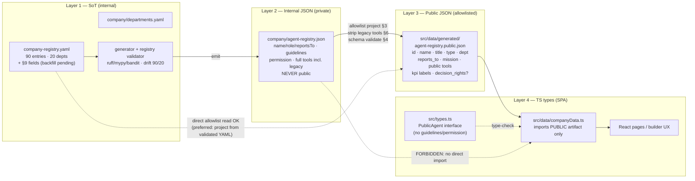
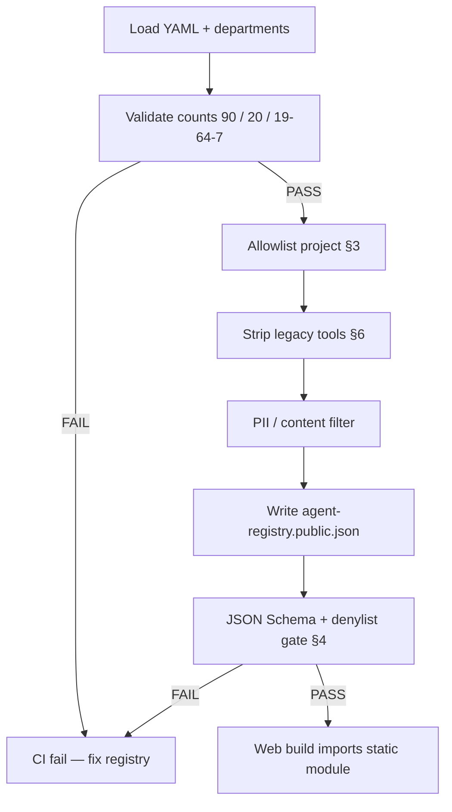

# Public Agent Registry Schema

**ECL change:** LightSpeed AI Company Builder + Web Experience Architecture v2.0
**Deliverable:** §34 support artifact 5 — `PUBLIC_AGENT_REGISTRY_SCHEMA.md`
**Workstream:** Data Architect (schema + transform ownership). Policy owner: [`PUBLIC_INTERNAL_BOUNDARY.md`](PUBLIC_INTERNAL_BOUNDARY.md) (NEVER/EXPOSE lists enforce this schema).
**Primary doc:** [`LIGHTSPEED_AI_COMPANY_BUILDER_WEB_ARCHITECTURE_V2.md`](LIGHTSPEED_AI_COMPANY_BUILDER_WEB_ARCHITECTURE_V2.md)
**Baseline:** `harness/changes/active/summary.md` (90 agents / 20 departments, verified 2026-09-24)
**Status:** Docs-only contract. No code or registry edits in this change (implementation lands in a follow-on ECL).

> Deny by default. This schema is the **allowlist projection** required by the boundary policy: any field not marked PUBLIC below never reaches the public artifact. The internal registry remains the single source of truth and keeps every field, including those this schema forbids for egress.

---

## 1. Goals

1. **Build-time public-safe projection.** Produce an immutable, schema-validated public agent registry during build/CI so the SPA bundle never imports internal registry data.
2. **Single source remains `company-registry.yaml`.** Nothing is hand-authored for the public artifact; it is regenerated on every registry change through the existing pipeline plus one new stage:

   `company-registry.yaml` → generator → `company/agent-registry.json` (internal) → **PUBLIC transform (this schema)** → public artifact → `src/data/*.ts`

3. **Deny-by-default allowlist.** Transform copies only fields listed in §3; unknown source fields are dropped silently *and* forbidden keys in the output fail CI (§5).
4. **Zero trust-boundary crossings.** No arrow from the internal operating system (orchestrator, inbox, dashboard, memory, cost tracker) into the public artifact — only the allowlist projection of the validated registry (boundary §1).
5. **Count integrity.** Public artifact must carry exactly **90 agents / 20 departments**, matching `docs/source-of-truth.yaml` drift gates.

### Recommended public path

**Recommend: `src/data/generated/agent-registry.public.json`** (generated file under `src/`, imported as a static module).

| Option | Verdict | Why |
|--------|---------|-----|
| `src/data/generated/agent-registry.public.json` | **RECOMMENDED** | Vite resolves JSON imports at build time → zero runtime fetch, no CORS, content hashed into the bundle, CI schema gate runs *before* the bundle exists. Matches §7 (static module). |
| `public/agent-registry.json` (repo `public/` dir) | Rejected as primary | Served as a static asset requiring `fetch()` at runtime: extra request, mutable after deploy, easy to bypass schema gate, Vite discourages importing from `public/` into JS. Keep only as an optional mirror if an external consumer needs a raw URL. |
| Runtime API filter | Rejected | Adds a network surface + latency; boundary §7 Q2 alternatives already discarded it. |
| Hand-curated static JSON | Rejected | Drifts from the 90/20 SoT immediately. |

Boundary doc §4/§8 illustrates `public/agent-registry.json`; this schema **recommends the `src/data/generated/` path instead** for the reasons above — same transform, same allowlist, different sink. Architecture Lead confirms at §9.

---

## 2. Three-layer schema diagram (brief §17 / §34 registry dataflow)



Rules:
- Layers 1–2 are internal-only. Layer 3 is the **only** egress artifact for agent data.
- The transform may read Layer 1 (validated YAML) or Layer 2 (internal JSON); it must never write back into either.
- Layer 4 types are a *narrowing* of Layer 3 — `src/types.ts` `Agent` must be replaced/split so `guidelines` and `permission` disappear from the public type (fixes V1/V2 typing pressure).

---

## 3. Field map (YAML → internal JSON → public TS)

**PUBLIC? = allowlist.** Anything not `ALLOW` is DENY (boundary §2 NEVER list).

| # | YAML field (`company-registry.yaml`) | Internal JSON (`company/agent-registry.json`) | Public TS type (`PublicAgent`) | PUBLIC? | Notes |
|--:|--------------------------------------|-----------------------------------------------|--------------------------------|---------|-------|
| 1 | `id` (snake_case, e.g. `chief_of_staff`) | *absent* — slug lives in `name` (`chief-of-staff`) | `id: string` | **ALLOW** | Canonical stable id. Transform emits kebab-case slug **and** keeps YAML `id` as `registry_id` if needed for joins. Resolve internal/external slug mismatch here (internal JSON has no `id`). |
| 2 | `name` | `name` (actually the slug) | `name: string` | **ALLOW** | Display name comes from YAML `name` / internal `role` — do **not** copy internal `name` verbatim (it is the slug). |
| 3 | `title` | `role` | `title: string` | **ALLOW** | Role title for UI. |
| 4 | `description` | `description` | `mission: string` | **ALLOW** | Public "mission" surface (§9 G9 naming: registry `description` ≡ dept `mission`). |
| 5 | `type` | `type` (`Executive`/`Specialist`/`Board`) | `type: 'executive'\|'specialist'\|'board'` | **ALLOW** | Normalize case to lowercase enum on the way out. `human_ceo` human flag exposed via `is_human` derived boolean only. |
| 6 | `department` | `department` | `department: string` + `department_id` | **ALLOW** | Display name + slug; must resolve against `departments.yaml` (20). |
| 7 | `reports_to` | `reportsTo` | `reports_to: string` | **ALLOW** | Parent **slug/display only** — no private path payloads. |
| 8 | `responsibilities` | `responsibilities` | `responsibilities?: string[]` | **ALLOW (curated)** | Editorial subset pass allowed; default = full list if review marks it safe. |
| 9 | `tools` | `tools` (includes legacy `write`/`execute`/`delegate`) | `tools?: PublicTool[]` | **ALLOW (names only)** | Canonical 7 only (§6). Strip/alias-remap legacy names; never emit grant flags. |
| 10 | `kpis` (**§9 gap G4, 0/90 today**; labels sourced from `company/config/kpis.yaml`) | *not present* | `kpi_labels?: string[]` | **ALLOW (labels only)** | **NEVER** current/target/history values (boundary §2 #10). Until G4 backfill, transform may join KPI *names* by department — labels only. |
| 11 | `decision_rights` (**§9 gap G3, 0/90**) | *not present* | `decision_rights?: string[]` | **ALLOW (if public-safe)** | Optional until backfill; editorial review before first emission. |
| 12 | `direct_reports` | `directReports` | `direct_reports?: string[]` | OPTIONAL / policy-gated | Boundary §3: org-sensitive; expose only on public org/leadership surfaces — default **omit** from registry artifact, derive client-side from `reports_to` if needed. |
| 13 | `guidelines` (83/90) | `guidelines` | — | **NEVER** | Private operating instructions (boundary §2 #3; violation V2). Omit entirely — not even empty string. |
| 14 | `permission` (internal-only field) | `permission: "Execute"` | — | **NEVER** | Unrestricted permission exposure (boundary §2 #5; violation V3). |
| 15 | `model_tier` (86/90) | (internal if emitted) | — | **NEVER** | Cost/tier internals (boundary §2 #8). |
| 16 | `approval_level` (**G5, 0/90**) | — | — | **NEVER** | Maps to HITL/dashboard tiers — internal governance (boundary §2 #5). |
| 17 | `escalation_path` (**G6, 0/90**) | — | — | **NEVER** | Operational escalation internals (boundary §2 #6). Public org page may show `reports_to` only. |
| 18 | `workflows` / `inputs` / `outputs` (**G7/G8, 0/90**) | — | — | **NEVER** (v1) | Pipeline wiring is internal ops; revisit only with explicit EXPOSE amendment. |
| 19 | `technical_domain` | — | `technical_domain?: string` | OPTIONAL | Low-risk label; allow after one-line review (defaults ALLOW for specialists). |
| 20 | *(none)* task/inbox fixtures | in `src/data/companyData.ts` L41+ | — | **NEVER** | `initialTasks`, `initialApprovals`, `initialEscalations`, raw KPI series, cost/model-tier, audit entries (boundary §2 #6–#10; violation V4) — must leave the public module entirely. |
| 21 | *(none)* secrets/keys | `.env`, `DASHBOARD_*`, API keys | — | **NEVER** | Boundary §2 #1–#2. Detector gate on artifact (§5). |
| 22 | counts metadata | — | `meta.counts` | **ALLOW** | `agents: 90`, `departments: 20` — derived, never hard-coded (AI_WORKFORCE §7.3). |

NEVER public, consolidated: **guidelines, permission, secrets/credentials, raw KPI values, cost/model-tier internals, task/inbox/approval/escalation payloads, escalation_path, approval_level, workflows/inputs/outputs, raw memory, audit logs, legacy tool names.**

---

## 4. Public agent object — JSON Schema + TypeScript interface

### 4.1 Envelope (required)

```json
{
  "schema_version": "1.0.0",
  "generated_at": "2026-09-24T00:00:00Z",
  "source": "company-registry.yaml",
  "meta": { "agents": 90, "departments": 20 },
  "agents": [ /* PublicAgent[] — exactly meta.agents length */ ],
  "departments": [ /* PublicDepartment[] — exactly meta.departments length */ ]
}
```

Envelope required fields: `schema_version`, `generated_at`, `source`, `meta.agents`, `meta.departments`, `agents`, `departments` → **7 required envelope keys**.

### 4.2 `PublicAgent` — required fields (7) + optional groups (5)

**Required (must be present and non-empty on all 90):**

| # | Field | Type | Validation rule |
|--:|-------|------|-----------------|
| 1 | `id` | string | `^[a-z0-9]+(-[a-z0-9]+)*$` (kebab), unique across 90 |
| 2 | `name` | string | non-empty display name |
| 3 | `title` | string | non-empty (fallback = `name`) |
| 4 | `type` | enum | `executive \| specialist \| board` |
| 5 | `department` | string | non-empty; `department_id` ∈ departments.yaml set (20) |
| 6 | `reports_to` | string \| null | resolvable id, or null only for `board_chair` |
| 7 | `mission` | string | non-empty (from `description`) |

**Optional (allowlisted; omit key entirely when absent — never emit empty secrets-shaped defaults):**

| # | Field | Type | Rule |
|--:|-------|------|------|
| 8 | `tools` | `PublicTool[]` | ⊆ canonical 7; unique; see §6 |
| 9 | `kpi_labels` | `string[]` | labels only; no numbers |
| 10 | `decision_rights` | `string[]` | only after §9 G3 backfill + editorial OK |
| 11 | `responsibilities` | `string[]` | curated subset OK |
| 12 | `technical_domain` | `string` | optional label |

**Forbidden keys (schema `additionalProperties: false` + denylist scan):** `guidelines`, `permission`, `model_tier`, `approval_level`, `escalation_path`, `workflows`, `inputs`, `outputs`, `initialTasks`, `initialApprovals`, `initialEscalations`, any `*_key`, `secret`, `token`, `cost`, `budget`, raw `kpis` objects with `current`/`target`/`history`.

### 4.3 TypeScript interface (public — replaces `Agent` for registry consumers)

```ts
export type PublicTool = 'read' | 'edit' | 'grep' | 'list' | 'bash' | 'webfetch' | 'task';
export type PublicAgentType = 'executive' | 'specialist' | 'board';

export interface PublicAgent {
  id: string;
  name: string;
  title: string;
  type: PublicAgentType;
  department: string;        // display name
  department_id: string;     // slug
  reports_to: string | null;
  mission: string;
  is_human?: boolean;        // true only for human_ceo
  tools?: PublicTool[];
  kpi_labels?: string[];
  decision_rights?: string[];
  responsibilities?: string[];
  technical_domain?: string;
}

export interface PublicAgentRegistry {
  schema_version: string;
  generated_at: string;
  source: string;
  meta: { agents: 90; departments: 20 };
  agents: PublicAgent[];
  departments: PublicDepartment[];
}
```

**Validation rules (CI, §5):**
- JSON Schema draft 2020-12 with `additionalProperties: false` on `PublicAgent`.
- Counts: `agents.length === 90`, unique `id`, `departments.length === 20`.
- Every `tools[]` value ∈ canonical 7; **zero** occurrences of `write|execute|delegate|code_interpreter|web_search` anywhere in the artifact.
- Denylist regex scan of raw artifact text for: `guidelines`, `"permission"`, `model_tier`, `approval_level`, `escalation_path`, `DASHBOARD_`, `API_KEY`, `initialTasks`, `llm_cost`.
- Type enum counts sanity: 19 executive + 64 specialist + 7 board = 90 (AI_WORKFORCE §4).

---

## 5. Transform pipeline steps

Ordered, deterministic, runs in CI **before** the web build (and available as a local script):

| Step | Action | Failure mode |
|-----:|--------|--------------|
| 1 | **Load** `company-registry.yaml` (preferred) or `company/agent-registry.json`; load `company/departments.yaml`. | Unreadable/parse error → fail. |
| 2 | **Validate counts**: 90 agent ids, 20 departments, type census 19/64/7; align with `docs/source-of-truth.yaml` current_value. | Any mismatch → fail (drift). |
| 3 | **Validate internal pipeline green**: generator/registry validator already ran (90/90/90). | Not green → do not emit public artifact. |
| 4 | **Allowlist project** per §3: copy only ALLOW fields; derive `mission` from `description`; normalize `type` to lowercase; kebab-slug `id`. | Implementation bug (missing required field) → fail. |
| 5 | **Strip legacy / non-canonical tools** (§6): drop or remap `write`→`edit`, `execute`→`bash`, `delegate`→`task`; reject `code_interpreter`; drop unknown names. | Residual legacy name in output → fail. |
| 6 | **Optional joins**: KPI *labels* by department from `company/config/kpis.yaml`; `decision_rights` when present. | Labels must never carry values. |
| 7 | **PII / content filter pass** (`src/ai_company/security/pii_detector.py` + `content_filter.py` or equivalent CI check) on serialized artifact. | Any finding → fail; never publish. |
| 8 | **Write** `src/data/generated/agent-registry.public.json` (atomic replace; include `schema_version` + `generated_at`). | — |
| 9 | **Schema validate** the written file (§4 JSON Schema + count + denylist). | Fail CI on any violation. |
| 10 | **Forbidden-field CI gate**: grep artifact for `guidelines\|permission\|model_tier\|initialTasks\|approval_level\|escalation_path` → **fail build if present**. Also fail if `src/**` contains `import .*company/agent-registry.json` (closes V1 permanently). | Exit non-zero. |



---

## 6. Canonical tool vocabulary note (AGENTS.md §8)

Public `tools` may contain **only** these seven names:

`read` · `edit` · `grep` · `list` · `bash` · `webfetch` · `task`

| Rule | Detail |
|------|--------|
| Reject | `code_interpreter` — removed, not an alias; hard-fail if present. |
| Legacy aliases must not appear | `write`→`edit`, `execute`→`bash`, `delegate`→`task`, `web_search`/`websearch`→`webfetch`. Transform remaps on the way out; any surviving alias = CI failure. |
| Names only | No permission levels, no tier flags, no per-tool allow/deny booleans (boundary §2 #5). |
| Observed today (V3) | Internal JSON first entries still carry `write`/`execute`/`delegate` — public transform must not inherit them even while the internal registry cleanup (separate task) is pending. |

---

## 7. Versioning + cache strategy for the SPA

**Recommendation: import as a static module** (not `fetch`).

| Concern | Strategy |
|---------|----------|
| Consumption | `import registry from './generated/agent-registry.public.json'` inside `src/data/companyData.ts`; typed via `PublicAgentRegistry`. Vite inlines + content-hashes at build → long-cache immutable assets, zero runtime request. |
| Schema versioning | Semver in `schema_version`. Breaking field removal/renames → major bump; consumers fail type-check. Minor = additive optional fields. |
| Cache busting | Content hash comes from the bundler (default). If the raw file is also mirrored to `public/`, serve as `agent-registry.<contenthash>.json` or bump `?v=<schema_version>` — but primary path does not need this. |
| Regeneration cadence | On every registry change commit (post-commit / CI step alongside generator + `graphify update`). Never hand-edit the generated file. |
| SPA staleness | Deploy = new bundle; no client polling. `generated_at` + `meta.counts` rendered in a debug/footer slot for operators to confirm freshness. |
| Fetch alternative | Only if a non-Vite consumer appears: expose hashed file + `Cache-Control: public, max-age=31536000, immutable`. Still produced by the same transform — never a second codepath. |
| Rollback | Artifact is generated, not SoT → revert registry commit and regenerate (fully reversible; boundary §7 Q6). |

---

## 8. §37 decision framework — build-time transform (ten answers)

Recommendation: **YES — build-time allowlist transform** (aligns with boundary §7; schema owned here).

| # | Question | Answer |
|---|----------|--------|
| 1 | What problem does it solve? | Stops the full internal registry (`guidelines`, `permission`, legacy tools) and ops fixtures (tasks/approvals/KPI series/cost) from entering the public bundle — violations V1–V5. |
| 2 | What are the alternatives? | (a) Hand-curated JSON (drifts); (b) runtime API filter (new surface, latency); (c) do nothing; (d) **build-time allowlist transform — chosen**. |
| 3 | Why is (d) best? | Pipeline already exists (YAML→JSON→cards); one deterministic stage; artifact immutable per deploy; deny-by-default matches boundary §2; schema gate runs before bundling. |
| 4 | Security impact? | Positive: shrinks leak surface; no secrets/permissions in bundle; PII/content filter fits as final egress check; CI greps make regressions loud. |
| 5 | Cost / effort? | Small: one transform script + JSON Schema + swap `companyData.ts` import + tests (90 rows, zero forbidden keys, canonical tools). |
| 6 | Reversibility? | Fully reversible — artifact is generated, not SoT; delete the stage and the internal path is untouched. |
| 7 | Who owns it? | Policy: Governance Architect (`PUBLIC_INTERNAL_BOUNDARY.md`). Schema/transform: **Data Architect (this doc)**. Synthesis: Architecture Lead. Implementation: data-engineer/registry_owner in follow-on ECL. |
| 8 | Dependencies / risks? | Registry validator green; §9 field backfill for `decision_rights`/`kpis` (optional emissions); V3 legacy tool cleanup; risk of forgetting an allowlist entry → mitigated by `additionalProperties: false` + denylist CI. |
| 9 | Timeline / sequencing? | Before builder/org UI work that renders agent data (roadmap Phase with T007/T005) — unblocks route/UX work that touches `agentsList`. |
| 10 | Success criteria? | `src/**` has **no** import of `company/agent-registry.json`; public artifact = 90/20; zero `guidelines`/`permission`/raw KPI/cost/legacy-tool tokens; `ruff`/`mypy`/`pytest` + `lint-ecl.ps1` + `validate-drift.ps1` green; SPA typechecks against `PublicAgent` only. |

---

## 9. Open — alignment with boundary violations V1–V5

Schema closes each violation as follows; all require the follow-on implementation ECL (this change is docs-only).

| Violation (boundary §4) | Finding | How this schema closes it | Status |
|-------------------------|---------|---------------------------|--------|
| **V1** | `src/data/companyData.ts` L1 imports `company/agent-registry.json` wholesale | Pipeline step 10 CI-fails any `src/**` import of the internal JSON; `companyData.ts` switches to `agent-registry.public.json` | Open — implementation |
| **V2** | `guidelines` passed into client bundle (`companyData.ts` L13) | Field marked NEVER (§3 #13); absent from `PublicAgent`; denylist grep in steps 9–10 | Open — implementation |
| **V3** | `permission: "Execute"` + legacy tools `write`/`execute`/`delegate` in registry JSON and TS map (L14–15) | `permission` NEVER; tools canonical-7 with remap/reject (§6); type `PublicTool` union | Open — implementation + internal registry cleanup |
| **V4** | Tasks/approvals/escalations/raw KPIs/cost/audit colocated in public data module (L41–367) | Not registry fields — excluded by scope: only the public artifact may feed agent UI; ops fixtures must move out of `src/data/` or behind RBAC dashboard (boundary §2 #6–#10) | Open — split module (adjacent task) |
| **V5** | No transform step; components consume `agentsList` directly (`HaomtgvGovernanceFramework.tsx`) | This document *is* the transform contract (brief §17); component keeps consuming `agentsList`, which becomes public-only after the swap | Open — implementation |

Additional alignment notes:
- **§9 ownership gaps (G3–G8):** `decision_rights` and `kpis` are designed into the public optional surface now so the future registry backfill flows through the same allowlist without a schema rewrite; `approval_level`, `escalation_path`, `workflows`, `inputs`, `outputs` stay NEVER regardless of backfill.
- **Slug mismatch:** internal JSON uses `name` as kebab slug with no `id`; public schema mandates `id` — transform must source ids from YAML, not from internal JSON's `name` field.
- **Decision for Architecture Lead:** confirm sink path `src/data/generated/agent-registry.public.json` vs boundary's illustrative `public/agent-registry.json` (§1 recommendation).
- **Mirror check:** departments list in the artifact must equal 20 including `pharos` (source-of-truth comment about missing pharos is stale — see active `summary.md`).

---

## Cross-links

- Policy: [`PUBLIC_INTERNAL_BOUNDARY.md`](PUBLIC_INTERNAL_BOUNDARY.md) (NEVER/EXPOSE, V1–V5)
- Ownership schema + §9 gaps: [`AI_WORKFORCE_90.md`](AI_WORKFORCE_90.md) §5
- Counts SoT: `docs/source-of-truth.yaml` (90 agents / 20 departments / 25 KPIs)
- Canonical tools: `AGENTS.md` §8 · Safety: AGENTS.md §7
- Current violation surface: `src/data/companyData.ts`, `src/types.ts` (`Agent`), `company/agent-registry.json`
- Primary v2 doc: [`LIGHTSPEED_AI_COMPANY_BUILDER_WEB_ARCHITECTURE_V2.md`](LIGHTSPEED_AI_COMPANY_BUILDER_WEB_ARCHITECTURE_V2.md)
