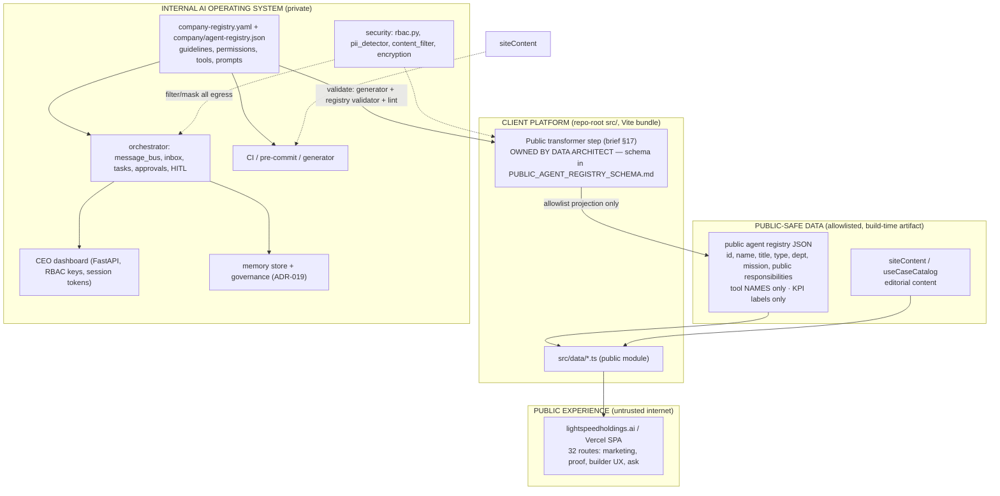
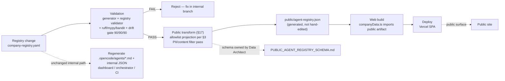

# Public vs Internal Boundary

**ECL change:** LightSpeed AI Company Builder + Web Experience Architecture v2.0
**Deliverable:** §34 support artifact 3 — `PUBLIC_INTERNAL_BOUNDARY.md`
**Workstream:** Governance Architect (policy owner). Schema ownership: Data Architect → [`PUBLIC_AGENT_REGISTRY_SCHEMA.md`](PUBLIC_AGENT_REGISTRY_SCHEMA.md).
**Primary doc:** [`LIGHTSPEED_AI_COMPANY_BUILDER_WEB_ARCHITECTURE_V2.md`](LIGHTSPEED_AI_COMPANY_BUILDER_WEB_ARCHITECTURE_V2.md)
**Baseline:** `harness/changes/active/summary.md` (90 agents / 20 departments, verified 2026-09-24)

> Policy statement (brief §16): the public experience consumes **only** public-safe, transformed data. The internal AI operating system (registry, inbox, approvals, memory, dashboards, CI) never shares a trust boundary with the public site. Deny by default; exposure requires an explicit allowlist entry below.

---

## 1. Layer diagram (brief §16)

Rule: arrows never cross from INTERNAL → PUBLIC except through `TRANSFORM`. No direct import of `company/agent-registry.json` into `src/` pages/components (see §4).

---

## 2. NEVER-EXPOSE list

| # | Class | Examples in this repo | Enforcement |
|---|-------|----------------------|-------------|
| 1 | Secrets / credentials | `.env`, `OPENCODE_API_KEY`, `GEMINI_API_KEY`, `DASHBOARD_*_KEY`, webhook signing secrets | gitignore; never in any public JSON/TS; PII/API-key detector on egress |
| 2 | Credentials of any kind | role keys, browser session tokens (ADR-013), API keys in fixtures | RBAC keys stay server-side; tokens IP-bound + TTL |
| 3 | Internal prompts / private agent instructions | `guidelines` field, system prompts, card bodies in `.opencode/agents/*.md` | transformer omits `guidelines` entirely |
| 4 | Sensitive infra detail | host/port topology beyond published docs, Docker/K8s internals, network topology | no public surface |
| 5 | Unrestricted permissions | `permission: "Execute"`, tier overrides, approval bypasses, tool grant sets | public shows **tool names only**, never permission level |
| 6 | Internal operational data | task instructions, escalation reasons, audit log entries, inbox contents | never in `src/data/` public modules |
| 7 | Inbox / tasks / approvals content | `initialTasks`, `initialApprovals`, `initialEscalations`, `.opencode/inbox.json` | internal dashboard only (RBAC `run`/`approve`) |
| 8 | Cost internals **as live** | `modelTiers` token/cost/request counts, `llm_cost_per_task` raw values, $15.0M allocation variance | public shows static narrative claims only, labeled as illustrative if used at all |
| 9 | Raw memory | `MemoryStore` entries, semantic/procedural/episodic records (ADR-019) | internal only; recall/search never public |
| 10 | Internal KPI raw values + history | `initialKPIs` current/target/history series | public: **labels only** (§3) |

---

## 3. EXPOSE-OK list (public agent registry)

Allowlist — anything not listed is DENY:

| Field | Notes |
|-------|-------|
| `id` | stable slug |
| `name` | display name |
| `title` / `role` | role title |
| `type` | Executive / Specialist / Board / human CEO flag |
| `department` | department id + display name |
| `reports_to` (display) | display name or slug of parent — **not** full org-charts of private paths beyond public org page intent |
| `mission` | agent/department mission statement |
| public responsibilities | curated subset of `responsibilities` (editorial pass) |
| tool **names** only | canonical vocabulary (AGENTS.md §8: read/edit/grep/list/bash/webfetch/task) if judged safe; **no** permission level, no flags, no aliases |
| KPI **labels** | e.g. "Fleet Availability" — **never** current/target/history values |
| counts | 90 agents / 20 departments (aligned with `docs/source-of-truth.yaml`) |

Explicitly excluded even when present in registry: `guidelines`, `permission`, `directReports` internals if considered org-sensitive (policy: allowed only on public org/leadership pages), budgets, headcount internals beyond published public org chart, any timestamps of internal activity.

---

## 4. Current violation findings (verified 2026-09-24)

| # | Finding | Evidence | Severity |
|---|---------|----------|----------|
| V1 | **Full registry JSON imported into web app.** `src/data/companyData.ts` line 1: `import rawAgents from '../../company/agent-registry.json'` then maps every agent into `Agent[]` | `companyData.ts` L1–16 | High |
| V2 | **Private agent instructions exposed.** Registry entries carry `guidelines` (first entry: chief-of-staff strategic delegation instructions); the map passes `guidelines` straight through into the client bundle | `agent-registry.json` first entry; `companyData.ts` L13 | High |
| V3 | **Permission + tool grant exposure.** Entries carry `permission: "Execute"` and tool arrays incl. **legacy non-canonical names** (`write`, `execute`, `delegate` — AGENTS.md §8 forbids these in generated cards, yet registry JSON still carries them) | first registry entry; `companyData.ts` L14–15 | High |
| V4 | **Internal operational data colocated in the public data module.** `src/data/companyData.ts` hard-codes tasks with full instructions, approvals with dollar amounts, escalations with reasons, raw KPI series, live cost/model-tier internals, audit log entries — all inside the same module the public site imports from | `companyData.ts` L41–367 | High |
| V5 | **No public transformer step (brief §17).** Public component chain `AiCompanyBuilderSection` → `HaomtgvGovernanceFramework` consumes `agentsList` directly; no allowlist projection, no schema gate. Policy is owned here; **schema/implementation owned by Data Architect** in [`PUBLIC_AGENT_REGISTRY_SCHEMA.md`](PUBLIC_AGENT_REGISTRY_SCHEMA.md) | `HaomtgvGovernanceFramework.tsx` L42, L366 | High |

Mitigation direction (not implemented in this docs-only change): build-time **public transform** — `company-registry.yaml` → validate → allowlist projection (§3) → `public/agent-registry.json` → `companyData.ts` imports the public artifact only. Internal module (tasks/approvals/costs) splits out of `src/data/` or is deleted from the public bundle.

---

## 5. Governance model for 90 agents (brief §10)

Autonomous vs human-approval matrix, mapped to existing controls:

| Action class | Autonomy | Approval control | Dashboard key (ADR-012) |
|--------------|----------|------------------|--------------------------|
| Read/search/plan (Tier 0) | **Autonomous** | none — auto-approve | `run` (reads) |
| Low-risk writes, notify (Tier 1) | Autonomous + notify | HITL notification log | `run` |
| Code changes, tests (Tier 2) | Human gate | single approver via ApprovalGate / HITL gate | `approve` |
| Prod deploy, DB change (Tier 3) | Human gate | two-person rule (CISO & CTO class) | `approve` |
| Financial / legal / security / secrets paths (Tier 4) | **CEO only** | Human CEO approval; sensitive-path escalation in `tier_rules.py` | `approve` (+ admin for config) |

Supporting controls:

| Control | Mechanism | Boundary relevance |
|---------|-----------|--------------------|
| HITL gate | `executor/hitl_gate.py` + ApprovalGate; expired PENDING → EXPIRED (AGENTS.md §9.1) | approvals never leave internal dashboard |
| RBAC dashboard keys | `run` → `approve` → `admin` hierarchy; loopback/VPN network boundary (ADR-012/013) | public site holds **zero** dashboard keys |
| PII / content filter | `pii_detector.py` (email, SSN, card, API keys, phones, IPs, private keys) + `content_filter.py` | mandatory on any egress toward public surfaces |
| Model routing / cost | 3-tier routing + cost tracker; tier cost internals internal-only (§2 #8) | public: narrative only |
| Incident / postmortem | escalation items (ESC-*), audit log, security audit entries | internal; postmortems may be **summarized** for public trust page after review |
| Versioning / termination | registry is SoT (YAML → JSON → cards, 90/90/90 drift gate); agent add/remove = registry change flowing through §8 pipeline | public JSON regenerated each build — no hand edits |
| Memory governance | ADR-019 veto/flag/TTL/supersede; raw memory never public | §2 #10 |

Scale note: 90 agents × full HITL is throughput-hostile — Tier 0/1 stays autonomous by design; human load concentrates on Tier 2–4 volume, which the 5-tier classifier already routes.

---

## 6. Audiences for the boundary

| Audience | Trust level | Sees | Auth |
|----------|-------------|------|------|
| Public site visitors | Untrusted | EXPOSE-OK (§3) only | none |
| CEO dashboard operators | Trusted (network boundary) | internal ops: tasks, approvals, escalations, KPI raw, cost, audit | RBAC keys + session tokens (ADR-012/013); loopback/VPN |
| OpenCode agents (90 cards) | Semi-trusted runtime | full card incl. tools/permissions; registry YAML; memory recall per governance | local runtime; tier_rules on tool execution |
| CI / pre-commit | Trusted automation | full repo incl. registry; runs generator, ruff/mypy/bandit, drift gates | repo credentials; never ships secrets to public artifacts |

---

## 7. §37 decision framework — "Generate public-safe JSON at build time"

Recommendation: **YES — generate public-safe registry JSON at build time** via a validated allowlist transform (Data Architect owns schema; this doc owns policy).

| # | Question | Answer |
|---|----------|--------|
| 1 | What problem does it solve? | Stops the full registry (guidelines, permissions, tools, legacy names) and internal ops data from reaching the public bundle (V1–V5). |
| 2 | What are the alternatives? | (a) Hand-curated static JSON (drifts); (b) runtime API filter (adds surface + latency); (c) do nothing; (d) **build-time allowlist transform (chosen)**. |
| 3 | Why is (d) best? | Single pipeline already exists (YAML→JSON→cards); transform is one more deterministic stage; public artifact is immutable per deploy; deny-by-default allowlist matches §2. |
| 4 | Security impact? | Positive: shrinks attack/leak surface; no secrets in bundle; aligns with PII detector + content filter as final egress gate. |
| 5 | Cost / effort? | Small: one transform script + schema (Data Architect) + swap import in `companyData.ts` + test asserting 90 rows and forbidden-field absence. |
| 6 | Reversibility? | Fully reversible; artifact is generated, not SoT. |
| 7 | Who owns it? | Policy: Governance Architect (this doc). Schema/transform: Data Architect (`PUBLIC_AGENT_REGISTRY_SCHEMA.md`). Synthesis/roadmap: Architecture Lead. |
| 8 | Dependencies / risks? | Depends on registry validator green + canonical tool vocabulary cleanup (V3 legacy names). Risk: forgetting a field in allowlist — mitigated by deny-by-default + schema test. |
| 9 | Timeline / sequencing? | Phase-appropriate with T007/T005 in roadmap — before route/UX work that renders agent data. |
| 10 | Success criteria? | `src/` contains **no** import of `company/agent-registry.json`; public artifact passes schema test (90 agents, zero `guidelines`/`permission`/raw KPI/cost fields); lint/drift gates green. |

---

## 8. Boundary flow: registry change → deploy

---

## Cross-links

- Schema contract: [`PUBLIC_AGENT_REGISTRY_SCHEMA.md`](PUBLIC_AGENT_REGISTRY_SCHEMA.md) *(Data Architect)*
- Primary v2 doc: [`LIGHTSPEED_AI_COMPANY_BUILDER_WEB_ARCHITECTURE_V2.md`](LIGHTSPEED_AI_COMPANY_BUILDER_WEB_ARCHITECTURE_V2.md)
- ADR-012 dashboard RBAC · ADR-013 browser session tokens · ADR-019 memory governance (`docs/adr/`)
- Controls: `src/ai_company/security/` (rbac, pii_detector, content_filter, encryption) · `src/ai_company/orchestrator/tier_rules.py` (5-tier matrix)
- AGENTS.md §7 safety boundaries · §9 governance rules
