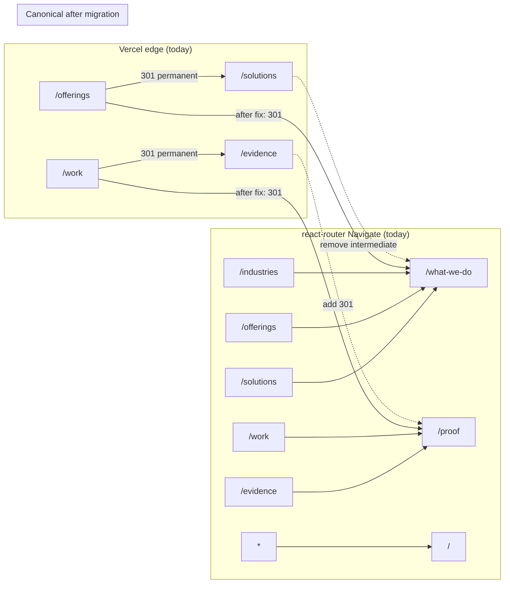
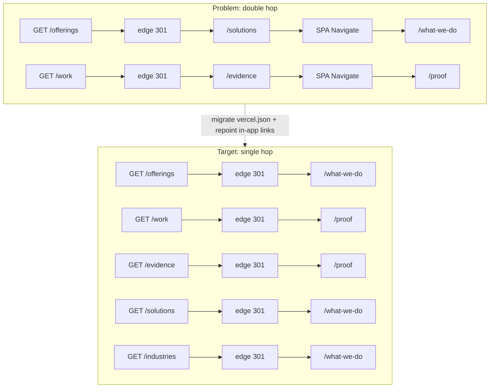

# Route Migration v2

**ECL change:** LightSpeed AI Company Builder + Web Experience Architecture v2.0
**Deliverable:** §34 support artifact 6 — `ROUTE_MIGRATION_V2.md`
**Workstream:** Frontend Lead (route inventory + migration plan). Cross-ref: [`WEB_INFORMATION_ARCHITECTURE_V2.md`](WEB_INFORMATION_ARCHITECTURE_V2.md) (T006, pending), [`EVIDENCE_ARCHITECTURE.md`](EVIDENCE_ARCHITECTURE.md) (proof/evidence/work consolidation).
**Primary doc:** [`LIGHTSPEED_AI_COMPANY_BUILDER_WEB_ARCHITECTURE_V2.md`](LIGHTSPEED_AI_COMPANY_BUILDER_WEB_ARCHITECTURE_V2.md)
**Baseline:** `src/App.tsx` (32 child routes), `vercel.json` (2 redirects + SPA rewrite), verified 2026-09-24.
**Scope:** Docs only — this file documents the migration; implementation is a separate ECL change (tasks.md Deferred).

> **Decision framework §37** applied: every recommendation below records keep / redirect / delete / alias, evidence, and risk if deferred. No router framework rewrite (brief §29 constraint).

---

## 1. Full route inventory (`src/App.tsx`)

Router: `createBrowserRouter` (react-router-dom ^7.18.3), root `SiteLayout`, children under `/`.

### 1.1 Live pages (render a real component)

| Path | Component | Role |
|------|-----------|------|
| `/` (index) | `HomePage` | Home |
| `/what-we-do` | `WhatWeDoPage` | Capabilities hub (canonical for offerings/solutions/industries index) |
| `/proof` | `ProofPage` | Evidence hub (canonical for work/evidence) |
| `/solutions/:slug` | `SolutionDetailPage` | Solution detail (from `siteContent.solutions`) |
| `/industries/:slug` | `IndustryDetailPage` | Industry detail (from `siteContent.industries`) |
| `/technology` | `TechnologyPage` | Stack / governance |
| `/insights` | `InsightsPage` | Pharos content |
| `/about` | `AboutPage` | Company |
| `/ai-company-builder` | `AiCompanyBuilderPage` | **Product surface — keep** |
| `/ask` | `AskLightSpeed` | **Product surface (component route) — keep** |
| `/contact` | `ContactPage` | Conversion (+ `api/enquiry.ts`) |
| `/legal/privacy` | `PrivacyPage` | Legal — keep |
| `/legal/terms` | `TermsPage` | Legal — keep |
| `/why` | `WhyLightSpeedPage` | Differentiation |
| `/how-we-help` | `HowWeHelpPage` | Engagement model |
| `/how-we-help/engagement` | `HowWeHelpPage` | Alias of same component (engagement deep-link) |
| `/process` | `ProcessPage` | Delivery process |
| `/geography` | `GeographyPage` | Markets |
| `/leadership` | `LeadershipPage` | Leadership |
| `/faq` | `FAQPage` | FAQ |
| `/resources` | `ResourcesPage` | Resources |
| `/events` | `EventsPage` | Events |
| `/news` | `NewsPage` | News |
| `/careers` | `CareersPage` | Careers |
| `/deliverables` | `DeliverablesPage` | Offerings detail |
| `/outcomes` | `OutcomesPage` | Outcomes |
| `/partnerships` | `PartnershipsPage` | Partners |
| `/trust` | `TrustPage` | Trust / compliance |

**Count:** 28 live route entries (index + 27 paths). Two paths share `HowWeHelpPage`.

### 1.2 SPA `Navigate` redirects (in-router only)

| Path | Target | Notes |
|------|--------|-------|
| `/solutions` | `/what-we-do` | Hub index retired |
| `/industries` | `/what-we-do` | Hub index retired |
| `/offerings` | `/what-we-do` | Legacy naming |
| `/work` | `/proof` | Legacy naming |
| `/evidence` | `/proof` | Merged into proof |
| `*` (catch-all) | `/` | Unknown paths → home |

**Count:** 6 SPA redirects.

### 1.3 Edge redirects (`vercel.json`)

| Source | Destination | permanent | Conflict |
|--------|-------------|-----------|----------|
| `/offerings` | `/solutions` | true | Double hop → see §2 |
| `/work` | `/evidence` | true | Double hop → see §2 |

SPA rewrite: `/(.*)` → `/index.html` (all unmatched paths serve the SPA).
Function: `api/enquiry.ts` region `cpt1` (not a page route).

### 1.4 Route totals

| Layer | Count |
|-------|-------|
| Child entries in `App.tsx` | **34** (28 live + 5 SPA redirects + 1 catch-all) |
| Distinct public paths after migration target | **28 live + detail slugs** |
| Edge redirects today | **2** |
| Edge redirects after §2 fix | **5** (offerings, work, evidence, solutions, industries → single hop) |

> **IA cross-check note:** `WEB_INFORMATION_ARCHITECTURE_V2.md` (T006) validates “all 32 App.tsx child routes + redirects.” Counts here use 34 child array entries (includes index + catch-all). Architecture Lead reconciles nomenclature; path list is authoritative from this inventory.

---

## 2. Double-hop resolution (T008 primary validation)

### 2.1 Current broken chains

```text
Visitor GET /offerings
  → Vercel edge 301 → /solutions          (vercel.json permanent)
  → SPA matches Navigate → /what-we-do    (App.tsx)
  User sees two redirects; SEO signal lands on intermediate /solutions.

Visitor GET /work
  → Vercel edge 301 → /evidence           (vercel.json permanent)
  → SPA matches Navigate → /proof         (App.tsx)
  Same double hop; TrustPage also links to /evidence (SPA hop only when typed/shared).
```

In-app links never hit the edge (client router runs first) — but shared/bookmarked URLs and crawlers do.

### 2.2 Target model: one hop to final canonical

| Legacy source | Edge target (after fix) | SPA fallback (keep) | Final canonical |
|---------------|-------------------------|---------------------|-----------------|
| `/offerings` | `/what-we-do` | `/what-we-do` | `/what-we-do` |
| `/work` | `/proof` | `/proof` | `/proof` |
| `/evidence` | `/proof` | `/proof` | `/proof` |
| `/solutions` | `/what-we-do` (optional edge) | `/what-we-do` | `/what-we-do` |
| `/industries` | `/what-we-do` (optional edge) | `/what-we-do` | `/what-we-do` |

**Recommended `vercel.json` redirects (implementation phase):**

```json
"redirects": [
  { "source": "/offerings", "destination": "/what-we-do", "permanent": true },
  { "source": "/work", "destination": "/proof", "permanent": true },
  { "source": "/evidence", "destination": "/proof", "permanent": true },
  { "source": "/solutions", "destination": "/what-we-do", "permanent": true },
  { "source": "/industries", "destination": "/what-we-do", "permanent": true }
]
```

**Rules:**
1. Edge destination **must equal** SPA Navigate target — never an intermediate alias.
2. Keep SPA `Navigate` entries for local `vite dev` and any non-edge host (same final targets).
3. Detail paths (`/solutions/:slug`, `/industries/:slug`) are **not** redirected at edge — only the bare indexes.
4. `/work` and `/evidence` already shipped as permanent 301s (PR #265, 2026-09-16) to `/evidence` / … — **re-pointing `/work` directly to `/proof` is a second permanent redirect chain for users who cached the first hop**; acceptable (301s are re-fetched), but document in CHANGELOG when executed.

### 2.3 In-app links that still target redirecting paths

| File | Link | Resolves today | Fix |
|------|------|----------------|-----|
| `SolutionDetailPage.tsx:34` | `to="/solutions"` (404 back-link) | SPA → `/what-we-do` | Change to `/what-we-do` |
| `IndustryDetailPage.tsx:34,149` | `to="/industries"` | SPA → `/what-we-do` | Change to `/what-we-do` |
| `TrustPage.tsx:198` | `to="/evidence"` | SPA → `/proof` | Change to `/proof` |

No remaining `to="/offerings"` or `to="/work"` in `src/` (grep clean).

### 2.4 Mermaid redirect graph





---

## 3. Dead-code list (T008 primary validation)

### 3.1 Dead imports / unused route wrappers in `App.tsx`

These pages are imported and wrapped with `withSite(...)` but **never mounted** — their paths are pure `Navigate`:

| Import | Wrapper constant | Route element today | Action |
|--------|------------------|---------------------|--------|
| `SolutionsPage` | `SolutionsPageRoute` | `Navigate to="/what-we-do"` | **Delete** import + wrapper + file (superseded by `WhatWeDoPage`) |
| `IndustriesPage` | `IndustriesPageRoute` | `Navigate to="/what-we-do"` | **Delete** import + wrapper + file |
| `WorkPage` | `WorkPageRoute` | `Navigate to="/proof"` | **Delete** import + wrapper + file |
| `OfferingsPage` | `OfferingsPageRoute` | `Navigate to="/what-we-do"` | **Delete** import + wrapper + file |
| `EvidencePage` | `EvidencePageRoute` | `Navigate to="/proof"` | **Delete** import + wrapper + file |

**Confirmed dead imports:** `WorkPage`, `OfferingsPage`, `EvidencePage`, **plus** `SolutionsPage`, `IndustriesPage` (same pattern; summary.md called out the first three — all five are dead).

**After cleanup:** `App.tsx` imports only live components; 5 page files under `src/pages/` become delete candidates (keep only if EVIDENCE_ARCHITECTURE or content migration still needs prose — otherwise remove in same PR).

### 3.2 Dead dependency candidates (package.json)

| Package | Usage in `src/` | Action |
|---------|-----------------|--------|
| `recharts` | **No imports found** | Remove from `dependencies` (bundle/lock weight) |
| `framer-motion` | No direct imports; `motion` package used (`motion/react` in 2 components) | Confirm `motion` supersedes `framer-motion`; drop unused dual entry if true |
| `three` | Used only in `ThreeCanvas.tsx` (site shell) | **Keep** — but budget: dynamic-import canvas if LCP suffers (§29 performance; no premature rewrite) |

### 3.3 Unreachable page files (never imported by router)

All 31 files under `src/pages/` are either live or in §3.1 — no additional orphans found. `AskLightSpeed` is a component route (`/ask`), not a page file.

### 3.4 Keep list (do not delete)

- `/ai-company-builder`, `/ask` — product surfaces (brief constraint).
- Legal, contact, trust — compliance / conversion.
- Detail routes + `siteContent` data modules.

---

## 4. Slug strategy

### 4.1 Content model slugs (source of truth: `src/data/siteContent.ts`)

**Solutions (`/solutions/:slug`):**
`ai-company-builder`, `digital-presence`, `business-automation`, `enterprise-deployment`, `boardroom-briefing`

**Industries (`/industries/:slug`):**
`financial-services`, `healthcare`, `agriculture`, `education`, `government`

### 4.2 Link ↔ slug mismatches (broken detail URLs today)

| Link location | Linked path | Matches content? | Result |
|---------------|-------------|------------------|--------|
| `SiteFooter.tsx` solutions | `/solutions/agentic-ai`, `digital-transformation`, `data-intelligence`, `automation`, `strategy-advisory` | **No** — content uses different slugs | Miss → catch-all → `/` (or 404 shell) |
| `SiteLayout.tsx` title map | Same legacy solution slugs | **No** | Wrong/missing document titles |
| `PillarNavigationCard.tsx` | `/solutions/strategy-advisory`, `/solutions/agentic-ai` | **No** | Broken pillar CTAs |
| `SiteFooter.tsx` industries | `/industries/development` | **No** — content has `education`, not `development` | Broken footer link |
| `SiteLayout.tsx` | `/industries/development` title | **No** | Stale title map |
| Footer industries (other) | `government`, `financial-services`, `healthcare`, `agriculture` | Yes | OK |
| `WhatWeDoPage` / `HomePage` cards | `siteContent` slugs via data | Yes | OK |

**Decision (§37):** **Keep URL prefixes `/solutions/:slug` and `/industries/:slug` for SEO** (detail pages already public; hub indexes redirect to `/what-we-do`). Align **all hardcoded footer/layout/pillar links to `siteContent` slugs** in the same migration PR as edge redirects. Prefer data-driven footer (import `solutions`/`industries` arrays) so slug drift cannot recur.

**Optional alias map (if analytics show legacy slug traffic):** SPA route table may add explicit `Navigate` entries only for slugs that ever shipped publicly (footer slugs above). Do **not** invent aliases for never-linked strings.

### 4.3 Hub vs detail IA

| Concern | Decision |
|---------|----------|
| Index `/solutions`, `/industries` | Redirect → `/what-we-do` (already) |
| Detail pages | Keep under `/solutions/*`, `/industries/*` |
| Future merge under `/what-we-do/...` | **Deferred** — only with Architecture Lead + WEB_IA sign-off; would need full 301 set for every slug |
| `/how-we-help` vs `/how-we-help/engagement` | Keep both (same component); treat `/engagement` as permanent alias if analytics prefer one |

---

## 5. Stack evaluation (brief §29)

| Layer | Current | Verdict |
|-------|---------|---------|
| Framework | React 18.3.1 + TypeScript 5.7.3 | **Keep** — no evidence for rewrite |
| Router | `react-router-dom` 7.18.3 (`createBrowserRouter`) | **Keep** — data APIs unused but stable; migration is config-only |
| Build | Vite 6.1.0, `@vitejs/plugin-react`, Tailwind 4 Vite plugin | **Keep** |
| Package manager | `bun@1.4.2` (engines node ≥22, bun ≥1.4) | **Keep** (repo policy via `check-package-manager.cjs`) |
| Animation | `motion` (used); `framer-motion` (dep present, unused imports) | Deduplicate deps |
| 3D | `three` via `ThreeCanvas` in `SiteLayout` | Keep; measure before optimizing |
| Charts | `recharts` unused | Remove |
| Tests | Vitest + `@testing-library/jest-dom` (one unit test) | Add route inventory / redirect unit test in implement phase |
| E2E | `@playwright/test` dep present; no site route config at repo root | Optional: one redirect assertion suite post-migration |
| Edge | Vercel `vercel.json` | Keep; fix redirects (§2) |

**Explicit non-goals:** no Next.js/Astro migration, no router library swap, no design-system rewrite — brief §29 requires evidence-first architecture changes only.

**Performance note:** `SiteLayout` mounts `ThreeCanvas` globally — consider route-level lazy loading for `/` only if budgets fail; not required for route migration.

---

## 6. Migration plan (implementation phase — separate ECL)

| Step | Change | Validation |
|------|--------|------------|
| M1 | Update `vercel.json` redirects to final targets (§2.2) | Deploy preview: `curl -I` each legacy path → single 301 to final; no chain |
| M2 | Repoint in-app links (`SolutionDetailPage`, `IndustryDetailPage`, `TrustPage`) | Grep: no `to="/solutions"`, `to="/industries"`, `to="/evidence"` except data-driven detail bases |
| M3 | Align footer / SiteLayout / PillarNavigationCard slugs to `siteContent` (or data-drive them) | Every footer detail link resolves to a live record |
| M4 | Remove 5 dead imports/wrappers + delete 5 page files (if content migrated) | `tsc --noEmit` clean; bundle size drop; no `Navigate` left pointing at deleted components |
| M5 | Drop unused `recharts` (+ optional `framer-motion`) | `bun install`; build green |
| M6 | Optional: edge redirects for `/solutions`, `/industries` indexes | Single hop in preview |
| M7 | Tests: unit table of legacy→canonical; optional Playwright redirect suite | `bun test` / CI green |
| M8 | Update CHANGELOG + STATUS (second pass of 301 re-point) | Drift docs note |

**Do not** hand-edit `harness/changes/INDEX.json`. Code migration lands only after this doc + primary v2 doc approved.

---

## 7. Decision answers (brief §37)

| # | Question | Decision | Rationale / evidence |
|---|----------|----------|----------------------|
| D1 | Collapse double hops? | **Yes** — edge targets = SPA final | Current `/offerings`→`/solutions`→`/what-we-do` and `/work`→`/evidence`→`/proof` (vercel.json + App.tsx) |
| D2 | Canonical hubs? | `/what-we-do`, `/proof` | SPA Navigate already treats them as sinks; nav/footer use them |
| D3 | Keep detail slug prefixes? | **Yes** (`/solutions/:slug`, `/industries/:slug`) | SEO + existing cards; hub merge deferred |
| D4 | Delete dead pages? | **Yes** — 5 files + imports after link/content check | Navigate-only routes; never mounted |
| D5 | Keep `/ask` + `/ai-company-builder`? | **Yes** | Product surfaces (brief) |
| D6 | Edge redirect for indexes? | **Yes** for `/offerings`,`/work`,`/evidence`; **recommended** for `/solutions`,`/industries` | One hop for crawlers |
| D7 | Framework rewrite? | **No** | Brief §29; stack fits; problem is redirect config only |
| D8 | Unify footer slugs with content? | **Yes, data-driven** | Hardcoded legacy slugs currently 404→home |
| D9 | `/industries/development` vs `education`? | Content model wins: **`education`**; fix footer/layout; alias only if traffic exists | Footer links a slug absent from `siteContent` |
| D10 | `recharts` / dual motion packages? | Remove unused; keep `motion` + `three` | Zero import hits for `recharts` |

---

## 8. Cross-references

- Active change: `harness/changes/active/` — T008, plan.md, summary.md redirect conflict note.
- Parallel IA: `docs/architecture/WEB_INFORMATION_ARCHITECTURE_V2.md` (T006) — **pending**; if path names diverge, Architecture Lead reconciles.
- Proof consolidation: `docs/architecture/EVIDENCE_ARCHITECTURE.md` (T009).
- Primary: `docs/architecture/LIGHTSPEED_AI_COMPANY_BUILDER_WEB_ARCHITECTURE_V2.md` (T012).
- History: `docs/STATUS.md` (2026-09-16 PR #265 first 301 wave); `docs/adr/020-client-facing-site-guiding-principles.md`.
- Sources: `src/App.tsx`, `vercel.json`, `src/data/siteContent.ts`, `src/components/SiteFooter.tsx`, `src/components/SiteLayout.tsx`, `package.json`.

---

## 9. Action counts (summary)

| Action | Count | Items |
|--------|------:|-------|
| **Keep** (live routes) | 28 path entries | §1.1 |
| **Redirect** (SPA, keep as fallback) | 5 + catch-all | solutions, industries, offerings, work, evidence → hubs; `*` → `/` |
| **Redirect** (edge, replace/add) | 5 after fix | offerings, work, evidence, solutions, industries → single hop |
| **Alias** | 1+ | `/how-we-help/engagement` (same page); optional legacy solution slugs |
| **Delete** (dead imports/pages) | 5 | SolutionsPage, IndustriesPage, WorkPage, OfferingsPage, EvidencePage |
| **Delete** (deps) | 1–2 | `recharts`; possibly `framer-motion` |
| **Fix links** | 6+ sites | TrustPage, 2× detail back-links, footer/layout/pillar slugs |

**T008 validation met:** double-hop vs `vercel.json` resolved (§2); dead imports listed (§3.1).

---

## 10. Open items for Architecture Lead

1. Confirm optional edge redirects for `/solutions` and `/industries` indexes vs SPA-only.
2. Confirm whether `WEB_INFORMATION_ARCHITECTURE_V2.md` renames any hub before this migration executes.
3. Approve data-driven footer (single source `siteContent`) vs manual slug sync.
4. Schedule implementation ECL after primary v2 doc approval.
