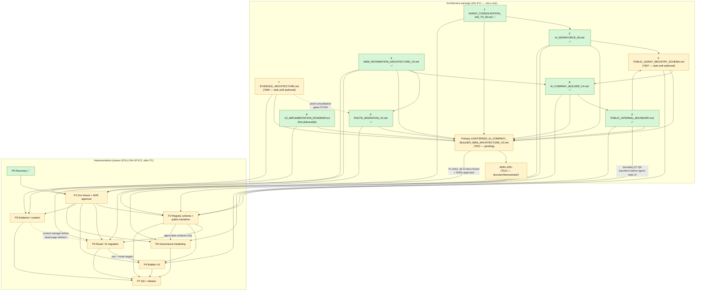

# V2 Implementation Roadmap

**ECL change:** LightSpeed AI Company Builder + Web Experience Architecture v2.0
**Deliverable:** §34 support artifact 9 — `V2_IMPLEMENTATION_ROADMAP.md`
**Workstream:** Technical Documentation Lead (roadmap synthesis). Approver: Architecture Lead.
**Primary doc:** [`LIGHTSPEED_AI_COMPANY_BUILDER_WEB_ARCHITECTURE_V2.md`](LIGHTSPEED_AI_COMPANY_BUILDER_WEB_ARCHITECTURE_V2.md) *(T012 — pending)*
**Baseline:** `harness/changes/active/summary.md` + `BRIEF_LOCK.md` (discovery complete 2026-09-24)
**Scope:** Docs only. Phased plan, depends-on graph, risk register (§36), definition of done, §37 decision answers.

---

## 1. Guiding constraint — NO code or registry rewrites in this architecture ECL

**This change is documentation only.** Implementation is a **FOLLOW-UP change** opened after primary doc approval.

| Allowed in this ECL | Forbidden in this ECL |
|---|---|
| Authoring the 9 support artifacts + primary v2 doc + ADRs + Mermaid diagrams under `docs/architecture/` | Editing `company-registry.yaml`, regenerating `.opencode/agents/*.md`, mutating `company/agent-registry.json` |
| Harness updates to `harness/changes/active/` (spec/plan/tasks/summary) | Any `src/` React changes, `vercel.json` edits, route code migration |
| Read-only discovery, lint/validate scripts | Live deploy cutover, DNS/host changes, remote README pushes |
| This roadmap (planning the follow-up) | Building the public transform script (design only lives in T007/T005) |

Enforced by: `spec.md` Non-Goals, `tasks.md` Deferred Tasks ("Actual route code migration — separate ECL change after v2 doc approved"), `ROUTE_MIGRATION_V2.md` §6 ("Do not hand-edit INDEX.json. Code migration lands only after this doc + primary v2 doc approved"), and the operating principle in `AI_WORKFORCE_90.md` §5.2 ("Remediation is schema/loader work for a later implementation ECL change").

**Gate to open the follow-up change:** P1 exit criteria (§3) — primary doc + ADRs approved.

---

## 2. Phase overview

Eight phases, P0–P7. BRIEF_LOCK notes "Phases 0-10 migration" in the full brief text (not retained verbatim in-repo); the phase set below is the locked roadmap set for this deliverable. If the verbatim brief enumerates a different split, Architecture Lead reconciles numbering at P1 doc freeze — dependencies in §3–§4 win over nominal ordering.

| Phase | Name | Status | One-line goal |
|---|---|---|---|
| **P0** | Discovery / current-state baseline | **COMPLETE** (this change) | Facts, artifacts, and risks captured before any target-state authoring. |
| **P1** | Doc freeze + ADR approval | Planned | Freeze all 10 architecture artifacts; approve ADRs; open implementation ECL. |
| **P2** | Registry schema + public transform | Planned | Close schema gaps (G3–G8); ship public-safe registry artifact behind the boundary. |
| **P3** | Route / IA migration | Planned | Single-hop redirects, dead-code removal, IA target tree live in the React SPA. |
| **P4** | AI Company Builder UX | Planned | Five-mode switcher, journeys, Ask Option A, accessibility per builder UX spec. |
| **P5** | Evidence / content | Planned | Proof/evidence/work consolidation; stale-count sweep; slug and claim fixes. |
| **P6** | Governance hardening | Planned | Single-owner violations closed; HITL tiers, decision rights, escalation encoded. |
| **P7** | QA + release | Planned | Full verification matrix green; cutover executed; metrics recorded. |

**Dependency overrides applied (artifacts win over nominal order):**

1. `PUBLIC_INTERNAL_BOUNDARY.md` §7 Q9 — public transform must land **before** route/UX work that renders agent data → **P2 before P3/P4 agent-data surfaces** (keeps P2 as ordered).
2. `ROUTE_MIGRATION_V2.md` §6 M4 — dead-page deletion only "if content migrated" → **P5 content salvage gates the final P3 deletion step** (P3 split: redirects/links first; file deletion deferred until P5 exit).
3. `AI_WORKFORCE_90.md` §5.2 + `PUBLIC_INTERNAL_BOUNDARY.md` §5 — schema backfill and single-owner fixes are implementation work → **P2 and P6 after P1**, never inside this ECL.
4. Primary doc (T012) synthesizes all nine artifacts → **P1 is the only phase that can start the follow-up ECL**; everything else depends on P1 exit.

---

## 3. Phase detail

Roles map to brief §33 workstreams: **Architecture Lead · AI Workforce · Orchestration · Governance · Web Experience · Content · Frontend · Data · QA.**

### P0 — Discovery / current-state baseline

| Field | Value |
|---|---|
| **Goal** | Establish verified facts (registry 90/90/90, 32 routes, redirect conflicts, ADR inventory, deployment targets) so target-state docs cannot invent numbers. |
| **Entry criteria** | ECL change accepted (`intake_status: accepted`); no prior baseline exists. |
| **Exit criteria** | `summary.md` baseline complete; `ref/deployment-comparison.md` written; three-route count check green; `agents_152.txt` / `agents_90.txt` captured. **Met 2026-09-24.** |
| **Owner workstream** | Architecture Lead (lead); AI Workforce (registry census); Web Experience + Frontend (route inventory); Governance (boundary findings); Data (schema gap census). |
| **Deliverable tasks** | T001 discovery; T002 brief lock; T017 deployment comparison; discovery appendices in `summary.md`. |
| **Depends-on** | Nothing (change intake). |
| **Risk** | Baseline drifts before freeze → mitigate: re-run count checks at P1 entry. **Status: complete.** |

### P1 — Doc freeze + ADR approval

| Field | Value |
|---|---|
| **Goal** | Freeze the architecture package: all 9 support artifacts + primary doc + ADRs (025+) + 12 Mermaid diagrams, lint green, counts consistent — then approve and open the implementation ECL. |
| **Entry criteria** | P0 complete; all §34 artifact tasks (T003–T011) authored or explicitly stubbed with cross-links; full brief §33–§35 text available for verbatim reconciliation. |
| **Exit criteria** | Primary doc links all 9 artifacts (no orphans, T012); ADRs numbered from 025 with path decision recorded and duplicate-020 note added (T013); `lint-ecl.ps1` + `validate-drift.ps1` green (T014); no stale 145/152 claims in new docs (T015); Architecture Lead + CEO approval recorded; follow-up implementation ECL opened. |
| **Owner workstream** | Architecture Lead (synthesis + approval); Governance (ADR authoring); Content (stale-count sweep); all artifact owners (freeze their files). |
| **Deliverable tasks** | T007 + T009 (fill the two pending artifacts — currently stubs); T012 primary doc; T013 ADRs; T014 lint; T015 count audit; T016 summary update; reconcile brief "Phases 0-10" numbering if it diverges from §2. |
| **Depends-on** | P0; artifacts 1–9; BRIEF_LOCK.md. |
| **Risk** | Parallel-artifact drift while T007/T009 land late → mitigate: synthesis pass last (plan.md §3); stub cross-links already present in T005/T008/T010. |

### P2 — Registry schema + public transform

| Field | Value |
|---|---|
| **Goal** | Close the §9 ownership-schema gaps and stop the full internal registry from reaching the public bundle: build-time allowlist transform `company-registry.yaml` → validate → `public/agent-registry.json` → `companyData.ts`. |
| **Entry criteria** | P1 approved; ADR for schema v2 + public transform approved; artifacts 1, 2, 3, 5 frozen. |
| **Exit criteria** | 7 MANDATORY missing fields (`decision_rights`, `kpis`, `approval_level`, `escalation_path`, `workflows`, `inputs`, `outputs`) designed and backfilled across 90 entries with validator fail-fast (warn→fail staged); `src/` contains **no** import of `company/agent-registry.json`; public artifact passes schema test (90 rows, zero `guidelines`/`permission`/raw KPI/cost fields); legacy non-canonical tool names (`write`, `execute`, `delegate`) purged from registry JSON; drift gates 90/90/90 green. (Boundary §7 Q10 success criteria.) |
| **Owner workstream** | Data (lead — transform + schema); AI Workforce (field backfill semantics); Governance (allowlist policy from artifact 3); QA (schema tests); Content (public-facing mission/responsibility editorial pass). |
| **Deliverable tasks** | Implement artifact-5 schema; registry loader/validator changes; transform script; swap `companyData.ts` import; forbid-field unit test; regenerate cards only under follow-up ECL approval. |
| **Depends-on** | P1; artifact 3 (policy) → artifact 5 (schema); artifact 2 (gap list G1–G9); artifact 1 (roster stability). |
| **Risk** | Validator too strict breaks generation → mitigate: staged warn→fail (AI_WORKFORCE_90 §8 Q6); forgetting an allowlist field → deny-by-default + schema test. |

### P3 — Route / IA migration

| Field | Value |
|---|---|
| **Goal** | Land the v2 information architecture in code: single-hop redirects, target nav tree, slug fixes, dead-code cleanup — per `ROUTE_MIGRATION_V2.md` M1–M8 and `WEB_INFORMATION_ARCHITECTURE_V2.md` route table. |
| **Entry criteria** | P1 approved; artifacts 4 and 6 frozen; **P2 exit met for any surface that renders agent data** (boundary §7 Q9); Architecture Lead answered ROUTE_MIGRATION §10 open items 1–3. |
| **Exit criteria** | Every legacy path resolves in **one** hop (`curl -I`: `/offerings`→`/what-we-do`, `/work`→`/proof`, `/evidence`→`/proof` — no edge→SPA chains); in-app links repointed (`SolutionDetailPage`, `IndustryDetailPage`, `TrustPage`); footer/layout/pillar slugs aligned to `siteContent` (data-driven preferred); dead deps removed (`recharts`, maybe `framer-motion`); redirect unit test table green; **final step:** 5 dead imports/page files deleted only after P5 content salvage confirmed. |
| **Owner workstream** | Frontend (lead — `vercel.json`, `App.tsx`, links); Web Experience (IA decisions, nav labels, fragment IDs); Content (copy moved during merges); QA (redirect assertions, Playwright optional). |
| **Deliverable tasks** | ROUTE_MIGRATION steps M1–M3, M5–M8; IA §4 keep/merge/redirect/create table; homepage 13-section structure (structure-only moves OK; copy finalized in P5). |
| **Depends-on** | P1; artifacts 4, 6; P2 (agent-data surfaces); P5 gates M4 file deletion; artifact 7 (EVIDENCE — proof consolidation target for merge routes). |
| **Risk** | Double-hop regressions when edge and SPA both claim a path → mitigate: rule "edge destination must equal SPA final" (ROUTE_MIGRATION §2.2); `/work` second permanent redirect chain for cached first-hop users → document in CHANGELOG (M8). |

### P4 — AI Company Builder UX

| Field | Value |
|---|---|
| **Goal** | Implement the builder experience spec: five-mode switcher (Organization · Agent · Operations · Intelligence · Governance), URL-synced modes, executive/technical journeys, Ask Option A, accessibility and demo-labeling rules. |
| **Entry criteria** | P1 approved; artifacts 8 (+ 3, 5 for agent modal data contracts) frozen; P2 exit met (AgentModal and governance roster consume only public-safe data). |
| **Exit criteria** | Top-level mode switcher replaces stacked tab chrome; `#governance` fragment frozen; AgentModal keyboard-trap-safe with canonical 7-tool vocabulary only; simulated CLI labeled demo-only; Ask promoted to nav CTA (Option A) with honest empty state; counts read from test-backed constants (90/20/2373/5-tier); no hard-coded "140+ agents" copy; a11y checklist in artifact 8 §7 passed. |
| **Owner workstream** | Web Experience (lead — product-designer spec); Frontend (implementation); Content (honesty labels, stale homepage claims); Data (registry constants via public artifact); QA (a11y + journeys). |
| **Deliverable tasks** | Artifact-8 §3 mode mapping, §4 journeys, §5 component dispositions, §6–§7 motion/a11y; resolve artifact-8 open Q1–Q6 at implementation kickoff. |
| **Depends-on** | P1; artifacts 8, 3, 5; P2 (roster data); P3 (route targets `/solutions`, `/sectors`, nav tree); artifact 4 (homepage section links into builder). |
| **Risk** | Two stacked tab systems confuse mode state → mitigate: single mode switcher as orientation source, inner tabs demoted (artifact 8 §3.1); fake success states violate ADR-020 → demo labeling mandatory. |

### P5 — Evidence / content

| Field | Value |
|---|---|
| **Goal** | Consolidate proof/evidence/work into `/proof` sections; sweep stale counts (145/152, "140+ agents", remote README 152); align claims with honesty badges and source-of-truth. |
| **Entry criteria** | P1 approved; artifact 7 frozen; P3 merge-target structure exists (or runs concurrently with P3 content extraction). |
| **Exit criteria** | `EvidencePage`/`WorkPage`/`TrustPage`/`OutcomesPage` prose salvaged into Proof sections per artifact 7; zero live (non-historical) 145/152/140+ claims in public copy (`EXECUTIVE-STRATEGY-EXPANSION.md`, README, homepage About band fixed); GitHub remote README synced to 90 (deployment-comparison action); slug-drift fix list (IA §4.1) cleared or ticketed; STale pharos/`source-of-truth.yaml` comment reconciled. |
| **Owner workstream** | Content (lead); Architecture Lead (canonical-count rulings); QA (grep gates); Web Experience (proof page composition). |
| **Deliverable tasks** | Artifact-7 consolidation map; count sweep (T015 pattern applied repo-wide); README/status notes; CHANGELOG entry. |
| **Depends-on** | P1; artifact 7; artifact 4 (proof sections in IA); artifact 1 (90/20 canonical); **gates P3 M4 deletion**. |
| **Risk** | Historical milestone lines (STATUS.md) are gate-exempt but look stale to readers → mitigate: footnote as historical, don't rewrite history; remote/local README split persists → trigger: release checklist includes remote sync verify. |

### P6 — Governance hardening

| Field | Value |
|---|---|
| **Goal** | Close structural governance gaps carried from discovery: single-owner violation V1, bounded V9/V10 decision rights, chief-of-staff span watch, HITL tier encoding, boundary enforcement automation. |
| **Entry criteria** | P1 approved; P2 schema backfill live (so `decision_rights`/`approval_level`/`escalation_path` can be encoded); artifacts 2, 3 frozen. |
| **Exit criteria** | V1 resolved (BD department re-owned to `head_of_business_development` **or** documented dual mandate with separate KPIs — Architecture Lead ruling); V9 `decision_rights` encoded (qa_lead = policy/gates; test_engineering_lead = automation/eval); V10 intake routing rule published; chief_of_staff span (19 reports + absorbed program duties) instrumented with queue-depth watch (matrix R4); 5-tier matrix declarative per agent; NEVER-EXPOSE egress checks (PII/content filter) wired on transform; dashboard holds zero public keys; boundary criteria from `PUBLIC_INTERNAL_BOUNDARY.md` §7 Q10 all met. |
| **Owner workstream** | Governance (lead — policy + enforcement); AI Workforce (org rewiring); Orchestration (HITL/tier_rules, approval gate); Data (transform egress gate); QA (policy tests); Architecture Lead (V1 ruling). |
| **Deliverable tasks** | departments.yaml edit (follow-up ECL); registry field encoding; span monitor; boundary CI check (no `company/agent-registry.json` import assertion). |
| **Depends-on** | P1; P2; artifacts 2, 3, 5; ADRs on RBAC/session/memory (012/013/019) referenced not renumbered. |
| **Risk** | BD split orphans reporting edges → mitigate: `head_of_business_development` already reports to `chief_of_staff` (AI_WORKFORCE_90 §8 Q6); span overload on chief_of_staff worsens if program duties added without offload → trigger: queue depth / SLA breaches → offload to `workflow_owner`. |

### P7 — QA + release

| Field | Value |
|---|---|
| **Goal** | Run the full verification matrix across all phases; execute cutover per pointers; record definition-of-done evidence. |
| **Entry criteria** | P2–P6 exit criteria met (or explicitly waived by Architecture Lead with recorded rationale); all 10 artifacts + ADRs final. |
| **Exit criteria** | Definition-of-done checklist (§6) fully checked; lint + drift + registry triple-count green; redirect matrix live-verified on canonical host; single canonical production origin declared (Vercel SPA from `main` recommended; AI Studio redirect/re-scope per deployment-comparison); release notes/CHANGELOG updated; metrics recorded; follow-up ECL closed. |
| **Owner workstream** | QA (lead); Architecture Lead (sign-off); Frontend (deploy verification); Content (release notes); Governance (boundary re-audit). |
| **Deliverable tasks** | Full test suite; `lint-ecl` + `validate-drift`; count audit; redirect curl matrix; boundary import audit; a11y pass; optional Playwright redirect suite. |
| **Depends-on** | P1–P6 (all); artifacts 1–9 + primary; deployment-comparison actions. |
| **Risk** | Two production frontends diverge during cutover → mitigate: canonical-host decision is a P1 open item, hard gate at P7; repo/deploy sync unproven → trigger: verify build hash or route inventory on deploy preview before go-live. |

---

## 4. Depends-on graph (nine artifacts + primary doc)

**Legend:** ✅ = authored 2026-09-24 · pending = still open in `tasks.md`. Dashed edges are gating constraints (not just file links).

---

## 5. Risk register (brief §36 style)

| # | Risk | Impact | Likelihood | Mitigation | Trigger |
|---|------|--------|------------|------------|---------|
| R-01 | **Double-hop redirects** — edge (`vercel.json`) and SPA (`App.tsx`) both claim `/offerings` and `/work`, sending crawlers through intermediate URLs; SEO signal lands on non-canonical pages. | High — SEO dilution, slow legacy resolves, inconsistent canonicals | **High** (live today) | ROUTE_MIGRATION §2.2: edge destination must equal SPA final; single-hop curl matrix in P3/P7; SPA Navigate retained as dev fallback only | Any `curl -I` returning two 30x responses, or edge target ≠ SPA target in diff review |
| R-02 | **Public data leak** — full `company/agent-registry.json` imported into `src/`; `guidelines`, `permission`, legacy tool names, raw KPIs/costs, tasks/approvals reach the client bundle (boundary V1–V5). | **Critical** — exposes internal prompts, permissions, ops data to internet | **High** (present in code today) | P2 allowlist transform + deny-by-default; CI assertion: no `src/` import of internal JSON; forbid-field schema test; PII/content filter on egress (boundary §8) | Any new `import ... from '../../company/agent-registry.json'` in `src/`; schema test failing on `guidelines`/`permission` |
| R-03 | **Two production frontends** — Vercel SPA and `lightspeedholdings.ai.studio` serve divergent titles/narratives; repo/deploy sync unproven; remote GitHub README lags local. | High — brand inconsistency, stale claims live, unclear canonical origin | **High** (observed in deployment-comparison) | P1: Architecture Lead declares canonical host (recommend Vercel SPA from `main`; AI Studio redirect or re-scope); P7 go-live gate verifies route inventory/build on canonical host; remote README sync in P5 | Preview vs prod title mismatch; remote README still says 152 at P7 entry |
| R-04 | **Stale 145/152 claims** — `docs/STATUS.md` (gate-exempt historical), `EXECUTIVE-STRATEGY-EXPANSION.md` ("145 specialized agents"), remote README (152/151 AI), homepage "140+ AI Agents" band, pharos comment in source-of-truth.yaml. | Medium–High — public inaccuracy, contradicts drift gates, erodes trust claims | **High** (several live) | P1 T015 count audit on new docs; P5 repo-wide sweep: fix live docs, footnote historical; grep gate in CI for `145 agents\|152 agents\|140+` outside `/STATUS.md` history | Any new doc or public copy containing a non-canonical count; drift-gate deviation |
| R-05 | **19-direct-report span** — chief_of_staff carries 19 direct reports plus REASSIGN program duties (matrix R4); orchestration queue can silently overload. | Medium — missed escalations, SLA breaches, accountability blur | Medium | P6 instrumentation: queue-depth watch on chief_of_staff; offload program tracking to `workflow_owner` on SLA breach; re-evaluate at quarterly org review | Chief-of-staff queue depth or approval latency exceeding agreed SLA; escalation backlog grows two cycles running |
| R-06 | **Schema field gaps** — 7 MANDATORY §9 fields missing (0/90): `decision_rights`, `kpis`, `approval_level`, `escalation_path`, `workflows`, `inputs`, `outputs`; partial coverage on `model_tier`/`guidelines`; chain broken at decision node (G3 High). | High — accountability chain incomplete; validator cannot fail-fast; V9/V10 stay unencoded | **High** (census verified) | P2 backfill all 90 under follow-up ECL with staged warn→fail; validator rejects missing MANDATORY at load; do not weaken schema for future trims (AI_WORKFORCE_90 §7.6) | Registry load/validate passing with empty `decision_rights`/`approval_level`; any new agent added without the 10 MANDATORY fields |
| R-07 | Parallel-artifact incompleteness — T007 schema + T009 evidence docs still pending at roadmap write; cross-links currently stubs. | Medium — primary doc synthesis could ship with orphan edges | Medium | Stub cross-links already embedded in artifacts 3/6/8; P1 exit requires all 9 + primary, no orphans (T012 validation) | P1 checklist finding any `<!-- stub -->` or broken artifact link |
| R-08 | ADR path/numbering ambiguity — brief §35 says `docs/architecture/adr/`; plan suggested `docs/adr/`; duplicate ADR-020 files exist. | Low–Medium — split canon, citation confusion | Medium | Resolved clarification locks `docs/architecture/adr/` for 025+; record path decision + 020 collision note in T013 (no silent history rename) | Two live ADR indexes disagreeing; new ADR filed under wrong path |
| R-09 | Slug drift / broken links — footer, SiteLayout, PillarNavigationCard reference non-existent solution slugs and `/industries/development`; catch-all masks 404s as home bounces. | Medium — SEO soft-404s, dead CTAs | **High** (live) | P3 M3 data-driven footer from `siteContent`; unknown slugs soft-404 to index, never hard-redirect to home (IA §5.2) | Any footer/pillar link 404→`/`; ROUTE_TITLES key missing for a canonical slug |
| R-10 | Dead-page deletion before content salvage — ROUTE_MIGRATION M4 deletes Evidence/Work pages while artifact-7 consolidation unfinished. | Medium — content loss on Proof surfaces | Medium | Hard gate: P3 M4 blocked until P5 exit (dashed edge §4); salvage checklist in artifact 7 | PR removing page files while artifact-7 map still marks prose "not yet migrated" |
| R-11 | Legacy tool vocabulary persists in registry JSON (`write`, `execute`, `delegate`) though AGENTS.md §8 forbids them in cards — public AgentModal could display non-canonical tools. | Medium — spec drift, confusing public contract | Medium | P2 purge + canonical-7 assert in transform; Artifact 8 modal bound to canonical list only | AgentModal rendering a tool outside `read/edit/grep/list/bash/webfetch/task` |
| R-12 | Scope creep into code during docs ECL — an agent edits registry or routes "while here", violating docs-only constraint. | High — breaks ECL integrity, unreviewed mutations | Low–Medium | §1 constraint + spec Non-Goals; pre-commit/drift gates catch registry edits; INDEX.json hand-edits forbidden | `git status` in this ECL showing `src/` or `company-registry.yaml` changes |

---

## 6. Definition of done (architecture-level)

Checklist for closing the **documentation** ECL (P1 gate) and the overall architecture package. Implementation-level items are marked *(follow-up ECL)* and verified in P7.

### 6.1 Artifacts (10)

- [ ] 1 `docs/architecture/AGENT_CONSOLIDATION_152_TO_90.md` — ✅ authored
- [ ] 2 `docs/architecture/AI_WORKFORCE_90.md` — ✅ authored
- [ ] 3 `docs/architecture/PUBLIC_INTERNAL_BOUNDARY.md` — ✅ authored
- [ ] 4 `docs/architecture/WEB_INFORMATION_ARCHITECTURE_V2.md` — ✅ authored
- [ ] 5 `docs/architecture/PUBLIC_AGENT_REGISTRY_SCHEMA.md` — pending T007 (stub in place)
- [ ] 6 `docs/architecture/ROUTE_MIGRATION_V2.md` — ✅ authored
- [ ] 7 `docs/architecture/EVIDENCE_ARCHITECTURE.md` — pending T009 (stub in place)
- [ ] 8 `docs/architecture/AI_COMPANY_BUILDER_UX.md` — ✅ authored
- [ ] 9 `docs/architecture/V2_IMPLEMENTATION_ROADMAP.md` — ✅ this file
- [ ] 10 `docs/architecture/LIGHTSPEED_AI_COMPANY_BUILDER_WEB_ARCHITECTURE_V2.md` — pending T012; links **all nine** artifacts (no orphans)

### 6.2 ADRs and diagrams

- [ ] ADRs 025+ filed under `docs/architecture/adr/` (per resolved clarification §35), one decision each, required sections (Context / Decision / Alternatives / Rationale / Consequences / Status)
- [ ] ADR path decision + duplicate-ADR-020 collision recorded (no silent rename of history)
- [ ] All 12 required Mermaid diagrams present and fence-balanced (current/target arch, 90-agent org, single-owner, lifecycle, dispatch, public/private, registry dataflow, LSOS, builder UX, web IA, migration + roadmap graph in §4)

### 6.3 Lint, drift, and counts

- [ ] `pwsh scripts/lint-ecl.ps1` green
- [ ] `pwsh scripts/validate-drift.ps1` green (source-of-truth 90/20)
- [ ] Registry triple-count 90/90/90 re-verified at P1 entry
- [ ] Grep of new architecture docs: **no stale 145/152/140+ claims** except intentional historical citations (footnoted)
- [ ] Mermaid blocks parse-clean (no unclosed fences)

### 6.4 Boundary criteria (from `PUBLIC_INTERNAL_BOUNDARY.md`)

Architecture-level (this ECL):
- [ ] NEVER-EXPOSE list (§2) and EXPOSE-OK allowlist (§3) published and cross-linked from primary doc
- [ ] Public transform pipeline specified end-to-end (§8) with schema ownership assigned (artifact 5)
- [ ] Current violations V1–V5 recorded with severity and remediation phase (P2/P6)
- [ ] Audiences + 5-tier governance matrix (§5–§6) reflected in primary doc

Implementation-level *(follow-up ECL, P7 verify)*:
- [ ] `src/` contains no import of `company/agent-registry.json`
- [ ] Public artifact passes schema test: 90 agents; zero `guidelines` / `permission` / raw KPI / cost fields
- [ ] Canonical tool vocabulary only (no legacy aliases) in public surfaces
- [ ] Public site holds zero dashboard RBAC keys; egress through PII/content filter

### 6.5 Open items closed at freeze

- [ ] Brief §13/§15/§20/§21 verbatim labels confirmed (IA open Q1–2, Q7; UX open Q1–2, Q7)
- [ ] Phase numbering reconciled with brief "Phases 0-10" (§2 note)
- [ ] Canonical production origin declared (deployment-comparison action; closes R-03 decision)
- [ ] V1 (cso dual department) ruling scheduled into P6 backlog with named decider

---

## 7. Out of scope

Explicitly **not** delivered by this roadmap artifact or the docs ECL:

1. **Actual Python implementation** — registry schema backfill, validator fail-fast, transform script, generator/template changes, card regeneration. Design lives in artifacts 2/3/5; execution is the follow-up ECL (P2/P6).
2. **Actual React implementation** — `App.tsx` / `vercel.json` edits, dead-import deletion, mode switcher, Ask changes, a11y fixes. Execution is P3/P4 (documented in artifacts 4/6/8).
3. **Live deploy cutover details beyond pointers** — DNS, host migration, AI Studio re-scope mechanics, build-hash verification steps are referenced only via `ref/deployment-comparison.md` and P7 exit criteria; runbooks are follow-up work.
4. **Registry roster changes** — no CREATE NEW / re-trim; 90/20 is frozen input.
5. **LLM in AskLightSpeed** — remains rule-based (artifact 8 §4.3); policy for a future LLM is a roadmap note only.
6. **i18n / SADC languages, WebGL additions, framework rewrites** (Next/Astro/router swap) — deferred per artifact 6 §5 explicit non-goals and artifact 8 §10 Q10.
7. **Hand-editing `harness/changes/INDEX.json`** — ever.

---

## 8. §37 — Ten decision answers (this roadmap)

| # | Question | Answer |
|---|----------|--------|
| 1 | **What problem does it solve?** | Discovery produced 9 artifacts but no sequenced path from docs to shipped v2; without a roadmap, implementation forks across registry, routes, UX, and governance with no dependency order — risking leaks (R-02), double-hops (R-01), and count drift (R-04) shipping together unmanaged. |
| 2 | **What are the alternatives?** | (a) Implement everything inside this ECL (rejected — violates docs-only lock); (b) ad-hoc implementation tasks with no phases (rejected — no gate, no DoD); (c) big-bang single follow-up change (rejected — blast radius too large across Python + React + deploy); (d) **phased P0–P7 follow-up ECL series with doc-freeze gate (chosen)**. |
| 3 | **Why is (d) best?** | Matches ECL discipline (discovery → docs → approval → implementation); honors artifact-stated dependencies (boundary §7 Q9 transform-before-UI; M4 content-gate); isolates high-risk P2 boundary work behind an approved ADR before any public surface changes. |
| 4 | **Trade-offs?** | Phases add coordination overhead and serialize P2→P4 agent-data work; buys reviewable increments, reversibility per phase, and a single canonical cutover at P7. P3/P5 must interleave (deletion gate) — accepted cost. |
| 5 | **Blast radius?** | Docs ECL: zero runtime impact. Follow-up ECL: registry YAML + validator + `src/data` import (P2), `vercel.json`/`App.tsx`/pages (P3), builder components (P4), public copy (P5), departments.yaml + governance fields (P6), production origin (P7). |
| 6 | **Risks?** | Register §5 (R-01…R-12). Top three: public data leak (R-02), double-hop SEO (R-01), dual frontends (R-03) — each has a named phase, mitigation, and trigger. |
| 7 | **Dependencies?** | Phase graph §3–§4: P0→P1→{P2,P3,P4,P5,P6}→P7 with cross-gates P2→P3/P4 (agent data), P5→P3-M4 (content), P2→P6 (schema fields). Artifact graph feeds P1 synthesis; brief §33–§35 + BRIEF_LOCK are inputs. |
| 8 | **Success metrics?** | P1: 10/10 artifacts + ADRs + lint/drift green + zero stale counts. P2: 90/90 MANDATORY validation; zero internal-registry imports. P3: all legacy paths single-hop. P4: five modes URL-synced, a11y pass. P5: count sweep clean. P6: 0 structural single-owner violations. P7: §6 checklist 100%. |
| 9 | **Reversibility?** | High per phase — docs reversible pre-freeze; P2 transform artifact is generated (not SoT, fully regenerable); P3 redirects re-pointable (301 re-fetch); P5 content salvage additive before deletion; P6 YAML rewiring revertable. Only cached-301 chains (R-01 note) are sticky. |
| 10 | **Owner / approval?** | Roadmap: Technical Documentation Lead authors; **Architecture Lead approves at P1**. Per-phase owners in §3 (Data→P2, Frontend→P3, Web Experience→P4, Content→P5, Governance→P6, QA→P7). CEO/CISO class approvals for Tier-4/canonical-host decisions per boundary §5. |

---

## 9. Cross-links

- **Supports primary:** `docs/architecture/LIGHTSPEED_AI_COMPANY_BUILDER_WEB_ARCHITECTURE_V2.md` (T012, pending)
- **Artifacts 1–8:** [`AGENT_CONSOLIDATION_152_TO_90.md`](AGENT_CONSOLIDATION_152_TO_90.md) · [`AI_WORKFORCE_90.md`](AI_WORKFORCE_90.md) · [`PUBLIC_INTERNAL_BOUNDARY.md`](PUBLIC_INTERNAL_BOUNDARY.md) · [`WEB_INFORMATION_ARCHITECTURE_V2.md`](WEB_INFORMATION_ARCHITECTURE_V2.md) · [`PUBLIC_AGENT_REGISTRY_SCHEMA.md`](PUBLIC_AGENT_REGISTRY_SCHEMA.md) *(stub)* · [`ROUTE_MIGRATION_V2.md`](ROUTE_MIGRATION_V2.md) · [`EVIDENCE_ARCHITECTURE.md`](EVIDENCE_ARCHITECTURE.md) *(stub)* · [`AI_COMPANY_BUILDER_UX.md`](AI_COMPANY_BUILDER_UX.md)
- **Harness:** `harness/changes/active/{summary,BRIEF_LOCK,tasks,spec,plan}.md` · `ref/deployment-comparison.md` · `ref/agents_{152,90}.txt`
- **Inputs:** `docs/source-of-truth.yaml` · `company-registry.yaml` · `company/departments.yaml` · `src/App.tsx` · `vercel.json` · `docs/adr/*` (001–024, duplicate 020) · AGENTS.md §8–9
