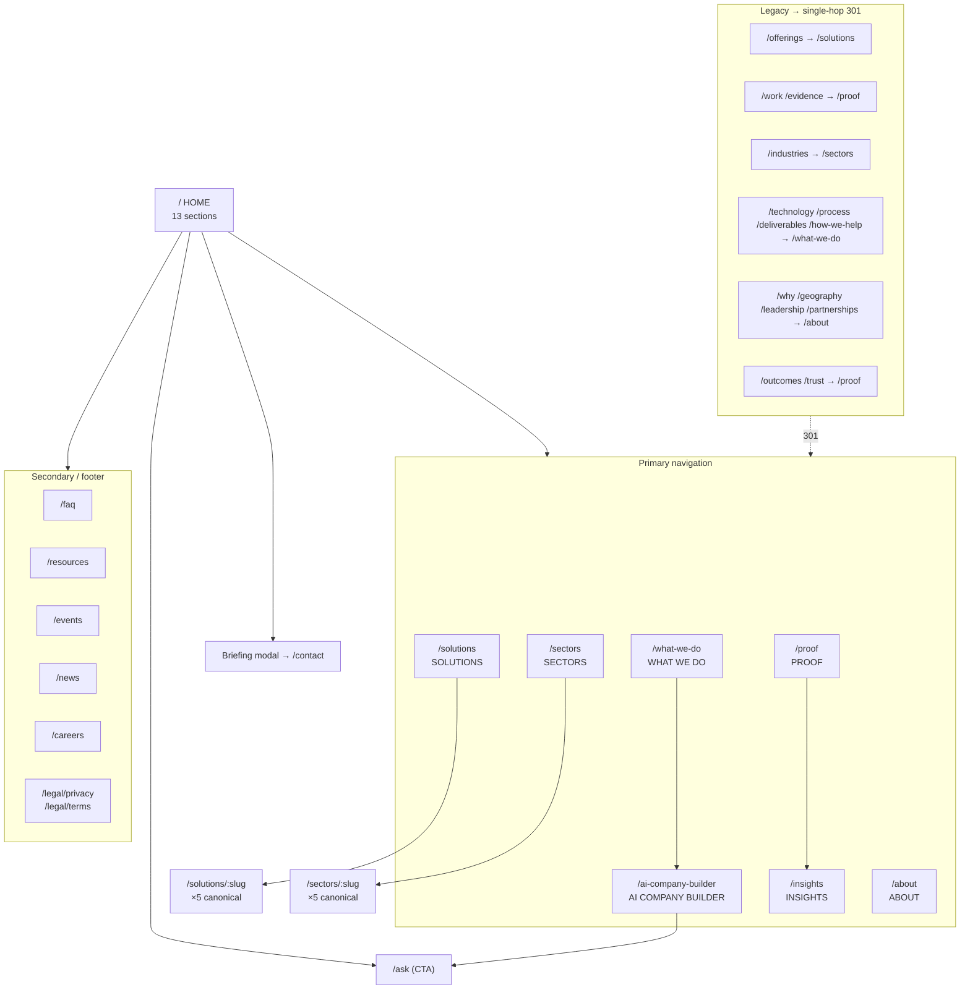

# Web Information Architecture v2.0

**ECL:** LightSpeed AI Company Builder + Web Experience Architecture v2.0
**Task:** T006 (`harness/changes/active/tasks.md`)
**Status:** Draft for review · Docs-only · No React code changes in this artifact
**Date:** 2026-09-24
**Sources of truth:** `src/App.tsx` route table (32 child routes), `vercel.json`, `src/data/siteContent.ts`, `src/components/{FloatingNav,SiteFooter,SiteLayout}.tsx`, ADR-020 (client-facing site guiding principles), brief §13 (target tree), §15 (homepage modes), §20 (Ask), §21 (audiences), §22 (geography), §27 (page template), §34#4 (this deliverable).

---

## 1. Purpose

Define the v2 public site information architecture: canonical navigation and URL map, route disposition for every current `App.tsx` child route, redirect/SEO strategy, homepage section architecture, audience and geography placement, and the content template for major pages. Implementation of the route table itself is a deferred follow-on (T008 `ROUTE_MIGRATION_V2.md` / separate ECL change).

Constraints inherited:

- **Migrate in place** (ADR-020): no Astro rebuild, no visual redesign without a UX or business reason (brief §23).
- **Brand tokens only** (ADR-020 §7.1): navy `#070A40`, red `#E63946`, cyan `#00BFFF`, white, `#F2F2F2`, Arial type scale. No invented colors.
- **No marketing copy in homepage section definitions** — structure and intent only (brief §15).
- **Evidence-backed claims / honesty badges** on solutions and proof surfaces (ADR-020; `HonestyBadge` already wired).
- **Canonical tool vocabulary / public registry boundary** is out of scope here — see sibling `PUBLIC_INTERNAL_BOUNDARY.md` (T005).

---

## 2. Route disposition summary (action counts)

Counts are over the **32 live `App.tsx` child routes** (index + named children, excluding the `*` catch-all which is classified separately as always-redirect).

| Action | Count | Meaning |
|--------|------:|---------|
| **Keep** | 15 | Stays as a first-class v2 route at the same path. |
| **Merge** | 12 | Path retired; content absorbed into a keep-route (section or page) with a permanent redirect. |
| **Redirect** | 4 | Path kept only as a permanent redirect to another first-class route (no unique content). |
| **Retire** | 0 | Removed with no replacement target (none — every current path maps somewhere). |
| **Create** | 3 | New first-class routes required by the target tree (§13): `/solutions`, `/sectors`, `/sectors/:slug`. |
| **Catch-all** | 1 | `*` → `/` (unchanged). |

**Net first-class content routes in v2:** ~20 (15 keep + `/solutions` index + 2 sector routes + homepage), down from a de-facto sprawl of 30+ live paths with overlapping remits.

Related fix (owned by T008, referenced here): collapse **edge + SPA double-hops** in `vercel.json` so `/offerings` and `/work` resolve in a single hop (§5).

---

## 3. Target navigation and URL map

Brief §13 target tree: **HOME, WHAT WE DO, AI COMPANY BUILDER, SOLUTIONS, SECTORS, PROOF, INSIGHTS, ABOUT.**

### 3.1 Primary navigation (desktop + mobile)

| Nav item | URL | Notes |
|----------|-----|-------|
| What We Do | `/what-we-do` | Capabilities hub; absorbs Technology, Process, How-we-help, Deliverables as sections/anchors. |
| Solutions | `/solutions` | **New** live index of the five solution cards (currently SPA-redirected to What We Do). Detail pages remain `/solutions/:slug`. |
| Sectors | `/sectors` | **New** rename of Industries (brief §13 wording). Detail pages `/sectors/:slug`. |
| AI Company Builder | `/ai-company-builder` | Flagship product surface; links to Ask for evaluation. |
| Proof | `/proof` | Absorbs Evidence, Work, Outcomes, Trust as sections. |
| Insights | `/insights` | Pharos thought leadership. |
| About | `/about` | Absorbs Why, Geography, Leadership, Partnerships as sections. |
| **Ask** (action) | `/ask` | Promoted out of nav list into primary CTA / action button (brief §20 evaluation — see open questions). |
| Book Executive Briefing | modal (`onRequestBriefing`) | Unchanged lead-capture CTA from current `FloatingNav`. |

Rationale vs. current nav (`What We Do · Proof · Technology · Ask · Insights · About`): Technology merges into What We Do (pillar detail becomes an anchor section); Ask becomes an action rather than a peer page so the nav stays aligned to the eight-item target tree; Solutions and Sectors surface browse paths that already exist as data (`siteContent.ts`) but are currently buried behind detail-only routes.

### 3.2 Footer / secondary map

Utility and long-tail routes stay reachable from the footer without occupying primary nav:

| Group | URLs |
|-------|------|
| Discover | `/solutions`, `/sectors`, `/what-we-do#technology`, `/what-we-do#engagement` |
| Company | `/about`, `/about#leadership`, `/about#geography`, `/careers`, `/partnerships` (→ About section) |
| Knowledge | `/insights`, `/resources`, `/events`, `/news`, `/faq` |
| Engage | `/ask`, `/contact`, briefing CTA |
| Legal | `/legal/privacy`, `/legal/terms` |

---

## 4. Full route table — CURRENT → ACTION → TARGET

Covers all **32** `App.tsx` child routes plus the catch-all. Detail families (`/solutions/:slug`, `/sectors/:slug`) are summarized once with their slug inventory.

| # | CURRENT path | ACTION | TARGET path | Redirect (301/SPA) | Notes |
|--:|--------------|--------|-------------|--------------------|-------|
| 1 | `/` (index) | **keep** | `/` | — | Homepage; 13-section architecture in §6. |
| 2 | `/what-we-do` | **keep** | `/what-we-do` | — | Capabilities hub. Absorbs Technology, Process, How-we-help, Deliverables content as anchored sections. |
| 3 | `/proof` | **keep** | `/proof` | — | Evidence hub. Absorbs Evidence, Outcomes, Trust, Work content. |
| 4 | `/solutions` | **keep→create** | `/solutions` | — | **Change:** currently `<Navigate to="/what-we-do">`. Becomes a live index of `solutions[]` cards linking to details. |
| 5 | `/solutions/:slug` | **keep** | `/solutions/:slug` | — | Slugs (data): `ai-company-builder`, `digital-presence`, `business-automation`, `enterprise-deployment`, `boardroom-briefing`. See §4.1 broken-link fix. |
| 6 | `/industries` | **redirect** | — | → `/sectors` | Rename to brief §13 “Sectors”. Edge redirect preferred. |
| 7 | `/industries/:slug` | **redirect** | — | → `/sectors/:slug` | Per-slug 301. Data slugs (canonical): `financial-services`, `healthcare`, `agriculture`, `education`, `government`. |
| 8 | `/offerings` | **redirect** | — | → `/solutions` | Edge already sends → `/solutions`; fix double-hop (§5). |
| 9 | `/work` | **redirect** | — | → `/proof` | Edge currently → `/evidence` then SPA → `/proof` (double-hop). Fix to single hop. |
| 10 | `/evidence` | **merge** | `/proof` | → `/proof` | Content moves to Proof sections; remove dead `EvidencePage` import in migration pass. |
| 11 | `/technology` | **merge** | `/what-we-do#technology` | → `/what-we-do` | Pillars become Technology section of What We Do; keep `TechnologyPage` content for section extraction. |
| 12 | `/insights` | **keep** | `/insights` | — | |
| 13 | `/about` | **keep** | `/about` | — | Absorbs Why, Geography, Leadership, Partnerships as sections. |
| 14 | `/ai-company-builder` | **keep** | `/ai-company-builder` | — | Primary builder surface; see companion `AI_COMPANY_BUILDER_UX.md`. |
| 15 | `/ask` | **keep** | `/ask` | — | Evaluation entry (brief §20); promoted to nav CTA. |
| 16 | `/contact` | **keep** | `/contact` | — | Form SLA copy per ADR-020. |
| 17 | `/legal/privacy` | **keep** | `/legal/privacy` | — | |
| 18 | `/legal/terms` | **keep** | `/legal/terms` | — | |
| 19 | `/why` | **merge** | `/about#why` | → `/about` | WhyLightSpeed content → About intro section. |
| 20 | `/how-we-help` | **merge** | `/what-we-do#engagement` | → `/what-we-do` | Same component already serves `/how-we-help/engagement`. |
| 21 | `/how-we-help/engagement` | **merge** | `/what-we-do#engagement` | → `/what-we-do` | Duplicate of #20 — collapse both. |
| 22 | `/process` | **merge** | `/what-we-do#process` | → `/what-we-do` | Engagement process section. |
| 23 | `/geography` | **merge** | `/about#geography` | → `/about` | Malawi→SADC→Africa→Global ladder (§7). |
| 24 | `/leadership` | **merge** | `/about#leadership` | → `/about` | |
| 25 | `/faq` | **keep** | `/faq` | — | Footer/discover; not primary nav. |
| 26 | `/resources` | **keep** | `/resources` | — | Knowledge cluster. |
| 27 | `/events` | **keep** | `/events` | — | |
| 28 | `/news` | **keep** | `/news` | — | |
| 29 | `/careers` | **keep** | `/careers` | — | |
| 30 | `/deliverables` | **merge** | `/what-we-do#deliverables` | → `/what-we-do` | |
| 31 | `/outcomes` | **merge** | `/proof#outcomes` | → `/proof` | |
| 32 | `/partnerships` | **merge** | `/about#partnerships` | → `/about` | |
| 33 | `/trust` | **merge** | `/proof#trust` | → `/proof` | Trust evidence band (`trustEvidence[]`). |
| — | `*` | **redirect** | — | → `/` | Catch-all unchanged. |

**Creates (not in CURRENT table):**

| Create | Action | Purpose |
|--------|--------|---------|
| `/solutions` | live index | Promote from redirect to first-class browse page (brief §13). |
| `/sectors` | new route | Rename Industries index → Sectors. |
| `/sectors/:slug` | new route | Per-sector detail (data already exists). |

### 4.1 Slug drift — broken links (must fix with migration)

Canonical slugs live in `src/data/siteContent.ts`. Several chrome files still reference **legacy slugs that do not exist** in data:

| Reference location | Broken target | Canonical replacement |
|--------------------|---------------|------------------------|
| `SiteFooter.tsx` Solutions column | `/solutions/agentic-ai` | `/solutions/ai-company-builder` (or `/solutions` index) |
| `SiteFooter.tsx` | `/solutions/digital-transformation` | `/solutions/digital-presence` |
| `SiteFooter.tsx` | `/solutions/data-intelligence` | (no 1:1 data slug — link `/solutions` or map to nearest capability) |
| `SiteFooter.tsx` | `/solutions/automation` | `/solutions/business-automation` |
| `SiteFooter.tsx` | `/solutions/strategy-advisory` | (no 1:1 data slug — link `/solutions` or map to boardroom-briefing/what-we-do) |
| `SiteLayout.tsx` `ROUTE_TITLES` | same five solution keys | Rekey to canonical five slugs |
| `PillarNavigationCard.tsx` | `/solutions/strategy-advisory`, `/solutions/agentic-ai` | Rekey to canonical slugs |
| `SiteFooter.tsx` / `SiteLayout.tsx` | `/industries/development` | Not in data — map to `/sectors` index or add data entry if development/donor is a real sector |
| Footer Sectors list | missing `education` | Add `education` alongside existing five data slugs |

Detail routes must 404-or-redirect on unknown slugs; prefer redirect to `/solutions` or `/sectors` index rather than homepage bounce for SEO.

---

## 5. Redirect and SEO strategy

### 5.1 Single-hop principle

Every legacy URL resolves to its final destination in **one** redirect. No edge→SPA chains.

**Current double-hops (fix in `vercel.json` + `App.tsx` together):**

| Request | Edge (`vercel.json`) | SPA (`App.tsx`) | Result today | Target edge | Target SPA |
|---------|----------------------|-----------------|--------------|-------------|------------|
| `/offerings` | → `/solutions` | `/solutions` → `/what-we-do` | 2 hops | → `/solutions` (now a live page) or → `/what-we-do` if collapsing solutions index is rejected | no further redirect |
| `/work` | → `/evidence` | `/evidence` → `/proof` | 2 hops | → `/proof` | remove SPA hop |

**Target edge redirects (all `permanent: true`):**

```json
{
  "redirects": [
    { "source": "/offerings", "destination": "/solutions", "permanent": true },
    { "source": "/work", "destination": "/proof", "permanent": true },
    { "source": "/evidence", "destination": "/proof", "permanent": true },
    { "source": "/industries", "destination": "/sectors", "permanent": true },
    { "source": "/technology", "destination": "/what-we-do", "permanent": true },
    { "source": "/why", "destination": "/about", "permanent": true },
    { "source": "/process", "destination": "/what-we-do", "permanent": true },
    { "source": "/geography", "destination": "/about", "permanent": true },
    { "source": "/leadership", "destination": "/about", "permanent": true },
    { "source": "/deliverables", "destination": "/what-we-do", "permanent": true },
    { "source": "/outcomes", "destination": "/proof", "permanent": true },
    { "source": "/partnerships", "destination": "/about", "permanent": true },
    { "source": "/trust", "destination": "/proof", "permanent": true },
    { "source": "/how-we-help", "destination": "/what-we-do", "permanent": true },
    { "source": "/how-we-help/engagement", "destination": "/what-we-do", "permanent": true }
  ]
}
```

`/industries/:slug` and any retired solution slugs: SPA-level map to `/sectors/:slug` / `/solutions` (parametric edge rules optional; SPA is sufficient if edge does not claim the prefix).

After cutover, **remove** the corresponding SPA `<Navigate>` entries so each path is handled at most once.

### 5.2 SEO notes

| Concern | Guidance |
|---------|----------|
| Titles | Rebuild `ROUTE_TITLES` from canonical paths only; drop legacy keys in §4.1. |
| Canonical tags | After merge, merged paths canonicalize to the keep-route (e.g. `/trust` → `/proof`). |
| Sitemap | Generate from keep-routes + live solution/sector slugs; exclude pure redirect paths. |
| H1 / section anchors | Merge targets use fragment IDs (`#technology`, `#engagement`, …) stable enough to survive section reordering only if IDs are explicit on section elements. |
| Unknown slugs | Detail pages: soft-404 UI with links to index — do not hard-redirect detail→home (preserves diagnostic value). |
| Honesty badges | Solution/sector cards keep `HonestyBadge`; no unqualified claim in meta descriptions (ADR-020 §5). |

---

## 6. Homepage architecture — 13 sections (01–13)

Structure only (brief §15: no marketing copy in section definitions). Modes referenced by brief §15: Organization / Agent / Operations / Intelligence / Governance — see `AI_COMPANY_BUILDER_UX.md` §3 for mode mapping; homepage sections below are the executive-first narrative spine (brief §38 progressive disclosure).

| # | Section ID / intent | Primary content shape | Linked destination | Current baseline (`HomePage.tsx`) |
|--:|---------------------|----------------------|--------------------|-------------------------------------|
| 01 | **Hero** | Positioning + primary CTA (briefing) + secondary (builder) | `/contact`, `/ai-company-builder` | `HeroSection` |
| 02 | **Problem / Strategy chasm** | Why change; manual→agentic tension | `/what-we-do#engagement` | `StrategyChasmSection` |
| 03 | **System / Thesis** | Operating thesis columns (prove in Malawi, ship don't promise, governed by design, research-informed) | `/about` | Thesis columns section |
| 04 | **Solutions** | Card grid of five solutions with honesty badges | `/solutions`, `/solutions/:slug` | Solutions section |
| 05 | **AI Company Builder** | Spotlight: governed workforce, link to full builder | `/ai-company-builder` | Spotlight section |
| 06 | **Sectors** | Sector chips / entry to sector detail | `/sectors`, `/sectors/:slug` | Industries chips (rename) |
| 07 | **Proof** | Verified operating metrics (90 / 2,373 / 20 / 5-tier) + evidence CTA | `/proof` | Proof band + `StatCounter` |
| 08 | **Engagement** | How we work: process, deliverables, outcomes summary | `/what-we-do#engagement` | *(missing as first-class — add)* |
| 09 | **Technology & Governance** | Pillars + HITL/approval posture | `/what-we-do#technology`, builder governance tab | Technology section (absorbing `/technology`) |
| 10 | **Geography** | Malawi → SADC → Africa → Global ladder | `/about#geography` | *(homepage currently omits — add per brief §22)* |
| 11 | **Insights** | Pharos teaser cards | `/insights` | Insights section |
| 12 | **Why / Trust / Who we work with** | Why LightSpeed, trust evidence, audiences | `/about`, `/proof#trust` | About band + Who-we-work-with |
| 13 | **Contact** | CTA band + form entry + SLA copy | `/contact` | `CtaBand` |

Use-case catalog (`UseCaseCatalogSection`, 50 offerable scenarios) sits between 06 and 07 or inside 04 as a filterable sub-grid — product decision left to implementation (flagged in open questions).

**Progressive disclosure (§38):** sections 01–07 are the executive layer; 08–12 deepen for operators; technical detail lives behind `/ai-company-builder` and What We Do anchors, not in the homepage spine.

---

## 7. Audience (§21) and geography (§22) placement

### 7.1 Audiences

Primary audience set (brief §21; content already echoed in `siteContent` “Who we work with” and Use Case Catalog): **SMEs, NGOs / development partners, Government & public sector, Donor organisations, Financial services, Healthcare, Education, Agriculture, Growth/scaling companies, Boards & executives (briefing buyers), Platform licensees (AI Company Builder).**

| Audience | Homepage touch | Primary route | Secondary |
|----------|----------------|---------------|-----------|
| Boards & executives | 01 Hero CTA, 13 Contact | `/ask` → briefing modal | `/solutions/boardroom-briefing` |
| SMEs | 04, 06 | `/solutions/digital-presence`, `/solutions/business-automation` | `/sectors` |
| NGOs / Donors | 06, 12 | `/sectors` (development/donor — see §4.1 slug gap) | `/proof` |
| Government | 06 | `/sectors/government` | `/about#geography` |
| Financial services | 06 | `/sectors/financial-services` | `/solutions/enterprise-deployment` |
| Healthcare | 06 | `/sectors/healthcare` | `/ask` |
| Education | 06 | `/sectors/education` | `/insights` |
| Agriculture | 06 | `/sectors/agriculture` | `/solutions/business-automation` |
| Platform licensees | 05 | `/ai-company-builder` | `/ask` |

No dedicated audience landing pages in v2 (YAGNI until analytics show demand); sector + solution detail pages carry audience-specific proof.

### 7.2 Geography ladder (§22)

Canonical data: `geography[]` in `siteContent.ts` — four stages with honesty status:

| Stage | ID | Status label (data) | Placement |
|-------|----|---------------------|-----------|
| Malawi (home market) | `malawi` | Proven in-house | Homepage §10 lead; About `#geography`; Proof case studies |
| SADC (regional) | `sadc` | In active development | Homepage §10; Insights (governance framework); About |
| Africa (ambition) | `africa` | Fieldable 2026 | Homepage §10; About |
| Global (knowledge/ecosystem) | `global` | Published | Homepage §10; Insights |

Ladder always renders in order Malawi → SADC → Africa → Global; never reorder for visual balance (brief §22). Full narrative remains on `/about#geography` (merged from `/geography`).

---

## 8. Content template for major pages (§27)

Apply to every first-class keep-route (15) and major merge target. Template is structural; copy stays in `siteContent.ts` / page components.

1. **Header block** — H1, one-sentence purpose, honesty badge if claim-bearing, primary CTA (briefing or Ask).
2. **Outcome lead** (5-second rule, ADR-020 §4) — what the visitor gets, not feature list.
3. **Evidence strip** — verified stats or `trustEvidence` excerpt; only evidenced or qualified claims.
4. **Body modules** — cards/lists driven by `siteContent` exports (no hard-coded copy in components where avoidable).
5. **Audience/sector cross-links** — `relatedLinksByRoute` for this path.
6. **Geography note** — where relevant, stage-appropriate status (Malawi proven / SADC development / …).
7. **CTA band** — briefing + Ask dual path; form SLA copy next to any form.
8. **Related links footer** — `RelatedLinks` component.
9. **SEO** — unique title from `ROUTE_TITLES`, meta description ≤160 chars, honesty-safe.

**Per-route content owner (data source):**

| Route family | Data source |
|--------------|-------------|
| `/`, What We Do, Proof, About sections | `siteContent.ts` (+ page-local structures) |
| `/solutions`, `/solutions/:slug` | `solutions[]` |
| `/sectors`, `/sectors/:slug` | `industries[]` (renamed in IA only; data key can stay `industries` until migration) |
| `/ai-company-builder` | Builder components + `companyData.ts` (90 agents / 20 depts) |
| `/ask` | `AskLightSpeed` state machine + `solutions[]` matching |
| `/insights`, news, events, resources | respective `siteContent` exports |
| Legal | static page components |

---

## 9. Dead / unreachable content inventory

| Artifact | Import status | Route status | Disposition |
|----------|---------------|--------------|-------------|
| `EvidencePage.tsx` | imported in `App.tsx` | route already redirect → `/proof` | Salvage markup into Proof sections; then remove import (T008). |
| `WorkPage.tsx` | imported | route already redirect → `/proof` | Same. |
| `OfferingsPage.tsx` | imported | route already redirect → `/what-we-do` (via SPA) / `/solutions` (edge) | Same after `/solutions` becomes live — re-evaluate if index should reuse Offerings layout. |
| `IndustriesPage.tsx` | exists | `/industries` redirects | Becomes `/sectors` index implementation (rename). |
| `SolutionsPage.tsx` | exists | `/solutions` redirects | Becomes live `/solutions` index (re-enable route). |
| `TechnologyPage.tsx` | live | will merge | Section source for What We Do `#technology`. |
| `WhyLightSpeedPage.tsx`, `ProcessPage.tsx`, `GeographyPage.tsx`, `LeadershipPage.tsx`, `DeliverablesPage.tsx`, `OutcomesPage.tsx`, `PartnershipsPage.tsx`, `TrustPage.tsx`, `HowWeHelpPage.tsx` | live | will merge | Section sources; keep components until section extraction validated. |

No page file is deleted in the docs phase; migration pass (deferred) removes imports only after content extraction is verified.

---

## 10. Mermaid — target sitemap



---

## 11. Open questions

1. **Brief §13 exact labels** — confirm “Sectors” vs current “Industries”, and whether “What We Do” remains the capabilities hub name or becomes “What We Build” (homepage spotlight already uses “What We Build”).
2. **Homepage section titles for 01–13** — confirm against brief §15 verbatim list (full brief body not in repo; `BRIEF_LOCK.md` pointer only).
3. **`/ask` as central entry (§20)** — recommend: yes, promote to primary nav CTA (action button), keep `/ask` path; alternative: `/` hero-embedded Ask. Needs product owner decision.
4. **`/solutions` index** — confirm it becomes a live route (this doc assumes yes to match §13 and fix `/offerings` single-hop). If rejected, `/offerings` should edge-redirect straight to `/what-we-do`.
5. **Legacy solution slug mapping** — `strategy-advisory`, `agentic-ai`, `data-intelligence` have no 1:1 data slugs: map to nearest, retire footer entries, or add data records?
6. **`/industries/development`** — add a development/donor data slug or drop the footer link?
7. **Audience list (§21)** — confirm the eleven-audience set in §7.1 against the brief body.
8. **Use-case catalog placement** — standalone homepage section vs nested under Solutions.
9. **Fragment IDs** — freeze anchor IDs (`#technology`, `#engagement`, `#geography`, `#leadership`, `#trust`, `#outcomes`, `#deliverables`, `#process`, `#why`, `#partnerships`) as public URLs now?
10. **T008 boundary** — this doc specifies intent; `ROUTE_MIGRATION_V2.md` owns dead-import removal and vercel.json edit sequencing.

---

## 12. Verification checklist (for this artifact)

- [x] All 32 `App.tsx` child routes appear in §4 with an action.
- [x] Catch-all `*` classified.
- [x] Double-hop issue documented with single-hop target (§5.1).
- [x] Create set matches brief §13 (`/solutions`, `/sectors`, `/sectors/:slug`).
- [x] Action counts: keep 15 · merge 12 · redirect 4 · retire 0 · create 3 (+ catch-all).
- [x] No brand colors invented; references ADR-020 tokens only.
- [x] Homepage table is structure, not marketing copy.
- [x] Geography ladder order fixed per §22.
- [x] Slugs verified against `siteContent.ts` (solutions ×5, industries ×5).
- [ ] Cross-link once primary v2 doc (T012) exists.
- [ ] Confirm brief §13/§15/§21 verbatim labels (open questions 1–2, 7).
