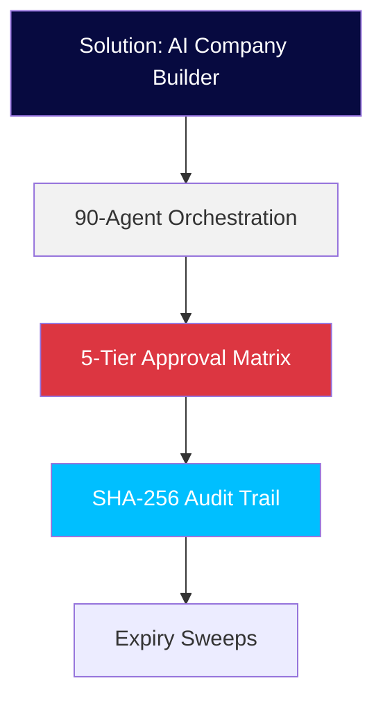

# SOLUTIONS Section — Media Assets Plan

**Source**: MEDIA PLACEMENT STRATEGY §20 (line 1330-1332): "Solution-specific diagrams"
**Spec**: IMAGE_SPEC.md — `diagram` kind taxonomy and rendering
**Owner**: Product Designer | **Status**: Draft

---

## Overview

The SOLUTIONS section requires **solution-specific diagrams** for each solution offering. Per `IMAGE_SPEC.md §1.1`, the `diagram` kind:
- Is **rendered inline** via the `ls-diagramming` skill → Mermaid → Kroki/Playwright → inline SVG
- Carries **no `src` field** — `ContentMedia` holds only `kind`, `alt`, `tone`
- Requires `data-ls-image-type: diagram` and `data-ls-tone: light|dark` attributes
- Must apply **brand palette** (navy `#070A40`, red `#DC3641`, cyan `#00BFFF`) via `ls-design-system`
- Alt text format: `"[Diagram type] showing [key relationships/entities]"`

There are **6 solutions** (per `siteContent.ts`): AI Company Builder, Digital Presence, Business Automation, Enterprise Deployment, Boardroom Briefing, and Governance Solution. Each receives one custom diagram.

---

## Asset Plan by Solution

| # | Solution | Skill/Agent | Output Format | Key Brand Requirements | Technical Requirements |
|---|----------|-------------|---------------|------------------------|------------------------|
| 1 | **AI Company Builder** | `ls-diagramming` skill | Inline Mermaid SVG (rendered via Kroki) | - Primary nodes: navy `#070A40`<br>- Accent highlights: cyan `#00BFFF`<br>- Labels: Arial, 12–14pt node labels<br>- Brand-restyled per `ls-design-system` tokens | - Mermaid `flowchart` TD syntax<br>- ≤15 nodes (architecture scope)<br>- Show: 90-agent orchestration, 5-tier approval matrix, SHA-256 audit trail flow<br>- `data-ls-tone: light` (default) or `dark` per theme<br>- Alt: `"System architecture diagram showing 90-agent multi-orchestration, 5-tier approval gates, and immutable audit trail flow"` |
| 2 | **Digital Presence** | `ls-diagramming` skill | Inline Mermaid SVG (rendered via Kroki) | - Primary nodes: navy `#070A40`<br>- Supporting: grey-light `#F2F2F2`<br>- Accent: cyan `#00BFFF` for mobile-money callouts<br>- Labels: Arial, 10–12pt edge labels | - Mermaid `flowchart` or `journey` syntax<br>- Mobile-first workflow: Airtel Money → TNM Mpamba → PayChangu integration<br>- Show: Mobile-responsive website pipeline with local payment rails<br>- Alt: `"Process flowchart showing mobile-first website development pipeline with Airtel Money, TNM Mpamba, and PayChangu payment integration"` |
| 3 | **Business Automation** | `ls-diagramming` skill | Inline Mermaid SVG (rendered via Kroki) | - Primary nodes: navy `#070A40`<br>- Highlight paths: cyan `#00BFFF`<br>- Reserved red `#DC3641` for CTA/warning nodes<br>- Labels: Arial, 10–11pt | - Mermaid `flowchart` syntax<br>- WhatsApp-native assistant + document pipeline workflow<br>- Show: WhatsApp assistant → form workflow → document automation sequence<br>- Alt: `"Workflow diagram showing WhatsApp-native assistants, automated document pipelines, and intelligent form workflows"` |
| 4 | **Enterprise Deployment** | `ls-diagramming` skill | Inline Mermaid SVG (rendered via Kroki) | - Primary nodes: navy `#070A40`<br>- RBAC nodes: cyan `#00BFFF`<br>- Governance gate nodes: red `#DC3641` (4 gates)<br>- Labels: Arial, 12pt | - Mermaid `flowchart` TD with 4 governance gate subgraphs<br>- RBAC layer + 5-tier approval matrix + offline-first sovereignty<br>- Show: Role-based access control, 5-tier gate flow, local infrastructure option<br>- Alt: `"Architecture diagram showing RBAC layer, 5-tier approval governance, and offline-first sovereignty on local infrastructure"` |
| 5 | **Boardroom Briefing** | `ls-diagramming` skill | Inline Mermaid SVG (rendered via Kroki) | - Navy primary, cyan accent for key takeaways<br>- Strategy 2×2 framework style (per `ls-diagramming` matrix)<br>- Labels: Arial, 11pt | - Mermaid `flowchart` or custom SVG for 2×2 strategy framework<br>- Executive narrative flow: platform → governance → roadmap<br>- Show: LightSpeed platform presentation, governance deep-dive, engagement roadmap<br>- Alt: `"Strategy framework diagram showing LightSpeed platform presentation, governance model deep-dive, and engagement roadmap for board leadership"` |
| 6 | **Governance Solution** | `ls-diagramming` skill | Inline Mermaid SVG (rendered via Kroki) | - Navy primary nodes for 5-tier matrix<br>- Red `#DC3641` for gate markers<br>- Cyan `#00BFFF` for audit trail highlights<br>- Labels: Arial, 10–12pt | - Mermaid `flowchart` TD emphasizing 5-tier approval matrix + 4 governance gates (Contract, DPA, Compliance, Security)<br>- SHA-256 audit trail flow with expiry sweeps<br>- Show: 5-tier gate cascade + immutable audit log pipeline<br>- Alt: `"Governance architecture diagram showing 5-tier human-in-the-loop approval matrix with 4 mandatory gates (Contract, DPA, Compliance, Security) and SHA-256 sealed audit trail"` |

---

## Technical Execution Flow

### 1. Diagram Source Creation (per solution)

```
ls-diagramming skill → Mermaid .mmd source → k-dense-mermaid-skill → validate + render → Kroki SVG output
```

**Per-solution source (.mmd) example pattern:**



### 2. Rendering Pipeline

```
Mermaid .mmd source → k-dense-mermaid-skill → Kroki API (https://kroki.io/mermaid/svg/<encoded>) → inline SVG → injected into SolutionCard component
```

### 3. Component Integration (per `IMAGE_SPEC.md`)

**SolutionCard** (in `src/components/site/`) receives:

```tsx
<ContentMediaSet>
  inline?: {
    kind: 'diagram'
    alt: "System architecture diagram showing 90-agent multi-orchestration, 5-tier approval gates, and immutable audit trail flow"
    tone: 'light' | 'dark'
  }
</ContentMediaSet>
```

**Rendered output** (per `IMAGE_SPEC.md §7.4` `InlineMediaBlock`):

```tsx
// InlineMediaBlock.tsx
{media.kind === 'diagram' && (
  <div dangerouslySetInnerHTML={{ __html: renderedSvg }} />
)}
```

### 4. QA Gate (per `visual_check.cjs`)

- `[ ]` `data-ls-image-type: diagram` present on diagram container
- `[ ]` `alt` text matches `[Diagram type] showing [key relationships/entities]` pattern
- `[ ]` No brand colors outside `#070A40`, `#DC3641`, `#00BFFF`, neutrals
- `[ ]` Aspect ratio honored (inline SVG — no container aspect-video applied)
- `[ ]` `HonestyBadge` present adjacent (derived from parent `Solution.honestyBadge`, not baked into image)
- `[ ]` Viewports: `1280x800`, `375x667`, `768x1024` — inline SVG must render without horizontal overflow

### 5. Honesty Badge Integration

Per `IMAGE_SPEC.md §9.2` — badge label derives from `Solution.honestyBadge` parent entity, not from the diagram pixel data. Badge renders adjacent to the diagram inline:

```tsx
<div className="relative aspect-video">
  {renderedSvg}
  {badgeLabel && (
    <HonestyBadge label={badgeLabel} className="absolute top-2 right-2 z-10" />
  )}
</div>
```

---

## Deliverables Checklist

### Data Layer (siteContent.ts)

- [ ] Add `media?: ContentMediaSet` to each solution entry (already partially present per §166)
- [ ] Populate `solutions[i].media.inline` with `kind: 'diagram'`, `alt`, and `tone` per the plan above
- [ ] Ensure `diagram` kind has `alt` + `tone` only (no `src`) per §383

### Components

- [ ] Create/extend `InlineMediaBlock.tsx` for `diagram` kind in `src/components/site/`
- [ ] Verify `SolutionCard` renders `inline.diagram` with `data-ls-image-type`, `data-ls-tone`, and `alt`
- [ ] Ensure `alt` quality per §2.3 (no "image", "photo", "picture", "graphic"; specific descriptions)
- [ ] Add `data-ls-image-type`, `data-ls-logo-instance`, `data-ls-tone` to all diagram renders

### Pipeline

- [ ] Run `ls-diagramming` skill per solution → generate `.mmd` source + rendered SVG
- [ ] Validate Mermaid syntax via `k-dense-mermaid-skill`
- [ ] Render via Kroki → output inline SVG
- [ ] Inject SVGs into `siteContent.ts` media data
- [ ] Configure `VITE_CONTENT_MEDIA_ENABLED` in Cloudflare Pages (staging → prod)

### QA

- [ ] Run `visual_check.cjs` on staging at 3 viewports — zero failures
- [ ] Manual audit: brand colors, alt quality, honesty badge positioning
- [ ] Lighthouse: no CLS, all images have `width`/`height` or aspect-ratio containers (inline SVG exempt per spec)
- [ ] Verify each diagram alt text follows `"[Diagram type] showing [key relationships/entities]"` pattern

### Documentation

- [ ] This plan (`docs/solutions-media-plan.md`) ratified and linked from `README.md`
- [ Component JSDoc updated with kind-handling tables for diagram renders]
