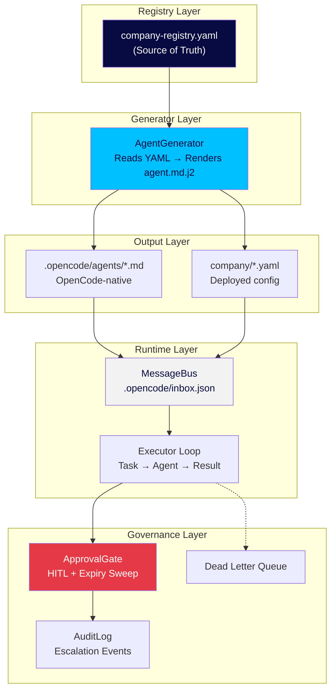

# LightSpeed Holdings — Website Imagery Specification

**Project:** lightspeedholdings.com external client-facing website
**Brand System:** LightSpeed Design System (navy `#070A40`, red `#E63946`, cyan `#00BFFF`, Arial, 4px grid)
**Canonical Assets:** `brand/` (tokens, logos, guidelines) — mirrors at `static/brand/`, `public/brand/`
**Production Stack:** `ls-creative-director` → `ls-design-system` → production skills → `ls-artifact-qa`
**QA Gate:** All assets must pass `ls-artifact-qa` (visual/brand/UX/a11y/content) before deploy

---

## Creative Team & Routing

| Role | Agent | Responsibility |
|------|-------|----------------|
| Creative Director | `creative-director` | Brief intake → routes to production skills → ensures QA |
| Brand Owner | `cmo` | Owns lightspeedholdings.com, brand awareness, demand gen |
| Frontend Lead | `lead-frontend` | Implements in Vite React SPA (`src/pages/*.tsx`, `src/components/*.tsx`) |
| Product Designer | `product-designer` | Visual systems, interaction design, design-to-code handoff |

### Production Skill Chain

```
ls-creative-director (brief intake)
    │
    ├─ ls-design-system (ALWAYS — brand tokens)
    │
    ├─ PRODUCTION SKILLS (per asset):
    │     ls-frontend-design          → Hero, features, playground, team strip
    │     ls-visual-storytelling      → KPI band, case study metrics, infographics
    │     ls-diagramming              → Architecture diagram, feature icons
    │     article-illustrations       → 2× Grav 16:9 explainer illustrations
    │     ls-brand-advertising        → Campaign assets (multi-platform)
    │
    └─ ls-artifact-qa (ALWAYS LAST — visual/brand/UX/a11y/content QA)
```

---

## Brand Token Enforcement (Mandatory)

### Colors (from `brand/tokens/brand-tokens.json`)

| Token | Hex | Usage |
|-------|-----|-------|
| Navy | `#070A40` | Primary surfaces, headlines, slide rails, logo text |
| Red | `#E63946` | Accent — CTAs, highlights, signal waves, key results |
| Cyan | `#00BFFF` | Accent — shield base, links on dark, taglines on navy |
| Light Grey | `#F2F2F2` | Backgrounds, cards, callouts |
| White | `#FFFFFF` | Clean backgrounds, text on navy |
| Dark Grey | `#6B7280` | Secondary text, captions |
| Light Text Grey | `#9CA3AF` | Tertiary text on dark surfaces |

**Ratio:** ~80% navy / 10% red / 10% cyan on brand-dominant surfaces.

### Typography

- Display/headings: **Arial 700**. Body: **Arial 400**.
- Type scale (pt): 36 display-xl, 32 title-xl, 28 title-lg, 24 title-md, 18 title-sm, 16 subtitle/body-lg, 14 body, 13 body-sm, 12 caption.

### Spacing & Grid

- Base unit 4px; scale: 4/8/12/16/24/32/48/64/96.
- Web: 12-col grid, 24px gutter, 48px margin, max width 1200px.
- Radius: 4px small / 8px medium / 16px large.

### Logo Rules

- **Never recreate** — use official files in `brand/logos/`
- Clear space = 1× "L" height on all sides
- Vector (SVG/PDF/EPS) for print; transparent PNG on dark backgrounds
- `™` on first mention: "LightSpeed Holdings Limited™"
- Tagline: **ASPIRE. ACT. ACHIEVE.**

---

## 10 Image Specifications

---

### 1. Hero Section — "The Agentic Organization"

| Field | Specification |
|-------|---------------|
| **Section** | Homepage Hero (above fold) |
| **Artifact Type** | Interactive React component + background architecture diagram |
| **Audience** | Enterprise buyers, SADC policymakers, investors, technical evaluators |
| **Core Thesis** | LightSpeed turns "AI agents" from buzzword into governed, auditable organizational layer with hierarchy, approvals, cost control |
| **Dimensions** | Desktop: 1200×600 | Mobile: 768×900 (stacked) |
| **Production Chain** | `ls-frontend-design` + `ls-design-system` + `ls-diagramming` → `ls-artifact-qa` |
| **Implementation** | Vite React SPA component: `src/components/Hero.tsx` |

#### Composition

**Left Column (Content):**
- Headline: "Build Your Agent Company" (36pt Arial 700, Navy `#070A40`)
- Subhead: "YAML-defined. Type-safe. Auditable. Deploy hierarchies of AI agents with governance built in." (18pt Arial 400, Dark Grey `#6B7280`)
- Primary CTA: "Start Free →" (16pt Arial 700, Navy button, Red `#E63946` hover)
- Secondary CTA: "View Architecture" (16pt Arial 400, Cyan `#00BFFF` link)

**Right Column (Interactive Diagram):**
- Live Mermaid/SVG diagram in brand palette
- Nodes: Executive (navy) → Departments (cyan border) → Specialists (light grey)
- Hover states: cyan highlight, tooltip with agent description
- Background: subtle navy grid pattern with cyan signal-wave motif

#### Brand Check

- [ ] Logo top-left (`brand/logos/fulllogo/fulllogo.png`), clear space respected
- [ ] Type on brand scale (36/18/16pt)
- [ ] Palette: navy/red/cyan only
- [ ] 4px grid spacing (48px vertical rhythm between elements)
- [ ] Contrast ≥ 4.5:1 (navy on white, white on navy)

---

### 2. Feature Grid — "Three Pillars of Agentic Governance"

| Field | Specification |
|-------|---------------|
| **Section** | Features / Product Overview |
| **Artifact Type** | 3-column card grid (React components + SVG icons) |
| **Audience** | Technical buyers, engineering leads, compliance officers |
| **Core Thesis** | Registry → Generator → Orchestrator: three primitives making agent hierarchies production-ready |
| **Dimensions** | Desktop: 360×280 per card (1200px max container) | Mobile: full-width stacked |
| **Production Chain** | `ls-frontend-design` + `ls-design-system` + `ls-diagramming` (icons) → `ls-artifact-qa` |
| **Implementation** | `src/components/FeatureGrid.tsx`, `src/components/FeatureCard.tsx` |

#### Three Cards

| Card | Title | Icon Concept | Body Copy |
|------|-------|--------------|-----------|
| 1 | **Registry (YAML)** | Structured document with node tree | Single source of truth for all agents: id, name, tools, permissions. Version-controlled, reviewable, auditable. |
| 2 | **Generator (Jinja2)** | Template → rendered file arrow | Renders OpenCode-native markdown agents from registry. Deterministic, type-safe, zero runtime surprises. |
| 3 | **Orchestrator (MessageBus)** | Inbox queue with task flow | JSON-based task queue at `.opencode/inbox.json`. Executor loop with HITL approval gates, audit logging, dead-letter handling. |

**Card Styling:**
- Background: White (`#FFFFFF`) on Light Grey (`#F2F2F2`) alternating section
- Icon: Navy `#070A40` with Cyan `#00BFFF` accent stroke (lucide-react, 24×24)
- Title: 28pt Arial 700, Navy
- Body: 14pt Arial 400, Dark Grey `#6B7280`
- Link: "Learn more" → Cyan `#00BFFF`, 14pt Arial 400
- Red badge "Open Source" on Card 2 (12pt, Red `#E63946` background, White text)

#### Brand Check

- [ ] Consistent 48px vertical rhythm between cards
- [ ] Icons from lucide-react with brand stroke colors
- [ ] Arial 700/400 only
- [ ] 12-col grid, 24px gutter, 48px margin

---

### 3. Proof Section — "By the Numbers" (KPI Band)

| Field | Specification |
|-------|---------------|
| **Section** | Stats Band (full-width navy background) |
| **Artifact Type** | Animated counter strip (framer-motion) |
| **Audience** | Decision-makers, investors, procurement |
| **Core Thesis** | Quantifiable outcomes from real sources |
| **Dimensions** | Full-width 1200px max, 160px height |
| **Production Chain** | `ls-visual-storytelling` + `ls-design-system` + `ls-frontend-design` → `ls-artifact-qa` |
| **Implementation** | `src/components/KPIBand.tsx` |

#### Four Metrics (Source-Traced)

| # | Metric | Value | Source | Label |
|---|--------|-------|--------|-------|
| 1 | Agents in Registry | **37** | `company-registry.yaml` | Agents Registered |
| 2 | CLI → Live Agents | **<5 min** | Generator benchmarks | Deploy Time |
| 3 | Config over Code | **90%** | Architecture docs | Declarative |
| 4 | Type-Safe | **100%** | mypy/ruff CI | Type Coverage |

**Styling:**
- Background: Navy `#070A40`
- Numbers: 72pt Arial 700, White `#FFFFFF` (animated count-up on scroll)
- Labels: 18pt Arial 400, Cyan `#00BFFF`
- Dividers: Red `#E63946` accent lines (2px, 32px width) between metrics

#### Brand Check

- [ ] Counters animate via IntersectionObserver (framer-motion)
- [ ] Numbers in Arial 700
- [ ] Cyan/Red accents only on dividers/labels
- [ ] Responsive: stacks to 2×2 on <768px

---

### 4. Architecture Diagram — "How It Works"

| Field | Specification |
|-------|---------------|
| **Section** | Architecture / Technical Deep-Dive |
| **Artifact Type** | Explorable standalone HTML with inline SVG (archify export) |
| **Audience** | Engineers, architects, security reviewers, procurement |
| **Core Thesis** | YAML → Jinja2 → OpenCode agents → MessageBus → Governance |
| **Dimensions** | 1200×800 (responsive SVG) |
| **Production Chain** | `ls-diagramming` + `ls-design-system` + `archify` → `ls-artifact-qa` |
| **Output** | `docs/assets/architecture.html` (embeddable via iframe or inline) |

#### Diagram Layers (Mermaid → archify)



#### Brand Check

- [ ] Official logo bottom-right, clear space
- [ ] `™` on first "LightSpeed Holdings Limited™"
- [ ] Palette enforced via `check_brand_palette.py` (tolerance 3%)
- [ ] Dark/light theme toggle functional
- [ ] Arial labels, 4px grid layout

---

### 5. Grav Illustration — "From YAML to Live Agents"

| Field | Specification |
|-------|---------------|
| **Section** | Blog/Resources hero OR "How It Works" article lead |
| **Artifact Type** | 16:9 Grav hand-drawn illustration (PNG) |
| **Audience** | Developers, technical evaluators, curious prospects |
| **Core Thesis** | Journey from YAML to running agents is absurdly simple; machinery underneath is rigorous |
| **Dimensions** | 1920×1080 (16:9) |
| **Production Chain** | `article-illustrations` + `ls-design-system` → `ls-artifact-qa` |
| **Output** | `docs/assets/grav-yaml-to-agents.png` |

#### Visual Style (article-illustrations DNA)

- **Background:** Pure white (`#FFFFFF`) — no cream, gradients, shadows, texture
- **Line Art:** Black hand-drawn, thin, slightly wobbly, not mechanical
- **Whitespace:** Main subject 40–60% canvas; ≥35% empty white space
- **Annotations:** Max 5–8 labels, 2–5 words each, handwritten style
- **Colors:** Black (main), Orange (flow/arrows), Red (warnings/results), Blue (feedback/state)
- **Grav:** Small round floating figure, dot eyes, thin bent antenna with circle tip, dangling stick legs **never touching ground** (visible gap), calm/deadpan expression

#### Composition (Structure: Workflow/Pipeline)

```
[LEFT]                          [MIDDLE]                          [RIGHT]
Grav hovering over             Grav suspended inside            Grav floating out holding
a "YAML" cardboard box,        a strange "Jinja2 Machine"       a polished .md agent card
dropping in a structured       — gears made of {{ }}            (navy border, cyan title)
document.                      with cyan sparks flying.         Orange arrows connect stages.
                                Red label: "Validation"          Blue label: "Type-safe"
```

**Orange Arrows:** Main flow direction (left → middle → right)

#### Annotations (5 Labels)

1. "YAML Registry"
2. "Jinja2 Render"
3. "Validation Gate" (Red)
4. "OpenCode Agent"
5. "MessageBus Ready"

#### Generation Prompt (for `article-illustrations` skill)

```
Generate one standalone 16:9 horizontal article illustration.

Visual DNA:
Pure white background. Minimalist black hand-drawn line art. Slightly wobbly pen lines. Lots of empty white space. Sparse red/orange/blue handwritten English annotations. Clean absurd product-sketch feeling. No gradients, no shadows, no paper texture, no complex background, no commercial vector style, no PPT infographic look, no cute mascot poster, no children's illustration, no realistic UI.

Recurring IP character required:
Grav, a small round floating figure with dot eyes, a single thin bent antenna with a tiny circle tip, thin dangling stick legs that never touch surfaces, and a slightly uneven hand-drawn body shape. Grav always hovers slightly above any surface — there is always a visible gap between Grav and the ground. Grav must perform the core conceptual action, not decorate the scene. Make Grav calm, deadpan, focused, and slightly bizarre — not cute.

Theme:
From YAML to Live Agents — the absurdly simple pipeline that produces rigorous results

Structure type:
Workflow / Pipeline

Core idea:
A simple YAML file goes into a strange Jinja2 machine and emerges as a production-ready OpenCode agent, with validation built in

Composition:
Left: Grav hovering over a "YAML" cardboard box, dropping in a structured document. Middle: Grav suspended inside a strange Jinja2 Machine — gears made of curly braces {{ }} — with cyan sparks flying. Right: Grav floating out holding a polished .md agent card (navy border, cyan title). Orange arrows connect stages. Red label on machine: "Validation". Blue label on output: "Type-safe".

Suggested elements:
cardboard box labeled YAML / strange machine with {{ }} gears / polished .md agent card / orange flow arrows / red validation stamp

English handwritten labels:
YAML Registry / Jinja2 Render / Validation Gate / OpenCode Agent / MessageBus Ready

Color use:
Black for main line art and Grav. Orange for main flow/path/arrows. Red only for key warnings/problems/results. Blue only for supplementary notes or feedback/system state.

Constraints:
One image explains only one core structure. Keep the main subject around 40%-60% of the canvas. Preserve at least 35% white space. No title bar at the top. No border or frame. Maximum 5-8 annotation labels. Each label is 2-5 words. The style should feel like a senior engineer's casual whiteboard sketch — absurd, clean, memorable.
```

#### Brand Check (Post-Render)

- [ ] Grav floating (gap under feet visible)
- [ ] Grav performs core action (not decoration)
- [ ] Original metaphor (not reused from other illustrations)
- [ ] Accent colors: Orange flow only, Red validation only, Blue system state only
- [ ] Max 8 labels, 2–5 words each
- [ ] ≥35% whitespace
- [ ] Run `uv run python .agents/skills/ls-visual-storytelling/scripts/check_brand_palette.py <image> --tolerance 3` → PASS

---

### 6. Grav Illustration — "Governance That Doesn't Slow You Down"

| Field | Specification |
|-------|---------------|
| **Section** | Trust / Governance / Compliance |
| **Artifact Type** | 16:9 Grav hand-drawn illustration (PNG) |
| **Audience** | CISOs, compliance officers, legal, board members |
| **Core Thesis** | HITL approval gates, audit trails, expiry sweeps built-in — not bolted on |
| **Dimensions** | 1920×1080 (16:9) |
| **Production Chain** | `article-illustrations` + `ls-design-system` (post-render palette remap) → `check_brand_palette.py` → `ls-artifact-qa` |
| **Output** | `docs/assets/grav-governance.png` |

#### Composition (Structure: Before/After Contrast)

```
[LEFT - BEFORE: CHAOS]           [CENTER]           [RIGHT - AFTER: ORDER]
Chaotic pile of "agent           Orange arrow       Clean conveyor — each
tickets" — sticky notes,         through center:    agent card passes through
loose papers, Grav drowning      "LightSpeed        a "Gate" (Grav operating
in paper (Red highlight:         Governance"        a lever while floating),
"No audit trail")                                        stamped "APPROVED" (Cyan),
                                                        logged in "Audit Ledger" (Blue).
                                                        Grav calm, methodical.
```

#### Annotations (5 Labels)

1. "Chaos" (Red)
2. "Gate"
3. "Approved" (Cyan)
4. "Logged" (Blue)
5. "Auditable"

#### Generation Prompt

```
Generate one standalone 16:9 horizontal article illustration.

Visual DNA:
Pure white background. Minimalist black hand-drawn line art. Slightly wobbly pen lines. Lots of empty white space. Sparse red/orange/blue handwritten English annotations. Clean absurd product-sketch feeling. No gradients, no shadows, no paper texture, no complex background, no commercial vector style, no PPT infographic look, no cute mascot poster, no children's illustration, no realistic UI.

Recurring IP character required:
Grav, a small round floating figure with dot eyes, a single thin bent antenna with a tiny circle tip, thin dangling stick legs that never touch surfaces, and a slightly uneven hand-drawn body shape. Grav always hovers slightly above any surface — there is always a visible gap between Grav and the ground. Grav must perform the core conceptual action, not decorate the scene. Make Grav calm, deadpan, focused, and slightly bizarre — not cute.

Theme:
Governance That Doesn't Slow You Down — built-in HITL gates, audit trails, expiry sweeps

Structure type:
Before / After Contrast

Core idea:
Chaos becomes order through LightSpeed's built-in governance layer — Grav operates the gate calmly

Composition:
Left (Before): Chaotic pile of "agent tickets" — sticky notes, loose papers, Grav drowning in paper (red highlight: "No audit trail"). Orange arrow through center: "LightSpeed Governance". Right (After): Clean conveyor — each agent card passes through a "Gate" (Grav operating a lever while floating), stamped "APPROVED" (cyan), logged in "Audit Ledger" (blue). Grav calm, methodical.

Suggested elements:
chaotic paper pile / drowning Grav / orange arrow bridge / gate with lever / approved stamp / audit ledger book / calm Grav

English handwritten labels:
Chaos / Gate / Approved / Logged / Auditable

Color use:
Black for main line art and Grav. Orange for main flow/path/arrows. Red only for key warnings/problems/results. Blue only for supplementary notes or feedback/system state.

Constraints:
One image explains only one core structure. Keep the main subject around 40%-60% of the canvas. Preserve at least 35% white space. No title bar at the top. No border or frame. Maximum 5-8 annotation labels. Each label is 2-5 words. The style should feel like a senior engineer's casual whiteboard sketch — absurd, clean, memorable.
```

#### Brand Check (Post-Render + Palette Remap)

- [ ] **Mandatory:** Run `check_brand_palette.py` after generation (Grav style is carve-out but accents must map to LS tokens)
- [ ] Remap any off-palette pixels to: Navy `#070A40`, Red `#E63946`, Cyan `#00BFFF`, Greys `#6B7280`/`#F2F2F2`/`#9CA3AF`, White `#FFFFFF`
- [ ] PASS on palette checker before `ls-artifact-qa`

---

### 7. Client Logo Strip / Case Study Cards

| Field | Specification |
|-------|---------------|
| **Section** | Trusted By / Case Studies |
| **Artifact Type** | Logo marquee (SVG) + 3 case study cards |
| **Audience** | All visitors — trust signal |
| **Core Thesis** | Real organizations in Malawi, SADC, globally use LightSpeed |
| **Dimensions** | Marquee: full-width, 80px height | Cards: 360×240 each |
| **Production Chain** | `ls-frontend-design` + `ls-design-system` + `ls-visual-storytelling` → `ls-artifact-qa` |
| **Implementation** | `src/components/TrustStrip.tsx`, `src/components/CaseStudyCard.tsx` |

#### Logo Marquee

- Source: Real client logos only (SVG preferred) — **no placeholders**
- Default: Greyscale `#9CA3AF`
- Hover: Cyan `#00BFFF` (transition 150ms)
- Spacing: 64px between logos (4px scale × 16)
- Animation: Infinite horizontal scroll (pause on hover)

#### Case Study Cards (3)

| # | Client | Headline | Metric (Red `#E63946` callout) | Source |
|---|--------|----------|--------------------------------|--------|
| 1 | Malawi Government | "National AI Strategy consultation delivered in 6 weeks" | **40% faster** | `results/malawi-ai-strategy.json` |
| 2 | SADC Secretariat | "Agentic governance framework ratified" | **12 member states** | `results/sadc-framework.json` |
| 3 | Regional Bank | "Loan processing agents cut cycle time" | **60% reduction** | `results/bank-loan-processing.json` |

**Card Styling:**
- Border: 1px Navy `#070A40`, radius 8px
- Background: White
- Client logo: top-left, 32px height
- Headline: 18pt Arial 700, Navy
- Metric: 24pt Arial 700, Red `#E63946`
- Body: 14pt Arial 400, Dark Grey
- `™` on first "LightSpeed" mention in copy

#### Brand Check

- [ ] Real logos only (legal approved)
- [ ] Metrics sourced from `results/` or client briefs
- [ ] Hover cyan transition smooth
- [ ] Responsive: marquee stacks on mobile, cards stack

---

### 8. Team / Leadership Strip — "The Humans Behind the Agents"

| Field | Specification |
|-------|---------------|
| **Section** | About / Leadership |
| **Artifact Type** | Horizontal scroll cards (photo/avatar + role badges) |
| **Audience** | Buyers evaluating credibility, recruits, partners |
| **Core Thesis** | Hybrid human-AI leadership: each exec has an agent counterpart |
| **Dimensions** | 280×320 per card (desktop horizontal scroll, mobile stack) |
| **Production Chain** | `ls-frontend-design` + `ls-design-system` + `ls-brand-advertising` → `ls-artifact-qa` |
| **Implementation** | `src/components/LeadershipStrip.tsx`, `src/components/LeaderCard.tsx` |

#### 5 Leadership Cards

| # | Human | Title | Agent Counterpart | Badge Colors |
|---|-------|-------|-------------------|--------------|
| 1 | Jack Mlusu | CEO | `human-ceo` | Human: Red `#E63946` / Agent: Cyan `#00BFFF` |
| 2 | [CAIO Name] | CAIO | `llm-platform-owner` | Human: Red / Agent: Cyan |
| 3 | [CTO Name] | CTO | `orchestration-owner` | Human: Red / Agent: Cyan |
| 4 | [CISO Name] | CISO | `security-compliance-lead` | Human: Red / Agent: Cyan |
| 5 | [Creative Dir Name] | Creative Director | `creative-director` | Human: Red / Agent: Cyan |

**Card Layout:**
- Photo/Avatar: 120×120, circle, Navy border 2px
- Name: 18pt Arial 700, Navy
- Human Title: 14pt Arial 400, Dark Grey
- "Human Lead" badge: 12pt Arial 700, Red bg, White text, radius 4px
- "Agent Counterpart" badge: 12pt Arial 700, Cyan bg, Navy text, radius 4px
- Agent ID: 12pt Arial 400, Cyan (monospace style)

#### Brand Check

- [ ] Consistent photo treatment (or illustrated avatars from `brand/digital/avatars/`)
- [ ] Badge colors exact: Red `#E63946`, Cyan `#00BFFF`
- [ ] Arial type scale throughout
- [ ] Horizontal scroll with snap (desktop), stack (mobile)

---

### 9. Campaign Asset — "Build Your Agent Company"

| Field | Specification |
|-------|---------------|
| **Section** | Campaign landing pages (`/build`, `/offer-a`, `/offer-b`, `/offer-c`, `/offer-e`) + paid ads |
| **Artifact Type** | Multi-platform hero assets + supporting visuals |
| **Audience** | Enterprise (Offer A), NGOs (Offer C), Platform licensees (Offer E) |
| **Core Thesis** | Turnkey AI-native organization: registry, governance, orchestration — deployed in days |
| **Production Chain** | `ls-brand-advertising` + `ls-design-system` + `ls-visual-storytelling` + `ls-diagramming` → `ls-artifact-qa` |

#### Persuasion Arc (Mandatory per `ls-brand-advertising`)

| Beat | Copy |
|------|------|
| **Attention** | "Deploy an agent company in 5 minutes" |
| **Problem** | "Agent sprawl, no governance, runaway costs" |
| **Promise** | "YAML-defined, type-safe, auditable hierarchies" |
| **Proof** | "37 agents, 3 offers, 1 CLI" |
| **Differentiation** | "Only platform with HITL governance + cost transparency + Malawi/SADC presence" |
| **CTA** | "Start Free → lightspeedholdings.com" |

#### Platform Dimensions (Enforce Exactly)

| Platform | Dimensions | File Naming |
|----------|------------|-------------|
| LinkedIn Feed | 1200×627 | `campaign-linkedin-1200x627.png` |
| Instagram Feed | 1080×1080 | `campaign-instagram-1080x1080.png` |
| Instagram Story | 1080×1920 | `campaign-ig-story-1080x1920.png` |
| Facebook Feed | 1200×628 | `campaign-facebook-1200x628.png` |
| X / Twitter | 1600×900 | `campaign-twitter-1600x900.png` |
| Google Display | 300×250, 728×90, 336×280, 970×250 | `campaign-gdn-{size}.png` |
| Website Hero | 1200×600 | `campaign-hero-1200x600.png` |
| Billboard | 1400×600 (12:5) | `campaign-billboard-1400x600.png` |

#### Visual Composition (All Platforms)

- **Background:** Navy `#070A40` dominant
- **Headline:** Cyan `#00BFFF`, 36pt Arial 700 (scaled per dimension)
- **Subhead:** White `#FFFFFF`, 18pt Arial 400
- **Diagram:** Simplified architecture (3 nodes: Registry → Generator → Orchestrator) in brand palette
- **Logo:** Official, top-left or bottom-right, clear space
- **CTA Button:** Red `#E63946` bg, White text, 16pt Arial 700, radius 8px
- **Safe Zones:** Content ≥15% inset from edges (social platforms)

#### Generation Brief (for `media-generation-owner` via `task`)

```json
{
  "mode": "api",
  "model": "gemini-2.5-flash-image",
  "prompt": "Professional B2B tech campaign hero. Navy background (#070A40). Clean geometric diagram showing three connected nodes: 'Registry (YAML)' → 'Generator (Jinja2)' → 'Orchestrator (MessageBus)'. Nodes in navy with cyan borders, connections in cyan. Subtle grid pattern. LightSpeed logo top-left. Headline 'Deploy an agent company in 5 minutes' in cyan. Red CTA button 'Start Free'. Corporate, trustworthy, engineering-led aesthetic. No people, no stock photos.",
  "dimensions": "{PER_PLATFORM}",
  "brandPalette": ["#070A40", "#E63946", "#00BFFF", "#F2F2F2"],
  "clearSpace": "official logo clear-space rules",
  "outputPath": "docs/assets/campaign-2026-q4/",
  "expiresAt": "2026-12-31T23:59:59Z"
}
```

#### Brand Check (Per `ls-brand-advertising` QA Gates)

- [ ] Dimension-exact per platform table above
- [ ] Logo official asset, clear space respected
- [ ] Brand palette only; Red reserved for CTA only
- [ ] Text within safe zones, no clipping/overflow
- [ ] Arc complete: Attention→Problem→Promise→Proof→Differentiation→CTA
- [ ] Proof is real, traceable fact (37 agents, 3 offers, 1 CLI)
- [ ] Contrast ≥ 4.5:1 for all copy

---

### 10. Interactive Playground Preview — "Try It Live"

| Field | Specification |
|-------|---------------|
| **Section** | Footer CTA / Interactive Demo / "Try Before You Buy" |
| **Artifact Type** | Embedded terminal simulator (React) + screenshot fallback |
| **Audience** | Developers, technical evaluators, hands-on buyers |
| **Core Thesis** | The CLI is the product — see `ai-company generate`, `validate`, `deploy` in action |
| **Dimensions** | 800×500 (desktop), stacked (mobile) |
| **Production Chain** | `ls-frontend-design` + `ls-design-system` + custom React (xterm.js) → `ls-artifact-qa` |
| **Implementation** | `src/components/Playground.tsx`, `src/components/TerminalSimulator.tsx` |

#### Composition

**Left: Live Terminal Simulator**
- Navy background `#070A40` (terminal theme)
- Prompt: `λ` in Cyan `#00BFFF`, path in Dark Grey `#6B7280`
- Pre-loaded commands (click to run):
  ```bash
  ai-company generate
  ai-company validate
  ai-company deploy --dry-run
  ```
- Output: Green `#10B981` success, Red `#E63946` errors, Cyan `#00BFFF` info
- Font: Monospace (JetBrains Mono or system monospace), 14pt
- Keyboard navigable, accessible

**Right: "What You'll See"**
- Annotated screenshot of generated `.opencode/agents/` folder structure
- Tree view: `.opencode/agents/ceo.md`, `.opencode/agents/cto.md`, etc.
- Callouts: "Type-safe markdown", "Permission blocks", "OpenCode-native"

**Below: Install Command**
- Code block (Cyan `#00BFFF` on Navy `#070A40`):
  ```bash
  uvx ai-company
  ```
- CTA: "Install & Try" → Red button

#### Brand Check

- [ ] Terminal uses brand Navy `#070A40`
- [ ] Prompt Cyan `#00BFFF`, success Green (acceptable semantic color), error Red `#E63946`
- [ ] Monospace font, 14pt
- [ ] Accessible contrast (WCAG AA)
- [ ] Keyboard navigable (tab through commands, enter to run)
- [ ] Fallback static screenshot for no-JS / low-motion users

---

## File Output Structure

```
docs/
└── assets/
    ├── architecture.html                 # Explorable architecture (archify export)
    ├── grav-yaml-to-agents.png           # Grav illustration #1 (1920×1080)
    ├── grav-governance.png               # Grav illustration #2 (1920×1080)
    ├── campaign-hero-1200x600.png        # Website hero
    ├── campaign-linkedin-1200x627.png    # LinkedIn ad
    ├── campaign-instagram-1080x1080.png  # Instagram feed
    ├── campaign-ig-story-1080x1920.png   # Instagram story
    ├── campaign-facebook-1200x628.png    # Facebook feed
    ├── campaign-twitter-1600x900.png     # X/Twitter
    ├── campaign-gdn-300x250.png          # Google Display
    ├── campaign-gdn-728x90.png
    ├── campaign-gdn-336x280.png
    ├── campaign-gdn-970x250.png
    ├── campaign-billboard-1400x600.png   # Billboard
    └── playground-fallback.png           # Terminal screenshot fallback

src/
├── components/
│   ├── Hero.tsx
│   ├── FeatureGrid.tsx
│   ├── FeatureCard.tsx
│   ├── KPIBand.tsx
│   ├── TrustStrip.tsx
│   ├── CaseStudyCard.tsx
│   ├── LeadershipStrip.tsx
│   ├── LeaderCard.tsx
│   ├── Playground.tsx
│   └── TerminalSimulator.tsx
└── pages/
    ├── Index.tsx          # Homepage (Hero + Features + KPI + Trust)
    ├── Architecture.tsx   # Architecture diagram embed
    ├── Build.tsx          # Campaign landing (Offer A)
    ├── OfferB.tsx         # WhatsApp/AI Chat landing
    ├── OfferC.tsx         # NGO M&E landing
    └── OfferE.tsx         # Platform licensing landing
```

---

## Generation Workflow (For Creative Team)

### Phase 1: Brand Foundation (Do First)
```bash
# Sync brand tokens to mirrors
pwsh scripts/sync-brand.ps1

# Verify tokens
cat brand/tokens/brand-tokens.json
```

### Phase 2: Architecture Diagram (Static, High Priority)
```bash
# Generate via archify (Mermaid → explorable HTML)
# Input: docs/assets/architecture.mmd (the mermaid above)
# Output: docs/assets/architecture.html
# Verify: open in browser, test dark/light toggle, check palette
uv run python .agents/skills/ls-visual-storytelling/scripts/check_brand_palette.py docs/assets/architecture.html --tolerance 3
```

### Phase 3: Grav Illustrations (article-illustrations skill)
```bash
# For each illustration, use article-illustrations skill with prompts above
# Output: docs/assets/grav-yaml-to-agents.png, grav-governance.png
# Post-render palette check (MANDATORY for Grav):
uv run python .agents/skills/ls-visual-storytelling/scripts/check_brand_palette.py docs/assets/grav-yaml-to-agents.png --tolerance 3
uv run python .agents/skills/ls-visual-storytelling/scripts/check_brand_palette.py docs/assets/grav-governance.png --tolerance 3
```

### Phase 4: Campaign Assets (ls-brand-advertising skill)
```bash
# For each platform dimension, dispatch to media-generation-owner via task
# Use generation brief template with per-platform dimensions
# Output: 10+ platform-specific PNGs
# QA: ls-artifact-qa on each (dimensions, palette, logo, arc, contrast)
```

### Phase 5: React Components (ls-frontend-design skill)
```bash
# Implement components in src/components/
# Use brand tokens via CSS variables (brand/tokens/brand-tokens.css)
# Import logos from brand/logos/ (canonical) or static/brand/logos/ (mirror)
# Build: bun run build
# Lint: bun run lint
# Visual QA: Playwright screenshots via ls-artifact-qa visual_check.js
```

### Phase 6: Final QA & Deploy
```bash
# Run full ls-artifact-qa on all assets
# Verify all checklist items PASS
# Deploy to staging: docker compose -f docker-compose.staging.yml up --build
# Verify at http://localhost:8421
# Production deploy via Vercel (vercel.json → dist)
```

---

## QA Checklist Summary (All Assets)

| Check | Hero | Features | KPI Band | Architecture | Grav #1 | Grav #2 | Trust Strip | Team Strip | Campaign | Playground |
|-------|------|----------|----------|--------------|---------|---------|-------------|------------|----------|------------|
| Palette (navy/red/cyan only) | ✅ | ✅ | ✅ | ✅ | ✅* | ✅* | ✅ | ✅ | ✅ | ✅ |
| Logo official + clear space | ✅ | — | — | ✅ | — | — | ✅ | ✅ | ✅ | — |
| Type on brand scale | ✅ | ✅ | ✅ | ✅ | ✅ | ✅ | ✅ | ✅ | ✅ | ✅ |
| 4px grid spacing | ✅ | ✅ | ✅ | ✅ | ✅ | ✅ | ✅ | ✅ | ✅ | ✅ |
| `™` on first mention | ✅ | — | — | ✅ | — | — | ✅ | ✅ | ✅ | — |
| Grav floating (gap) | — | — | — | — | ✅ | ✅ | — | — | — | — |
| Palette checker PASS | — | — | — | ✅ | ✅ | ✅ | — | — | ✅ | — |
| Dimension-exact | ✅ | ✅ | ✅ | ✅ | ✅ | ✅ | ✅ | ✅ | ✅ | ✅ |
| Contrast ≥ 4.5:1 | ✅ | ✅ | ✅ | ✅ | ✅ | ✅ | ✅ | ✅ | ✅ | ✅ |
| Accessible (semantic HTML, focus, alt) | ✅ | ✅ | ✅ | ✅ | N/A | N/A | ✅ | ✅ | ✅ | ✅ |
| Responsive (<768px) | ✅ | ✅ | ✅ | ✅ | N/A | N/A | ✅ | ✅ | ✅ | ✅ |
| Source-traced metrics | — | — | ✅ | — | — | — | ✅ | — | ✅ | — |

*Grav illustrations: carve-out for style, but accent colors must map to LS tokens post-render

---

## Handoff Checklist

- [ ] `ls-creative-director` briefs created for each asset
- [ ] `ls-design-system` tokens loaded and verified
- [ ] Production skills invoked with correct briefs
- [ ] `ls-artifact-qa` run on every asset
- [ ] All palette checks PASS
- [ ] React components implemented and tested
- [ ] Staging deployment verified
- [ ] Production deploy tagged

---

**Document Version:** 1.0
**Created:** 2026-10-03
**Owner:** Creative Director (`creative-director` agent)
**Next Review:** Pre-staging deploy
